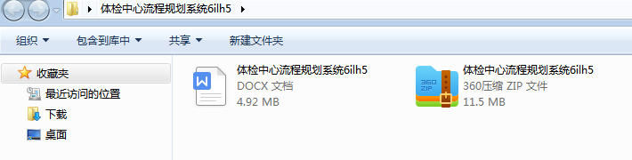
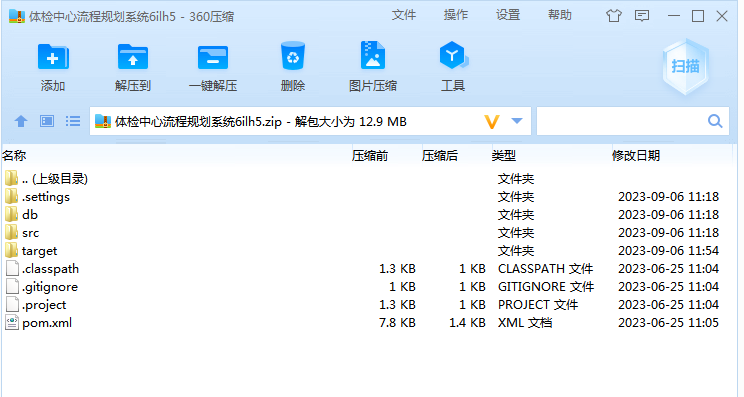
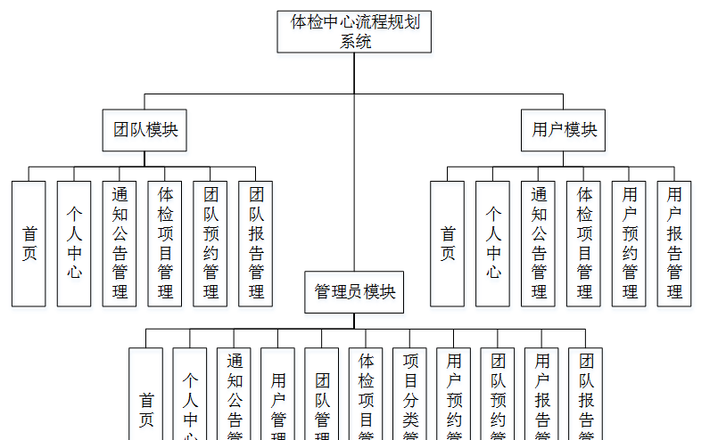
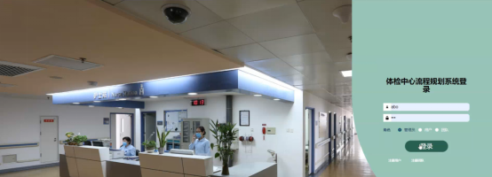
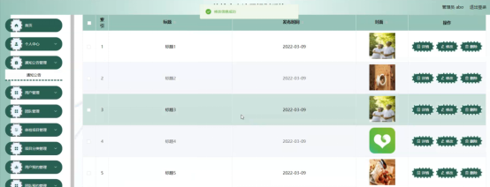
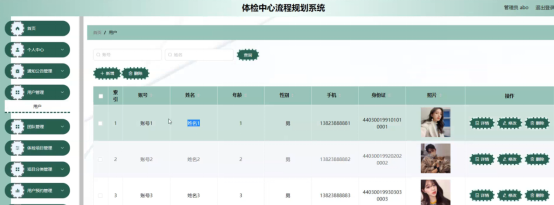
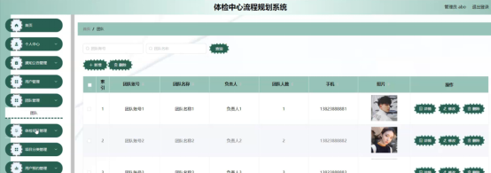
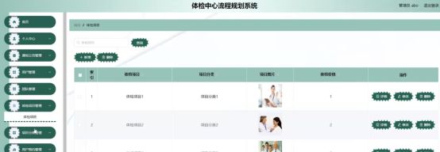

本系统带文档lw万字以上 文末可领取本课题的JAVA源码参考

## ******开发环境******

开发语言：Java

框架：ssm

技术：ssm+vue

JDK版本：JDK1.8

服务器：tomcat7

数据库：mysql 5.7或8.0

数据库工具：Navicat11

开发软件：eclipse/myeclipse/idea

Maven包：Maven3.3.9

浏览器：建议谷歌浏览器或edge

## ******功能模块******

系统总体设计即对有关系统全局问题的设计，也就是设计系统总的处理方案，又称系统概要设计。它包括系统规划与系统功能设计等内容。

体检中心流程规划系统主要有3类用户。分别是用户模块，团队模块和管理员模块，详细规划如图4-1所示。

## ******系统界面******

## ******2**** ** **023-2024**** ** **年成品******

除了以上作品下面是2023-2024年最新100套计算机专业原创的毕业设计源码+数据库，是近期作品，如果你的题目刚好在下面可以文末领取java源码参考

【1】| ssm宠物领养管理系统  
---|---  
【2】| jsp基于ssm的分销管理系统  
【3】| jsp新闻发布系统的设计与实现  
【4】| ssm汽车资讯网站  
【5】| jsp文章管理系统  
【6】| ssm基于微信小程序的协和医院预约系统  
【7】| ssm垃圾分类回收小程序  
【8】| ssm小程序企业进销存管理系统  
【9】| springboot交通事故档案管理平台  
【10】| springboot基于SpringBoot的医疗服务系统  
【11】| ssm基于web的汉字文化交流学习系统  
【12】| jsp房产中介系统  
【13】| springboot在线考试平台设计与实现  
【14】| ssm农产品销售APP  
【15】| jsp兴翼机械销售管理系统  
【16】| ssm基于微信小程序的校园失物招领悬赏系统  
【17】| springboot云南特产购物系统  
【18】| springboot响应式企业官网开发  
【19】| springboot在线基金管理平台的设计与实现  
【20】| ssm基于微信公众平台的举重赛事管理系统  
【21】| jsp宿舍管理系统  
【22】| springboot基于Springboot的手机电商网站  
【23】| springboot城市旅游人文推荐系统  
【24】| jsp小区物业管理系统  
【25】| ssm基于微信小程序的教室预约系统  
【26】| springboot校车管理系统  
【27】| springboot家庭理财管理系统  
【28】| jsp家电配送中心库存管理信息系统  
【29】| jsp引航调度系统的设计与实现  
【30】| springboot基于微信小程序的校园健康管理系统  
【31】| jsp基于web的物流管理系统与开发  
【32】| springboot微信小程序的个人财务管理系统  
【33】| jsp宿舍管理系统与实现  
【34】| jsp基于SSM的北京冬奥会志愿者服务系统  
【35】| ssm公司福利管理  
【36】| springboot电子商城的设计与实现  
【37】| jsp基于人脸识别的考勤系统  
【38】| ssm社区论坛  
【39】| ssm小程序高校多校区间校车通勤运行管理与拼车系统  
【40】| springboot体测评估系统  
【41】| springboot家乡旅游网站的设计与实现  
【42】| springboot微信小程序的校园订餐系统  
【43】| ssm校园一卡通系统  
【44】| jsp实验室预约系统  
【45】| ssm学生综合考评系统  
【46】| ssm基于Android的大学食堂意见反馈APP  
【47】| jsp二手平台交易系统的设计和实现  
【48】| jsp养老院健康看护系统  
【49】| springboot商城积分系统  
【50】| springboot宿舍管理系统小程序  
【51】| springboot房屋租赁网站的设计与实现  
【52】| ssm个体商铺蔬菜交易小程序  
【53】| jsp智能化出租车调度系统  
【54】| ssm体检预约与调度的微信小程序系统  
【55】| ssm基于ssm的高校党建平台  
【56】| springboot大学生交流和辅导系统  
【57】| jsp校园失物招领平台  
【58】| jspjava的空巢老人  
【59】| springboot城市地铁线路与站点查询系统  
【60】| springboot学生社团管理系统  
【61】| springboot服装租赁系统  
【62】| ssm基于微信小程序的园区导航系统  
【63】| ssmspringbmvc餐厅点餐  
【64】| springboot学年设计课程管理系统  
【65】| ssm基于微信小程序的乡村民宿预定系统  
【66】| ssm基于推荐算法的汽车租赁系统  
【67】| ssm基于Android的数字化博物馆系统  
【68】| ssm健康定位打卡系统  
【69】| jsp人力资源管理系统  
【70】| ssm校园疫情防控管理系统  
【71】| jsp毕业实习管理系统  
【72】| ssm社区智慧养老系统  
【73】| ssm基于Vue的电商管理平台  
【74】| ssm基于微信小程序的天气平台  
【75】| jsp客户管理系统  
【76】| jsp中小企业人力资源管理系统  
【77】| ssm小区垃圾回收信息管理系统  
【78】| ssm基于java的课程思政素材管理平台  
【79】| ssm微信小程序的电影推荐系统  
【80】| jsp宠物课代表  
【81】| jsp招标采购管理系统  
【82】| jsp医院预约挂号系统  
【83】| ssm校园二手商城微信小程序  
【84】| jsp基于Javaweb的在线考试系统  
【85】| ssm无人超市货物自动上架系统  
【86】| ssm火车票订票系统  
【87】| jsp智慧学伴服务平台开发  
【88】| springboot乐动健身房管理系统  
【89】| jsp手机进销存管理系统  
【90】| springboot博物馆预约小程序  
【91】| jsp宜家农产品系统的设计与实现  
【92】| ssm85技术网微课网站  
【93】| springboot小区垃圾分类系统  
【94】| springboot光明公务员知识网站  
【95】| springboot学生社团管理系统  
【96】| jsp学生管理系统  
【97】| ssm民宿管理系统  
【98】| jsp客运列车物资定额及领用管理系统  
【99】| jsp数码电商平台的实现与数据分析  
【100】| ssm基于安卓的校外人员来访审批系统  
  
## ******源码分享和部署******

