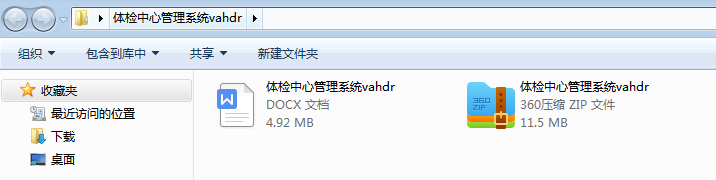
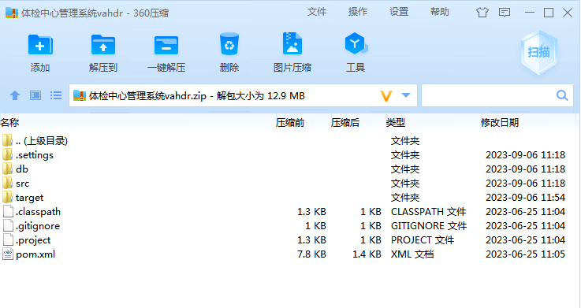
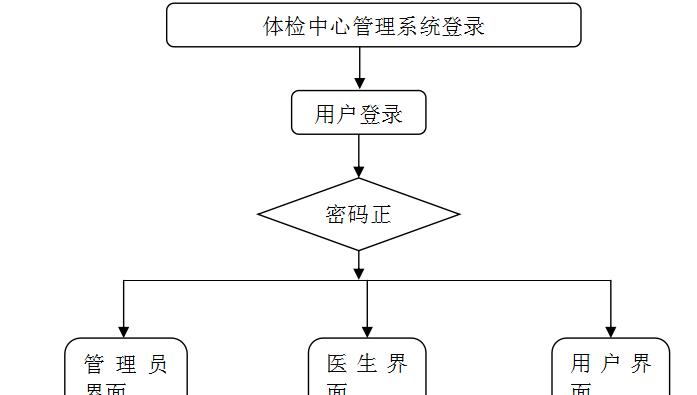
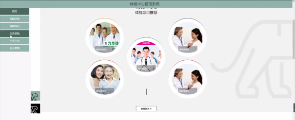
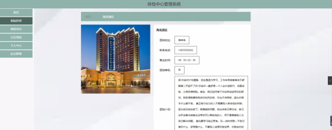
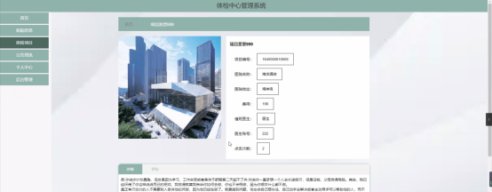
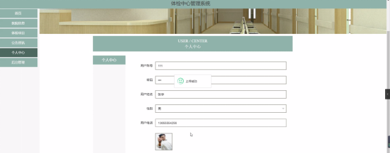

本系统带文档lw万字以上 文末可领取本课题的JAVA源码参考

## ******开发环境******

开发语言：Java

框架：ssm

技术：ssm+vue

JDK版本：JDK1.8

服务器：tomcat7

数据库：mysql 5.7或8.0

数据库工具：Navicat11

开发软件：eclipse/myeclipse/idea

Maven包：Maven3.3.9

浏览器：建议谷歌浏览器或edge

## ******功能模块******

模块包括首页、个人中心、用户管理、医生管理、医院信息管理、项目类型管理、体检项目管理、预约体检管理、取消预约管理、就诊体检管理、体检报告管理、系统管理等进行相应的操作。

登录系统结构图，如图4-2所示：

## ******系统界面******

## ******2**** ** **023-2024**** ** **年成品******

除了以上作品下面是2023-2024年最新100套计算机专业原创的毕业设计源码+数据库，是近期作品，如果你的题目刚好在下面可以文末领取java源码参考

【1】| ssm基于vue疫情校园人员管理系统  
---|---  
【2】| springboot宠物领养管理系统  
【3】| ssm基于微信小程序的外卖点餐系统  
【4】| jsp企业合同管理系统的设计与开发  
【5】| ssm某企业危化品信息管理系统  
【6】| springboot校内突发事件预警系统  
【7】| springboot大学生校园兼职平台  
【8】| springboot校园防诈骗在线学习系统  
【9】| jsp基于JSP的疫苗预约系统  
【10】| jspOllyDebug学习系统  
【11】| springboot个性化健康饮食推荐平台  
【12】| jsp基于SSM高考志愿填报系统  
【13】| jsp云动勤工助学系统  
【14】| ssm基于微信小程序的快递上门取件服务平台  
【15】| springboot家庭财务管理系统  
【16】| jsp专门体检预约管理系统  
【17】| springboot智慧社区养老服务平台  
【18】| ssm中学生签到管理系统的设计与实现  
【19】| ssm基于安卓的外卖APP  
【20】| ssm学生部门工作管理系统  
【21】| jsp某电影院购票网站  
【22】| ssm基于vuejs的游戏门户网站  
【23】| springboot用户兴趣推荐的娱乐服务APP  
【24】| ssm特殊教育学校学生管理系统  
【25】| ssm基于微信小程序的儿童营养指导系统  
【26】| springboot基于VUE框架搭建旅游网平台  
【27】| ssm员工宿舍管理系统  
【28】| jsp卡通动漫商城系统  
【29】| jsp家居管理系统  
【30】| jsp图书管理与推荐系统的设计与实现  
【31】| ssm化妆品公司人事管理系统  
【32】| ssm学生上课签到系统APP  
【33】| ssm糖尿病患者饮食  
【34】| ssm在线评教系统  
【35】| jsp拆迁安置社区养老服务管理系统  
【36】| springboot学校试卷生成系统  
【37】| springboot无人酒店的设计与实现  
【38】| springboot人事管理系统  
【39】| jsp医院门诊挂号系统  
【40】| ssm基于小程序在线考试系统  
【41】| ssm微信闲置物品置换小程序  
【42】| jsp临床信息管理系统  
【43】| ssm摩梭丑苹果O2O平台设计与实现小程序  
【44】| ssm基于微信小程序的民宿预订系统  
【45】| springboot滑雪场管理系统  
【46】| springboot一种校园二手物品交易微信小程序  
【47】| ssm司库管理系统  
【48】| ssm校园二手交易平台小程序  
【49】| ssm小区物业通微信小程序  
【50】| ssm基于Mybatis的作业管理系统  
【51】| jsp产品结构树的产品报价系统  
【52】| springboot影楼管理系统  
【53】| ssm抽奖管理系统  
【54】| springboot校园二手商品交易平台  
【55】| springboot工厂生产计划与生产进度管理系统  
【56】| ssm基于校医院管理服务的微信小程序  
【57】| ssm健康管理小程序  
【58】| ssm基于Android系统的在线学习APP  
【59】| springboot农产品溯源系统  
【60】| springboot洪水灾后区域重建后援系统  
【61】| jsp教师培训管理系统  
【62】| springboot成都市景区管理系统  
【63】| ssm基于SSM的宠物领养管理系统  
【64】| ssm基于微信小程序的汽车共享充电桩预约系统  
【65】| ssm危险品运输车辆信息管理系统  
【66】| springboot疫情信息管理系统  
【67】| ssm大学生穿搭交流小程序  
【68】| ssm小区物业移动管理平台app  
【69】| jsp乡村水费管理系统  
【70】| ssm校园快递代领系统  
【71】| ssm电竞酒店管理  
【72】| jsp学生选课系统的设计于实现  
【73】| jsp员工管理系统  
【74】| ssm电影片网上订购平台  
【75】| ssm流浪动物救助系统  
【76】| springboot班级综合测评管理系统  
【77】| ssm学生学籍管理系统  
【78】| springboot商品秒杀抢购系统发与设计  
【79】| ssm基于Android的自习室管理系统  
【80】| jsp基于java语言的民宿订购系统  
【81】| ssmOA自动化办公系统  
【82】| springboot勤工助学管理系统  
【83】| ssm新生报到系统微信小程序  
【84】| ssm基于SSM的旅游信息管理  
【85】| ssm插画交流分享平台  
【86】| jsp大学生评奖评优系统  
【87】| springboot南天在线求助系统  
【88】| springboot基于微信小程序的象喜自习室系统  
【89】| springboot医院信管系统  
【90】| springboot后勤报修管理系统  
【91】| springboot基于安卓的豆果美食APP  
【92】| jsp校园运动会管理系统  
【93】| ssm大学生爱心公益管理平台  
【94】| ssm基于微信小程序的点餐平台  
【95】| ssm我的题库我做主app  
【96】| springboot便利店管理系统  
【97】| jsp房屋租赁信息管理系统  
【98】| jsp东莞大益球队管理系统  
【99】| springboot爱心物品及志愿者分配管理  
【100】| springboot基于SpringBoot的智慧校园搜索系统  
  
## ******源码分享和部署******

