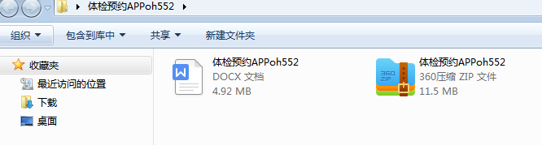
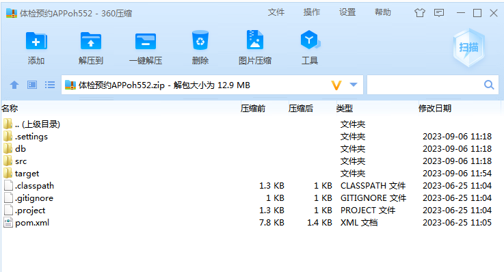
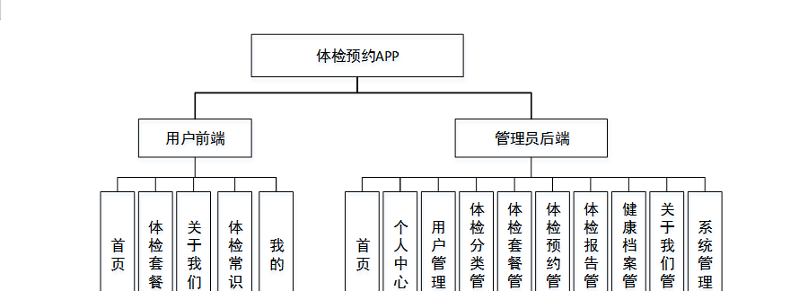
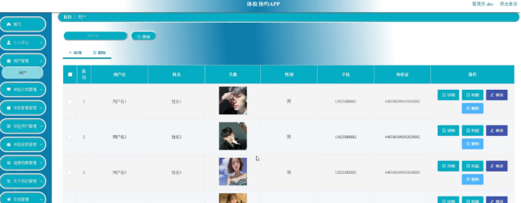
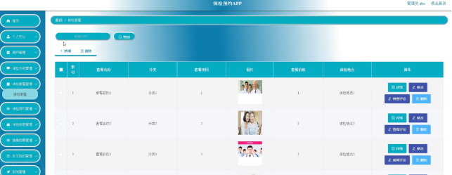
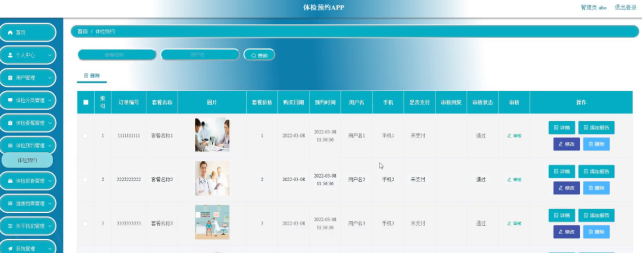
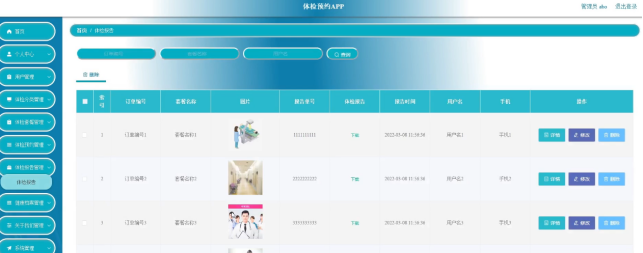

本系统带文档lw万字以上 文末可领取本课题的JAVA源码参考

## ******开发环境******

开发语言：Java

框架：ssm

技术：ssm+vue

JDK版本：JDK1.8

服务器：tomcat7

数据库：mysql 5.7或8.0

数据库工具：Navicat11

开发软件：eclipse/myeclipse/idea

Maven包：Maven3.3.9

浏览器：建议谷歌浏览器或edge

## ******功能模块******

为了更好的去理清本系统整体思路，对该系统以结构图的形式表达出来，设计实现该体检预约APP的功能结构图如下所示：

## ******系统界面******

## ******2**** ** **023-2024**** ** **年成品******

除了以上作品下面是2023-2024年最新100套计算机专业原创的毕业设计源码+数据库，是近期作品，如果你的题目刚好在下面可以文末领取java源码参考

【1】| springboot医院体检中心信息管理系统  
---|---  
【2】| springboot学生经典作文网站  
【3】| ssm实验室设备管理系统  
【4】| springboot实验室管理系统  
【5】| springboot基于微信小程序的英语在线学习系统  
【6】| jsp宠物救助收养系统  
【7】| ssm文明宿舍打分系统APP  
【8】| ssm个人理财助手设计app  
【9】| jsp建设路小学芙童币和芙童印章管理系统  
【10】| jsp共享自习室管理系统  
【11】| ssm同学录app设计与实现  
【12】| springboot楼盘销售系统  
【13】| springboot基于SpringBoot的玉石交易系统  
【14】| ssm基于Java的残疾人信息服务系统  
【15】| ssm公司内部交流APP  
【16】| springboot上门医疗服务小程序  
【17】| ssm杭州亚运会志愿者服务系统  
【18】| springboot人事管理  
【19】| springboot公交大厦停车场管理系统  
【20】| springboot学习交流平台的设计与实现  
【21】| jsp诈骗事件应急处理系统  
【22】| ssm基于SSM的学生事务管理系统  
【23】| jsp居家养老服务系统的设计与实现  
【24】| springboot事业单位内部的财务管理系统  
【25】| springboot乐旋乒乓球课程管理微信小程序  
【26】| ssm校园学生管理系统  
【27】| jsp好物分享平台  
【28】| springboot微信小程序新沂市娱乐推荐  
【29】| ssm基于微信小程序的校园缴费系统  
【30】| ssm服装公司的设计与实现网站  
【31】| ssm社会职业技能培训管理平台  
【32】| jsp体育资讯网站的设计与实现  
【33】| springboot校园闲置物品交易平台的设计与实现  
【34】| ssm微信小程序的应急救护知识推荐的设计与实现  
【35】| jsp单词软件系统的设计与实现  
【36】| jsp东软电子出版社管理系统  
【37】| springboot图书零售管理APP  
【38】| jsp机械铸造企业ERP网站  
【39】| jsp圣鸿宇电玩店管理系统  
【40】| jsp同城绘本馆的设计与开发  
【41】| jsp在线投稿系统  
【42】| ssm小区管家服务平台APP  
【43】| ssm基于微信小程序的新生入学报道系统  
【44】| ssm打烊自习馆小程序系统  
【45】| jsp基于web的销售管理系统设计与实现  
【46】| ssm基于微信小程序的个人账本  
【47】| ssm图书管理系统  
【48】| jsp小区业主服务平台  
【49】| ssm小学生兴趣延时班预约小程序  
【50】| springboot在线学习系统  
【51】| jsp图书馆智能选座系统  
【52】| jsp基于JSP的花店后台管理系统  
【53】| springboot猪肉制品信息公开系统  
【54】| jsp景区停车场系统  
【55】| ssm小区物业管理app  
【56】| ssm基于Java的健身房管理系统  
【57】| ssm基于微信小程序的教学辅助系统  
【58】| springboot微信小程序课堂管理小助手  
【59】| ssm基于小程序的农牧认养系统  
【60】| ssm学生考勤管理微信小程序  
【61】| springboot校园线上订餐管理系统  
【62】| jsp校园网用户管理系统  
【63】| ssm社区志愿者信息管理系统  
【64】| ssm个人空间交友网站  
【65】| springboot施工与库房管理系统  
【66】| springboot桃花社区医疗信息管理系统  
【67】| ssm基于JAVAEE的车检预约系统  
【68】| springboot毕业设计选题管理系统  
【69】| springboot松林小区疫情防控信息管理系统  
【70】| jsp校园疫情防控平台  
【71】| ssm智慧社保服务平台app  
【72】| springboot游戏交易平台  
【73】| ssm校园超市购物系统  
【74】| ssm基于微信小程序的点餐系统  
【75】| ssm在线学习系统  
【76】| ssm个性化音乐系统  
【77】| springboot在线音乐管理系统  
【78】| jsp情绪管理系统  
【79】| springboot医疗系统  
【80】| springboot仓储管理系统设计与开发  
【81】| ssm儿童二手闲置物品交易平台  
【82】| ssm室外智能充电系统小程序  
【83】| jsp天津欢乐谷门票销售系统  
【84】| springboot亲子微信小程序  
【85】| jsp《网页开发课程》教学网站的设计与实现  
【86】| springboot在线视频网站  
【87】| ssm基于微信公众号和小程序的智慧露营地运营系统的设计开发与实现  
【88】| jsp个人饮食营养管理系统  
【89】| springboot机票订单管理系统  
【90】| jsp在线鲜花销售配送管理系统  
【91】| ssm水库信息管理系统  
【92】| springboot人事管理系统  
【93】| jsp宠物医院管理系统  
【94】| ssm基于微信小程序的涉疫人员信息系统的设计与实现  
【95】| jsp房屋出租系统  
【96】| springboot“秦岭康养大数据陕西省高校工程研究中心”网站  
【97】| springboot微信社区商城系统  
【98】| ssm基于安卓的运动健康管理系统  
【99】| springboot摄影约拍系统的设计与实现  
【100】| springboot学生选课系统  
  
## ******源码分享和部署******

