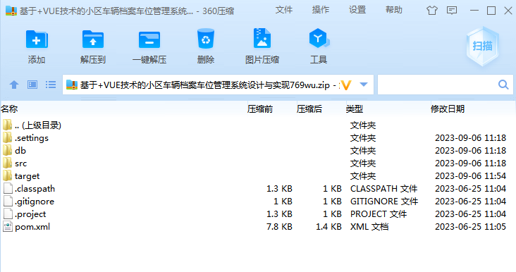
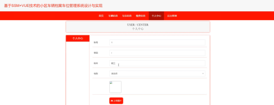

本系统带文档lw万字以上 文末可领取本课题的JAVA源码参考

## ******开发环境******

开发语言：Java

框架：ssm

技术：ssm+vue

JDK版本：JDK1.8

服务器：tomcat7

数据库：mysql 5.7或8.0

数据库工具：Navicat11

开发软件：eclipse/myeclipse/idea

Maven包：Maven3.3.9

浏览器：建议谷歌浏览器或edge

## ******功能模块******

系统架构图属于系统设计阶段，系统架构图只是这个阶段一个产物，系统的总体架构决定了整个系统的模式，是系统的基础。小区车辆档案车位管理系统设计与实现的整体结构设计如图4-2所示。

## ******系统界面******

## ******2**** ** **023-2024**** ** **年成品******

除了以上作品下面是2023-2024年最新100套计算机专业原创的毕业设计源码+数据库，是近期作品，如果你的题目刚好在下面可以文末领取java源码参考

【1】| jsp校园生活超市的设计与实现  
---|---  
【2】| ssmAndroid的二手商品交易系统的设计与实现  
【3】| ssm健康科普与线上医疗小程序  
【4】| ssm寻彝问药网站  
【5】| ssm新冠疫苗预约接种小程序  
【6】| springboot手机市场发布平台  
【7】| jsp医疗设备及业务综合巡检系统  
【8】| jsp基于JSP的医患交流平台管理系统  
【9】| jsp教学成果管理系统的设计与实现  
【10】| springboot学院图书借阅管理系统  
【11】| jsp开放实验室预约管理系统  
【12】| jsp二手图书交易系统  
【13】| jsp快递收发管理系统  
【14】| ssm基于Java的在线拼车服务系统  
【15】| jsp乐宠宠物医院管理系统  
【16】| jsp校园快递代取  
【17】| ssm体检中心流程规划系统  
【18】| jsp仓库管理系统  
【19】| jsp人事工资管理系统  
【20】| springboot个人博客系统的设计与实现  
【21】| ssm基于HTML5的子女教育经验分享网站  
【22】| ssm中小学信息技术课程考试系统  
【23】| jsp北京冬奥会志愿者管理系统  
【24】| ssm基于JAVA的新生报到管理系统  
【25】| springboot客户信息管理系统  
【26】| ssm人事管理系统  
【27】| springboot学习互助辅助系统  
【28】| jsp文正练习单  
【29】| ssm点餐小程序  
【30】| jsp宠物商店管理系统  
【31】| ssm微信哄睡小程序  
【32】| jsp基于JAVA的天坛医院线上看诊系统的设计与实现  
【33】| springboot心理健康辅导系统  
【34】| ssm社区互助小程序  
【35】| ssm校园二手物品交易平台  
【36】| jsp学生档案管理系统  
【37】| ssm图书推荐系统  
【38】| ssm基于SSM的开放式实验室预约系统  
【39】| springboot基于web慕课学习网站  
【40】| jsp停车场进出管理系统的设计与实现  
【41】| jsp小型企业财务管理的设计与实现  
【42】| ssm教师绩效考核过程管理系统  
【43】| ssm游戏角色装备交易系统  
【44】| ssm基于微信小程序的外卖点餐系统软件  
【45】| jsp在线图书商城系统  
【46】| jsp大学生创新创业大赛管理系统  
【47】| springboot彩妆专卖分享平台的设计与实现  
【48】| ssm基于BS的数据结构课程教学平台  
【49】| ssm基于Android的点餐APP  
【50】| springboot慈善公益平台  
【51】| ssm流浪动物救助平台  
【52】| jsp林业局办公用品管理系统的设计与实现  
【53】| springboot学校试卷生成系统  
【54】| springboot校园外卖点餐APP  
【55】| jsp小区物业管理系统  
【56】| ssm文明宿舍打分系统APP  
【57】| ssm校友墙微信小程序  
【58】| springboot中医养生馆信息管理系统  
【59】| jsp基于JAVAWEB医院挂号系统  
【60】| jsp宠物商城  
【61】| springboot企业进销存管理系统  
【62】| springboot基于微信小程序的自习室图书馆座位预约系统  
【63】| springboot办公用品管理系统  
【64】| springboot嗅嗅流浪猫庄园管理系统  
【65】| jsp学生社团信息管理系统  
【66】| ssmJava校园失物招领平台  
【67】| ssm基于项目驱动的课程管理系统  
【68】| jspC语言考试软件的设计与实现  
【69】| ssm在浙智游  
【70】| springboot室内设计类网站  
【71】| ssm校园服务系统  
【72】| springboot校园智慧防疫上报系统的设计与实现  
【73】| ssm同学录app设计与实现  
【74】| springboot学生疫情防控信息填报系统  
【75】| ssm基于微信小程序的实验室巡检系统  
【76】| jsp二手奢侈品交易网站  
【77】| springboot企业基本信息检索系统  
【78】| jsp基于模式识别的大型消费场所的人脸识别  
【79】| ssm基于微信小程序的4S店汽车销售  
【80】| springboot基于springboot的校园招聘系统  
【81】| ssm医院预约挂号服务系统  
【82】| springboot基于Android的自然灾害救援信息共享平台设计  
【83】| ssm仓库物资信息可视化管理系统  
【84】| jsp企业考勤系统  
【85】| jsp“淘实习”网站用户端后台设计与实现  
【86】| jsp有机食品销售  
【87】| ssm基于微信小程序的生鲜商城  
【88】| springboot琴行管理系统  
【89】| ssm基于Android的智能小区物业管理系统  
【90】| springboot微信小程序的驾校宝典  
【91】| ssm基于小程序在线考试系统  
【92】| springboot基于网络爬虫及机器学习的肉鸽行为特征知识库设计与实现  
【93】| jsp化学仿真系统  
【94】| ssm微信小程序社区互助平台  
【95】| ssm物业管理微信小程序  
【96】| ssm公司人员疫情防控管理系统  
【97】| jsp学生食堂饭卡管理  
【98】| springboot春华纺织厂的仓储管理系统  
【99】| springboot停车场管理系统  
【100】| jsp宠物交流服务平台  
  
## ******源码分享和部署******

