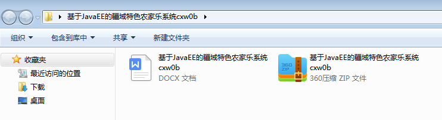
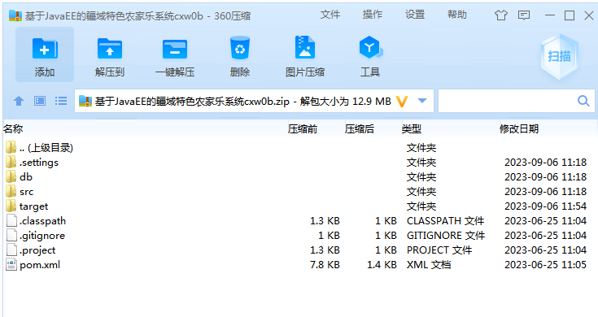
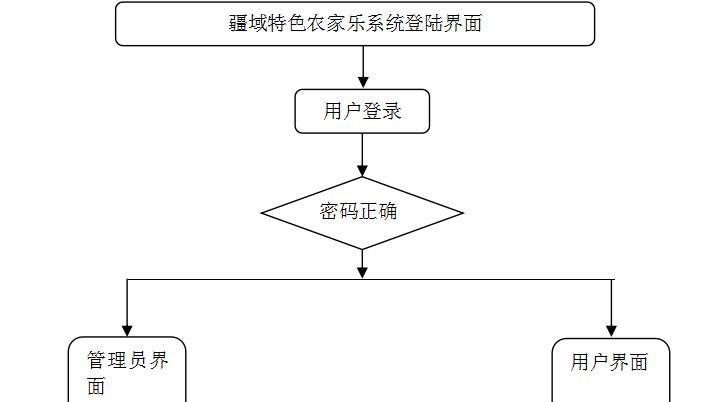
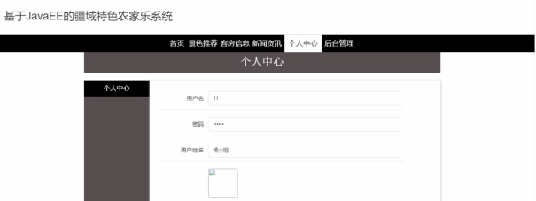
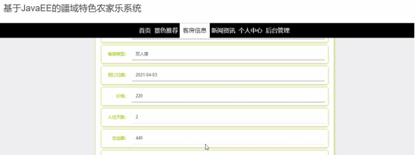
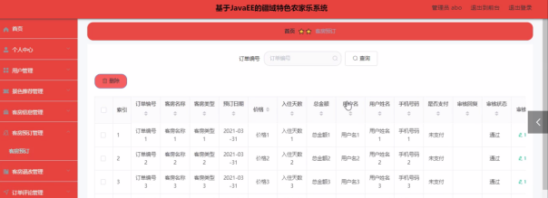

本系统带文档lw万字以上 文末可领取本课题的JAVA源码参考

## ******开发环境******

开发语言：Java

框架：ssm

技术：ssm+vue

JDK版本：JDK1.8

服务器：tomcat7

数据库：mysql 5.7或8.0

数据库工具：Navicat11

开发软件：eclipse/myeclipse/idea

Maven包：Maven3.3.9

浏览器：建议谷歌浏览器或edge

## ******功能模块******

本系统架构网站系统，本系统的具体功能如下：

## ******系统界面******

## ******2**** ** **023-2024**** ** **年成品******

除了以上作品下面是2023-2024年最新100套计算机专业原创的毕业设计源码+数据库，是近期作品，如果你的题目刚好在下面可以文末领取java源码参考

【1】| ssm微信小程序的律师服务系统  
---|---  
【2】| springboot安卓平台开发的课堂签到系统  
【3】| ssm基于微信小程序的教室预约系统  
【4】| ssm建材销售APP  
【5】| ssm公交车辆保修信息系统  
【6】| ssm微信小程序的“旅游助手”的设计与实现  
【7】| jsp基于ssm的二手手机商城  
【8】| ssm基于微信公众号和小程序的智慧露营地运营系统的设计开发与实现  
【9】| ssm毕业设计选题档案管理系统  
【10】| ssm大学生德育工程思想道德评价系统  
【11】| springboot基于用户的协同过滤算法的话题推荐  
【12】| jsp教师信息管理系统  
【13】| ssm基于小程序的班级日志管理系统  
【14】| ssm基于SSM的“随听”音乐视频网站  
【15】| ssm川行公司办公管理系统  
【16】| ssm基于微信小程序的智能药房设计  
【17】| ssm中学生签到管理系统的设计与实现  
【18】| ssm宿舍维修小程序  
【19】| ssm思政强国学习平台  
【20】| ssm学生购电小程序  
【21】| ssm实验室课程管理系统  
【22】| ssm校园二手商城小程序  
【23】| springboot水果商城平台  
【24】| ssm人事档案管理系统  
【25】| springboot物流管理系统  
【26】| ssm微信小程序的电影推荐系统  
【27】| ssm动漫播放系统  
【28】| jsp攀枝花学院新冠疫情查询与管理系统  
【29】| ssm微信小程序社团活动管理的设计与实现  
【30】| ssm基于微信小程序的火车订票系统设计与实现  
【31】| jsp基于ssm的会议室预约系统  
【32】| springboot基于springbootvue小学生学习阅读平台  
【33】| ssm校园外卖点餐系统  
【34】| ssm理疗预约小程序  
【35】| ssm基于安卓的会议管理系统系统  
【36】| jsp宠物生活馆管理系统  
【37】| jsp智慧教室预约  
【38】| ssm拼单点餐系统  
【39】| ssm基于SSM的校园卡管理系统  
【40】| springboot宠物寄养平台  
【41】| springboot企业项目知识管理系统  
【42】| jsp校园二手书共享系统  
【43】| ssm基于微信小程序的智能移动学习平台  
【44】| ssm微信小程序的校园体质健康管理系统  
【45】| jsp“心理自查”信息咨询设计与实现  
【46】| jsp教学辅助工具管理系统  
【47】| jsp基于JavaEE的在线学习平台  
【48】| springboot基于springboot的图书互换系统  
【49】| jsp农旅融合电商平台  
【50】| ssm成都医学院考研信息交流平台  
【51】| ssm基于SSM的校园心理咨询网站  
【52】| ssm大学生社会实践活动管理系统  
【53】| ssm基于微信小程序的养老管理平台  
【54】| ssm智慧迎新系统小程序  
【55】| springboot医患交流平台app  
【56】| ssm天气预警系统APP  
【57】| ssm基于大数据的高校人事管理系统  
【58】| springboot毕业生就业信息管理系统  
【59】| ssm在线招聘小程序  
【60】| springboot学生综合数据分析系统  
【61】| ssm基于微信小程序的图书订购系统  
【62】| ssm基于微信小程序的健康管理系统  
【63】| springboot球场预定管理  
【64】| springboot基于SpringBoot的流浪动物领养系统的设计与实现  
【65】| ssm某物业公司的信息管理系统  
【66】| springboot企业宣传展示网  
【67】| ssm智慧社区信息化服务平台  
【68】| ssm平面设计课程在线学习平台系统  
【69】| ssm拼团慕课系统小程序  
【70】| ssm畅游微信小程序  
【71】| ssm房屋租赁管理系统  
【72】| jsp在线考试系统  
【73】| springboot基于微信小程序的Sunmoon口红商城  
【74】| ssm本科生考勤与考核管理信息系统  
【75】| jsp图书管理系统  
【76】| ssm中国南方地区传统民居建筑信息管理系统  
【77】| ssm基于微信小程序的教学质量评价系统  
【78】| jsp企业物资交易平台  
【79】| jsp山西农大学生健康档案管理系统  
【80】| springboot一种美妆产品购物体验的线上交流平台  
【81】| ssm安卓的架校管理系统  
【82】| springboot微信小程序的校园学生疫情管理系统  
【83】| ssm打印预约小程序  
【84】| ssm社区防疫系统  
【85】| ssm智慧门诊综合管理系统  
【86】| ssm奢侈品交易平台  
【87】| jsp基于Java的档案管理系统  
【88】| ssm新冠疫苗接种管理系统  
【89】| ssm基于微信小程序的企业职工薪资查询系统设计与实现  
【90】| jsp城科报名推荐管理系统设计与实现  
【91】| ssm微信小程序的大学生课堂考勤系统  
【92】| springboot基于vue的地方美食分享网站  
【93】| springboot校园招聘信息网站系统  
【94】| springbootzy旅游健身  
【95】| springboot大学生运动与健康管理  
【96】| ssm基于ssm员工信息管理系统  
【97】| ssm木棉堂水果电商平台  
【98】| ssm健康饮食微信小程序  
【99】| ssm小程序的网络购水系统  
【100】| ssm剧本杀分享社区网站  
  
## ******源码分享和部署******

