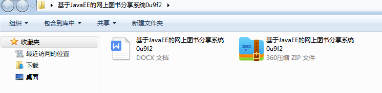
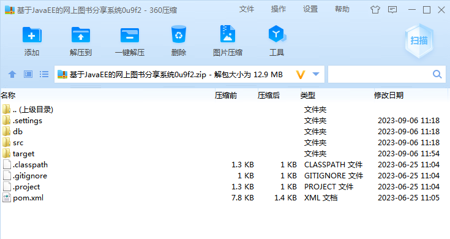
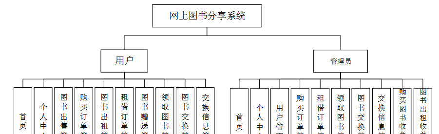
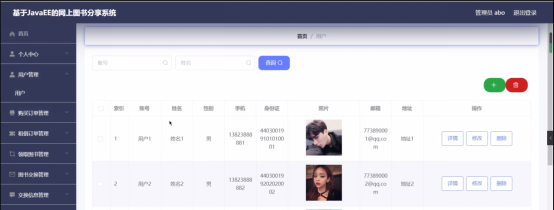
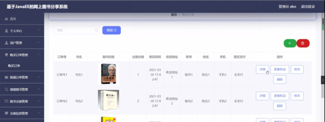
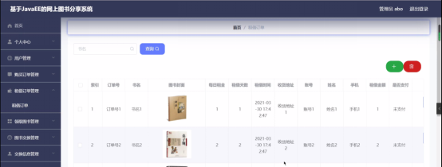
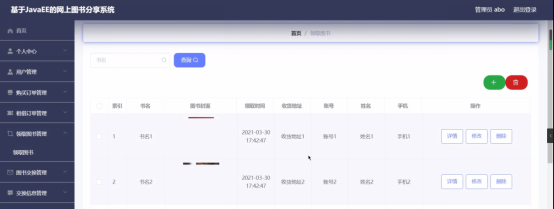

本系统带文档lw万字以上 文末可领取本课题的JAVA源码参考

## ******开发环境******

开发语言：Java

框架：ssm

技术：ssm+vue

JDK版本：JDK1.8

服务器：tomcat7

数据库：mysql 5.7或8.0

数据库工具：Navicat11

开发软件：eclipse/myeclipse/idea

Maven包：Maven3.3.9

浏览器：建议谷歌浏览器或edge

## ******功能模块******

为了更好的去理清本系统整体思路，对该系统以结构图的形式表达出来，设计实现该网上图书分享管理系统的功能结构图如下所示：

## ******系统界面******

## ******2**** ** **023-2024**** ** **年成品******

除了以上作品下面是2023-2024年最新100套计算机专业原创的毕业设计源码+数据库，是近期作品，如果你的题目刚好在下面可以文末领取java源码参考

【1】| ssm基于H5跨平台移动应用开发小程序  
---|---  
【2】| ssm基于WEB的教学质量评价系统的设计与实现  
【3】| ssm基于疫情防控的物资管理与发放系统  
【4】| ssm校园生活互助平台  
【5】| jsp定制化学习平台的设计与实现  
【6】| ssm宠物服务平台小程序  
【7】| springboot基于vuejs的文创产品销售平台app  
【8】| springboot专家库管理系统的设计与实现  
【9】| springboot基于springboot的学生宿舍管理系统  
【10】| ssm微信小程序英语自主学习的设计与实现  
【11】| springboot地铁健康宝系统  
【12】| ssm中小型中医诊所的服务系统  
【13】| ssm全民健身平台小程序  
【14】| ssm大学生活动管理小程序  
【15】| springboot智慧教育在线学习系统  
【16】| jsp校园二手货交易系统  
【17】| jsp医药企业进销存管理系统  
【18】| ssm成绩管理与学情分析系统  
【19】| ssm微信小程序的个人消费系统  
【20】| jsp农村房屋和人员管理系统  
【21】| ssm校园二手交易平台的设计与实现  
【22】| jsp众筹平台设计与实现  
【23】| ssm图书商城小程序  
【24】| springboot智慧实验室管理系统  
【25】| springboot大学生创新创业项目管理系统  
【26】| ssm基于安卓的英语背单词app  
【27】| springboot基于springboot的秒杀商城  
【28】| ssm基于混合型推荐算法的短视频推荐APP  
【29】| springboot毕业设计选题管理系统  
【30】| springboot水族馆观光网站  
【31】| ssm社区居民党员管理系统  
【32】| ssm母婴商品店进出货管理系统  
【33】| ssm天蓝VR产品售卖系统  
【34】| jsp四季果园水果销售系统  
【35】| ssm基于android的闲置学习用品再利用平台  
【36】| jsp中青年健康管理监测系统  
【37】| ssm基于Vuejs办公自动化管理管理信息系统  
【38】| jsp农业生产平台的实现  
【39】| springbootvue电影购票网站  
【40】| ssm机场保障车辆报修app  
【41】| ssm微信小程序的体检预约系统  
【42】| jsp智能社区健康管理系统  
【43】| springboot基于Springboot的养老院管理系统  
【44】| springboot协同过滤的就业系统的设计与实现  
【45】| ssm基于智能推荐的游戏论坛管理  
【46】| jsp基于推荐算法的图书购物网站  
【47】| jsp工业大学高校社团管理网站  
【48】| ssm社区疫情申报小程序  
【49】| ssm基于安卓平台的新闻客户端的  
【50】| jsp基于Github编译原理的个人主页便捷管理系统  
【51】| springboot恩施民宿房屋预订系统  
【52】| springboot古董拍卖交易平台  
【53】| ssm基于Java的图书馆综合服务系统微信小程序  
【54】| ssm二手书交易软件设计与实现  
【55】| ssm智慧园区运营管理app  
【56】| springboot时间管理系统  
【57】| springboot微信小程序的高校二手商品交易平台  
【58】| ssm基于Java的影院售票系统设计与实现  
【59】| springboot医药连锁店管理系统  
【60】| ssm养老院老人日常生活管理系统  
【61】| ssm大学生学习交流平台小程序  
【62】| ssm物流配送管理系统  
【63】| ssm基于SSM+Vue的学生实践管理平台开发  
【64】| jsp中国天气质量数据展示与分析系统  
【65】| springboot电影影评管理系统  
【66】| ssm医院移动自助系统的设计与实现  
【67】| jsp朋辈帮扶系统  
【68】| jsp校园失物招领系统设计与实现  
【69】| jsp昭通土特产电子商务网站  
【70】| springboot在线音乐网站  
【71】| springboot洛阳地铁信息查询与管理系统  
【72】| ssm基于Android的美发管理系统  
【73】| ssm基于Web的选课系统  
【74】| springboot校园疫情防控系统  
【75】| ssm光华二手交易平台  
【76】| ssm明星社区交流与分享平台app  
【77】| springboot安卓的校园信息服务APP  
【78】| springboot热贡文化艺术展示与定制平台  
【79】| springboot“夕阳红”服务系统  
【80】| ssm基于Android平台的社区订餐系统  
【81】| jsp小型超市管理系统  
【82】| springboot基于微信小程序的Linda大学生竞赛平台  
【83】| ssm基于微信小程序的教学互动工具  
【84】| ssm旅游APP  
【85】| springboot基于web的校园互助系统设计  
【86】| ssm二手交易app  
【87】| springboot基于springboot和vue的阆中旅游文化网站  
【88】| springboot校园论坛  
【89】| springboot汉中公交线路查询系统的设计与实现  
【90】| jsp基于JavaWeb的CRM系统  
【91】| ssm基于微信小程序的移动生鲜电子商城开发与实现  
【92】| ssm基于vue的网上书城  
【93】| springboot健康在线服务平台  
【94】| springboot大学生个人信息管理系统  
【95】| springboot旅游信息采集管理与分享系统  
【96】| ssm法律在线咨询系统  
【97】| ssm核酸检测预约排队小程序  
【98】| ssm影院自助售票管理小程序  
【99】| springboot小区物业管理系统  
【100】| ssm基于Android的移动订餐APP  
  
## ******源码分享和部署******

