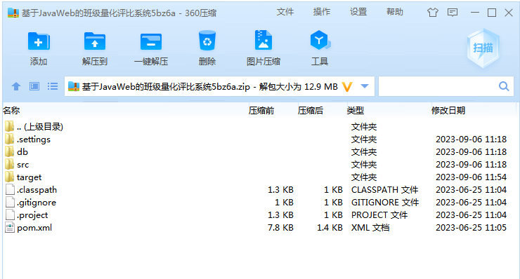
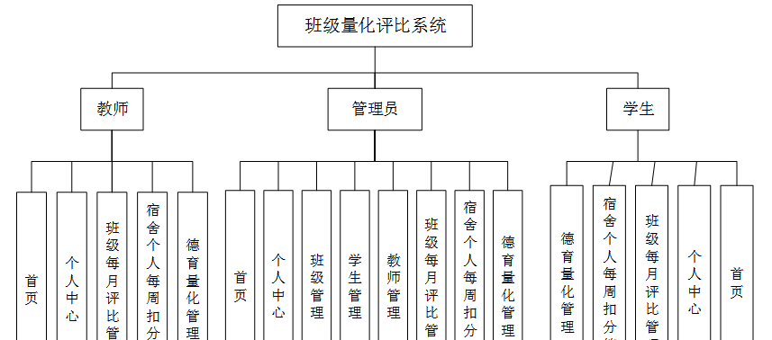
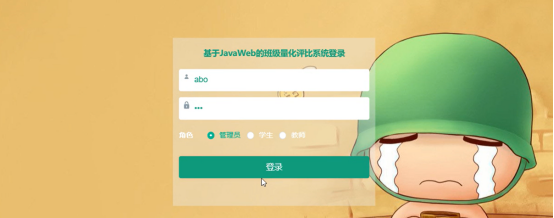
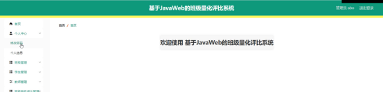
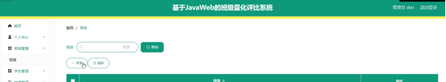
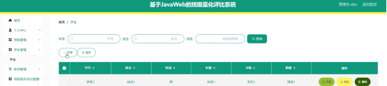
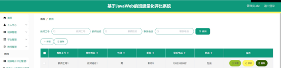

本系统带文档lw万字以上 文末可领取本课题的JAVA源码参考

## ******开发环境******

开发语言：Java

框架：ssm

技术：ssm+vue

JDK版本：JDK1.8

服务器：tomcat7

数据库：mysql 5.7或8.0

数据库工具：Navicat11

开发软件：eclipse/myeclipse/idea

Maven包：Maven3.3.9

浏览器：建议谷歌浏览器或edge

## ******功能模块******

为了更好的去理清本系统整体思路，对该系统以结构图的形式表达出来，设计实现该班级量化评比系统的功能结构图如下所示：

## ******系统界面******

## ******2**** ** **023-2024**** ** **年成品******

除了以上作品下面是2023-2024年最新100套计算机专业原创的毕业设计源码+数据库，是近期作品，如果你的题目刚好在下面可以文末领取java源码参考

【1】| springboot基于安卓的教师事务管理系统  
---|---  
【2】| jsp师生教务管理查询系统  
【3】| jsp小脑汇笔记本销售网站  
【4】| ssm开心鲜花系统  
【5】| jsp基于ssm的网上购物系统  
【6】| ssm基于网络的景区旅游服务管理系统  
【7】| jsp宿舍水电管理系统  
【8】| springboot图书管理系统  
【9】| springboot家政服务管理系统  
【10】| springboot基于Java酒店管理系统  
【11】| ssm个人相册管理系统  
【12】| springboot榆阳区幼儿园办公自动化系统  
【13】| ssm书影音社区前端设计与实现  
【14】| jsp基于Java的智能停车场系统  
【15】| jsp在线直播管理系统  
【16】| springboot玄幻阅读系统  
【17】| springboot基于微信小程序的在线商城系统  
【18】| jsp人事管理系统  
【19】| ssm旧物捐赠app  
【20】| ssm在线小说阅读平台微信小程序  
【21】| springboot安全生产目标管理系统  
【22】| ssm校园招聘信息管理系统  
【23】| ssm基于微信小程序的社团管理的设计与实现  
【24】| jsp校园互助平台  
【25】| springboot地方疫情管理系统app  
【26】| jsp教务管理系统  
【27】| jsp校园兼职网站  
【28】| ssm基于微信小程序的民宿预定  
【29】| ssm幼儿英语APP的设计与实现  
【30】| ssm基于微信小程序的点餐系统  
【31】| jsp作业管理系统的设计与实现  
【32】| springboot基于springboot校园一卡通管理系统  
【33】| springboot创意摄影交流平台  
【34】| ssm冷链物流管理系统的设计与开发  
【35】| jsp宾馆客房管理系统  
【36】| jsp学生作业管理系统  
【37】| springboot新闻资讯类app  
【38】| springboot健身俱乐部管理  
【39】| ssm农产品销售系统  
【40】| ssm基于微信小程序的校园失物招领系统  
【41】| ssm微信小程序失物招领  
【42】| jsp专业知识自学系统  
【43】| springboot基于SpringBoot技术的招聘管理系统  
【44】| springboot学院综合事务管理小程序  
【45】| ssm基于JAVA的公务员报名系统  
【46】| springboot教学辅助系统  
【47】| ssm基于vue疫情校园人员管理系统  
【48】| jsp客运列车物资定额及领用管理系统  
【49】| ssm吕梁市高铁购票小程序  
【50】| ssm医院挂号预约管理系统  
【51】| ssm学生社团管理系统  
【52】| jsp智能实时疫情监管服务平台  
【53】| jsp仓库管理系统设计  
【54】| ssm基于B/S架构的互联网在线培训教育平台  
【55】| springboot依依不舍体验台设计与实现  
【56】| springboot毕设课题的选择和申报管理系统  
【57】| springboot兴趣班和延时班管理系统  
【58】| jsp招聘网站设计与实现  
【59】| jsp宿舍管理系统  
【60】| ssm书籍回收售卖系统  
【61】| jsp基于协同过滤算法的电影推荐网站  
【62】| jsp校园二手物品交易系统  
【63】| ssm家居商城小程序的设计与实现  
【64】| springboot商洛研究院科研管理系统  
【65】| ssm疫区核酸检测管理小程序  
【66】| jsp人才信息管理系统  
【67】| jsp教室信息管理系统  
【68】| ssm基于微信小程序的直播在线教育平台  
【69】| springboot校园人员管理系统  
【70】| ssm基于Android的移动办公应用  
【71】| ssm基于微信小程序的白血病回访系统  
【72】| ssm学生学籍管理系统  
【73】| springboot建设工程智慧管理系统  
【74】| springboot大学校园公益回收平台设计与实现  
【75】| ssm基于微信小程序疫情下图书馆预定座位系统  
【76】| ssm微信的健康食谱小程序  
【77】| springboot基于springboot的仓储管理系统  
【78】| ssm基于Android的垃圾分类APP设计与实现  
【79】| jsp“茗茶”文化网站  
【80】| ssm希望小学学生信息管理系统  
【81】| jsp学术讲座管理系统的设计与实现  
【82】| jsp基于JSP的新闻发布及管理系统  
【83】| ssm基于javaEE的房产中介管理系统  
【84】| springboot宠物领养系统  
【85】| springboot智慧幼教服务系统  
【86】| springboot北京市美食推荐管理系统  
【87】| jsp基于web的小型公司人事管理系统  
【88】| jsp昭通推广网站开发  
【89】| ssm基于Java的流浪猫狗救助平台  
【90】| springboot医院诊疗辅助系统  
【91】| jsp智慧养殖管理系统  
【92】| ssm环保小卫士app  
【93】| springboot毕业生就业管理系统  
【94】| jsp小石药店管理系统  
【95】| jsp教务管理系统  
【96】| springboot商洛市精准扶贫管理系统  
【97】| ssm医院住院管理系统  
【98】| jsp基于JavaEE的防疫物资管理系统  
【99】| jsp校园疫情防控管理系统  
【100】| ssm手游微信交易小程序  
  
## ******源码分享和部署******

