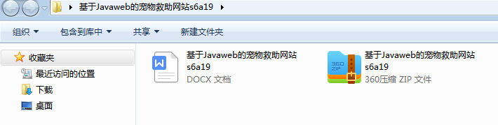
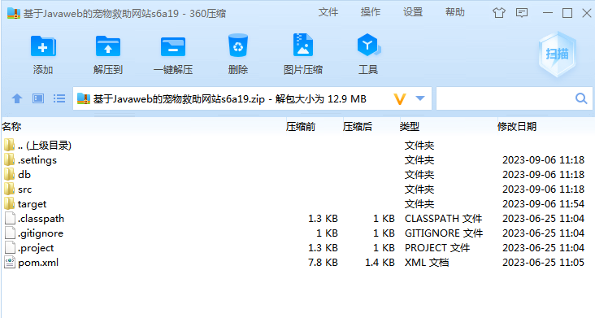
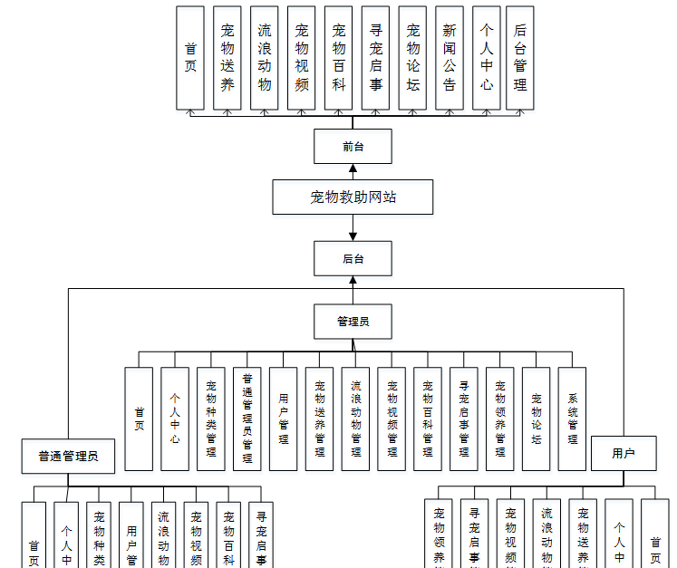
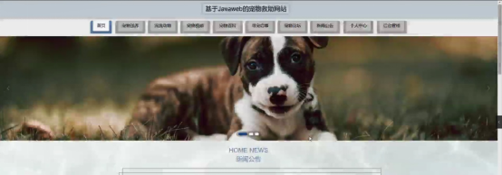
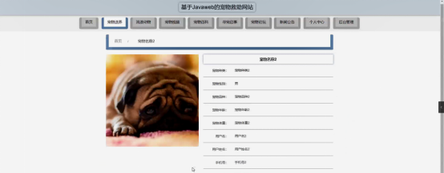
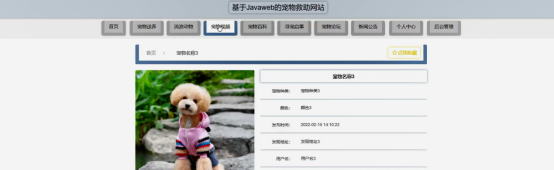
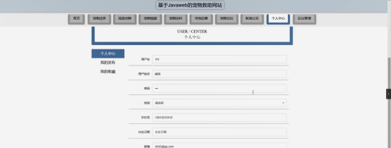

本系统带文档lw万字以上 文末可领取本课题的JAVA源码参考

## ******开发环境******

开发语言：Java

框架：ssm

技术：ssm+vue

JDK版本：JDK1.8

服务器：tomcat7

数据库：mysql 5.7或8.0

数据库工具：Navicat11

开发软件：eclipse/myeclipse/idea

Maven包：Maven3.3.9

浏览器：建议谷歌浏览器或edge

## ******功能模块******

通过市场调研及咨询研究，了解了宠物救助网站及管理者的使用需求，于是制定了管理员，普通管理员和用户等模块。功能结构图如下所示：

## ******系统界面******

## ******2**** ** **023-2024**** ** **年成品******

除了以上作品下面是2023-2024年最新100套计算机专业原创的毕业设计源码+数据库，是近期作品，如果你的题目刚好在下面可以文末领取java源码参考

【1】| jsp基于SSM架构的网上书城系统  
---|---  
【2】| ssm公务员考试在线学习平台  
【3】| ssm基于ssm的鲜花预定管理系统  
【4】| jsp个人信息管理系统  
【5】| springboot养老企业知识库的设计与开发  
【6】| jsp商城会员积分管理系统的设计与实现  
【7】| ssm冬泳爱好者分享网站  
【8】| ssm会议报名系统  
【9】| jsp欢乐小说阅读网站的设计与实现  
【10】| ssm电子原材料采购系统  
【11】| ssm校内民生APP  
【12】| ssm社区再就业管理信息系统  
【13】| springboot摄影爱好者兼职平台  
【14】| ssm后台投票网站系统  
【15】| springboot宠物领养系统  
【16】| ssm人才信息化服务平台  
【17】| jsp农村政务平台  
【18】| ssm基于SSM的医院预约系统  
【19】| springboot医疗管理平台  
【20】| springboot交流平台微信小程序  
【21】| ssm基于安卓的专家门诊在线预约APP  
【22】| springboot基于SpringBootVue的智能敬老院管理系统  
【23】| ssm学⽣电⼦信息采集系统  
【24】| springboot微信小程序的自习室选座系统  
【25】| ssm校园订餐小程序  
【26】| jsp实验中心网格化管理系统  
【27】| ssm农产品配送系统  
【28】| springboot演出售票管理信息系统  
【29】| jsp智慧幼儿园管理系统  
【30】| jspxx图书馆库存管理系统  
【31】| ssm基于app的物业管理系统  
【32】| jsp基于SSM框架的高校网络教学平台  
【33】| springboot学生在线档案管理系统  
【34】| ssm汽车维修服务信息系统  
【35】| ssm信息管理系统  
【36】| ssm渔船信息查询系统  
【37】| ssm水果生鲜销售系统  
【38】| jsp校园信息共享平台  
【39】| ssm校园百事知系统  
【40】| ssm微信小程序选课  
【41】| jsp人才招聘网站  
【42】| springboot商城系统  
【43】| ssm基于数据挖掘的毕业生离校信息系统  
【44】| jsp广州中小学学校信息管理系统  
【45】| springboot智慧点餐系统  
【46】| ssm基于安卓模拟经营类游戏百科  
【47】| jsp基于javaweb的工资管理  
【48】| springboot汽车管理系统  
【49】| ssm儿童疫苗接种管理系统  
【50】| ssm基于Java的电影评论网站  
【51】| ssm公共停车场车位预约与导航小程序  
【52】| ssm基于微信小程序的校园换物系统  
【53】| ssm基于java语言的在线电子书阅读系统  
【54】| ssm小区公共充电桩管理微信小程序的设计与实现  
【55】| springboot基于安卓app运动员综合分析训练系统  
【56】| springboot教务评价系统  
【57】| springboot微信小程序医院预约挂号系统  
【58】| ssm基于SSM的儿童疫苗接种管理系统的设计与实现  
【59】| ssm兴隆超市管理系统  
【60】| jsp某保险公司客户集中服务系统  
【61】| ssm社区论坛  
【62】| springboot物资管理系统的设计与实现  
【63】| jsp大学生家教服务管理系统  
【64】| ssm养老院管理系统  
【65】| ssm浑源春隆高新材料宣传网站  
【66】| springboot智慧幼儿园小程序  
【67】| springboot双鸭山市农产品销售系统  
【68】| jsp校园活动赞助与宣传管理系统  
【69】| ssm民宿管理系统  
【70】| springboot基于微信小程序的商品销售平台  
【71】| springboot宠物达人交流社区系统  
【72】| ssm基于安卓的校园二手书籍交易APP  
【73】| ssm商城小程序  
【74】| ssm快递代拿系统  
【75】| ssm基于微信小程序的电影院订票选座系统  
【76】| springboot健身房管理系统  
【77】| jsp乡村振兴帮扶信息管理系统  
【78】| springboot有只小宠  
【79】| springboot畅游游戏销售平台  
【80】| ssm基于JAVA的教学服务管理系统  
【81】| jsp居民用水抄表管理系统  
【82】| jsp动物保护资讯推荐网站  
【83】| ssm疫苗预约小程序  
【84】| springboot招投标管理系统  
【85】| ssm口罩销售系统APP  
【86】| ssm图书出版系统  
【87】| springboot点点小说微信小程序设计与开发  
【88】| ssm妈妈孕育app的设计与实现  
【89】| jsp安顺市旅游博客网站的设计与实现  
【90】| ssm校园社区app  
【91】| springboot影视网站  
【92】| ssm图书馆座位管理小程序  
【93】| jsp二手商品交易平台  
【94】| jsp保健院医保付费及绩效管理平台  
【95】| ssm大学生扶贫创业平台  
【96】| springboot晋中学院失物招领系统的设计与实现  
【97】| jsp停车场管理系统  
【98】| jsp在线购票系统  
【99】| jsp基于JavaWeb的B2C电商商城系统  
【100】| springboot志愿者活动管理网站  
  
## ******源码分享和部署******

