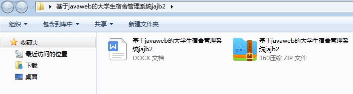
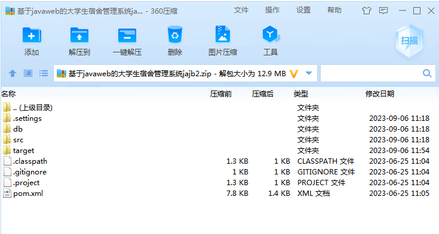
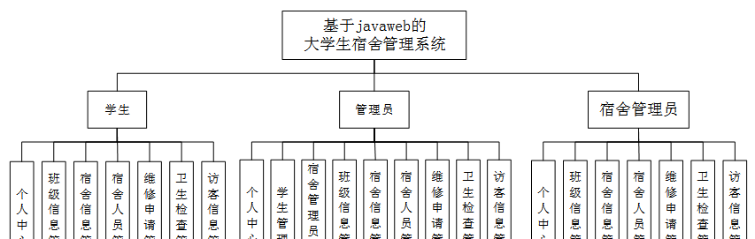
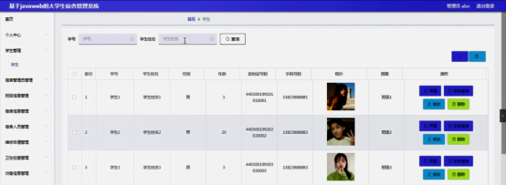
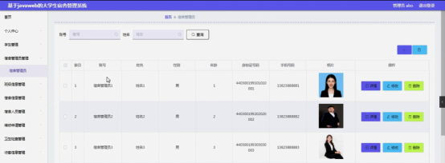
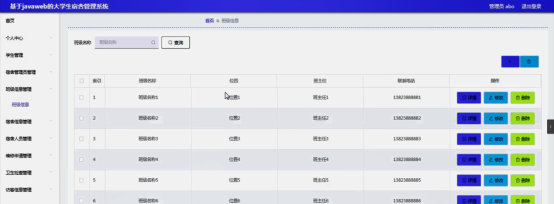
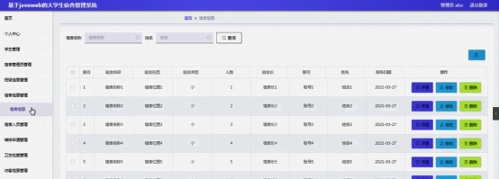

本系统带文档lw万字以上 文末可领取本课题的JAVA源码参考

## ******开发环境******

开发语言：Java

框架：ssm

技术：ssm+vue

JDK版本：JDK1.8

服务器：tomcat7

数据库：mysql 5.7或8.0

数据库工具：Navicat11

开发软件：eclipse/myeclipse/idea

Maven包：Maven3.3.9

浏览器：建议谷歌浏览器或edge

## ******功能模块******

为了更好的去理清本系统整体思路，对该系统以结构图的形式表达出来，设计实现该大学生宿舍管理系统的功能结构图如下所示：

## ******系统界面******

## ******2**** ** **023-2024**** ** **年成品******

除了以上作品下面是2023-2024年最新100套计算机专业原创的毕业设计源码+数据库，是近期作品，如果你的题目刚好在下面可以文末领取java源码参考

【1】| ssm基于Android的就诊服务APP  
---|---  
【2】| springboot基于springboot的商城购物系统  
【3】| springboot南昌高新区健身房管理系统  
【4】| ssm创新创业云平台  
【5】| springboot毕业设计网上管理系统  
【6】| ssm仿今日头条平台  
【7】| jspJava公用自助洗衣机服务系统  
【8】| springboot基于“天气+”概念下的微信小程序天气预报  
【9】| ssm外卖系统  
【10】| ssm基于用户偏好的个性化电商系统app  
【11】| jsp智慧校园校医室问诊系统  
【12】| springboot医院管理系统  
【13】| ssm基于VUE的高校学生社团管理系统  
【14】| springboot在线考研刷题系统  
【15】| jsp校园二手交易平台  
【16】| ssm基于Java的进口食品在线商城的设计与实现  
【17】| jsp健身房管理系统  
【18】| springboot微信的课程辅导小程序  
【19】| springboot基于Springboot的在线教育平台的设计与实现  
【20】| ssm智慧家政系统  
【21】| springboot房产维修网  
【22】| ssm基于小程序制作的剧本杀预约系统  
【23】| ssm客运公司网上售票系统  
【24】| ssm医疗资源分享平台  
【25】| ssm社区综合服务app  
【26】| jsp儿童资源教育网站  
【27】| jsp奥运会志愿者管理系统  
【28】| springboot加班管理系统的设计与实现  
【29】| ssm新考务系统  
【30】| ssm全国乡村振兴信息服务平台  
【31】| springboot基于springboot的电商中台管理系统  
【32】| ssm应急求救信息发布系统  
【33】| ssm小学生教学辅助  
【34】| jspHPV疫苗接种预约系统  
【35】| jsp学术团队资源管理系统  
【36】| jsp基于SSM学生网上请假系统  
【37】| springboot基于大数据平台的个性化图书推荐系统  
【38】| ssm微信小程序华信宿舍报修管理  
【39】| springboot校园失物招领系统  
【40】| jsp校友交流论坛的网站  
【41】| ssm云讲座系统  
【42】| ssm水上乐园售票管理系统  
【43】| springboot微信小程序的大学生心理咨询系统  
【44】| ssm古诗词鉴赏小程序  
【45】| springboot学生就业管理系统  
【46】| springboot基于springboot的农家乐预定平台  
【47】| ssm基于微信的观赏鱼交流中心  
【48】| ssm报名系统  
【49】| springboot协同过滤算法及在个性化音乐推荐  
【50】| jspIT耗材销售公司销售管理系统  
【51】| springboot基于Web的景区疫情预警系统设计与实现  
【52】| ssm物业管理系统  
【53】| ssm基于校医院管理服务的微信小程序  
【54】| ssm在线点餐小程序  
【55】| jsp唯爱家政服务系统的设计与实现  
【56】| ssm大学校园二手教材与书籍  
【57】| springboot医疗管理系统  
【58】| springboot汽车租赁公司小程序  
【59】| springboot列车调度信息系统的设计与实现  
【60】| ssm成都美食交流平台  
【61】| ssm学生宿舍管理系统  
【62】| ssm情报综合管理系统  
【63】| ssm二手图书交易小程序  
【64】| springboot机房排课系统  
【65】| springboot基于web的健身俱乐部管理系统  
【66】| springboot实验室管理系统  
【67】| springboot人脸识别物流运输管理系统  
【68】| jsp基于JSP开发的在线音乐管理系统  
【69】| ssm微信小程序的社区物业管理  
【70】| jsp智能推荐算法的驾校管理系统  
【71】| ssm免税店销售系统  
【72】| ssm基于小程序的人工智能类竞赛管理系统  
【73】| ssm基于位置管理的员工考勤打卡系统设计app  
【74】| jsp校园保修系统  
【75】| ssm睿道教育平台在线考试子系统  
【76】| ssm中小型企业在线工作日志管理系统  
【77】| jsp基于鸿蒙系统的教师教学质量问卷调查系统  
【78】| jsp新冠疫情战疫志愿者系统  
【79】| springboot医疗资源分享平台  
【80】| ssm外卖会员管理系统  
【81】| jsp五金店的销售系统  
【82】| ssm小程序共享电动车租赁系统  
【83】| springboot电子商务创业合作网站  
【84】| ssm基于微信小程序的大学生运动管理系统  
【85】| springboot物品竞价拍卖系统  
【86】| springboot学生信息管理系统  
【87】| ssm我爱美食点评类小程序  
【88】| springboot在线智能办公系统  
【89】| springboot河北民族师范学院教室管理系统  
【90】| ssm社区日间照料中心管理系统app  
【91】| ssm信息工程学院学科竞赛管理平台  
【92】| ssm基于SSM的砂石销售管理系统  
【93】| jsp人才管理系统  
【94】| springboot基于微信小程序的生鲜电商订购平台  
【95】| springboot商品智能推荐系统  
【96】| ssm农副产品网上预订系统  
【97】| ssm环巢湖智慧养老系统  
【98】| ssm个人人际关系管理软件  
【99】| springboot基于微信小程序的疫情点餐系统  
【100】| ssm基于微信小程序的医院自助挂号系统  
  
## ******源码分享和部署******

