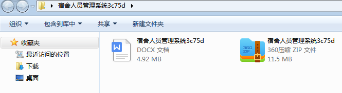
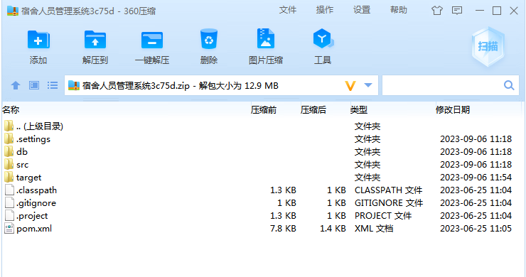
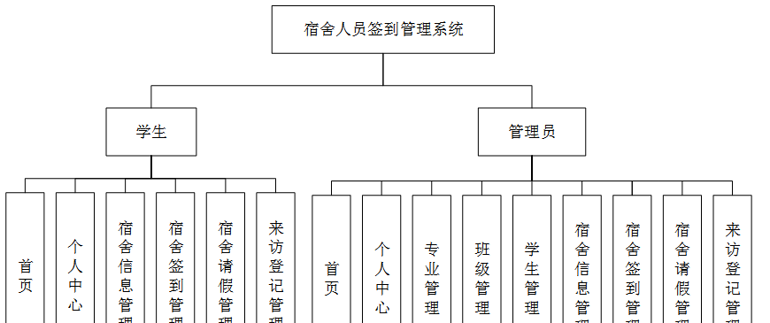
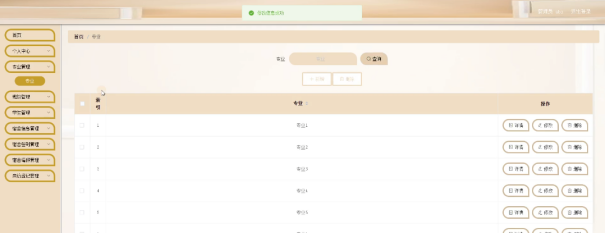
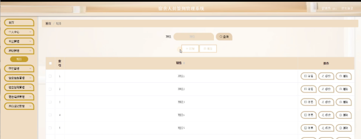
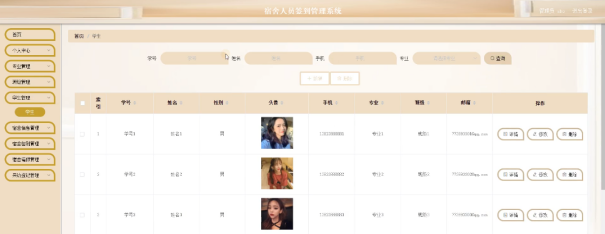
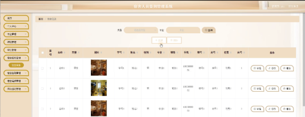

本系统带文档lw万字以上 文末可领取本课题的JAVA源码参考

## ******开发环境******

开发语言：Java

框架：ssm

技术：ssm+vue

JDK版本：JDK1.8

服务器：tomcat7

数据库：mysql 5.7或8.0

数据库工具：Navicat11

开发软件：eclipse/myeclipse/idea

Maven包：Maven3.3.9

浏览器：建议谷歌浏览器或edge

## ******功能模块******

通过市场调研及咨询研究，了解了用户及管理者的使用需求，于是制定了管理员和学生等模块。功能结构图如下所示：

## ******系统界面******

## ******2**** ** **023-2024**** ** **年成品******

除了以上作品下面是2023-2024年最新100套计算机专业原创的毕业设计源码+数据库，是近期作品，如果你的题目刚好在下面可以文末领取java源码参考

【1】| jsp教材信息管理系统  
---|---  
【2】| ssm校园二手交易管理系统  
【3】| jsp宠物管理系统  
【4】| jsp和光JK制服网站  
【5】| ssm本科生专业分流管理系统  
【6】| ssm基于5G应用的生鲜食品智能销售平台  
【7】| springboot慢性肾病的营养评价及干预  
【8】| ssm招生宣传工作人员管理系统  
【9】| ssm基于Kinect和可穿戴的健康管理系统  
【10】| ssm基于微信小程序的校园二手交易平台  
【11】| ssm毕业生就业管理系统  
【12】| ssm甘蔗种植管理系统  
【13】| jsp基于Java的汽车销售系统  
【14】| ssm汽车4S店APP  
【15】| ssm基于ssm在线寻亲系统  
【16】| springboot基于云服务实现的线上社交平台  
【17】| ssm基于SSM的房产中介信息系统  
【18】| ssm云游博物馆微信小程序的设计与实现  
【19】| ssm大学生校园线上知识共享平台  
【20】| ssm微信小程序超市商品库存管理系统  
【21】| springboot化妆品销售管理系统  
【22】| springboot安卓党史教育学习系统  
【23】| springboot工作流引擎在OA办公系统  
【24】| ssm基于微信小程序的时间碎片管理器  
【25】| ssm校园快递代取平台  
【26】| ssm社区医院儿童预防接种管理系统  
【27】| ssm漫画小程序  
【28】| ssm学生考勤及课程管理APP  
【29】| springboot健康管理信息系统  
【30】| springboot商城后台管理系统  
【31】| ssm基于Java的班委报名投票系统  
【32】| ssm智慧社区家政服务系统  
【33】| springboot姜太公渔具销售系统  
【34】| jsp基于web的学生宿舍管理系统的设计与实现  
【35】| jsp光华学生社团管理系统  
【36】| ssm基于小程序的大学生双创团队招募平台  
【37】| springboot房产销售管理系统  
【38】| ssm基于个人需求和地域特色的外卖推荐系统  
【39】| ssm基于Android的驴友社交系统平台  
【40】| ssm学生宿舍管理系统  
【41】| ssm工程质量验收管理系统  
【42】| ssm校园疫情管理系统  
【43】| ssm图书借还系统  
【44】| springboot云台音乐微信小程序  
【45】| jsp企业档案信息化综合管理系统  
【46】| springboot智慧迎新系统  
【47】| ssm基于微信小程序的公交查询平台  
【48】| ssmDIY模型网站的设计与实现  
【49】| springboot基于微信小程序的共享平台  
【50】| ssm基于安卓健康饮水APP  
【51】| ssm新县红色旅游  
【52】| springboot数码潮玩众筹社区平台app  
【53】| jsp图书借阅系统  
【54】| springboot就业推荐系统  
【55】| springboot微信小程序的校园运动会系统  
【56】| ssm疫情防控信息采集处理小程序  
【57】| jsp校园失物招领平台  
【58】| springboot物流管理系统  
【59】| jsp企业人事管理系统  
【60】| ssm智能仓储维修管理系统设计  
【61】| ssmExcel操作题自动评分系统  
【62】| springboot校园闲置物品交易平台的设计与实现  
【63】| springboot智能停车计费系统小程序  
【64】| jspweb平台  
【65】| springboot智慧交通  
【66】| ssm关山社区居民信息管理系统  
【67】| ssm微信小程序课程管理  
【68】| ssm家用电器售后服务平台  
【69】| jsp景点推荐系统  
【70】| jsp基于ssm乐器网站系统  
【71】| springboot微信小程序的基金优选系统  
【72】| jsp健身俱乐部管理系统  
【73】| ssm基于微信小程序的信息化农贸市场的设计与实现  
【74】| ssm动漫交流与推荐分析系统  
【75】| jsp基于java的综合教务管理系统  
【76】| jsp学生考试成绩统计分析系统  
【77】| springboot体育科技运动综合信息平台  
【78】| ssmAndroid服装搭配  
【79】| springboot二手物品网上交易平台  
【80】| ssm基于推荐算法的汽车租赁系统  
【81】| springboot商场购物管理系统  
【82】| ssm学术交流管理系统APP  
【83】| springboot校友转租平台  
【84】| ssm医院住院管理系统  
【85】| ssm基于微信小程序的百年党史学习系统  
【86】| jsp房屋租赁系统  
【87】| ssm学生请假管理小程序  
【88】| ssm基于Android的校园综合性app  
【89】| ssm智慧民政服务平台  
【90】| ssm城院闲置资源共享APP  
【91】| jsp学生宿舍设备报修  
【92】| springboot在线论坛系统  
【93】| ssm社区流浪动物救助领养系统  
【94】| springboot大学社团管理系统  
【95】| jsp宿舍管理系统  
【96】| springboot智慧社区车辆监控平台  
【97】| springboot疫情下药店管理系统  
【98】| springboot学习交流平台的设计与实现  
【99】| ssm在线学习分享平台  
【100】| ssm新生入学管理系统  
  
## ******源码分享和部署******

