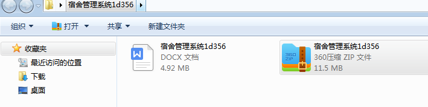
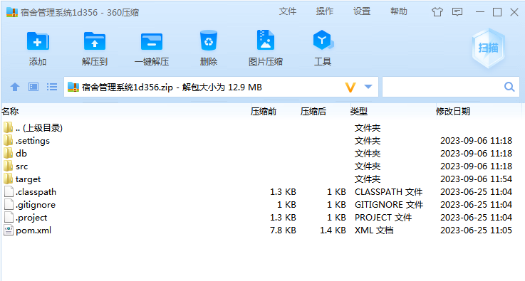
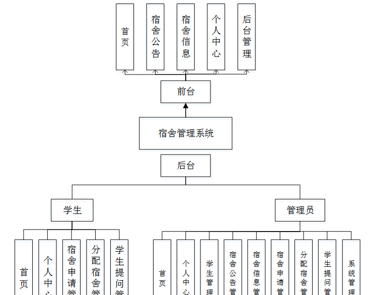
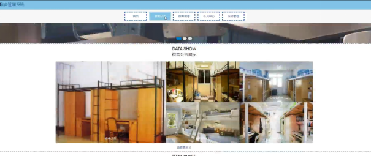
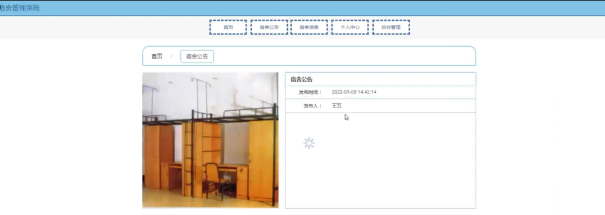
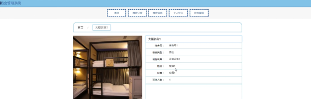
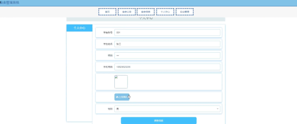
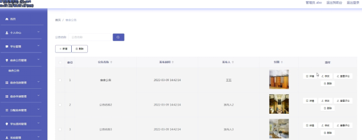

本系统带文档lw万字以上 文末可领取本课题的JAVA源码参考

## ******开发环境******

开发语言：Java

框架：ssm

技术：ssm+vue

JDK版本：JDK1.8

服务器：tomcat7

数据库：mysql 5.7或8.0

数据库工具：Navicat11

开发软件：eclipse/myeclipse/idea

Maven包：Maven3.3.9

浏览器：建议谷歌浏览器或edge

## ******功能模块******

这些功能可以充分满足宿舍管理系统的需求。此系统功能较为全面如下图系统功能结构如图4-3所示。

## ******系统界面******

## ******2**** ** **023-2024**** ** **年成品******

除了以上作品下面是2023-2024年最新100套计算机专业原创的毕业设计源码+数据库，是近期作品，如果你的题目刚好在下面可以文末领取java源码参考

【1】| ssm社区老年人活动志愿者服务系统  
---|---  
【2】| jsp在线图书个性化推荐系统  
【3】| springboot健康商城药品线上配送系统  
【4】| ssm学生会综合管理系统  
【5】| jsp基于web的电子产品网络购物平台  
【6】| ssm宠物救助与领养小程序  
【7】| ssm宠物领养小程序  
【8】| springboot宠物寄养酒店系统  
【9】| ssm健康定位打卡系统  
【10】| springboot城市建设用地管理系统  
【11】| ssm基于Android的健康记录APP  
【12】| springboot物物交换系统  
【13】| springboot校园旧衣物上门回收捐赠小程序  
【14】| ssm助学校园兼职管理系统  
【15】| springboot投搞管理系统  
【16】| jsp南义安诊所管理系统  
【17】| ssm旅游信息管理系统  
【18】| ssm充电桩小程序  
【19】| ssm基于小程序的影视观看系统  
【20】| springboot健身场馆预约  
【21】| springboot微信小程序的食谱大全“食全食美”  
【22】| ssm基于微信小程序的错题管理系统  
【23】| springboot校园数字化服务平台  
【24】| ssm微信小程序的课堂互动系统  
【25】| ssm基于RFID和二维码技术的鸡蛋质量溯源系统设计  
【26】| springboot旅游景区管理系统  
【27】| springboot流浪猫狗救助平台  
【28】| springboot学生社团管理系统  
【29】| jsp景区资源管理系统  
【30】| ssm基于微信小程序的电子阅读器的设计与实现  
【31】| ssm基于SSM的校园商城  
【32】| jsp五点壹零教育网站  
【33】| springboot工厂的机器设备测控APP  
【34】| springboot古建筑信息现代数字化管理平台  
【35】| springboot学生在线考试系统  
【36】| jsp哈尔滨市贯日儿童影楼管理系统  
【37】| jsp宿舍报修系统  
【38】| jsp教学管理系统  
【39】| ssm病历管理小程序  
【40】| jsp医疗废物溯源系统中的科室管理系统  
【41】| springboot基于Web的绿色环保网站  
【42】| ssm学生量化考核系统  
【43】| ssm七七美食汇  
【44】| springboot基于springboot的理想汽配城  
【45】| jsp学生社团管理系统  
【46】| ssm民宿预定管理系统  
【47】| springboot智慧党建系统  
【48】| ssm商户供销存微信小程序的设计与实现  
【49】| ssm学校防疫小程序  
【50】| springboot树木知识科普网站  
【51】| jsp企业档案管理系统  
【52】| springboot应急物资管理系统  
【53】| jsp星期八酒店管理系统  
【54】| ssm医院预约挂号管理系统  
【55】| springboot企业公文管理系统  
【56】| ssm农产品直销小程序  
【57】| jsp健身房信息管理系统  
【58】| springboot医院物资管理系统  
【59】| ssm民政办事预约服务系统  
【60】| ssm星星书屋购书小程序  
【61】| ssm校企合作实训管理系统  
【62】| ssm业俊宾馆客房管理系统  
【63】| ssm校园扶助综合服务平台的设计与实现  
【64】| ssmspringbmvc餐厅点餐  
【65】| jsp校园兼职系统的设计与实现  
【66】| ssm动物救助中心管理系统  
【67】| ssm基于ssm的教务管理系统  
【68】| springboot医疗系统  
【69】| ssm微信小程序的律师事务所服务平台  
【70】| jsp基于ssm的校园求职招聘系统  
【71】| springboot大学校园智能化人流管理系统  
【72】| jsp智健体检中心管理网站  
【73】| jsp在线教学系统  
【74】| springboot校园失物认领系统  
【75】| ssm体育赛事管理系统App  
【76】| ssm全国生鲜溯源平台  
【77】| ssm基于安卓的外卖APP  
【78】| springboot杭州辉瑞MRO采购管理  
【79】| ssm医院预约挂号小程序  
【80】| springboot个性化名片网站  
【81】| ssm基于翻转课堂教学模式的小学英语微课互动平台  
【82】| ssm实习管理  
【83】| ssm基于微信小程序的同城交易信息系统  
【84】| ssm信息学科部网站  
【85】| ssm优家选装修第三方保障平台  
【86】| springboot品牌服饰网站的设计与实现  
【87】| springboot校园闲置物品交易系统  
【88】| springboot大学生体育运动会服务系统  
【89】| springboot智能公交系统app  
【90】| ssm基于android的企业员工考勤系统  
【91】| ssm仓库管理系统  
【92】| jsp房屋租赁系统的设计与实现  
【93】| jsp校园疫情防控管理系统  
【94】| springboot大学生博客园管理系统  
【95】| jsp摄影作品网站  
【96】| ssm乒乓球运动员管理系统  
【97】| springboot毕业设计管理系统  
【98】| ssm商场地下停车场寻车app  
【99】| jsp宿舍报修管理系统的设计与实现  
【100】| ssm基于vue.js技术的潮鞋在线购买网站  
  
## ******源码分享和部署******

