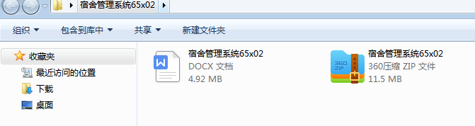
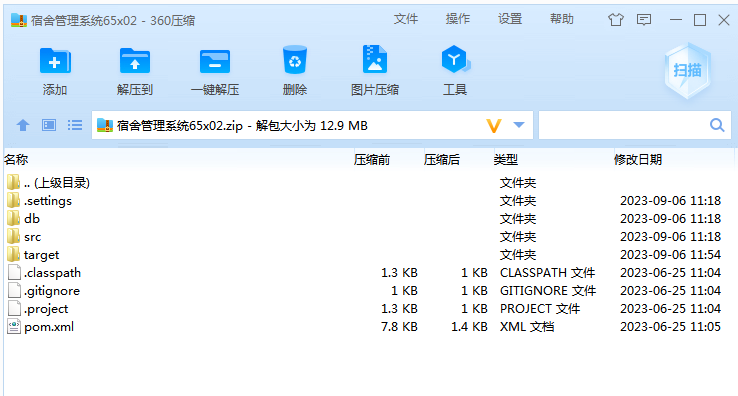
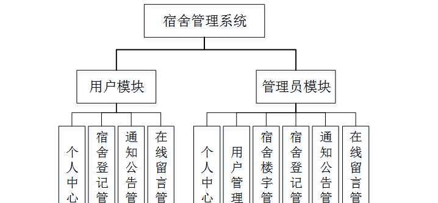
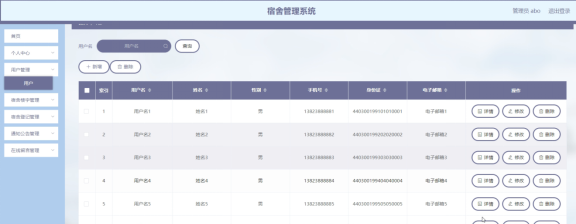
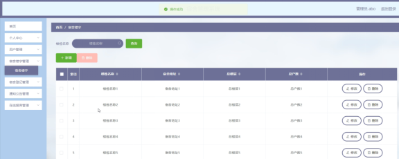
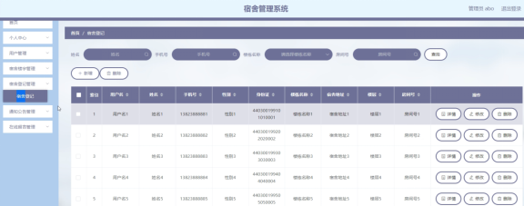
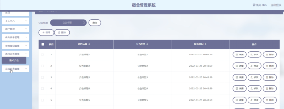

本系统带文档lw万字以上 文末可领取本课题的JAVA源码参考

## ******开发环境******

开发语言：Java

框架：ssm

技术：ssm+vue

JDK版本：JDK1.8

服务器：tomcat7

数据库：mysql 5.7或8.0

数据库工具：Navicat11

开发软件：eclipse/myeclipse/idea

Maven包：Maven3.3.9

浏览器：建议谷歌浏览器或edge

## ******功能模块******

为了更好的去理清本系统整体思路，对该系统以结构图的形式表达出来，设计实现该宿舍管理系统的功能结构图如下所示：

## ******系统界面******

## ******2**** ** **023-2024**** ** **年成品******

除了以上作品下面是2023-2024年最新100套计算机专业原创的毕业设计源码+数据库，是近期作品，如果你的题目刚好在下面可以文末领取java源码参考

【1】| springboot小型OA系统设计与实现  
---|---  
【2】| ssm健身房管理系统  
【3】| ssm学生学习评价与分析系统  
【4】| jsp客户管理系统  
【5】| ssm家具商城  
【6】| springboot校园招聘系统  
【7】| jsp办公电子文档收集与管理系统  
【8】| jsp互动媒体学习社区  
【9】| jsp基于java心理健康系统  
【10】| ssm基于SSM的校园小助手系统  
【11】| ssm宿舍管理系统app  
【12】| jsp家政服务预约管理系统  
【13】| ssm在线实验室器材设备借用管理系统  
【14】| springboot基于Springboot的校园单车租赁系统  
【15】| ssm企业人力资源管理  
【16】| springboot中电科海信院培训考试系统的设计与实现  
【17】| springboot中外儿童绘本赏析网站  
【18】| ssm基于SSM的高校毕业生就业管理系统  
【19】| springboot校园靓拍网站  
【20】| ssm宠物医院管理系统  
【21】| springboot教师评价系统  
【22】| springboot广告设计与投放系统  
【23】| ssm基于ssm的楼盘销售系统  
【24】| jsp养老公寓管理系统  
【25】| jsp华夏文库网的设计与开发  
【26】| ssm学生体检系统  
【27】| ssm疫情高校学生请假进出系统  
【28】| springboot体育课程在线预约平台  
【29】| jsp智能开放实验室管理系统  
【30】| ssm二手商城交易系统  
【31】| ssm云民大民族舞蹈鉴赏社  
【32】| jsp基于JavaWeb生鲜O2O订购平台  
【33】| ssm在线教学管理系统  
【34】| springboot摄影预约系统  
【35】| jsp房屋租赁管理系统的设计和实现  
【36】| ssmLPL周边商城的设计与实现  
【37】| ssm教室预约平台  
【38】| springboot物品捎带平台  
【39】| jsp图书馆自习室管理系统的设计与实现  
【40】| ssm中小型企业合同管理系统  
【41】| ssm儿童疫苗接种提醒APP  
【42】| jsp医院预约挂号系统  
【43】| jsp高校心理医患交流平台  
【44】| ssm基于微信小程序的学生公寓生活管理系统  
【45】| ssm养老院药品配发管理APP  
【46】| ssm企业岗前培训与考试系统  
【47】| springboot健身系统的设计与实现  
【48】| springboot医院在线挂号微信小程序  
【49】| ssm微信导游客服小程序  
【50】| ssm大学生家教系统  
【51】| jsp旅游网站  
【52】| ssm基于微信小程序的校园二手交易  
【53】| ssm忻州市雾造司甜品点餐系统  
【54】| ssm开发共享汽车app  
【55】| jsp优质影视作品网站  
【56】| ssm出租车租赁管理系统  
【57】| ssm小区物业管理app  
【58】| ssm娃娃小程序  
【59】| ssm教研室采购管理系统  
【60】| ssm基于Android平台的医院挂号系统  
【61】| jsp智慧物流管理系统  
【62】| jsp城市电网检修管理系统  
【63】| ssm旅行指南移动端app  
【64】| ssm党支部在线学习  
【65】| jsp基于Java烟支信息管理系统  
【66】| ssm基于Android技术的网络交易平台  
【67】| jsp城市智慧停车场管理系统  
【68】| ssm展厅动态小程序  
【69】| springboot健身房管理系统的设计与实现  
【70】| springboot基于Android的供应链管理系统  
【71】| ssm对当代大学生身体健康数据的可视化分析  
【72】| springboot智慧医疗系统  
【73】| springboot基于springboot的校企招聘管理系统  
【74】| jspGiulia汽车经销商销售管理系统  
【75】| jsp数据结构教学网站设计与开发  
【76】| springboot汽车租赁管理系统  
【77】| ssm婴儿用品系统  
【78】| ssm垃圾分类管理系统  
【79】| springboot基金交易平台  
【80】| springboot大学生心里咨询预约管理系统  
【81】| jsp基于java的报刊杂志征订管理系统  
【82】| ssm甘肃草地植物数字化标本库管理系统  
【83】| jsp校园社团管理系统的设计与实现  
【84】| ssm大学体育馆预约系统  
【85】| springboot交友平台网站  
【86】| springboot公益岗位招聘网  
【87】| ssm垃圾分类系统  
【88】| jsp学生宿舍管理系统  
【89】| springboot基于Vue的社区拼购商城  
【90】| springboot校园订餐管理系统  
【91】| jsp教师档案管理系统的设计与实现  
【92】| ssm乐器销售管理系统  
【93】| jsp小型超市仓库管理系统  
【94】| ssm摄影工作室约拍系统  
【95】| springboot学校二手书城系统  
【96】| jsp智能停车收费与运营管理系统  
【97】| ssm机房自由上机收费管理系统  
【98】| ssm临时停车收费管理系统  
【99】| jsp供电所电子档案管理系统  
【100】| ssm海外淘小程序  
  
## ******源码分享和部署******

