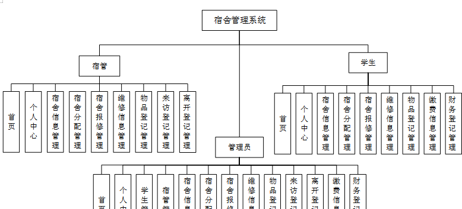

本系统带文档lw万字以上 文末可领取本课题的JAVA源码参考

## ******开发环境******

开发语言：Java

框架：ssm

技术：ssm+vue

JDK版本：JDK1.8

服务器：tomcat7

数据库：mysql 5.7或8.0

数据库工具：Navicat11

开发软件：eclipse/myeclipse/idea

Maven包：Maven3.3.9

浏览器：建议谷歌浏览器或edge

## ******功能模块******

系统分为管理员功能模块,学生功能模块,宿管功能模块。

学生登录系统为学生操作界面，主要包括首页、个人中心、宿舍信息管理、宿舍分配管理、宿舍报修管理、维修信息管理、物品登记管理、缴费信息管理、财务登记管理等功能；

宿管登录系统为宿管操作界面，主要包括首页、个人中心、宿舍信息管理、宿舍分配管理、宿舍报修管理、维修信息管理、物品登记管理、来访登记管理、离开登记管理等功能；

管理员功能模块为管理员操作界面，主要包括首页、个人中心、学生管理、宿管管理、宿舍信息管理、宿舍分配管理、宿舍报修管理、维修信息管理、物品登记管理、来访登记管理、离开登记管理、缴费信息管理、财务登记管理等功能；

系统整体功能如下图4-2所示。

## ******系统界面******

## ******2**** ** **023-2024**** ** **年成品******

除了以上作品下面是2023-2024年最新100套计算机专业原创的毕业设计源码+数据库，是近期作品，如果你的题目刚好在下面可以文末领取java源码参考

【1】| jspDIY服装铺电子商务平台  
---|---  
【2】| jsp发光购物网站  
【3】| springboot医废追溯系统  
【4】| springboot医药健康系统  
【5】| ssm基于Android新闻APP  
【6】| jsp“马上到”装修网的设计与实现  
【7】| ssm基于Java的小型电子病历系统  
【8】| ssm微信小程序高校学科竞赛管理系统  
【9】| ssm基于移动通信技术的航空订票系统app  
【10】| springboot基于微信小程序的转票系统  
【11】| jsp在线学习平台  
【12】| jsp开放性实验室预约管理系统  
【13】| ssm基于Web的在线音乐网站  
【14】| jsp博客系统设计与实现  
【15】| springboot勤工助学管理系统  
【16】| springboot电商平台设计与实现  
【17】| jsp中医养生系统设计与实现  
【18】| jsp实践教学管理系统  
【19】| springboot农产品销售网站  
【20】| ssm基于javaweb的招聘管理系统  
【21】| springboot公共场所安保信息管理系统  
【22】| ssm基于vue仿天津地铁app  
【23】| ssm新闻推荐系统  
【24】| ssm基于安卓的手机点餐  
【25】| ssm校园垃圾智能分类系统的设计与实现  
【26】| springboot微信小程序的新生报道系统  
【27】| jsp在线律师机器人问答系统  
【28】| ssm基于java的动漫视频管理分析系统的设计与实现  
【29】| springboot家乡旅游网站的设计与实现  
【30】| springboot中国足球甲级联赛赛事管理系统  
【31】| ssm基于鸿蒙操作系统的新闻app设计  
【32】| jsp图书馆门户网站  
【33】| ssm影院订票系统  
【34】| jsp敬老院管理系统  
【35】| jsp健康管理系统的设计与实现  
【36】| springboot小药店销售管理系统  
【37】| ssm校园订餐小程序  
【38】| jsp乡村卫生所管理系统  
【39】| ssm基于web的企业人事管理系统  
【40】| jsp佳客来美食网站设计  
【41】| springboot办公用品在线销售系统  
【42】| ssm基于android的儿童成长管理app  
【43】| ssm人力资源管理系统  
【44】| jsp校园宿舍管理系统的设计  
【45】| ssm大学生心理健康咨询管理系统  
【46】| ssm基于ssm框架的音乐网站  
【47】| jsp某中学学情分析系统  
【48】| springboot三星小区车辆登记系统  
【49】| jsp大学生家教平台的设计与实现  
【50】| springboot汽车维修服务管理  
【51】| springboot班级管理子项目  
【52】| jsp宠物医院管理系统  
【53】| ssm基于Android的校园内自行车租赁系统  
【54】| ssm电子资源管理系统  
【55】| jsp小说推荐网站的设计与实现  
【56】| jsp单词软件系统的设计与实现  
【57】| jsp基于web的健康信息管理系统  
【58】| ssm基于vue的选课系统  
【59】| jsp图书销售网站设计与实现  
【60】| ssm出版社高校教材样书管理  
【61】| springboot琴行管理系统  
【62】| springboot公司实习生培训系统  
【63】| springboot快递信息管理  
【64】| ssm基于SSM的物业小区管理系统  
【65】| ssm慧谷食堂在线订餐系统  
【66】| ssm电商后台管理系统  
【67】| springboot基于SpringBoot的房源管理系统  
【68】| jsp校园二手交易平台  
【69】| jsp基于java的信访管理系统  
【70】| ssm家政服务预约系统小程序  
【71】| springboot敬老院管理系统  
【72】| ssm影院app  
【73】| ssm基于Android的电子病历系统  
【74】| ssm微信记账小程序  
【75】| jsp东软电子出版社管理系统  
【76】| springboot公司资产  
【77】| jsp家庭垃圾分类管理系统  
【78】| jsp大连旅游平台  
【79】| ssm济南景区个人旅游规划管理  
【80】| ssm基于安卓的社团管理系统  
【81】| ssm例假app的设计与实现  
【82】| jsp“疫情通”信息管理平台  
【83】| ssm基于Android的社区论坛网站  
【84】| ssm基于java的高校学生实习管理系统设计  
【85】| ssm教室预约系统微信小程序  
【86】| ssm校园网上购物系统app  
【87】| ssm基于微信小程序的汽车共享充电桩预约系统  
【88】| springboot快递管理系统  
【89】| ssm农贸市场摊位管理系统  
【90】| jsp基于ssm的医院预约挂号管理系统  
【91】| ssm哲学人生系统小程序  
【92】| ssm民宿预订系统  
【93】| springboot新疆省考资料分享网站  
【94】| ssm微信小程序的社区购物系统  
【95】| jsp城市环境监管系统  
【96】| ssm基于微信小程序的校园突发事件应急管理系统  
【97】| springboot房地产公司员工工单管理系统  
【98】| ssm电影购票系统  
【99】| ssm拼车出行微信小程序  
【100】| springboot中工校园招聘系统  
  
## ******源码分享和部署******

