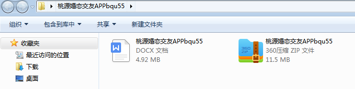
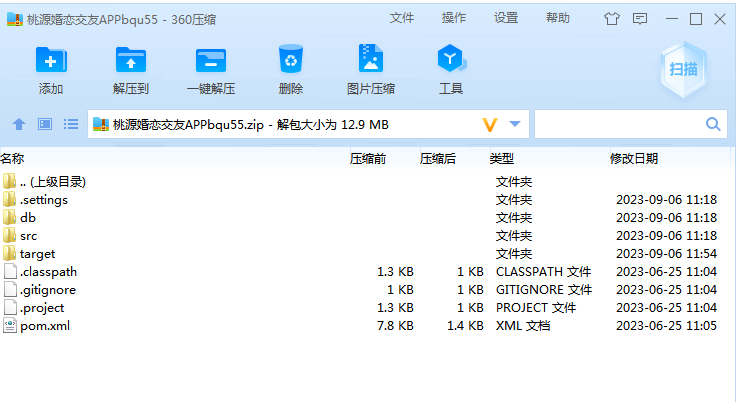
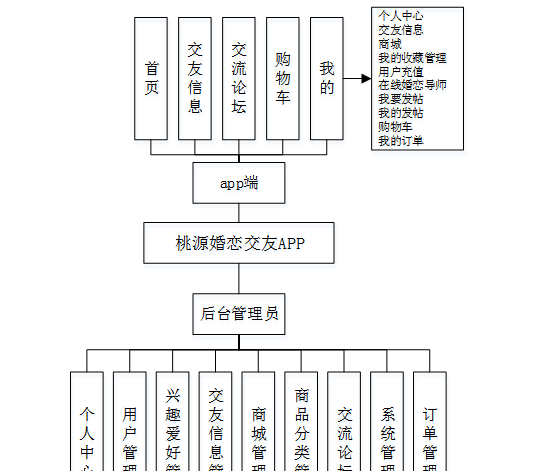
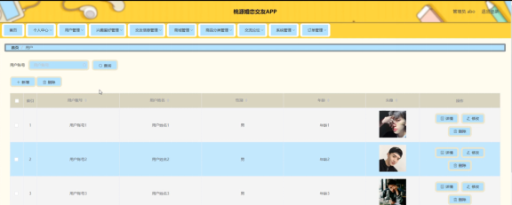
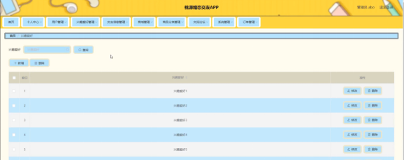
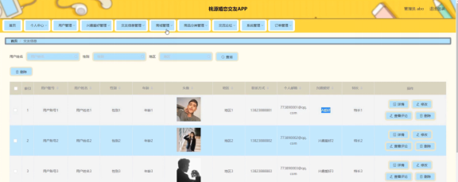
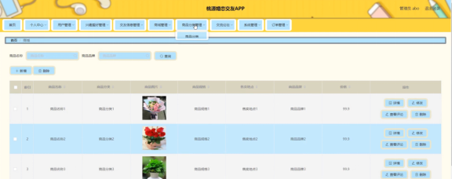

本系统带文档lw万字以上 文末可领取本课题的JAVA源码参考

## ******开发环境******

开发语言：Java

框架：ssm

技术：ssm+vue

JDK版本：JDK1.8

服务器：tomcat7

数据库：mysql 5.7或8.0

数据库工具：Navicat11

开发软件：eclipse/myeclipse/idea

Maven包：Maven3.3.9

浏览器：建议谷歌浏览器或edge

## ******功能模块******

桃源婚恋交友APP分两大部分，即管理员管理和用户管理。系统按照用户的实际需求开发而来，贴近生活。从管理员出拿到分配好的账号密码可以进入系统，使用相关的系统应用。管理员总体负责整体系统的运行维护，统筹协调。

系统整体模块设计：系统分为管理员和用户两大用户角色，系统管理员有最大的权限，整体功能展示如图4-1所示。

## ******系统界面******

## ******2**** ** **023-2024**** ** **年成品******

除了以上作品下面是2023-2024年最新100套计算机专业原创的毕业设计源码+数据库，是近期作品，如果你的题目刚好在下面可以文末领取java源码参考

【1】| springboot旅游网站的设计与实现  
---|---  
【2】| springboot在线招聘系统  
【3】| ssm健身房管理系统  
【4】| ssm桐梓娄山书店管理系统  
【5】| ssm校园管理小程序  
【6】| ssm一卡通系统的设计与实现  
【7】| ssm个人档案APP  
【8】| springboot校园的微信小程序运动场预约系统  
【9】| springboot农商对接系统  
【10】| springboot共享自习室管理系统  
【11】| jsp宿舍水电管理系统  
【12】| springboot基于JavaWeb的健身房管理系统  
【13】| ssm动漫衍生品交易平台  
【14】| jsp专业实习网站  
【15】| jsp大学生防疫管理系统设计与实现  
【16】| ssm基于微信小程序的电影交流平台  
【17】| springboot“互联网+”社区管理系统  
【18】| springboot数据资产估价分析与交易平台app  
【19】| jsp在线考试系统  
【20】| springboot列车调度信息系统的设计与实现  
【21】| ssm微信小程序学生体测管理系统  
【22】| springboot湘遇私房小厨点餐系统小程序  
【23】| ssm微信小程序花店系统  
【24】| ssm疫情防控管理系统  
【25】| ssmC＋＋程序设计考试系统  
【26】| ssm校园社区app  
【27】| jsp学生选课系统  
【28】| springboot水资源管理系统  
【29】| springboot智慧物流管理系统  
【30】| ssm双流社区医院就医app  
【31】| springboot图书管理信息系统  
【32】| ssm房屋租赁系统  
【33】| ssm基于ssm的民宿管理系统  
【34】| ssm基于vue的木里风景文化管理平台  
【35】| jsp智慧社区服务平台  
【36】| ssm喵犬云救助平台  
【37】| ssm中小型医院综合管理系统  
【38】| springboot大学生家教管理系统  
【39】| jsp宠物领养系统  
【40】| ssm基于微信小程序的疫情智慧防护平台  
【41】| springboot培养方案管理系统  
【42】| ssm基于微信小程序的“美妆优购”在线系统  
【43】| jsp云办公系统的设计与实现  
【44】| ssm疫情信息管理系统  
【45】| ssm基于web的软件资源库的设计与实现  
【46】| springboot某公司项目信息管理系统  
【47】| ssm农产品追溯系统设计与实现  
【48】| jsp农副及衍生产品交易系统  
【49】| springboot松康老年社区健康饮食推荐与配送系统  
【50】| ssm智能社区管理系统  
【51】| ssm基于SSM的校园招聘系统  
【52】| ssm基于人脸识别的个人博客登录系统  
【53】| ssm校园信息助手APP  
【54】| ssm企业员工信息管理  
【55】| springboot人脸及位置检测网上签到微信小程序  
【56】| jsp基于协同过滤的购物网站的设计与实现  
【57】| jsp停车场车辆管理系统  
【58】| ssm学生定位签到管理App  
【59】| ssm智能租房推荐系统APP  
【60】| springboot扶贫管理系统  
【61】| jsp宿舍管理系统  
【62】| ssm校园社团管理系统  
【63】| jsp基于Java的二手车买卖管理系统设计与实现  
【64】| springboot微信音乐播放器小程序  
【65】| springboot基于SpringBoot构建的高校疫情防控平台  
【66】| jsp在线视频网站  
【67】| ssm学校防疫小程序  
【68】| ssm基于微信小程序的飞机订票系统的设计与实现  
【69】| springboot二手车估值与销售网络平台  
【70】| jsp企业采购网络管理系统  
【71】| springboot电脑销售管理系统  
【72】| ssm甘蔗种植管理系统  
【73】| jsp网上购物系统  
【74】| ssm投票管理系统  
【75】| ssm咖啡豆商城系统  
【76】| jspXX医院挂号管理系统  
【77】| springboot中文学习系统的设计与实现  
【78】| ssm基于微信小程序的资产管理平台  
【79】| ssm短视频APP  
【80】| ssm培训机构学生管理系统  
【81】| ssm理财系统管理平台  
【82】| springboot外卖服务系统  
【83】| springboot动漫论坛  
【84】| ssm智慧党建信息系统  
【85】| jsp“海洋生态环境保护宣传”网站设计与实现  
【86】| jsp个性化图书推荐系统  
【87】| springboot大学生兼职平台  
【88】| ssm基于微信小程序天天优选平台  
【89】| ssm安卓课堂点名及互动软件  
【90】| springboot书友互助小程序  
【91】| jsp医院挂号系统  
【92】| jsp停车场信息管理系统  
【93】| ssm电影院在线购票系统  
【94】| ssm短视频的推荐平台  
【95】| jsp学生选课系统  
【96】| ssm川派中医文化小程序  
【97】| jsp房产销售网站设计与开发  
【98】| jsp在线影院订票管理系统  
【99】| ssm工商行政许可信息爬取及展示系统  
【100】| ssm儿童免疫接种系统小程序  
  
## ******源码分享和部署******

