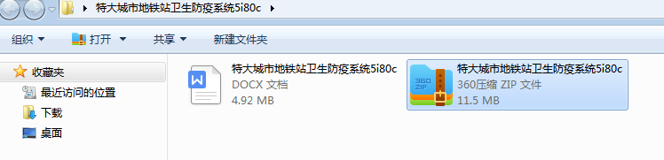
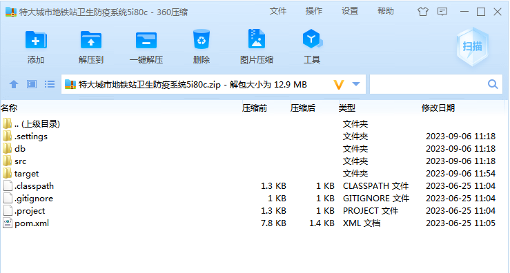
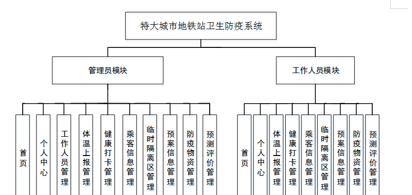
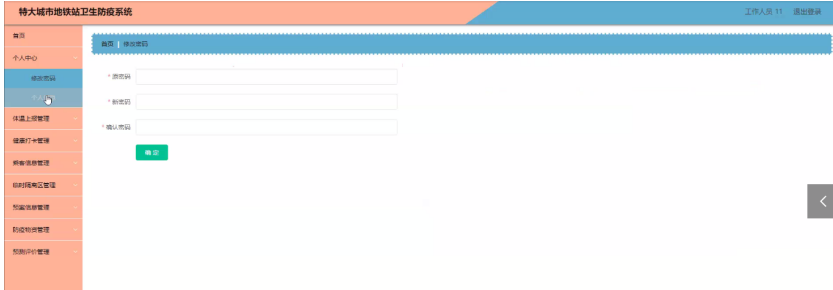
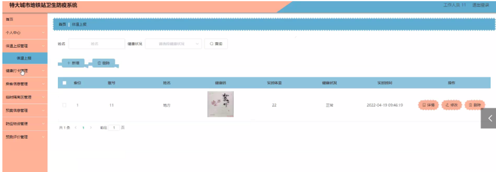
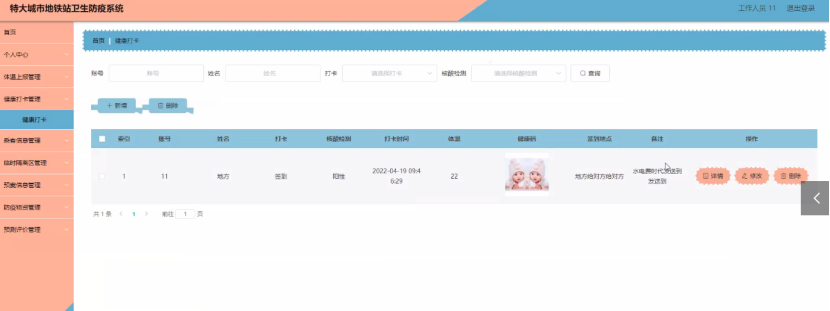
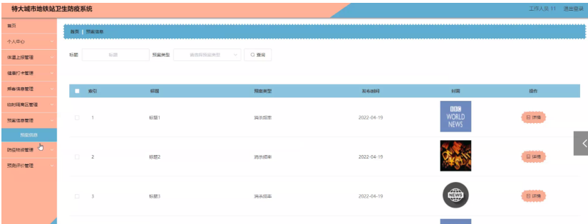

本系统带文档lw万字以上 文末可领取本课题的JAVA源码参考

## ******开发环境******

开发语言：Java

框架：ssm

技术：ssm+vue

JDK版本：JDK1.8

服务器：tomcat7

数据库：mysql 5.7或8.0

数据库工具：Navicat11

开发软件：eclipse/myeclipse/idea

Maven包：Maven3.3.9

浏览器：建议谷歌浏览器或edge

## ******功能模块******

系统的功能设计是整个系统的运行基础，是一个把设计需求替换成以计算机系统的形式表示出来。通过对特大城市地铁站卫生防疫系统的调查、分析和研究，得出了该网站的总体规划，这是开发设计系统的初步核心。

根据前期所得的数据流图，进一步的进行分析和研究，得到系统各模块的属性结构图。下面显示了系统功能的结构图。

特大城市地铁站卫生防疫系统功能模块的结构图，如图4-1所示：

## ******系统界面******

## ******2**** ** **023-2024**** ** **年成品******

除了以上作品下面是2023-2024年最新100套计算机专业原创的毕业设计源码+数据库，是近期作品，如果你的题目刚好在下面可以文末领取java源码参考

【1】| ssm图书馆座位预定管理小程序  
---|---  
【2】| ssm双端的在线学习考试平台  
【3】| ssm微校园在线系统app  
【4】| ssm医院挂号系统设计  
【5】| jsp毕业生就业调查统计系统  
【6】| ssm小程序的美食在线分享平台  
【7】| jsp基于JavaWeb的B2C电商商城系统  
【8】| springboot小区宠物管理平台  
【9】| ssm社区预定车位小程序  
【10】| ssm基于java的仓储信息管理系统  
【11】| springboot宠物医院预约挂号系统  
【12】| springboot基于springboot的校园生活工具租赁系统  
【13】| springboot校园台球厅的管理系统  
【14】| ssm共享电动车  
【15】| ssm基于Android的大学生健康管理APP  
【16】| springboot基于SpringBoot的莱山区信息网站  
【17】| ssm基于微信小程序美术馆预约系统  
【18】| jsp房屋租赁系统  
【19】| ssm气象分析系统的设计  
【20】| jsp在线考试系统  
【21】| jsp医务人员信息管理系统的设计与实现  
【22】| ssm在线教学系统  
【23】| ssm个人门户网站的设计与实现  
【24】| ssm心理评测APP  
【25】| springboot微信小程序的综合教务系统  
【26】| springboot医院药品的库存与销售管理系统  
【27】| ssm体检管理系统APP  
【28】| ssm基于Android的校园淘购物系统  
【29】| springboot勤工俭学管理系统  
【30】| ssm疫情隔离心理辅导系统  
【31】| ssm宠物寄养平台设计  
【32】| ssm教师出差管理系统  
【33】| springboot琴房预约系统  
【34】| ssm好又多百货商业广场有限公司自助收银操作系统  
【35】| springboot企业人力资源管理系统  
【36】| springboot校园篮球联赛管理系统  
【37】| springboot微信小程序的调查问卷平台  
【38】| ssm乐安县“岭南面馆”APP系统  
【39】| ssm校园共享单车  
【40】| ssm基于ssm框架高校运动会管理系统  
【41】| springboot基于Java的信公OA办公系统  
【42】| jsp基于天富天河热电厂OA管理信息系统  
【43】| jsp户外运动管理系统的设计与实现  
【44】| springboot弹唱教学分享平台  
【45】| ssm微信小程序视频直播卖货系统  
【46】| ssm基于微信小程序的儿童疫苗接种系统的设计与实现  
【47】| jsp教师教学信息系统  
【48】| ssm北京冬奥会志愿服务小程序  
【49】| jsp京西购物网站  
【50】| ssm毕业生就业管理系统  
【51】| springboot个人博客系统  
【52】| ssm电商客服意见跟踪系统  
【53】| ssm基于web的暗香小店系统的设计与实现  
【54】| ssm个人健康管理APP  
【55】| springboot个人博客系统的设计与实现  
【56】| springboot基于SpringBoot技术的招聘管理系统  
【57】| jsp在线阅读网站的设计与实现  
【58】| springboot宠物中心  
【59】| springboot基于Android的医院预约挂号系统  
【60】| ssm亲子益智成长平台小程序  
【61】| ssm全国生鲜溯源平台  
【62】| ssm基于安卓的智能监控系统  
【63】| ssm外卖调度管理系统  
【64】| ssm基于微信小程序的考研智能刷题系统  
【65】| springboot基于OBE理念的课程管理系统  
【66】| springboot学生在线考试系统  
【67】| springboot基于微信的酒店点菜小程序  
【68】| jsp旅游网站的设计与实现  
【69】| springboot基于springBoot的柜存银行采购系统  
【70】| jspK11391bwl就业管理  
【71】| jsp医院挂号系统  
【72】| ssm建筑工程管理系统  
【73】| jsp城市公共基础医疗  
【74】| jsp”三木子”时装管理系统  
【75】| springboot城市轨道交通线路查询  
【76】| springboot校园健康APP  
【77】| ssm电影订票小程序  
【78】| springboot养老机构评定系统  
【79】| ssm微信小程序订餐系统  
【80】| jsp买房与租房助手  
【81】| ssm家政服务预约平台  
【82】| jsp失踪人口管理系统  
【83】| ssm基于安卓的请假系统  
【84】| springboot基于H5的“解压小馆”APP  
【85】| springboot居家养老系统  
【86】| ssm基于vue框架的酒店订房系统  
【87】| springboot悦客民宿管理系统的设计与实现  
【88】| springboot打印助手平台  
【89】| springboot图书个性化推荐系统  
【90】| ssm医院挂号预约管理系统  
【91】| jsp新生报名系统的设计与实现  
【92】| ssm基于微信公众平台的新媒体投稿平台  
【93】| ssm人力资源管理系统  
【94】| jsp村级技能培训管理系统  
【95】| springboot医院手术预约及排班系统  
【96】| jsp公文审批流转系统  
【97】| ssm某商城汽配零件销售管理系统  
【98】| ssm企业员工信息管理系统  
【99】| ssm健身房管理系统  
【100】| jsp智能健身房管理系统  
  
## ******源码分享和部署******

