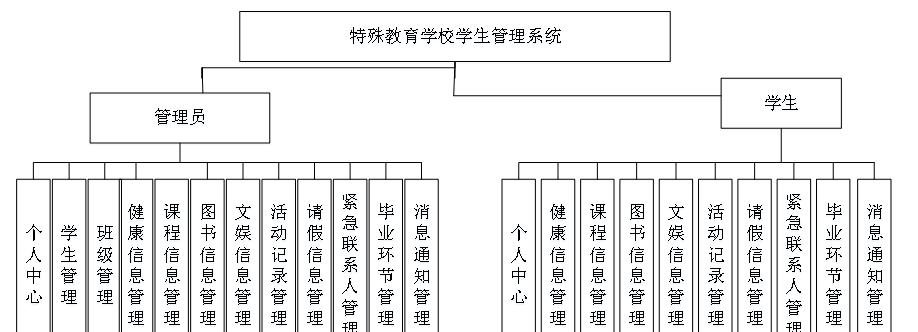

本系统带文档lw万字以上 文末可领取本课题的JAVA源码参考

## ******开发环境******

开发语言：Java

框架：ssm

技术：ssm+vue

JDK版本：JDK1.8

服务器：tomcat7

数据库：mysql 5.7或8.0

数据库工具：Navicat11

开发软件：eclipse/myeclipse/idea

Maven包：Maven3.3.9

浏览器：建议谷歌浏览器或edge

## ******功能模块******

为了更好的去理清本系统整体思路，对该系统以结构图的形式表达出来，设计实现该特殊教育学校学生管理系统的功能结构图如下所示：

## ******系统界面******

## ******2**** ** **023-2024**** ** **年成品******

除了以上作品下面是2023-2024年最新100套计算机专业原创的毕业设计源码+数据库，是近期作品，如果你的题目刚好在下面可以文末领取java源码参考

【1】| ssm微信小程序军训管理系统  
---|---  
【2】| ssm基于微信小程序的校园二手交易平台  
【3】| jsp基于JAVA的天坛医院线上看诊系统  
【4】| jsp基于SSM的农产品交易平台  
【5】| jsp平台课程快慢班学生重新分配系统  
【6】| ssm《数字逻辑电路》的微信小程序  
【7】| springboot汽车销售管理系统  
【8】| jsp在线校园报修系统  
【9】| jsp图书管理系统  
【10】| ssm学生选课系统  
【11】| springboot工业大学医务室管理系统  
【12】| springboot园区管理系统  
【13】| ssm微信小程序的编程学习系统  
【14】| ssm基于HarmonyOS在线学习平台app  
【15】| ssm少儿编程平台  
【16】| ssm基于Android的校园周边特色饮食推荐平台  
【17】| ssm外卖订餐app  
【18】| ssm疫情时期药物管理系统  
【19】| jsp建设路小学读背兴趣任务管理系统  
【20】| jsp乡村留守老人管理系统  
【21】| ssm基于微信小程序的疫苗预约系统  
【22】| ssm在线程序测评系统  
【23】| springboot景区直通车服务系统  
【24】| ssm全美商务宾馆网站  
【25】| springboot小区物业管理系统  
【26】| springboot医院管理系统  
【27】| jsp大学生勤工助学信息管理系统  
【28】| springboot基于Android平台的学生点名系统  
【29】| ssm政府公用车辆管理系统  
【30】| springboot基于Springboot的助学金管理系统设计与实现  
【31】| jsp大学生足球预约信息  
【32】| ssm基于安卓app的学生宿舍管理系统  
【33】| ssm基于Android的音乐播放器设计与实现  
【34】| ssm养老院管理系统  
【35】| jsp校园食堂评价系统  
【36】| springboot伟志西服在线交易信息系统  
【37】| springboot招聘系统的设计与实现  
【38】| jsp公司考勤管理系统  
【39】| springboot校园疫情管理系统  
【40】| ssm基于Android的饮食搭配系统  
【41】| springboot兴趣班APP设计与实现  
【42】| ssm向家租房微信小程序  
【43】| springboot城市空气质量数据管理系统  
【44】| springboot微信小程序的患者订餐的实现  
【45】| ssm众包物流设计系统  
【46】| jsp在线旅行观光服务平台  
【47】| ssm“芳萋”花草交流APP  
【48】| ssm基于微信小程序的同城租房系统  
【49】| ssm基于Android的校园互助平台  
【50】| ssm校园宿舍管理系统  
【51】| jsp基于JSP的图书馆管理系统  
【52】| jsp山西工程技术学院失物招领网站  
【53】| springboot夏贝服装  
【54】| springboot期刊在线投稿系统  
【55】| springboot在线英语学习系统  
【56】| jsp宠物寻回系统  
【57】| ssm常检查情况小程序  
【58】| ssm基于vue.js的IT技术问答论坛  
【59】| ssm校园交流平台  
【60】| jsp幼儿辅食推荐与管理系统  
【61】| ssm临期商品仓库智能管理系统  
【62】| ssm汽车驾校模拟考试系统  
【63】| ssm基于微信小程序的有机蔬菜销售平台  
【64】| springboot基于SpringBoot的冬奥会科普平台  
【65】| springboot养老院医疗护理系统  
【66】| ssm城市养老服务预约系统  
【67】| ssm流浪动物救助管理系统  
【68】| ssm基于H5的音乐播放管理系统  
【69】| springboot付费自习室管理小程序  
【70】| springboot基于微信小程序的课堂考勤系统  
【71】| ssm智慧阅读APP  
【72】| springboot基于Android的天气预报及推荐系统  
【73】| ssm二手房屋租赁买卖系统  
【74】| jsp心理健康测评系统  
【75】| jsp学生社团管理系统  
【76】| jsp一线牵婚庆公司服务平台  
【77】| ssm社团君小程序  
【78】| jsp基于SSM的考研信息共享平台  
【79】| ssm东方医院预约挂号系统  
【80】| springboot二手车查询平台APP  
【81】| jsp大学生兼职平台  
【82】| springboot新冠疫苗预约管理系统  
【83】| jsp个人博客系统设计与实现  
【84】| ssm农商行贷款管理系统  
【85】| jsp思英网络产品线上销售系统  
【86】| ssm电影智能推荐系统微信小程序  
【87】| ssm基于小程序的购物平台  
【88】| ssm奶茶店管理系统小程序  
【89】| jsp校园快递代领网站  
【90】| springboot基于Vue的化妆品购物app  
【91】| springboot智慧读书系统的设计与实现app  
【92】| jsp某城市参军和退役军人信息管理系统  
【93】| ssmAndroid的传统中医诊断管理系统  
【94】| springboot数字家谱管理系统  
【95】| springboot个人理财系统  
【96】| ssm礼品订购平台  
【97】| ssm社区居民党员管理系统  
【98】| springboot博文系统  
【99】| ssm校园快递系统小程序  
【100】| jsp动画的前端天气组件库的设计与实现  
  
## ******源码分享和部署******

