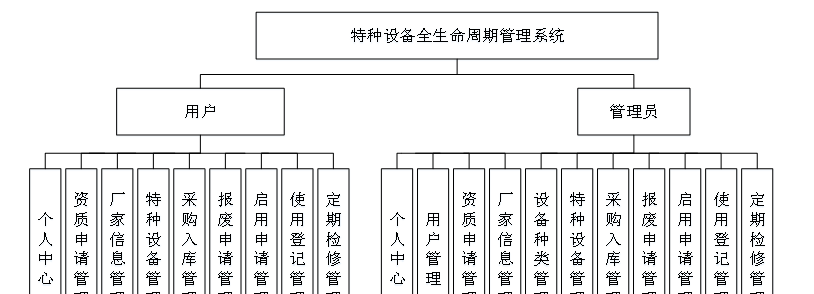
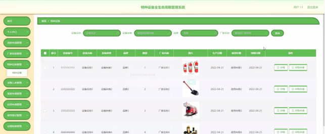

本系统带文档lw万字以上 文末可领取本课题的JAVA源码参考

## ******开发环境******

开发语言：Java

框架：ssm

技术：ssm+vue

JDK版本：JDK1.8

服务器：tomcat7

数据库：mysql 5.7或8.0

数据库工具：Navicat11

开发软件：eclipse/myeclipse/idea

Maven包：Maven3.3.9

浏览器：建议谷歌浏览器或edge

## ******功能模块******

为了更好的去理清本系统整体思路，对该系统以结构图的形式表达出来，设计实现该特种设备全生命周期管理系统的功能结构图如下所示：

## ******系统界面******

## ******2**** ** **023-2024**** ** **年成品******

除了以上作品下面是2023-2024年最新100套计算机专业原创的毕业设计源码+数据库，是近期作品，如果你的题目刚好在下面可以文末领取java源码参考

【1】| ssm学生组织管理系统  
---|---  
【2】| ssmSSM社区医院健康管理vue  
【3】| jsp昭通推广网站开发  
【4】| springboot大学生奖项成果管理系统  
【5】| springboot心理咨询预约管理系统  
【6】| ssm大学生就业管理系统  
【7】| springboot在线办公系统  
【8】| ssm古诗词知识学习系统  
【9】| ssm业俊宾馆客房管理系统  
【10】| ssm微信小程序疫情期间小区自助程序  
【11】| ssm校园技术交流与信息分享系统  
【12】| springboot校园疫情防控平台  
【13】| springboot热映电影订票系统  
【14】| jsp博物馆售票系统设计与实现  
【15】| ssm农业信息管理系统  
【16】| springboot投搞管理系统  
【17】| ssm图书管理系统  
【18】| ssm电脑售后服务管理系统  
【19】| ssm宠物店管理系统小程序  
【20】| ssm电脑配件电商系统  
【21】| ssm基于Web的儿童的教育与成长系统  
【22】| ssm基于Android的论文管理系统  
【23】| ssm基于微信小程序的点餐平台  
【24】| springboot医养结合养老APP的设计与实现  
【25】| ssm学生信息管理系统  
【26】| ssm动漫展会服务平台  
【27】| springboot校园互助跑腿系统小程序  
【28】| springboot基于移动终端的社区居家养老平台  
【29】| ssm游乐园售票系统  
【30】| jsp医院门诊信息管理系统  
【31】| jsp公廉租房维保系统  
【32】| ssm基于JAVA的毕业设计管理系统  
【33】| jsp文档管理系统的设计与实现  
【34】| ssm基于Android视频播放器APP  
【35】| springboot商城后台管理系统  
【36】| ssm一校置之系统的开发实现  
【37】| ssm病案预约复印App  
【38】| jsp毕业生信息管理系统  
【39】| ssm物业信息管理系统  
【40】| ssm健身服务微信小程序  
【41】| ssm水上乐园售票管理系统  
【42】| ssm出租车预约系统  
【43】| ssm助学校园兼职管理系统  
【44】| ssm基于web的图书借阅管理系统  
【45】| ssm教师档案管理系统  
【46】| ssm医疗陪诊系统  
【47】| ssm个人网盘系统  
【48】| ssm宠物领养平台  
【49】| jsp校园图书回收系统  
【50】| ssm家庭理财管理App  
【51】| springboot大学生综合测评系统  
【52】| springboot四六级英语小程序  
【53】| jsp在线图书交易平台  
【54】| springboot智能化汽车租赁平台  
【55】| ssm城市垃圾分类回收管理系统  
【56】| ssm基于vue技术的品牌银饰售卖平台  
【57】| jsp无接触取货购物系统  
【58】| ssm智能停车管理小程序  
【59】| jsp垃圾分类管理系统  
【60】| springboot协同过滤算法及在个性化音乐推荐  
【61】| ssm基于小程序的高校采购项目报名系统  
【62】| ssm基于Vue的代购网站  
【63】| springboot微信小程序的网约车代驾  
【64】| jsp“放眼乡村”乡村旅游类软件  
【65】| springboot区域特色产品营销推广平台  
【66】| springboot基于Spring Boot的校园帮互助平台管理系统  
【67】| ssm基于微信小程序的东方秀水苑报修系统  
【68】| ssm基于Android系统的健康通行码  
【69】| ssm电信资费管理系统  
【70】| ssm基于微信小程序的智慧医疗系统  
【71】| ssm微信小程序实验系统  
【72】| ssm兴城农家院短租平台  
【73】| jsp山工院科研信息管理  
【74】| jsp在线购物商品推荐系统  
【75】| springboot校园请假系统  
【76】| springboot剧本杀交流分享平台  
【77】| ssm校园论坛小程序  
【78】| jsp健身房管理系统  
【79】| ssm基于SSM的物业小区管理系统  
【80】| ssm宠物医院管理系统  
【81】| ssm二手书店微信小程序  
【82】| springboot电子产品在线购物平台  
【83】| springboot基于微信小程序的生鲜电商订购平台  
【84】| ssm微信小程序的图书管理系统  
【85】| ssm心灵氧吧心理咨询网站  
【86】| ssm基于Java的电影评论网站  
【87】| ssm电影院订票系统  
【88】| springboot创e理财综合系统  
【89】| ssm基于安卓的公交查询系统  
【90】| ssm微信小程序的公共设施维护  
【91】| jsp快递站点管理系统  
【92】| springboot全品类购物商城的设计与实现  
【93】| ssm电瓶车产业链网站  
【94】| ssm校园智慧节水平台管理系统  
【95】| springboot基于微信小程序的学生宿舍管理系统  
【96】| jsp新锐课堂考勤管理系统  
【97】| ssm农业技术学习平台  
【98】| ssm基于Java的酒店预订网站  
【99】| jsp医患关系管理系统  
【100】| ssm口腔医院管理系统  
  
## ******源码分享和部署******

