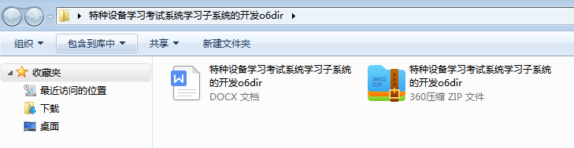

本系统带文档lw万字以上 文末可领取本课题的JAVA源码参考

## ******开发环境******

开发语言：Java

框架：ssm

技术：ssm+vue

JDK版本：JDK1.8

服务器：tomcat7

数据库：mysql 5.7或8.0

数据库工具：Navicat11

开发软件：eclipse/myeclipse/idea

Maven包：Maven3.3.9

浏览器：建议谷歌浏览器或edge

## ******功能模块******

根据特种设备学习考试系统学习子系统的功能需求，进行系统设计。

前台功能：用户进入系统可以实现首页，政策新闻，公告宣传，特种设备，学习培训，试卷，个人中心，后台管理等进行操作；

后台主要是管理员，管理员功能包括首页，个人中心，管理人员管理，培训人员管理，政策新闻管理，公告宣传管理，特种设备管理，学习培训管理，培训报名管理，试卷管理，试题管理，系统管理，考试管理等；

系统对这些功能进行整合，产生的功能结构图如下：

## ******系统界面******

## ******2**** ** **023-2024**** ** **年成品******

除了以上作品下面是2023-2024年最新100套计算机专业原创的毕业设计源码+数据库，是近期作品，如果你的题目刚好在下面可以文末领取java源码参考

【1】| ssm基于web的家教管理系统  
---|---  
【2】| ssm急救小程序设计  
【3】| springboot河北经贸大学毕业生就业跟踪系统  
【4】| springboot基于springbootvue框架的零售店记账系统  
【5】| ssm电竞酒店预订与管理系统  
【6】| ssm基于Android的法律咨询平台  
【7】| springboot信息工程学院学生社团一站是式管理平台  
【8】| jsp扶贫特产商城系统  
【9】| ssm儿童成长记录与分享系统  
【10】| jsp基于javaweb的个人物品竞拍平台  
【11】| ssm健身房管理系统  
【12】| springboot校园靓拍网站  
【13】| ssm娃娃小程序  
【14】| jsp成绩管理系统的设计与实现  
【15】| ssm医患交流平台  
【16】| ssm九江学院兼职招聘APP  
【17】| jsp基于SSM框架的高校网络教学平台  
【18】| springboot琴行管理系统  
【19】| springboot基于Android的垃圾分类系统  
【20】| jsp中小型企业人事系统  
【21】| ssm基于SSM的银行信贷贷前审批系统的设计与实现  
【22】| springboot招生管理系统  
【23】| ssm社区疫情防控平台小程序  
【24】| springboot微信智慧校园小程序  
【25】| jsp基于JSP的图书馆馆藏资源管理系统  
【26】| springboot有只小宠  
【27】| jsp校园二手物品交易平台  
【28】| springboot旅游管理系统  
【29】| jspit学习辅助系统  
【30】| springboot微信小程序的校园二手交易平台  
【31】| ssm社区防疫生活服务系统  
【32】| springboot乐器培训管理系统  
【33】| springboot新闻管理系统  
【34】| springboot基于springboot的外卖订餐系统  
【35】| springboot操作系统的在线考试系统  
【36】| jsp在线会议管理系统  
【37】| springboot疫情下药店管理系统  
【38】| springboot学院图书借阅管理系统  
【39】| springboot校园二手市场系统  
【40】| springboot个人日程  
【41】| jsp健康饮食信息管理系统  
【42】| ssm毕业生信息管理系统  
【43】| ssm焦虑自测与交流平台  
【44】| ssm医生预约管理系统  
【45】| jsp“合格父母”平台  
【46】| jsp校园论坛系统  
【47】| springboot基于微信小程序的在线考试系统  
【48】| ssm家乡旅游文化推广网站  
【49】| springboot乐校园二手书交易管理系统  
【50】| springboot健康体检管理系统  
【51】| springboot新冠流行病学调查系统  
【52】| jsp企业人事考核系统  
【53】| springboot汽车零配件管理系统  
【54】| jsp林长制巡查系统  
【55】| ssm思政强国学习平台  
【56】| jsp图书管理系统  
【57】| ssm“金辉国际酒店”餐饮及客房管理信息系统  
【58】| ssm掌上红旅小程序  
【59】| ssm乡村旅游APP  
【60】| ssm企业日常事务管理系统  
【61】| ssm入厂煤车辆管理系统  
【62】| ssm基于Andriod平台的手机Web地图服务设计  
【63】| springboot宠物商城系统的设计与实现  
【64】| jsp房屋在线租售系统  
【65】| ssm基于微信小程序的美容院管理系统  
【66】| ssm基于推荐算法的鞋服代购平台  
【67】| jsp整件药品库存管理系统  
【68】| ssm志愿者管理系统  
【69】| springboot个人运动健康管理  
【70】| ssm基于微信小程序的物业管理系统  
【71】| jsp在线教学系统  
【72】| ssm基于微信小程序的校园疫情防控  
【73】| springboot爱行汽车养护app  
【74】| ssm基于Android的新闻管理  
【75】| springboot在线教育系统  
【76】| ssm沧州交通学院家校通管理系统  
【77】| springboot一体化车贷管理系统  
【78】| jsp“永梦”无人售货机系统管理的设计与实现  
【79】| ssm疫情下的社区居民管理系统小程序  
【80】| ssm基于Android二师学生宝典设计与实现  
【81】| springboot校园疫情防控系统  
【82】| jsp校园社团管理系统  
【83】| ssm社区流浪动物救助系统  
【84】| ssm基于微信小程序的课程表和成绩信息查询系统  
【85】| ssm慕课视频推荐系统  
【86】| ssm图书馆管理小程序  
【87】| springboot智慧实验室管理系统  
【88】| springboot学生信息管理系统  
【89】| springbootZC银行  
【90】| springboot宠物救助管理系统的设计与实现  
【91】| springboot宠物用品商城小程序  
【92】| jsp校园招聘系统  
【93】| springboot图书管理系统  
【94】| springboot教师教学质量评价管理系统  
【95】| springboot中国足球甲级联赛赛事管理系统  
【96】| jsp基于web的视频网站管理系统  
【97】| ssm校园自行车租赁系统  
【98】| ssm微信小程序的博士园养发馆客户管理系统  
【99】| ssm物流管理小程序  
【100】| ssm大学生创新创业管理系统  
  
## ******源码分享和部署******

