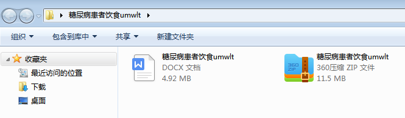
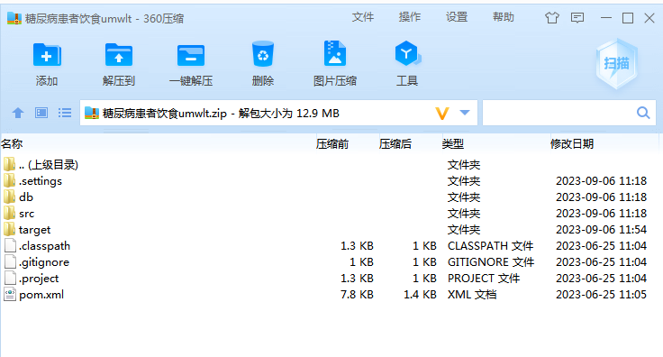
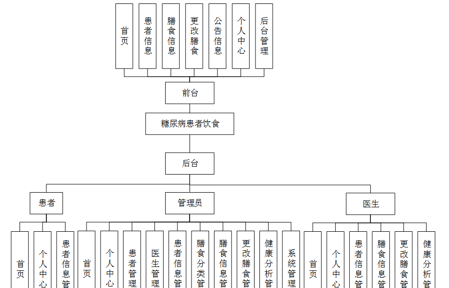
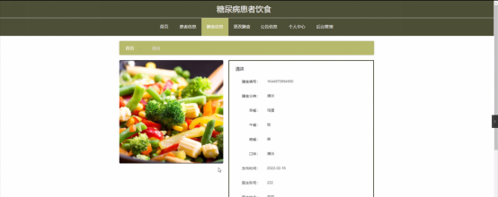
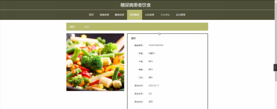
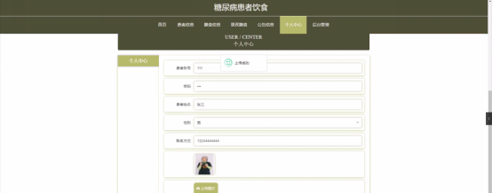

本系统带文档lw万字以上 文末可领取本课题的JAVA源码参考

## ******开发环境******

开发语言：Java

框架：ssm

技术：ssm+vue

JDK版本：JDK1.8

服务器：tomcat7

数据库：mysql 5.7或8.0

数据库工具：Navicat11

开发软件：eclipse/myeclipse/idea

Maven包：Maven3.3.9

浏览器：建议谷歌浏览器或edge

## ******功能模块******

系统架构图属于系统设计阶段，系统架构图只是这个阶段一个产物，系统的总体架构决定了整个系统的模式，是系统的基础。糖尿病患者饮食管理系统的整体结构设计如图4-2所示。

## ******系统界面******

## ******2**** ** **023-2024**** ** **年成品******

除了以上作品下面是2023-2024年最新100套计算机专业原创的毕业设计源码+数据库，是近期作品，如果你的题目刚好在下面可以文末领取java源码参考

【1】| springboot摄影跟拍预定管理系统  
---|---  
【2】| ssm基于微信小程序的教学互动工具  
【3】| springboot疫情信息查询系统  
【4】| jsp二手车交易平台  
【5】| ssm共享车位APP  
【6】| springboot电脑软件技能学习平台  
【7】| springboot专利运营中心平台  
【8】| springboot基于微信小程序的汽车租赁系统的设计与实现  
【9】| springboot基于CCF数图资源的计算机科学导论课程平台  
【10】| springboot校园寻人失物系统  
【11】| jsp二手书交易平台  
【12】| jsp旅游网站  
【13】| ssm公司人事薪资管理系统  
【14】| ssm微信小程序在慢性疾病管理中的应用  
【15】| jsp奶茶店管理系统  
【16】| springboot公交车路线查询系统  
【17】| ssm疫情社区防控平台app  
【18】| springboot企业生产报表管理系统的设计与实现  
【19】| springboot一体化校园快递小程序  
【20】| springboot“涂海美舍”民宿服务平台小程序  
【21】| jsp技术文档管理系统  
【22】| springboot校园在线考试系统  
【23】| jsp图书借阅网站设计  
【24】| ssm基于的社区疫情防控管理信息系统  
【25】| ssm社区团购系统  
【26】| springboot健康美食及菜谱分享系统的设计与实现  
【27】| springboot心理健康辅导系统  
【28】| springboot基于BS模式的学生公寓管理系统  
【29】| springboot个人理财系统  
【30】| jsp基于鸿蒙系统的教师教学质量问卷调查系统  
【31】| ssm实验农场数据系统管理小程序  
【32】| jsp基于大数据的面试模拟题库系统  
【33】| ssm手机银行客户端APP  
【34】| ssm基于微信小程序的小型酒店管理系统  
【35】| jsp智慧养老管理服务系统  
【36】| springboot珠宝饰品官网的设计与开发  
【37】| springboot物流管理系统  
【38】| springboot微信外卖点餐小程序  
【39】| ssmJava班级信息管理系统  
【40】| springboot员工管理系统  
【41】| springboot寻亲网  
【42】| jsp好安家租房管理系统  
【43】| ssm生物科普知识小程序  
【44】| jsp摄影技术分享管理系统  
【45】| springboot校园帮助系统  
【46】| ssm计算机维修服务微信小程序  
【47】| springboot外卖微信小程序  
【48】| ssm社区疫苗接种预约系统  
【49】| jsp哈尔滨市圣琪口腔牙科诊所管理系统  
【50】| jsp攀枝花旅游资源管理系统  
【51】| ssm基于Java的地域性主题酒店管理  
【52】| jsp农村政务管理系统  
【53】| jsp企业合同管理系统  
【54】| ssm社会救援力量信息管理统计系统  
【55】| springboot智慧点餐系统  
【56】| jsp企业记账系统  
【57】| jsp学生信息管理系统  
【58】| ssm基于Android移动端的一款便捷运动APP  
【59】| ssm宠物寄托小程序  
【60】| springboot完美奶茶屋点单小程序  
【61】| jsp教学辅助工具管理系统  
【62】| ssm眉山市白果村鲜茶供销管理  
【63】| ssm大学生入学指南APP  
【64】| jsp基于ssm乐器网站系统  
【65】| jsp医院网上预约挂号系统  
【66】| springboot农村人居环境治理监管系统  
【67】| ssm基于Android的公交车线路查询系统  
【68】| ssm基于微信小程序的高中辅导信息发布平台  
【69】| jsp川香汇美食网站  
【70】| springboot危化品信息管理  
【71】| jsp废旧塑料交易系统的设计与实现  
【72】| jsp旅游网站  
【73】| springboot汽车4S店试驾维修服务预约系统  
【74】| ssm校园招聘信息网站  
【75】| ssm基于Web的在线音乐网站  
【76】| ssm投票小程序  
【77】| springboot宠物咖啡馆系统的设计与实现  
【78】| springboot基于微信小程序的家政服务平台  
【79】| ssm爱生活健康管理软件  
【80】| ssm关于汽车零部件加工的erp系统  
【81】| springboot基于人脸识别的智慧实验室系统  
【82】| springboot学校评教系统  
【83】| springboot基于SpringBoot的CSGO赛事管理系统  
【84】| jsp帕金森病例追踪系统  
【85】| ssm医院病床管理系统  
【86】| springboot在线音乐网站  
【87】| jsp大学生志愿者服务平台  
【88】| jsp大学生学科竞赛信息管理系统  
【89】| jsp大学生宿舍管理系统  
【90】| jsp影院购票系统的设计与实现  
【91】| springboot影视服务系统小程序  
【92】| springboot基于Springboot的在线教育平台的设计与实现  
【93】| ssm大东区红山家政服务平台系统  
【94】| ssm历史知识题库系统小程序  
【95】| ssm基于微信小程序的社群商城的设计与实现  
【96】| ssm未来新型养老院管理系统  
【97】| jsp城市公共广告位出租管理一体化项目的设计与实现  
【98】| ssm学生综合测评  
【99】| ssmCRM权限管理系统  
【100】| ssm微信小程序的医院挂号预约系统  
  
## ******源码分享和部署******

