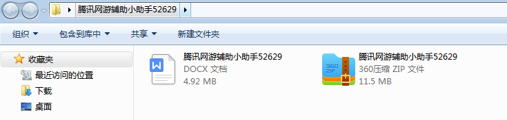
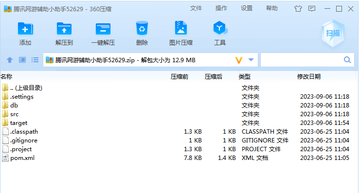
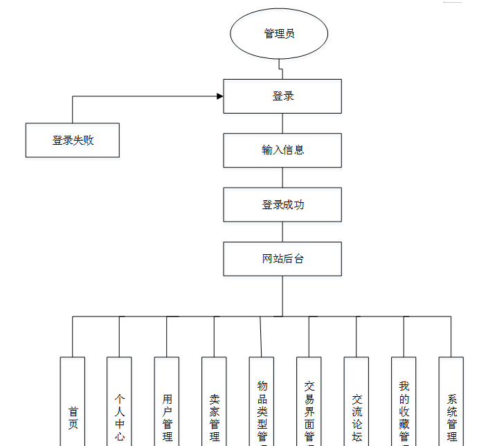
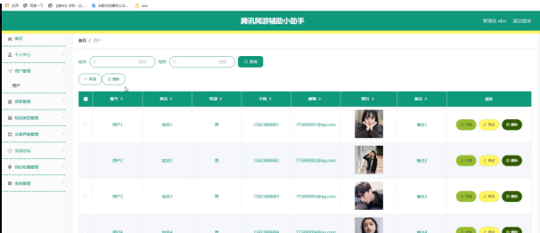
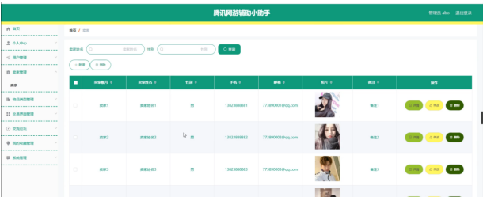
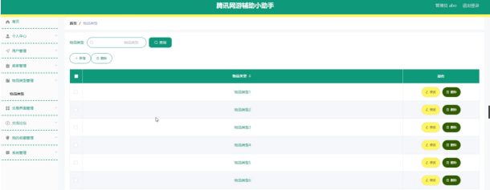
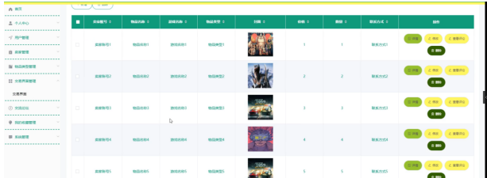

本系统带文档lw万字以上 文末可领取本课题的JAVA源码参考

## ******开发环境******

开发语言：Java

框架：ssm

技术：ssm+vue

JDK版本：JDK1.8

服务器：tomcat7

数据库：mysql 5.7或8.0

数据库工具：Navicat11

开发软件：eclipse/myeclipse/idea

Maven包：Maven3.3.9

浏览器：建议谷歌浏览器或edge

## ******功能模块******

根据系统功能需求建立的模块关系图如下图：

## ******系统界面******

## ******2**** ** **023-2024**** ** **年成品******

除了以上作品下面是2023-2024年最新100套计算机专业原创的毕业设计源码+数据库，是近期作品，如果你的题目刚好在下面可以文末领取java源码参考

【1】| jsp宠物商城  
---|---  
【2】| ssm在线教育app  
【3】| springboot古典文学阅读网站  
【4】| jsp体育资讯网站  
【5】| ssm社区防疫系统小程序  
【6】| jsp医药信息管理系统  
【7】| ssm云腾内部管理系统  
【8】| jsp个人信息管理系统  
【9】| ssm校企合作实训管理系统  
【10】| jsp培训公司的视频教学平台  
【11】| springboot人力资源管理系统  
【12】| springboot图像管理系统的设计与实现  
【13】| jsp基于ssm的乐聘网人才招聘系统  
【14】| springboot游戏网站  
【15】| jsp学科成员档案管理系统  
【16】| ssm今日健康饮食食谱小程序  
【17】| jsp亿上汽车在线销售管理系统  
【18】| springboot公司资产  
【19】| ssm手机校园BBS社区的设计与实现  
【20】| ssm就诊流程引导  
【21】| ssm基于Android的校园考研论坛  
【22】| springboot学生作业管理系统APP  
【23】| springboot基于协同过滤的资讯推送平台  
【24】| ssm基于ssm框架的动漫网站设计与实现  
【25】| jsp医疗设备档案管理系统  
【26】| ssm健康管理APP  
【27】| springboot图书管理系统的设计与实现  
【28】| springboot学生在线缴费系统  
【29】| ssm垃圾回收小程序  
【30】| ssm基于SSM的航空保险线上购买系统  
【31】| springboot个人博客系统的设计与实现  
【32】| springboot应急物资物流管理系统  
【33】| ssm城市应急救援辅助系统  
【34】| jsp基于Java的学生综合测评管理系统  
【35】| jsp开封市防疫志愿者服务平台  
【36】| springboot快餐店微信扫码点餐小程序  
【37】| ssm校园社团推广APP  
【38】| ssm时间管理系统  
【39】| jsp大连大学高校预约系统  
【40】| ssm校园外卖点餐系统  
【41】| jsp三亚智慧旅游信息服务平台  
【42】| ssm校园第二课堂小程序  
【43】| springboot养老平台的设计与实现  
【44】| ssm数据结构知识点渐进学习网站  
【45】| ssm基于安卓的民族药信息系统  
【46】| jsp基于mvc的天启网上购物系统  
【47】| ssm我为诗狂文本创作APP  
【48】| springboot实习生校内事务管理系统  
【49】| ssm基于微信小程序的学生成绩通知系统  
【50】| ssm微信小程序的移动英语学习平台  
【51】| springboot基于Vue学生选课管理系统  
【52】| jsp基于SSM的食品仓库管理系统  
【53】| jsp停车场管理系统  
【54】| jsp医院预约挂号系统  
【55】| springboot汽车销售管理系统  
【56】| jsp姚仕勇练习单22  
【57】| ssm环巢湖智慧养老系统  
【58】| ssm基于Android的英语学习类app  
【59】| springboot在线购物商城  
【60】| jsp智慧农贸信息化管理平台  
【61】| jsp养老院管理系统  
【62】| springboot健身房管理系统  
【63】| jsp图像识别系统  
【64】| springboot共享电动车电池管理系统设计与实现  
【65】| springboot微信小程序的会议管理系统  
【66】| springboot基于java的学生宿舍管理系统  
【67】| springboot华裳秀平台  
【68】| jsp大学生互助系统  
【69】| ssm基于Android的选课设计管理系统的设计与实现  
【70】| ssm基于Java的音乐网站  
【71】| ssm乡镇扶贫专项管理系统  
【72】| ssm画作交流平台  
【73】| springboot宠物领养系统  
【74】| springboot气象观测数据样本构建与分析系统  
【75】| ssm在线审计案例管理系统  
【76】| ssm民宿网站的设计与实现  
【77】| jsp怀旧影院订票系统的设计与实现  
【78】| ssm个人博客系统  
【79】| jsp在线教育平台的设计与实现  
【80】| springboot电影评论网站  
【81】| ssm家政服务管理平台  
【82】| jsp化妆品订购系统  
【83】| jsp图片素材管理库的设计与实现  
【84】| jsp事故救灾管理系统的设计与实现  
【85】| jsp小区疫情防控系统  
【86】| ssm大学生足球预约信息平台app  
【87】| ssm个人健康服务手机app  
【88】| jsp心理测评系统  
【89】| jsp图书销售管理系统的设计与开发  
【90】| springboot学习交友打卡平台  
【91】| ssm社区志愿服务管理平台  
【92】| ssm校园服务平台  
【93】| springboot基于SpringBoot的医院就医平台  
【94】| ssm旅客行程推荐系统  
【95】| jsp急诊急救服务管理系统  
【96】| ssm小区停车计费管理系统  
【97】| ssm电影售票小程序  
【98】| ssm在线阅读App  
【99】| ssm企业绩效考核系统  
【100】| springboot农产品交易平台app  
  
## ******源码分享和部署******

