ssm+Vue计算机毕业设计-在线作业管理系统（程序+LW文档）

**项目运行**

**环境配置：**

**Jdk1.8 + Tomcat7.0 + Mysql + HBuilderX** **（Webstorm也行）+ Eclispe（IntelliJ
IDEA,Eclispe,MyEclispe,Sts都支持）。**

**项目技术：**

**SSM + mybatis + Maven + Vue** **等等组成，B/S模式 + Maven管理等等。**

**环境需要**

**1.** **运行环境：最好是java jdk 1.8，我们在这个平台上运行的。其他版本理论上也可以。**

**2.IDE** **环境：IDEA，Eclipse,Myeclipse都可以。推荐IDEA;**

**3.tomcat** **环境：Tomcat 7.x,8.x,9.x版本均可**

**4.** **硬件环境：windows 7/8/10 1G内存以上；或者 Mac OS；**

**5.** **是否Maven项目: 否；查看源码目录中是否包含pom.xml；若包含，则为maven项目，否则为非maven项目**

**6.** **数据库：MySql 5.7/8.0等版本均可；**

**毕设帮助，指导，本源码分享，调试部署** **(** **见文末** **)**

### 系统体系结构

在线作业管理系统开发系统的结构图4-1所示：

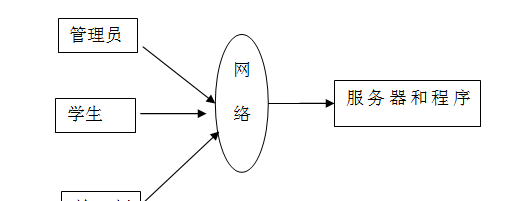

图4-1 系统结构

模块包括主界面，首页、个人中心、课程管理、教师管理、学生管理、课程信息管理、课程作业管理、学生选课管理、学生作业管理、作业评分管理、管理员管理、系统管理等进行相应的操作。

登录系统结构图，如图4-2所示：

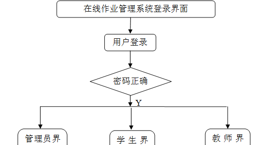

图4-2 登录结构图

这些功能可以充分满足在线作业管理系统的需求。此系统功能较为全面如下图系统功能结构如图4-4所示。

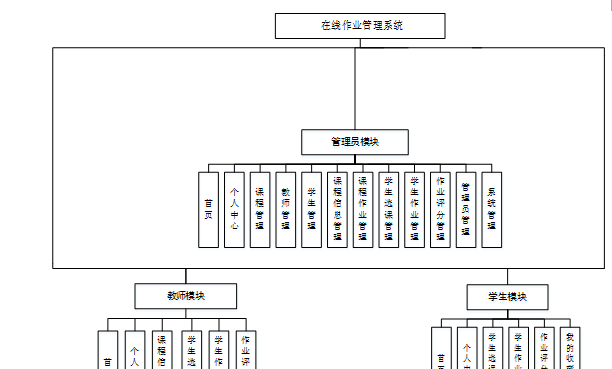

图4-4系统功能结构图

### 4.2 数据库设计原则

每个数据库的应用它们都是和区分开的，当运行到一定的程序当中，它就会与自己相关的协议与客户端进行通讯。那么这个系统就会对使这些数据进行连接。当我们选择哪个桥段的时候，接下来就会简单的叙述这个数据库是如何来创建的。当点击完成按钮的时候就会自动在对话框内弹出数据源的名称，在进行点击下一步即可，直接在输入相对应的身份验证和登录密码。

在线作业管理系统的数据流程：

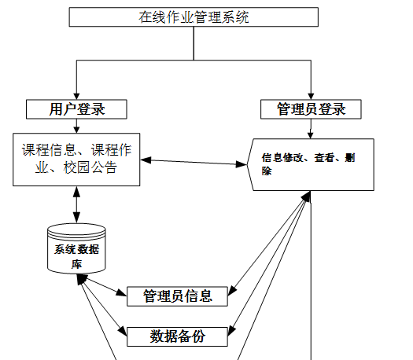

图4-5 系统数据流程图

学生信息实体E-R图，如图4.6所示。

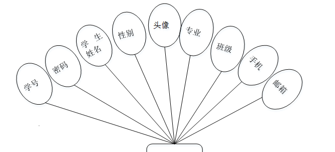

图4.6学生信息E-R图

作业评分信息E-R图，如图4.7所示。

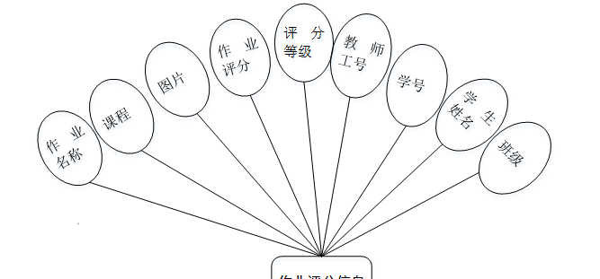

图4.7作业评分信息E-R图

### 学生功能模块

学生点击进入到系统操作界面，可以对首页、个人中心、学生选课管理、学生作业管理、作业评分管理、我的收藏管理等功能模块，个人信息：通过列表可以获取学号、密码、学生姓名、性别、头像、专业、班级、手机、邮箱并进行修改操作，如图5-1所示。

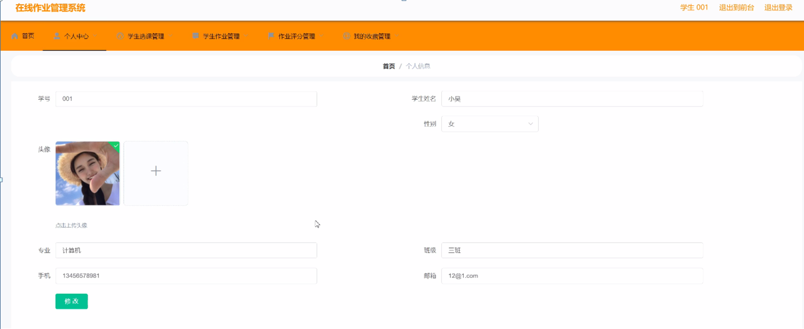

图5-1个人信息界面图

学生选课管理：通过列表可以获取课程、图片、教师工号、教师姓名、课程视频、课程资料、学号、学生姓名、专业、班级、审核回复、审核状态等信息，进行详情操作，如图5-2所示。

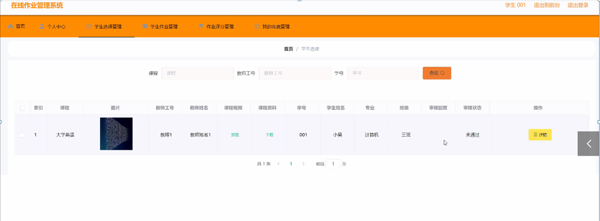

图5-2学生选课管理界面图

作业评分管理：通过列表可以获取作业名称、课程、图片、作业评分、评分等级、教师工号、学号、学生姓名、专业、班级等信息，进行查看操作，如图5-3所示。

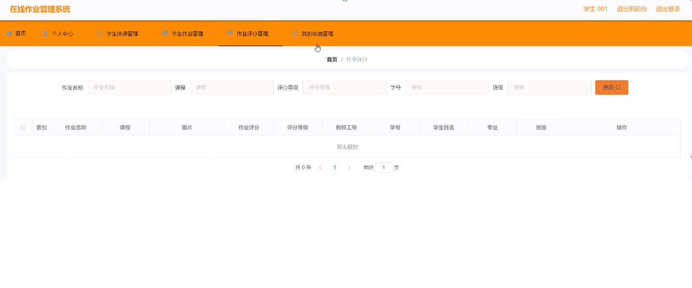

图5-3作业评分管理界面图

### 5.2管理员功能模块

###

管理员通过用户名和密码、角色填写完成后进行登录，如图5-4所示。管理员登录成功后进入到系统操作界面，可以对首页、个人中心、课程管理、教师管理、学生管理、课程信息管理、课程作业管理、学生选课管理、学生作业管理、作业评分管理、管理员管理、系统管理等功能模块进行相对应操作。

教师管理：通过列表可以获取教师工号、密码、教师姓名、性别、照片、职称、联系电话、教师邮箱等内容，可以进行修改或删除操作，如图5-5所示。

图5-4管理员登录页面

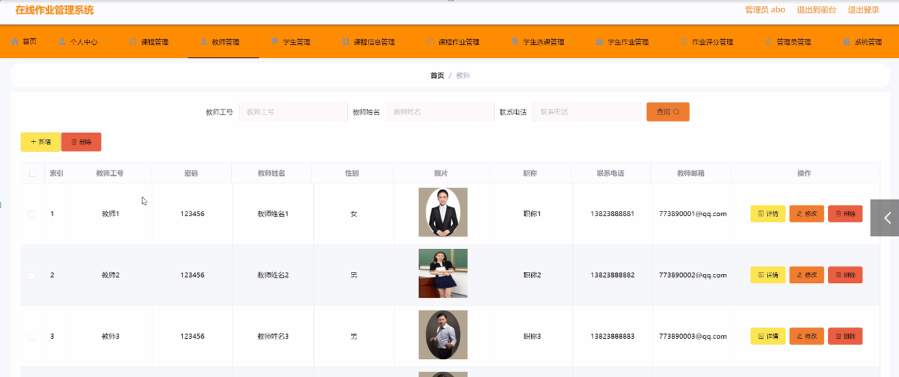

图5-5教师管理页面

学生管理：通过列表可以获取学号、密码、学生姓名、性别、头像、专业、班级、手机、邮箱等信息，进行删除或修改操作，如图5-6所示。

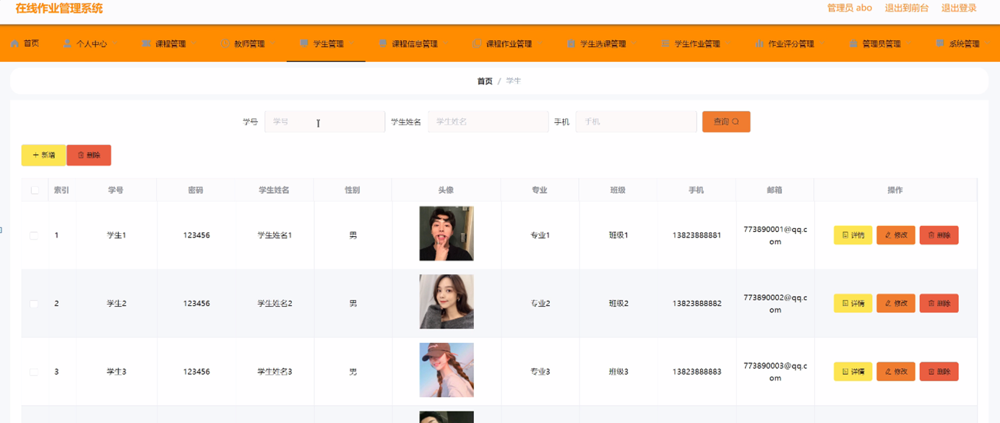

图5-6学生管理界面图

课程作业管理：通过列表可以获取作业名称、作业类型、课程、图片、作业要求、发布日期、教师工号、教师姓名、教师邮箱等信息，进行修改或删除操作，如图5-7所示。

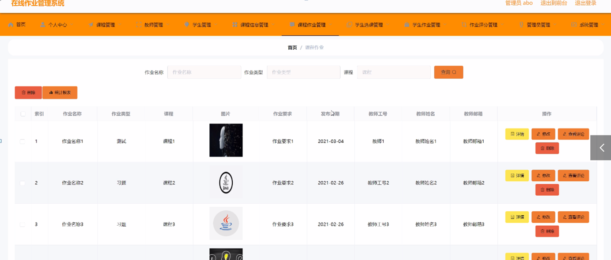

图5-7课程作业管理界面图

学生选课管理：通过列表可以获取课程、图片、教师工号、教师姓名、课程视频、课程资料、学号、学生姓名、专业、班级、审核回复、审核状态等信息，进行修改或删除操作，如图5-8所示。

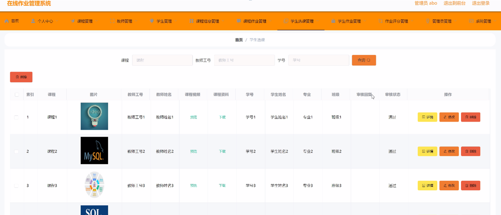

图5-8学生选课管理界面图

作业评分管理：管理员通过列表可以获取作业名称、课程、图片、作业评分、评分等级、教师工号、学号、学生姓名、专业、班级等信息，进行修改或删除操作，如图5-9所示。

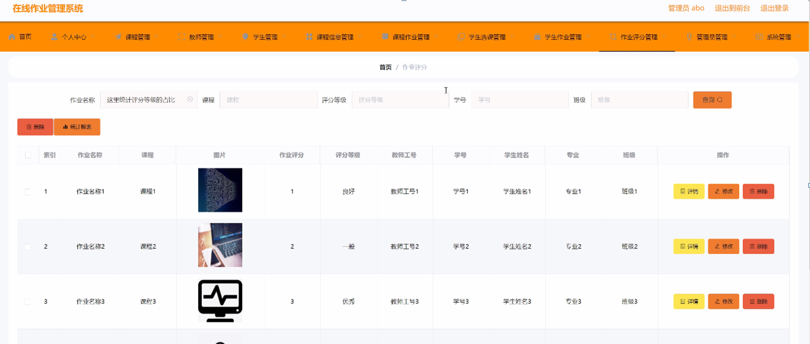

图5-9作业评分管理界面图

管理员管理：管理员通过列表可以获取用户名、密码、角色等信息，进行修改或删除操作，如图5-10所示。

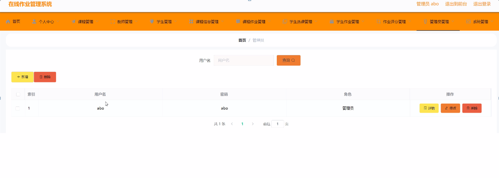

图5-10管理员管理界面图

### 5.3教师功能模块

教师点击进入到系统操作界面，可以对首页、个人中心、课程信息管理、学生选课管理、学生作业管理、作业评分管理等功能模块，个人信息：通过列表可以获取教师工号、密码、教师姓名、性别、照片、职称、联系电话、教师邮箱并进行修改操作，如图5-11所示。

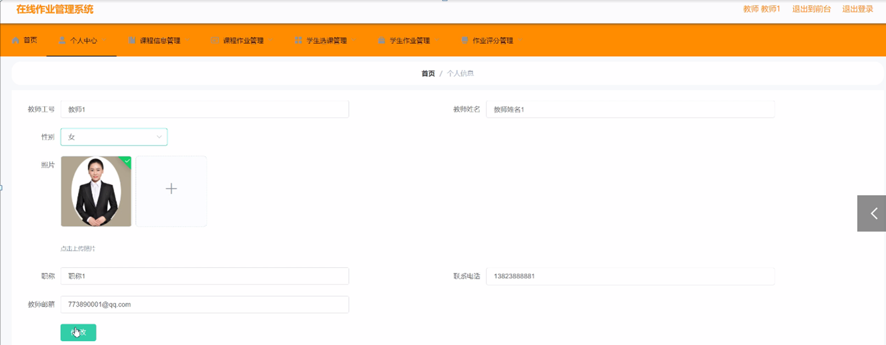

图5-11个人信息界面图

课程作业管理：通过列表可以获取作业名称、作业类型、课程、图片、作业要求、发布日期、教师工号、教师姓名、教师邮箱等信息，进行详情、修改、删除操作，如图5-12所示。

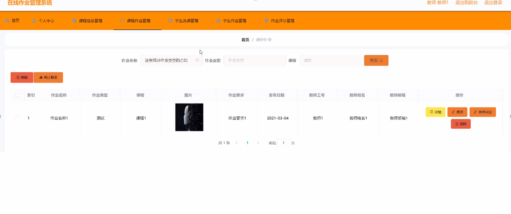

图5-12课程作业管理界面图

#### **JAVA** **毕设帮助，指导，源码分享，调试部署**

