ssm+Vue计算机毕业设计-志愿者管理系统（程序+LW文档）

**项目运行**

**环境配置：**

**Jdk1.8 + Tomcat7.0 + Mysql + HBuilderX** **（Webstorm也行）+ Eclispe（IntelliJ
IDEA,Eclispe,MyEclispe,Sts都支持）。**

**项目技术：**

**SSM + mybatis + Maven + Vue** **等等组成，B/S模式 + Maven管理等等。**

**环境需要**

**1.** **运行环境：最好是java jdk 1.8，我们在这个平台上运行的。其他版本理论上也可以。**

**2.IDE** **环境：IDEA，Eclipse,Myeclipse都可以。推荐IDEA;**

**3.tomcat** **环境：Tomcat 7.x,8.x,9.x版本均可**

**4.** **硬件环境：windows 7/8/10 1G内存以上；或者 Mac OS；**

**5.** **是否Maven项目: 否；查看源码目录中是否包含pom.xml；若包含，则为maven项目，否则为非maven项目**

**6.** **数据库：MySql 5.7/8.0等版本均可；**

**毕设帮助，指导，本源码分享，调试部署** **(** **见文末** **)**

### 系统结构

本系统架构网站系统，本系统的具体功能如下：

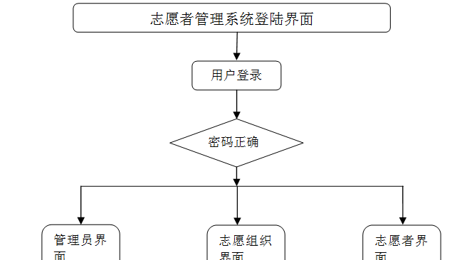

图4-2系统功能结构图

管理员功能结构图，如图4-3所示

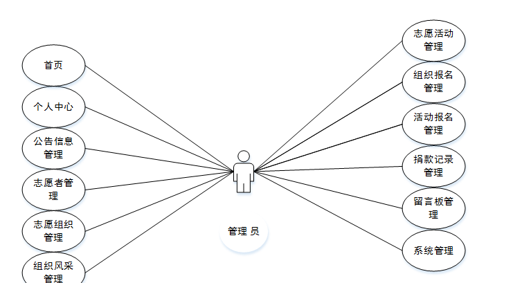

图4-3 管理员功能结构图

志愿者功能结构图，如图4-4所示：

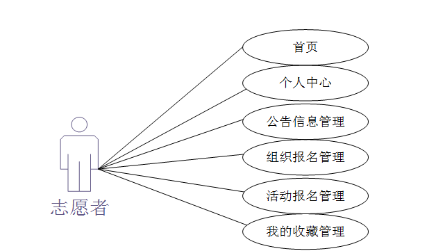

图4-4 志愿者功能结构图

志愿组织功能结构图，如图4-5所示：

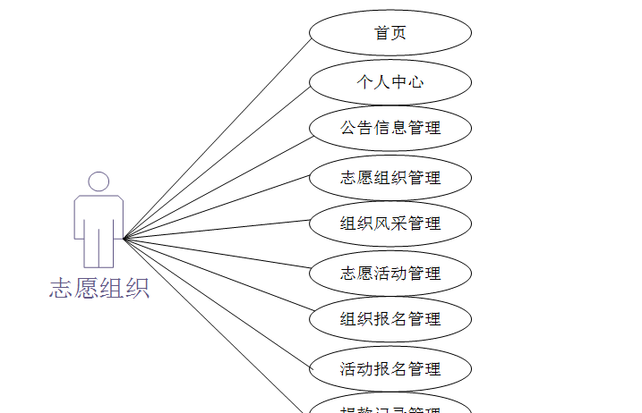

图4-5志愿组织功能结构图

### 4.3 数据库设计

#### 4.3.1 数据库实体

管理员信息结构图，如图4-6所示：

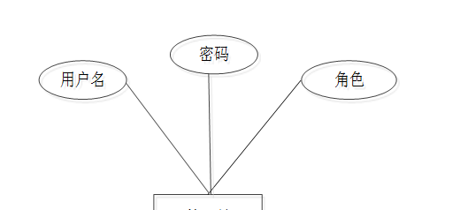

图4-6 管理员信息实体结构图

志愿者信息实体属性图，如图4-7所示：

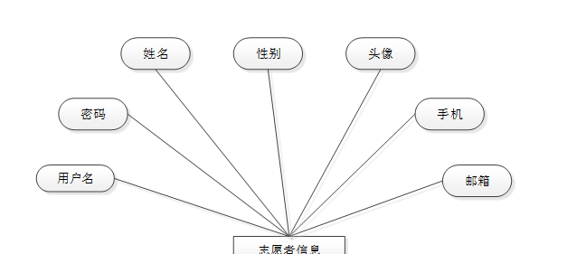

图4-7志愿者信息实体属性图

志愿组织信息实体属性图如图4-8所示。

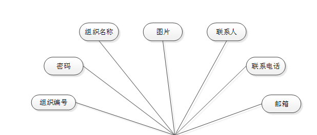

图4-8志愿组织信息实体属性图

志愿活动信息实体属性图如图4-9所示。

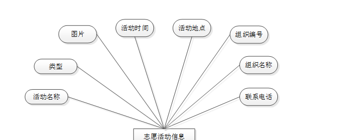

图4-9志愿活动信息实体属性图

### 管理员功能模块

管理员登录，管理员通过输入用户名、密码、角色等信息进行系统登录，如图5-1所示。

图5-1管理员登录界面图

管理员登录进入志愿者管理系统可以查看；首页、个人中心、公告信息管理、志愿者管理、志愿组织管理、组织风采管理、志愿活动管理、组织报名管理、活动报名管理、捐款记录管理、留言板管理、系统管理等内容，如图5-2所示。

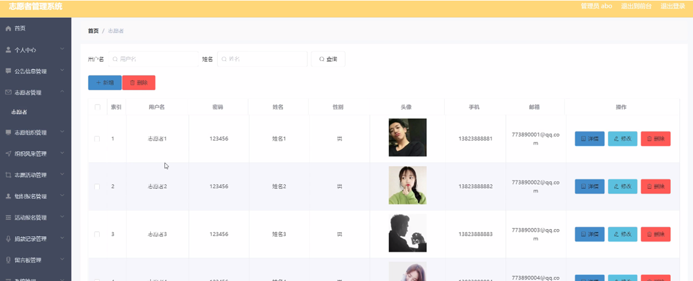

图5-2管理员功能界面图

志愿组织管理，在志愿组织管理页面可以查看组织编号、密码、组织名称、图片、联系人、联系电话、邮箱等内容，并可根据需要对志愿组织管理进行详情，修改或删除等操作，如图5-3所示。

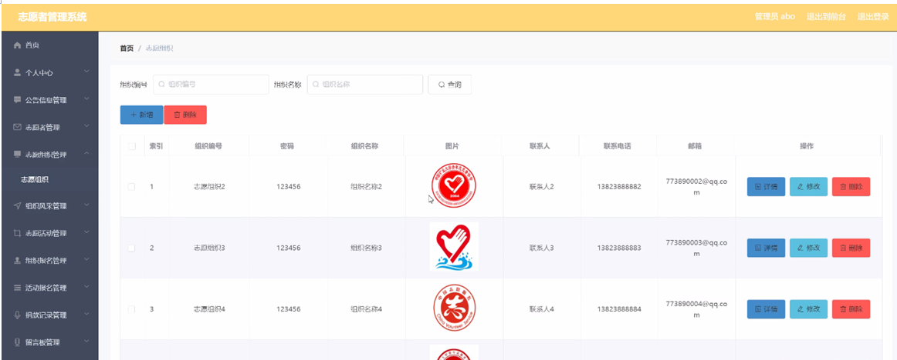

图5-3志愿组织管理界面图

志愿活动管理，在志愿活动管理页面可以查看活动名称、类型、图片、活动时间、活动地点、组织编号、组织名称、联系电话等内容，并可根据需要对志愿活动管理进行详情，修改或删除等操作，如图5-4所示。

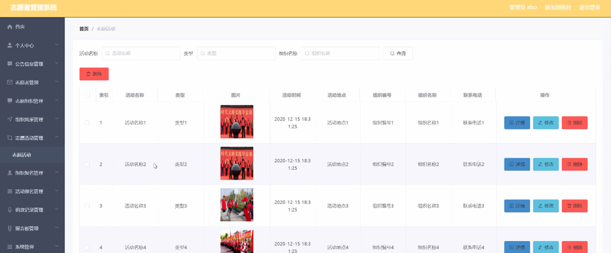

图5-4志愿活动管理界面图

组织报名管理，在组织报名管理页面可以查看报名编号、组织编号、组织名称、图片、申请日期、用户名、姓名、手机、审核回复等进行详情，修改，删除或查看详细内容等操作，如图5-5所示。

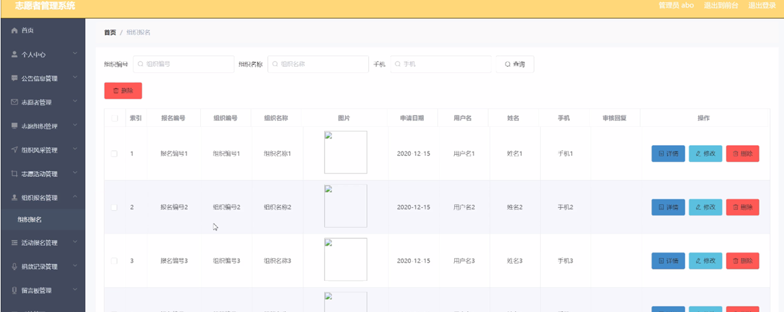

图5-5组织报名管理界面图

活动报名管理，在活动报名管理页面可以查看活动名称、类型、图片、活动时间、活动地点、组织编号、组织名称、报名时间、用户名、手机、审核回复等内容，并可根据需要对活动报名管理进行详情，修改，删除或详细内容等操作，如图5-6所示。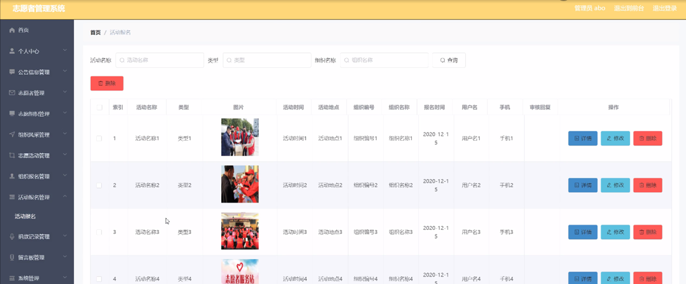

图5-6活动报名管理界面图

留言板管理 ，留言板管理页面可以查看用户名、留言内容、回复内容等内容，并可根据需要对留言板管理进行详情，修改，删除等操作，如图5-7所示。

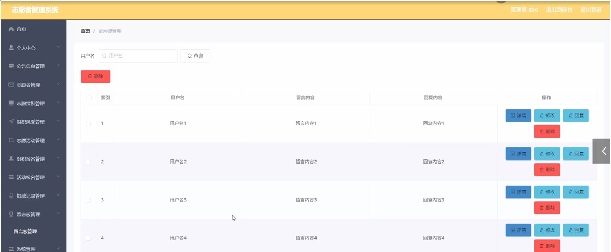

图5-7留言板管理界面图

### 5.2志愿组织功能模块

志愿组织登录进入志愿者管理系统可以查看首页、个人中心、公告信息管理、志愿组织管理、组织风采管理、志愿活动管理、组织报名管理、活动报名管理、捐款记录管理等内容，如图5-8所示。

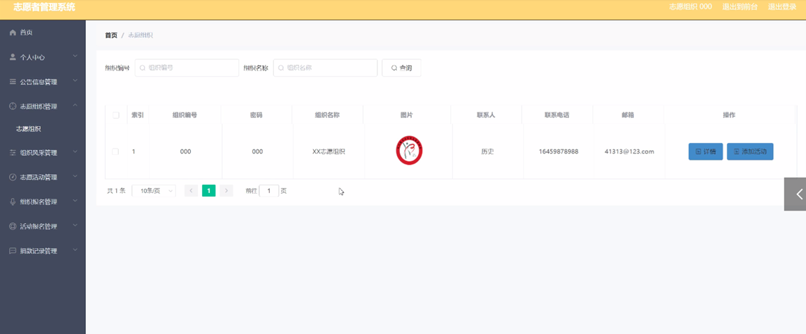图5-8志愿组织功能界面图

志愿活动管理，在志愿活动管理页面通过查看活动名称、类型、图片、活动时间、活动地点、组织编号、组织名称、联系电话等内容并可根据需要对志愿活动管理进行修改，如图5-9所示。

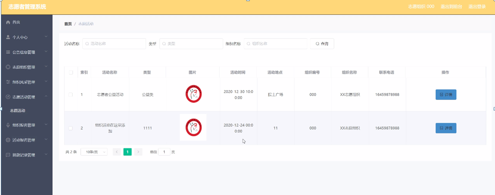

图5-9志愿活动管理界面图

组织报名管理，在组织报名管理页面可以查看报名编号、组织编号、组织名称、图片、申请日期、用户名、姓名、手机、审核回复等内容，并可根据需要对组织报名管理进行修改、删除操作，如图5-10所示。

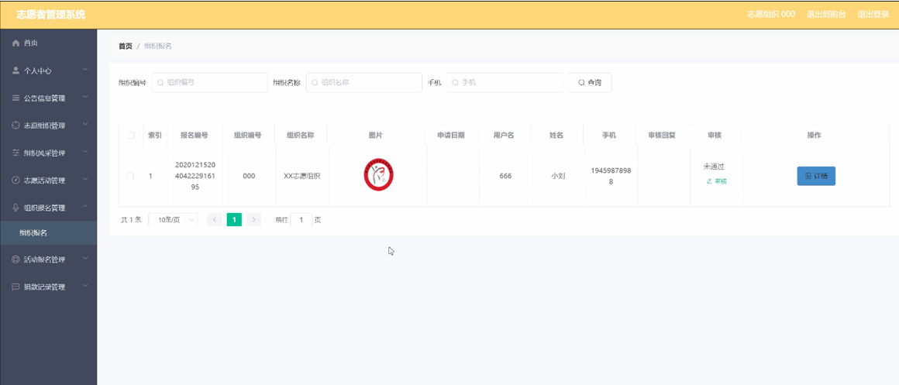

图5-10组织报名管理界面图

活动报名管理，在活动报名管理页面可以查看活动名称、类型、图片、活动时间、活动地点、组织编号、组织名称、报名时间、用户名、手机、审核回复、审核等内容，并可根据需要对活动报名管理详情、修改等操作，如图5-11所示。

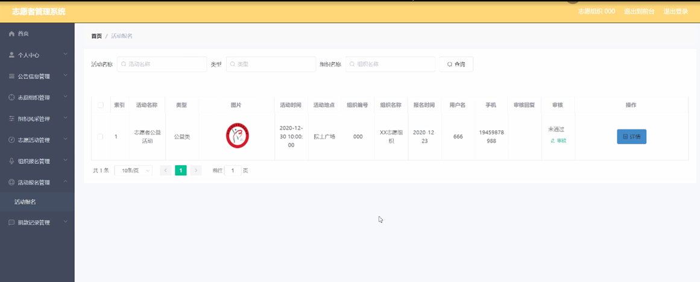

图5-11活动报名管理界面图

### 5.3志愿者功能模块

志愿者登录进入志愿者管理系统可以查看首页、个人中心、公告信息管理、组织报名管理、活动报名管理、我的收藏管理等内容，如图5-12所示。

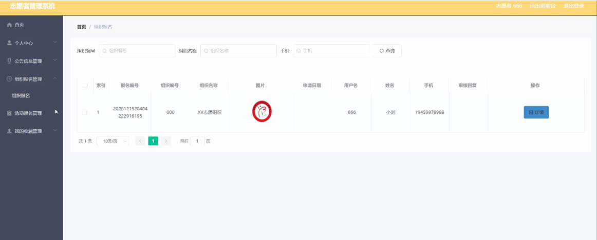图5-12志愿者功能界面图

#### **JAVA** **毕设帮助，指导，源码分享，调试部署**

