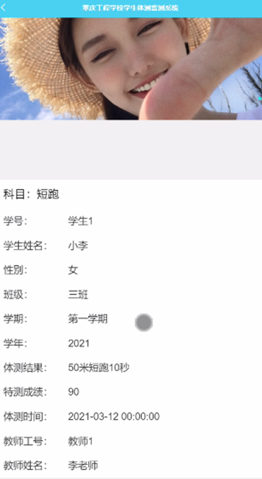

ssm+Vue计算机毕业设计-重庆工程学校学生体测监测系统-微信小程序（程序+LW文档）

**该项目含有源码、文档、程序、数据库、配套开发软件、软件安装教程。欢迎交流**

**项目运行**

**环境配置：**

**PHP+ Vscode + Mysql5.7 + HBuilderX+Navicat11+Vue+** **小皮PHPstudy。**

**项目技术：**

**php+ Vue** **等等组成，B/S模式 +Vscode管理+前后端分离等等。**

**环境需要**

**1.** **运行环境：最好是小皮phpstudy最新版，我们在这个版本上开发的。其他版本理论上也可以。**

**2.** **开发环境：Vscode或HbuilderX都可以。推荐HbuilderX;**

**3.mysql** **环境：建议是用5.7版本均可**

**4.** **硬件环境：windows 7/8/10 1G内存以上；或者 Mac OS；**

**6.Navcat11** **：这个版本不限10/11/14/15都可以。；**

**PHP** **毕设帮助，指导，本源码** **(** **见文末** **)** **，调试部署**

#### 实体ER图

数据库是整个软件编程中最重要的一个步骤，对于数据库问题主要是判定数据库的数量和结构公式的创建。展示系统使用的是Mysql进行对数据库进行管理，进行保证数据的安全性、稳定性等。

概念模型的设计是为了抽象真实世界的信息，并对信息世界进行建模。它是数据库设计的强大工具。数据库概念模型设计可以通过E-R图描述现实世界的概念模型。系统的E-
R图显示了系统中实体之间的链接。而且Mysql数据库是自我保护能力比较强的数据库，下图主要是对数据库实体的E-R图：

(1) 成绩标准管理E-R图，如图4-5所示：

图4-5 成绩标准管理实体属性图

(2)教师管理E-R图如图4-6所示：

图4-6教师管理实体图

这些功能可以充分满足重庆工程学校学生体测监测系统的需求。此系统功能较为全面如下图系统功能结构如图4-7所示。

图4-7系统功能结构图

### 学生客户端功能实现

学生登录通过账号、密码行页面，进入到重庆工程学校学生体测监测系统主界面，进入到操作界面，进行相对应操作，如图5-1所示。

图5-1学生登录界面图

学生首页页面可以查看首页、成绩标准、测试申请、学生总分、我的等信息，进行提交操作，如图5-2所示。

图5-2首页界面图

学生进入成绩标准页面可以填写标题、科目、图片、规则、学期、学年、发布日期等信息，进行测试申请操作，如图5-3所示。

图5-3成绩标准界面图

学生进入测试申请页面可以填写申请标题、科目、申请内容、申请时间、学号、头像、学生姓名、性别、班级、手机、教师工号、教师姓名等信息，进行提交操作，如图5-4-所示。

图5-4测试申请界面图

学生进入学生总分页面可以填写科目、学号、学生姓名、性别、班级、学期、学年、体测结果等信息，进行提交操作，如图5-5-所示。

图5-5学生总分界面图

### 5.2 管理员服务端功能实现

管理员通过重庆工程学校学生体测监测系统进行确认，管理员进入到重庆工程学校学生体测监测系统主界面，管理员进入到操作界面，通过登录窗口进行在线填写自己的用户名和密码、角色进行登录，登录成功后进入到系统操作界面进行相应信息的获取，如图5-6所示。

图5-6管理员登录主界面图

管理员进入到界面，通过界面的任务大厅，登录成功后进入到系统可以进行查看首页、个人中心、科目管理、成绩标准管理、班级管理、教师管理、学生管理、测试申请管理、体测成绩管理、学生总分管理、管理员管理、系统管理等功能模块，进行相对应操作，如图5-7所示。

图5-7管理员功能界面图

管理员点击成绩标准管理进入页面可以查看标题、科目、图片、规则、学期、学年、发布日期等信息，进行详情、修改、删除操作，如图5-8示。

图5-8成绩标准管理界面图

管理员进入教师管理界面，通过界面的任务大厅，登录成功后进入到系统可以查看教师工号、密码、教师姓名、性别、照片、职称、联系电话、教师邮箱等信息，进行详情、修改、删除操作，如图5-9所示。

图5-9教师管理界面图

管理员进入到学生管理界面，通过界面的任务大厅，登录成功后进入到系统可以查看学号、密码、学生姓名、性别、头像、班级、手机、邮箱、教师工号、教师姓名等信息，进行详情、修改、删除操作，如图5-10所示。

图5-10学生管理界面图

管理员进入到测试申请管理界面，通过界面的任务大厅，登录成功后进入到系统可以查看申请标题、科目、申请内容、申请时间、学号、头像、学生姓名、性别、班级、手机、教师工号、教师姓名、审核回复、审核状态等信息，进行详情、修改、删除操作，如图5-11所示。

图5-11测试申请管理界面图

管理员进入到体测成绩管理界面，通过界面的任务大厅，登录成功后进入到系统可以查看科目、学号、学生姓名、性别、头像、班级、学期、学年、体测结果、特测成绩、体测时间、教师工号、教师姓名等信息，进行详情、修改、删除操作，如图5-12所示。

图5-12体测成绩管理界面图

#### **PHP** **毕设帮助，指导，源码获取，调试部署**

