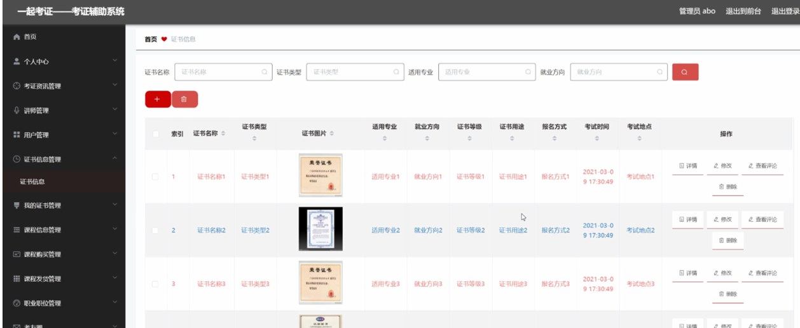

ssm+Vue计算机毕业设计一起考证——考证辅助系统（程序+LW文档）

**项目运行**

**环境配置：**

**Jdk1.8 + Tomcat7.0 + Mysql + HBuilderX** **（Webstorm也行）+ Eclispe（IntelliJ
IDEA,Eclispe,MyEclispe,Sts都支持）。**

**项目技术：**

**SSM + mybatis + Maven + Vue** **等等组成，B/S模式 + Maven管理等等。**

**环境需要**

**1.** **运行环境：最好是java jdk 1.8，我们在这个平台上运行的。其他版本理论上也可以。**

**2.IDE** **环境：IDEA，Eclipse,Myeclipse都可以。推荐IDEA;**

**3.tomcat** **环境：Tomcat 7.x,8.x,9.x版本均可**

**4.** **硬件环境：windows 7/8/10 1G内存以上；或者 Mac OS；**

**5.** **是否Maven项目: 否；查看源码目录中是否包含pom.xml；若包含，则为maven项目，否则为非maven项目**

**6.** **数据库：MySql 5.7/8.0等版本均可；**

**毕设帮助，指导，本源码分享，调试部署** **(** **见文末** **)**

### 系统结构

系统架构图属于系统设计阶段，系统架构图只是这个阶段一个产物，系统的总体架构决定了整个系统的模式，是系统的基础。一起考证——考证辅助系统的整体结构设计如图4-2所示。

图4-2 系统结构图

### 4.3. 数据库设计

#### 4.3.1 数据库实体

管理员信息结构图，如图4-3所示：

图4-3管理员信息实体结构图

证书信息管理实体属性图，如图4-4所示：

图4-4证书信息管理实体属性图

课程信息管理实体属性图如图4-5所示。

图4-5课程信息管理实体属性图

### 系统功能模块

一起考证——考证辅助系统，在系统首页可以查看首页、考证资讯、证书信息、课程信息、职业职位、考友圈、个人中心、后台管理等内容进行详细操作，如图5-1所示。

图5-1系统首页界面图

证书信息，在证书信息页面可以查看证书名称、证书类型、图片、适用专业、就业方向、证书等级、证书用途、报名方式、考试时间、考试地点、证书详情等内容，并可根据需要进行评论或收藏等操作，如图5-2所示。

图5-2证书信息界面图

课程信息，在课程信息页面可以查看课程标题、课程价格、课程图片、讲师工号、讲师姓名、讲师邮箱、课程详情等内容，并可根据需要进行课程购买、评论或收藏等操作，如图5-3所示。

图5-3课程信息界面图

用户注册，在用户注册页面对通过填写用户名、密码、姓名、手机、邮箱、学校、专业、年级等内容进行注册操作，如图5-4所示。在个人中心页面对通过填写用户名、密码、姓名、性别、图片、手机、邮箱、学校、专业、年级等内容进行信息更新操作，还可以根据需要对我的发布、我的收藏进行相应操作；如图5-5所示。

图5-4用户注册界面图

图5-5个人中心界面图

### 5.2管理员功能模块

管理员登录，管理员通过输入用户，密码，选择角色等信息进行系统登录，如图5-6所示。

图5-6管理员登录界面图

管理员登录进入系统可以查看首页、个人中心、考证资讯管理、讲师管理、用户管理、证书信息管理、我的证书管理、课程信息管理、课程购买管理、课程发货管理、职业职位管理、考友圈、管理员管理、系统管理等内容进行详细操作，如图5-7所示。

图5-7管理员功能界面图

考证资讯管理，在考证资讯管理页面可以对索引、资讯标题、资讯类型、图片、发布日期等内容进行详情、修改、查看评论或删除等操作，如图5-8所示。

图5-8考证资讯管理界面图

讲师管理，在讲师管理页面可以对索引、讲师工号、讲师姓名、性别、照片、职称、职业、联系电话、讲师邮箱等内容进行详情、修改或删除等操作，如图5-9所示。

图5-9讲师管理界面图

用户管理，在用户管理页面可以对索引、用户名、姓名、性别、头像、手机、邮箱、学校、专业、年级等内容进行详情、修改或删除等操作，如图5-10所示。

图5-10用户管理界面图

证书信息管理，在证书信息管理页面可以对索引、证书名称、证书类型、证书图片、适用专业、就业方向、证书等级、证书用途、报名方式、考试时间、考试地点等内容进行详情、修改、查看评论或删除等操作，如图5-11所示。

图5-11证书信息管理界面图

我的证书管理，在我的证书管理页面可以对索引、证书名称、证书类型、证书图片、证书等级、证书用途、用户名等内容进行详情、修改或删除等操作，如图5-12所示。

图5-12我的证书管理界面图

#### **JAVA** **毕设帮助，指导，源码分享，调试部署**

