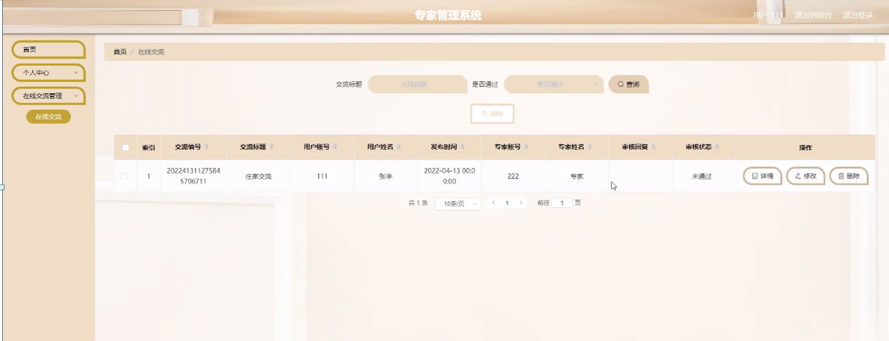

ssm+Vue计算机毕业设计专家管理系统（程序+LW文档）

**项目运行**

**环境配置：**

**Jdk1.8 + Tomcat7.0 + Mysql + HBuilderX** **（Webstorm也行）+ Eclispe（IntelliJ
IDEA,Eclispe,MyEclispe,Sts都支持）。**

**项目技术：**

**SSM + mybatis + Maven + Vue** **等等组成，B/S模式 + Maven管理等等。**

**环境需要**

**1.** **运行环境：最好是java jdk 1.8，我们在这个平台上运行的。其他版本理论上也可以。**

**2.IDE** **环境：IDEA，Eclipse,Myeclipse都可以。推荐IDEA;**

**3.tomcat** **环境：Tomcat 7.x,8.x,9.x版本均可**

**4.** **硬件环境：windows 7/8/10 1G内存以上；或者 Mac OS；**

**5.** **是否Maven项目: 否；查看源码目录中是否包含pom.xml；若包含，则为maven项目，否则为非maven项目**

**6.** **数据库：MySql 5.7/8.0等版本均可；**

**毕设帮助，指导，本源码分享，调试部署** **(** **见文末** **)**

###  系统设计主要功能

通过市场调研及咨询研究，了解了专家管理系统及管理者的使用需求，于是制定了管理员，用户和专家等模块。功能结构图如下所示：

图4-1系统功能结构图

### 4.2 数据库设计

#### 4.2.1 数据库设计规范

数据可设计要遵循职责分离原则，即在设计时应该要考虑系统独立性，即每个系统之间互不干预不能混乱数据表和系统关系。

数据库命名也要遵循一定规范，否则容易混淆，数据库字段名要尽量做到与表名类似，多使用小写英文字母和下划线来命名并尽量使用简单单词。

#### 4.2.2 E/R图

用户信息E/R图，如下所示：

图4-2 用户信息E/R图

专家成绩E/R图，如下所示：

图4-3专家成绩E/R图

### 系统功能模块

专家管理系统，在系统首页可查看首页、专家信息、活动信息、专家成绩、公告资讯、个人中心、后台管理等内容，如图5-1所示。

图5-1系统首页界面图

用户注册，通过输入用户账号、用户姓名、密码、用户电话、职位等内容进行注册，注册完通过输入账号、密码进行登录，如图5-2所示。

图5-2用户注册、登录界面图

个人中心，
用户可在个人中心页面通过输入用户账号、密码、用户姓名、性别、用户电话、上传图片、职位、出生日期等内容进行更新信息或查看我的收藏等内容，如图5-3所示。

图5-3个人中心界面图

专家信息，用户可在专家信息页面查看专家名称、专家账号、专家分类、专家电话、性别、民族、出生日期、专业、职务、学历、参加党派、成就、参与活动、个人简介等内容，还可进行评论、在线交流或收藏等操作，如图5-4所示。
图5-4专家信息界面图

活动信息，用户可在活动信息页面查看活动名称、活动编号、发布时间、活动地点、活动简介、专家账号、专家姓名、点击次数、活动详情等内容，还可进行评论或收藏等操作，如图5-5所示。

图5-5活动信息界面图

后台管理，用户可在后台管理页面查看个人中心、在线交流管理等内容，如图5-6所示。

图5-6用户后台功能界面图

在线交流管理，用户可在在线交流管理页面查看交流编号、交流标题、用户账号、用户姓名、发布时间、专家账号、专家姓名、审核回复、审核状态等内容，还可进行修改或删除等操作，如图5-7所示。

图5-7在线交流管理界面图

5.2专家功能模块

专家注册，专家通过输入专家账号、密码、专家姓名、专家电话、民族、出生日期等内容进行注册，如图5-8所示。

图5-8专家注册界图面

专家通过登录进入系统可查看个人中心、专家信息管理、活动信息管理、在线交流管理、专家成绩管理等内容，如图5-9所示。

图5-9专家功能界图面

专家信息管理，专家可在专家信息管理页面查看专家账号、专家姓名、专家分类、专家照片、性别、民族、出生日期、头像、专业、职务、学历、参加党派等内容，还可进行新增、修改、查看评论或删除等操作，如图5-10所示。

图5-10专家信息管理界面图

活动信息管理，专家可在活动信息管理页面查看活动编号、活动名称、活动图片、发布时间、活动地点、专家账号、专家姓名等内容，还可进行新增、修改、查看评论或删除等操作，如图5-11所示。

图5-11活动信息管理界面图

在线交流管理，专家可在在线交流管理页面查看交流编号、交流标题、用户账号、用户姓名、发布时间、专家账号、专家姓名、审核回复、审核状态等内容，还可进行审核等操作，如图5-12所示。

图5-12在线交流管理界面图

**JAVA** **毕设帮助，指导，源码分享，调试部署**

