ssm+Vue计算机毕业设计业俊宾馆客房管理系统（程序+LW文档）

**项目运行**

**环境配置：**

**Jdk1.8 + Tomcat7.0 + Mysql + HBuilderX** **（Webstorm也行）+ Eclispe（IntelliJ
IDEA,Eclispe,MyEclispe,Sts都支持）。**

**项目技术：**

**SSM + mybatis + Maven + Vue** **等等组成，B/S模式 + Maven管理等等。**

**环境需要**

**1.** **运行环境：最好是java jdk 1.8，我们在这个平台上运行的。其他版本理论上也可以。**

**2.IDE** **环境：IDEA，Eclipse,Myeclipse都可以。推荐IDEA;**

**3.tomcat** **环境：Tomcat 7.x,8.x,9.x版本均可**

**4.** **硬件环境：windows 7/8/10 1G内存以上；或者 Mac OS；**

**5.** **是否Maven项目: 否；查看源码目录中是否包含pom.xml；若包含，则为maven项目，否则为非maven项目**

**6.** **数据库：MySql 5.7/8.0等版本均可；**

**毕设帮助，指导，本源码分享，调试部署** **(** **见文末** **)**

### 系统结构设计

管理员和员工登录后对整个系统相关操作进行处理，可进行系统管理。系统的功能结构图如下图所示。

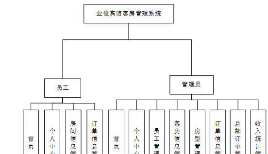

图3-1 系统功能结构图

### 3.5数据库设计

数据可设计要遵循职责分离原则，即在设计时应该要考虑系统独立性，即每个系统之间互不干预不能混乱数据表和系统关系。

数据库命名也要遵循一定规范，否则容易混淆，数据库字段名要尽量做到与表名类似，多使用小写英文字母和下划线来命名并尽量使用简单单词。

#### 3.5.1 E-R图设计

概念模型是对现实中的问题出现的事物的进行描述，ER图是由实体及其关系构成的图，通过E-R图可以清楚地描述系统涉及到的实体之间的相互关系。

房间信息E-R图如下所示：

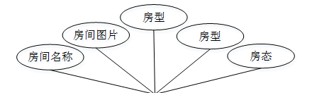

图3-2房间信息E-R图

订单信息E-R图如下所示：

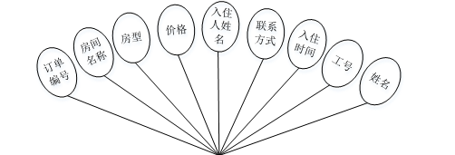

图3-3订单信息E-R图

系统登录，管理员和员工通过填写注册时输入的用户名，密码，选择角色等信息进行登录操作，如图4-1所示。

图4-1系统登录界面图

### 4.1管理员功能模块

管理员登录进入系统可以查看首页，个人中心，员工管理，客房信息管理，房型管理，订单信息管理，总部订单管理，收入统计管理等功能，并进行详细操作，如图4-2所示。

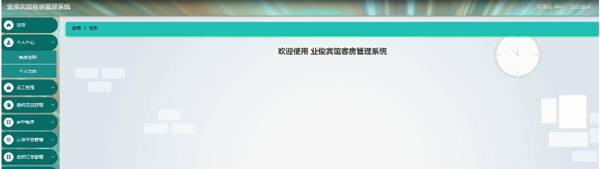

图4-2管理员功能界面图

员工管理；在员工管理页面中可以对索引，工号，姓名，性别，邮箱，手机号码，相片等内容进行详情，修改和删除操作；如图4-3所示。

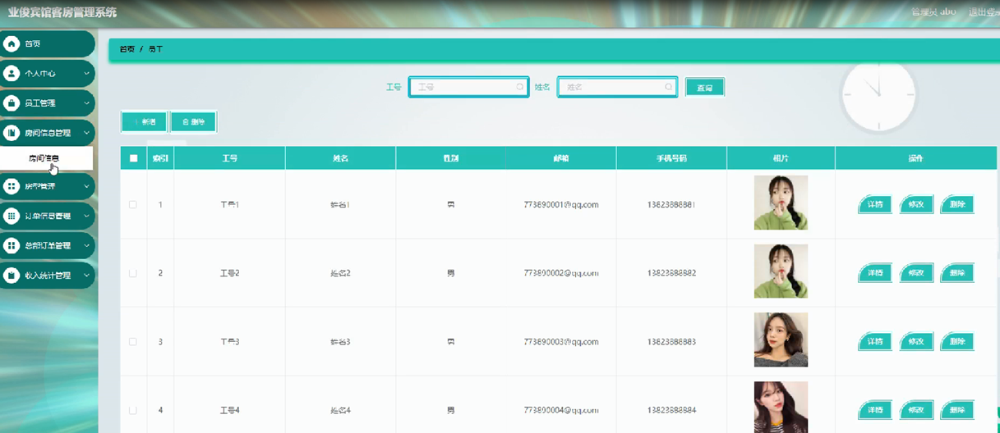

图4-3员工管理界面图

房间信息管理；在房间信息管理页面中可以对索引，房间名称，房间图片，房型，房态，价格等内容进行详情，接单，修改和删除等操作；如图4-4所示。

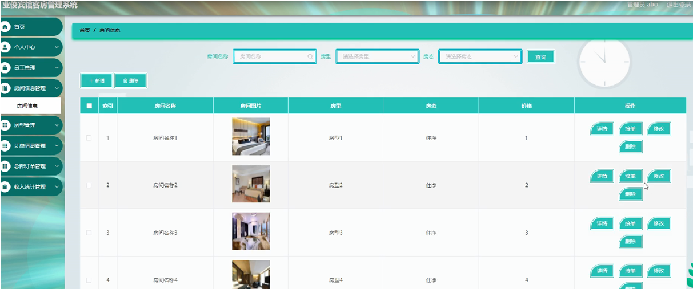

图4-4房间信息管理界面图

订单信息管理；在订单信息管理页面中可以对
索引，订单编号，房间名称，房型，价格，入住人姓名，联系方式，入住时间，工号，姓名等内容进行详情，删除等操作；如图4-5所示。

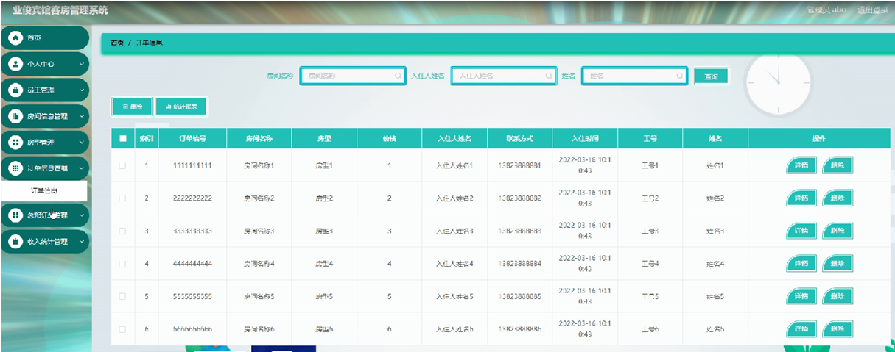

图4-5订单信息管理界面图

总部订单管理；在总部订单管理页面中可以对索引，订单编号，房间名称，房型，价格，入住人姓名，联系方式，入住时间等内容进行详情，修改和删除等操作；如图4-6所示。

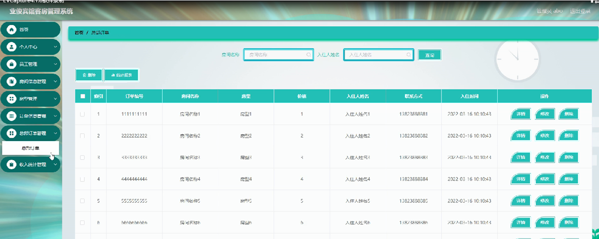

图4-6总部订单管理界面图

### 4.2员工功能模块

员工登录进入系统可以查看首页，个人中心，房间信息管理，订单信息管理等功能，并进行详细操作，如图4-7所示。

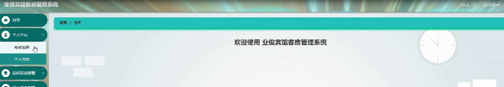

图4-7员工功能界面图

个人中心；在个人信息页面通过填写工号，姓名，性别，邮箱，手机号码，相片等内容进行个人信息修改操作；如图4-8所示。

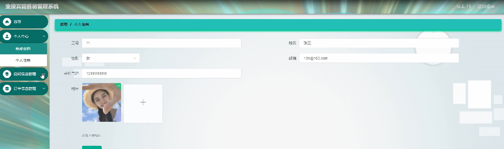

图4-8个人中心界面图

房间信息管理；在房间信息管理页面中可以对索引，房间名称，房间图片，房型，房态，价格等内容进行详情和预订等操作；如图4-9所示。

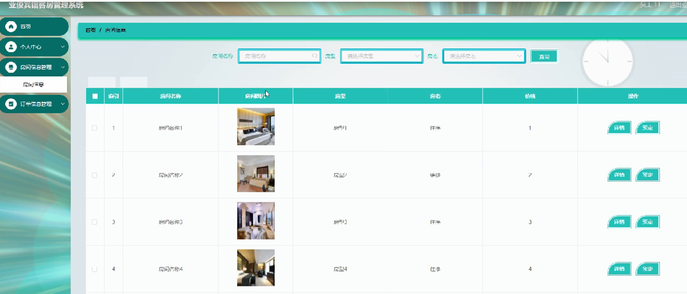

图4-9房间信息管理界面图

#### **JAVA** **毕设帮助，指导，源码分享，调试部署**

