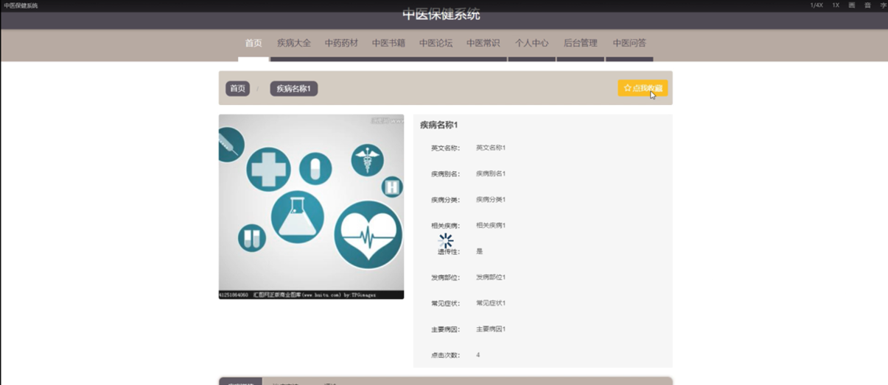

ssm+Vue计算机毕业设计中医保健系统（程序+LW文档）

**项目运行**

**环境配置：**

**Jdk1.8 + Tomcat7.0 + Mysql + HBuilderX** **（Webstorm也行）+ Eclispe（IntelliJ
IDEA,Eclispe,MyEclispe,Sts都支持）。**

**项目技术：**

**SSM + mybatis + Maven + Vue** **等等组成，B/S模式 + Maven管理等等。**

**环境需要**

**1.** **运行环境：最好是java jdk 1.8，我们在这个平台上运行的。其他版本理论上也可以。**

**2.IDE** **环境：IDEA，Eclipse,Myeclipse都可以。推荐IDEA;**

**3.tomcat** **环境：Tomcat 7.x,8.x,9.x版本均可**

**4.** **硬件环境：windows 7/8/10 1G内存以上；或者 Mac OS；**

**5.** **是否Maven项目: 否；查看源码目录中是否包含pom.xml；若包含，则为maven项目，否则为非maven项目**

**6.** **数据库：MySql 5.7/8.0等版本均可；**

**毕设帮助，指导，本源码分享，调试部署** **(** **见文末** **)**

####  系统设计主要功能

通过市场调研及咨询研究，了解了用户及管理者的使用需求，于是制定了管理员和用户等模块。功能结构图如下所示：

图4-1系统总体功能结构图

### 4.2 数据库设计

#### 4.2.1 数据库设计规范

数据可设计要遵循职责分离原则，即在设计时应该要考虑系统独立性，即每个系统之间互不干预不能混乱数据表和系统关系。

数据库命名也要遵循一定规范，否则容易混淆，数据库字段名要尽量做到与表名类似，多使用小写英文字母和下划线来命名并尽量使用简单单词。

#### 4.2.2 E/R图

疾病大全E/R图，如下所示：

图4-2疾病大全E/R图

中医论坛E/R图，如下所示：

图4-3中医论坛E/R图

中医书籍E/R图，如下所示。

图4-4中医书籍E/R图

### 系统功能模块

中医保健系统，在系统首页可以查看首页、疾病大全、中药药材、中医书籍、中医论坛、中医常识、个人中心、后台管理、中医问答等内容，并进行详细操作；如图5-1所示。

图5-1系统首页界面图

用户注册，在用户注册页面通过填写用户账号、密码、确认密码、用户姓名、联系方式等信息进行注册操作，如图5-2所示。

图5-2用户注册界面图

疾病大全，在疾病大全页面可以查看疾病名称、英文名称、疾病别名、疾病分类、相关疾病、遗传性、发病部位、常见症状、主要病因、点击次数、疾病详情、、治疗方法、图片等内容，并进行评论或收藏操作，如图5-3所示。

图5-3疾病大全界面图

中药药材，在中药药材页面中可以查看药材名称、中药分类、用法用量、药理作用、用药禁忌、药物介绍、功能主治、图片等内容，并进行评论、点赞或收藏操作，如图5-4所示。

图5-4中药药材界面图

中医书籍，在中医书籍页面中可以查看书籍名称、图书类型、书籍简介、原著、出版社、点击次数、书籍介绍、封面等内容，并进行评论、点赞或收藏操作，如图5-5所示。

图5-5中医书籍界面图

个人中心，在个人中心页面通过填写用户账号、密码、用户姓名、上传图片、性别、联系方式等内容进行更新信息，并根据需要对我的发布、我的收藏进行相对应操作，如图5-6所示。

图5-6个人中心界面图

### 5.2后台功能模块

后台登录，用户通过填写注册时输入的用户名、密码、选择角色等信息进行登录操作，如图5-7所示。

图5-7后台登录界面图

#### 5.2.1管理员功能模块

管理员登录系统后，可以对首页、个人中心、用户管理、疾病分类管理、疾病大全管理、中药分类管理、中药药材管理、图书类型管理、中药书籍管理、中医论坛、系统管理等功能进行相应的操作管理，如图5-8所示。

图5-8管理员功能界面图

用户管理，在用户管理页面可以对索引、用户账号、用户姓名、头像、性别、联系方式等内容进行详情，修改和删除等操作，如图5-9所示。

图5-9用户管理界面图

疾病分类管理，在疾病分类管理页面可以对索引、疾病分类等内容进行详情，修改和删除等操作，如图5-10所示。

图5-10疾病分类管理界面图

疾病大全管理，在疾病大全管理页面可以对索引、疾病名称、封面、英文名称、疾病别名、疾病分类、相关疾病、遗传性、发病部位等信息进行详情、修改、查看评论和删除等操作，如图5-11所示。

图5-11疾病大全管理界面图

中药分类管理，在中药分类管理页面可以对索引、中药分类等内容进行详情、修改或删除操作，如图5-12所示。

图5-12中药分类管理界面

#### **JAVA** **毕设帮助，指导，源码分享，调试部署**

