ssm+Vue计算机毕业设计中原图书供应商图书管理系统（程序+LW文档）

**项目运行**

**环境配置：**

**Jdk1.8 + Tomcat7.0 + Mysql + HBuilderX** **（Webstorm也行）+ Eclispe（IntelliJ
IDEA,Eclispe,MyEclispe,Sts都支持）。**

**项目技术：**

**SSM + mybatis + Maven + Vue** **等等组成，B/S模式 + Maven管理等等。**

**环境需要**

**1.** **运行环境：最好是java jdk 1.8，我们在这个平台上运行的。其他版本理论上也可以。**

**2.IDE** **环境：IDEA，Eclipse,Myeclipse都可以。推荐IDEA;**

**3.tomcat** **环境：Tomcat 7.x,8.x,9.x版本均可**

**4.** **硬件环境：windows 7/8/10 1G内存以上；或者 Mac OS；**

**5.** **是否Maven项目: 否；查看源码目录中是否包含pom.xml；若包含，则为maven项目，否则为非maven项目**

**6.** **数据库：MySql 5.7/8.0等版本均可；**

**毕设帮助，指导，本源码分享，调试部署** **(** **见文末** **)**

系统体系结构

中原图书供应商图书管理系统的结构图4-1所示：

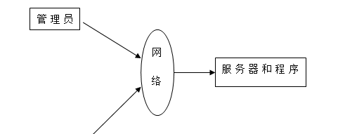

图4-1 系统结构

登录系统结构图，如图4-2所示：

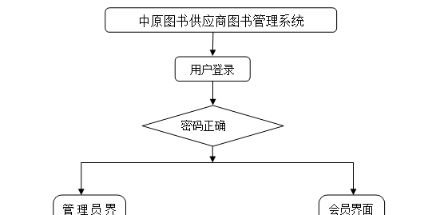

图4-2 登录结构图

系统结构图，如图4-3所示：

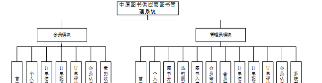

图4-3 系统结构图

4.2 数据库实体设计

数据库的功能就是对系统中所有的数据进行存储和管理。所有的数据可以在数据库中产时间的进行存储，方便用户的使用。而且所有的数据库中的数据也应该具有一定的共享性，任何的系统可以对一些数据进行使用，同时还应该保持一定的独立性，每一个数据库中的数据都有很强的安全性，可以被很好的存放到数据库，没有进行身份的验证是不能对这些数据进行查看和使用的。数据库的设计需要明确每一个实体之间的联系，系统的E-
R图如下图所示：：

热销图书管理主要包括索引、图书名称、分类、图片、作者、出版社、出版日期、价格、数量等属性，热销图书管理属性图如图4-4所示。

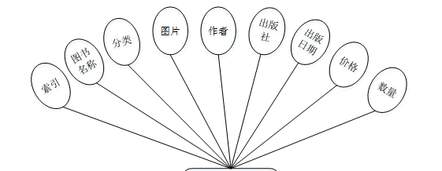

图4-4热销图书管理实体属性图

会员实体属性主要包括索引、用户名、密码、姓名、性别、头像、手机、邮箱、会员等级、会员折扣等属性。会员实体属性图如图4-5所示。

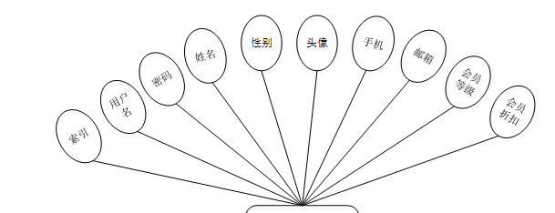

图4-5会员管理实体属性图

系统功能模块

中原图书供应商图书管理系统，在系统的首页可以查看首页、热销图书、图书资讯、个人中心、后台管理、客服等信息，如图5-1所示。

图5-1系统首页界面图

会员注册，新会员可以进行会员注册的操作，可以根据界面上的提示输入用户名、密码、姓名、手机、邮箱、会员折扣等信息，然后点击提交，所有的信息就被系统保存了下来，具体操作如图5-2所示。

图5-2会员注册界面图

热销图书，在热销图书页面中可以对图书名称、分类、作者、出版社、出版日期、价格、数量、详情、评论等进行购物车购买或收藏等操作，如图5-3所示。

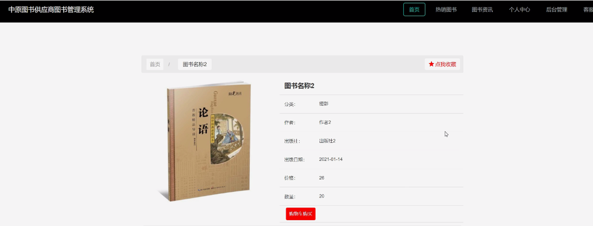

图5-3热销图书界面图

个人中心，在个人中心页面可以填写用户名、密码、姓名、性别、图片、手机、邮箱、会员等级、会员折扣等信息进行更新操作，还可以对我的收藏进行相对应操作，如图5-4所示。

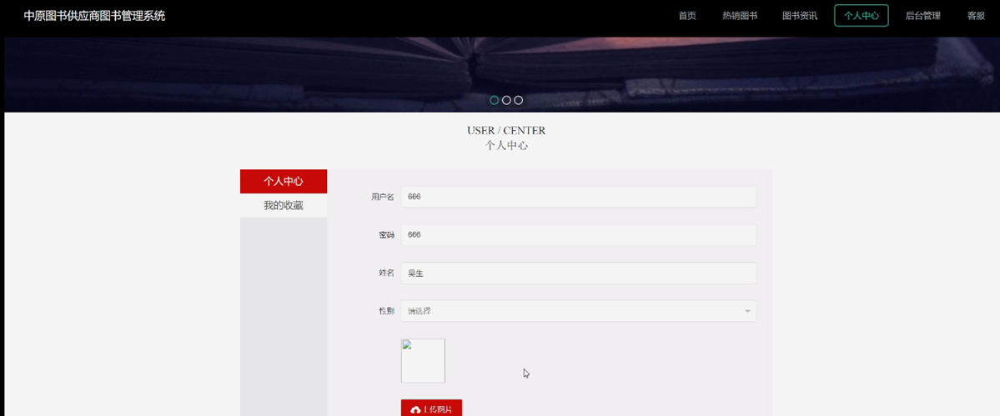

图5-4个人中心界面图

### 5.2 会员后台功能模块

会员登录进入中原图书供应商图书管理系统之后，就可以对首页、个人中心、订单信息管理、订单配送管理、订单评价管理、会员认证管理、我的收藏管理进行相应的操作管理，如图5-5所示。

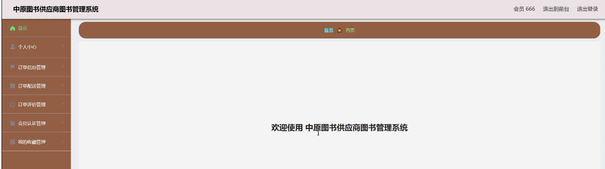

图5-5用户后台功能界面图

个人中心，在个人中心页面通过填写用户名、密码、姓名、性别、头像、手机、邮箱、会员等级、会员折扣等信息进行修改操作，如图5-6所示。

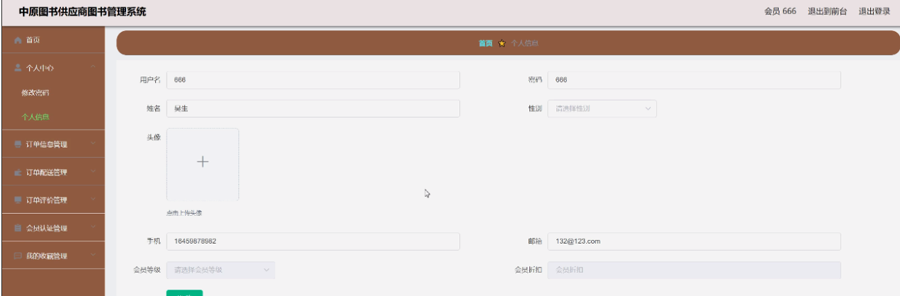

图5-6个人中心界面图

订单配送管理，在订单配送管理页面中通过查看索引、订单编号、图书名称、分类、图片、数量、下单日期、更新时间、订单状态、用户名、姓名、手机、收货地址等信息进行详情或订单评价等操作，如图5-7所示。

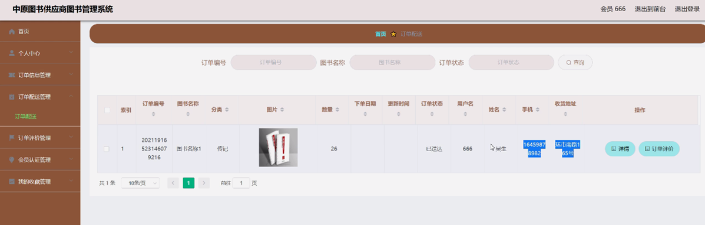

图5-7订单配送管理界面图

会员认证管理，在会员认证管理页面中可以对索引、用户名、姓名、头像、身份、身份证、扫描件、验证说明、审核回复、审核状态等信息进行修改或删除等操作，如下图5-8所示。

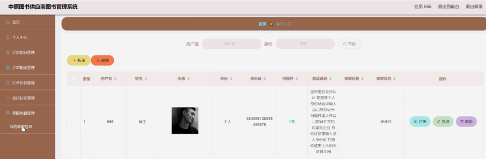

图5-8会员认证管理界面图

我的收藏管理，在我的收藏管理页面中可以查看索引、收藏id、表名、收藏名称、收藏图片等信息，并且可以进行详情或删除等操作，如图5-9所示。

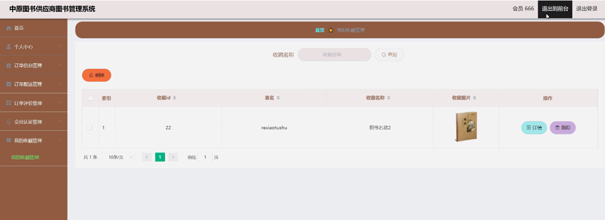

图5-9我的收藏管理界面图

### 5.3 管理员功能模块

管理员登录，管理员通过输入用户名、密码、角色等信息然后点击登录就能登录到系统进行系统的使用了，如图5-10所示。

图5-10管理员登录界面图

管理员登录进入中原图书供应商图书管理系统之后，就可以对所有的信息进行查看，可以查看到首页、个人中心、图书分类管理、热销图书管理、图书入库管理、会员等级管理、会员管理、订单信息管理、订单配送管理、订单评价管理、会员认证管理、系统管理等，并且还可以对其进行相应的操作管理，如图5-11所示。

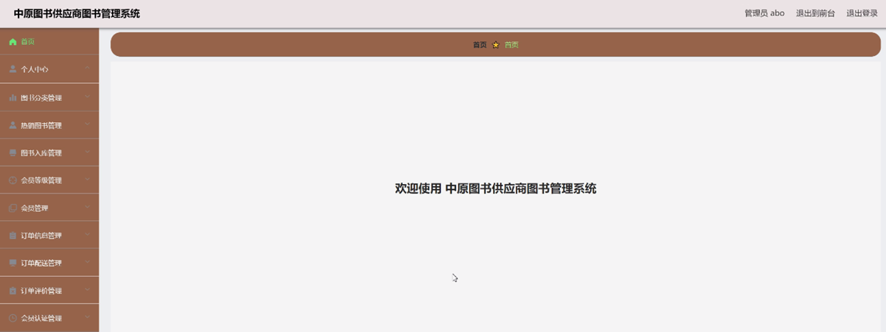

图5-11管理员功能界面图

图书分类管理，在图书分类管理页面中可以对索引、分类进行修改或删除等操作，如图5-12所示。

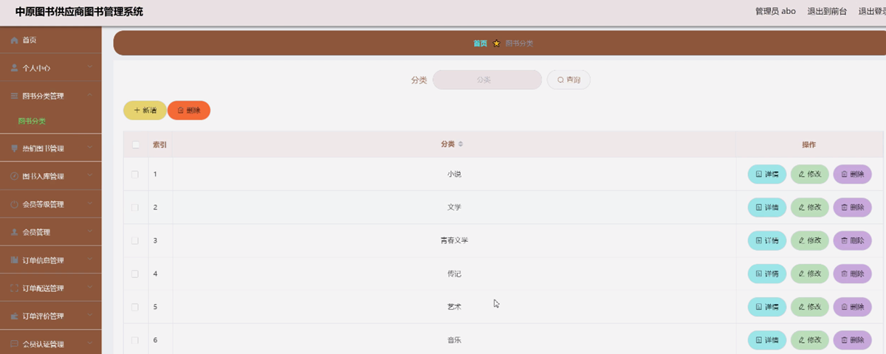

图5-12图书分类管理界面图

**JAVA** **毕设帮助，指导，源码分享，调试部署**

