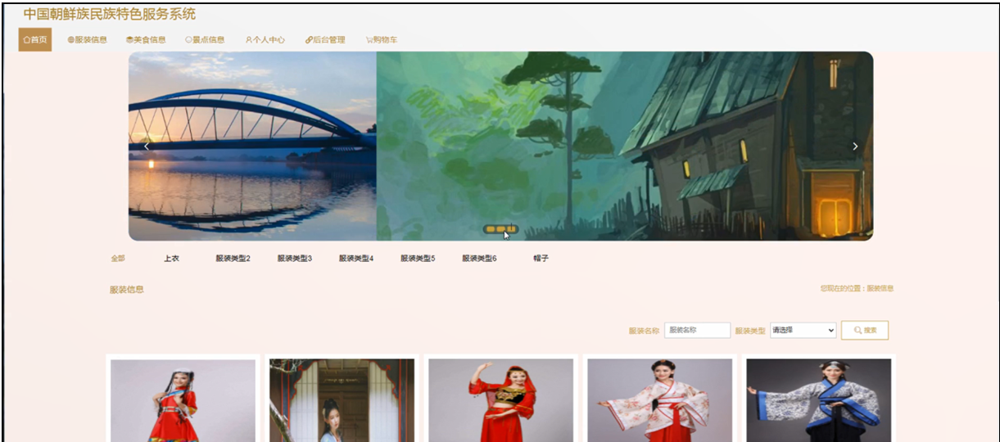

ssm+Vue计算机毕业设计中国朝鲜族民族特色服务系统（程序+LW文档）

**项目运行**

**环境配置：**

**Jdk1.8 + Tomcat7.0 + Mysql + HBuilderX** **（Webstorm也行）+ Eclispe（IntelliJ
IDEA,Eclispe,MyEclispe,Sts都支持）。**

**项目技术：**

**SSM + mybatis + Maven + Vue** **等等组成，B/S模式 + Maven管理等等。**

**环境需要**

**1.** **运行环境：最好是java jdk 1.8，我们在这个平台上运行的。其他版本理论上也可以。**

**2.IDE** **环境：IDEA，Eclipse,Myeclipse都可以。推荐IDEA;**

**3.tomcat** **环境：Tomcat 7.x,8.x,9.x版本均可**

**4.** **硬件环境：windows 7/8/10 1G内存以上；或者 Mac OS；**

**5.** **是否Maven项目: 否；查看源码目录中是否包含pom.xml；若包含，则为maven项目，否则为非maven项目**

**6.** **数据库：MySql 5.7/8.0等版本均可；**

**毕设帮助，指导，本源码分享，调试部署** **(** **见文末** **)**

### 总体设计

根据中国朝鲜族民族特色服务功能需求，进行系统设计。

CSS+DIV进行页面布局。CSS+DIV是一种网页的布局方法，这一种网页布局方法有别于传统的HTML网页设计语言中的表格（Table）定位方式，真正地达到了W3C内容与表现相分离，但是不是很兼容老版本的浏览器。

使用JAVA母版页可以为应用程序中的页创建一致的布局，各个模块继承母版页。

后台由管理员和用户两个角色组成，主要功能包括首页，个人中心，用户管理，文化介绍管理，服装信息管理，服装类型管理，美食信息管理，美食类型管理，景点信息管理，景点类型管理，服装订单管理，服装归还管理，系统管理，订单管理等；

系统对这些功能进行整合，产生的功能结构图如下：

图4-1 系统总体结构图

### 4.2数据库设计

#### 4.2.1概念模型设计

概念模型是对现实中的问题出现的事物的进行描述，ER图是由实体及其关系构成的图，通过E-R图可以清楚地描述系统涉及到的实体之间的相互关系。

文化介绍实体图如图4-2所示：

图4－文化介绍实体图

美食信息实体图如图4-3所示：

图4-3美食信息实体图

服装信息实体图如图4-4所示：

图4-4服装信息实体图

### 系统功能模块

中国朝鲜族民族特色服务系统，在系统首页可以查看首页，服装信息，美食信息，景点信息，个人中心，后台管理，购物车等内容，并进行详细操作；如图5-1所示。

图5-1系统首页界面图

用户注册，在用户注册页面通过填写用户账号，用户姓名，密码，确认密码，手机号码，邮箱等信息进行注册操作；如图5-2所示。

图5-2用户注册界面图

服装信息，在服装信息页面可以查看服装名称，服装类型，数量，租赁单价，点击次数等内容，并进行下单租赁，评论或收藏操作；如图5-3所示。

图5-3服装信息界面图

美食信息，在美食信息页面可以查看美食名称，价格，美食类型，点击次数等内容，并进行添加到购物车，立即购买，评论或收藏操作；如图5-4所示。

图5-4美食信息界面图

个人中心，在个人中心页面通过填写用户账号，用户姓名，密码，手机号码，上传图片，性别，邮箱，余额等内容进行更新信息操作，还可以对我的订单，我的地址，我的收藏进行详细操作；如图5-5所示。

图5-5个人中心界面图

### 5.2管理员功能模块

管理员登录系统后，可以对首页，个人中心，用户管理，文化介绍管理，服装信息管理，服装类型管理，美食信息管理，美食类型管理，景点信息管理，景点类型管理，服装订单管理，服装归还管理，系统管理，订单管理等功能进行相应的操作管理；如图5-6所示。

图5-6管理员功能界面图

用户管理，在用户管理页面可以对索引，用户账号，用户姓名，手机号码，头像，性别，邮箱等内容进行详情，修改或删除操作；如图5-7所示。

图5-7用户管理界面图

文化介绍管理，在文化介绍管理页面可以对索引，标题，日期，封面等内容进行详情，修改或删除操作；如图5-8所示。

图5-8文化介绍管理界面图

服装信息管理，在服装信息管理页面可以对索引，服装名称，封面，服装类型，数量，租赁单价等内容进行详情，修改，查看评论或删除操作；如图5-9所示。

图5-9服装信息管理界面图

服装类型管理，在服装类型管理页面可以对索引，服装类型等内容进行详情，修改或删除操作；如图5-10所示。

图5-10服装类型管理界面图

美食信息管理，在美食信息管理页面可以对索引，美食名称，封面，美食类型，价格等内容进行详情，修改，查看评论或删除操作；如图5-11所示。

图5-11美食信息管理界面图

美食类型管理，在美食类型管理页面可以对索引，美食类型等内容进行详情，修改或删除操作；如图5-12所示。

图5-12美食类型管理界面图

#### **JAVA** **毕设帮助，指导，源码分享，调试部署**

