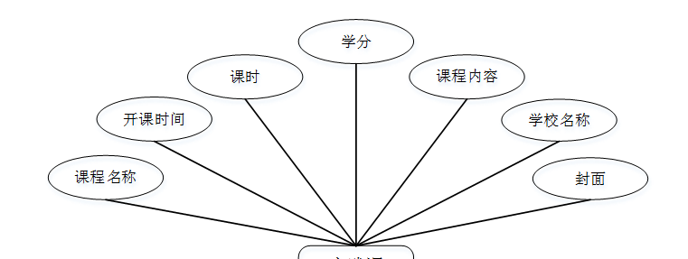

ssm+Vue计算机毕业设计中国财经类高校计算机科学与技术专业课程体系比较分析可视化系统（程序+LW文档）

**项目运行**

**环境配置：**

**Jdk1.8 + Tomcat7.0 + Mysql + HBuilderX** **（Webstorm也行）+ Eclispe（IntelliJ
IDEA,Eclispe,MyEclispe,Sts都支持）。**

**项目技术：**

**SSM + mybatis + Maven + Vue** **等等组成，B/S模式 + Maven管理等等。**

**环境需要**

**1.** **运行环境：最好是java jdk 1.8，我们在这个平台上运行的。其他版本理论上也可以。**

**2.IDE** **环境：IDEA，Eclipse,Myeclipse都可以。推荐IDEA;**

**3.tomcat** **环境：Tomcat 7.x,8.x,9.x版本均可**

**4.** **硬件环境：windows 7/8/10 1G内存以上；或者 Mac OS；**

**5.** **是否Maven项目: 否；查看源码目录中是否包含pom.xml；若包含，则为maven项目，否则为非maven项目**

**6.** **数据库：MySql 5.7/8.0等版本均可；**

**毕设帮助，指导，本源码分享，调试部署** **(** **见文末** **)**

### **系统设计主要功能**

通过市场调研及咨询研究，了解了用户的使用需求，于是制定了管理员模块。功能结构图如下所示：

图4-1系统功能结构图

### **4.2** **数据库设计**

#### 4.2.1 数据库设计规范

数据可设计要遵循职责分离原则，即在设计时应该要考虑系统独立性，即每个系统之间互不干预不能混乱数据表和系统关系。

数据库命名也要遵循一定规范，否则容易混淆，数据库字段名要尽量做到与表名类似，多使用小写英文字母和下划线来命名并尽量使用简单单词。

#### 4.2.2 E/R图

专业选修课E/R图，如下所示：

图4-2专业选修课E/R图

专业核心课E/R图，如下所示：

图4-3专业核心课E/R图

实践课E/R图，如下所示。

图4-4实践课E/R图

### **系统登录**

中国财经类高校计算机科学与技术专业课程体系比较分析可视化系统，管理员进行登录，进入系统前在登录页面根据要求填写用户名和密码等信息，点击登录进行登录操作，如图5-1所示。

图5-3 管理员登录界面图

### **5.2** **管理员功能模块**

管理员登录系统后，可以对首页，个人中心，公共基础课管理，学科基础课管理，专业核心课管理，专业选修课程管理，实践课程管理等功能进行相应的操作管理，如图5-2所示。

图5-2管理员功能界面图

公共基础课管理，在公共基础课管理页面可以对索引，课程名称，开课时间，课时，学分，学校名称，封面等内容进行详情，修改和删除等操作，如图5-3所示。

图5-3公共基础课管理界面图

学科基础课管理，在学科基础课管理页面可以对索引，课程名称，开课时间，课时，学分，学校名称，封面等内容进行详情，修改和删除等操作，如图5-4所示。

图5-4学科基础课管理界面图

专业核心课管理，在专业核心课管理页面可以对索引，课程名称，开课时间，课时，学分，学校名称，封面等信息进行详情，修改和删除等操作，如图5-5所示。

图5-5专业核心课管理界面图

专业选修课程管理，在专业选修课程管理页面可以对索引，课程名称，开课时间，课时，学分，学校名称，封面等内容进行详情，修改和删除操作，如图5-6所示。

图5-6专业选修课程管理界面图

实践课程管理，在实践课程管理页面可以对索引，课程名称，开课时间，课时，学分，学校名称，封面等内容进行详情，修改和删除等操作，如图5-7所示。

图5-7实践课程管理界面图

#### **JAVA** **毕设帮助，指导，源码分享，调试部署**

