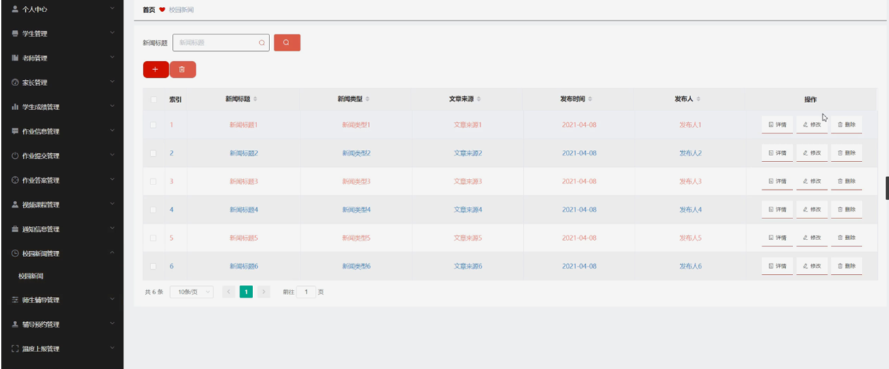
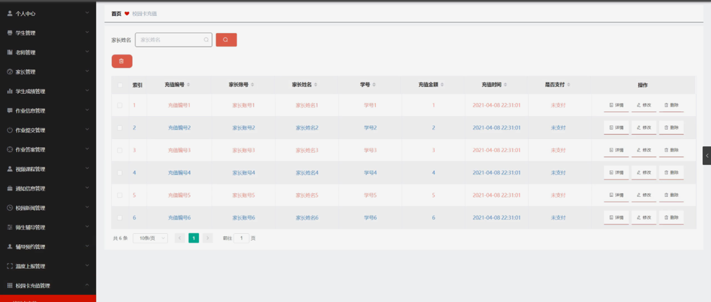

ssm+Vue计算机毕业设计中学教务管理系统（程序+LW文档）

**项目运行**

**环境配置：**

**Jdk1.8 + Tomcat7.0 + Mysql + HBuilderX** **（Webstorm也行）+ Eclispe（IntelliJ
IDEA,Eclispe,MyEclispe,Sts都支持）。**

**项目技术：**

**SSM + mybatis + Maven + Vue** **等等组成，B/S模式 + Maven管理等等。**

**环境需要**

**1.** **运行环境：最好是java jdk 1.8，我们在这个平台上运行的。其他版本理论上也可以。**

**2.IDE** **环境：IDEA，Eclipse,Myeclipse都可以。推荐IDEA;**

**3.tomcat** **环境：Tomcat 7.x,8.x,9.x版本均可**

**4.** **硬件环境：windows 7/8/10 1G内存以上；或者 Mac OS；**

**5.** **是否Maven项目: 否；查看源码目录中是否包含pom.xml；若包含，则为maven项目，否则为非maven项目**

**6.** **数据库：MySql 5.7/8.0等版本均可；**

**毕设帮助，指导，本源码分享，调试部署** **(** **见文末** **)**

### 系统体系结构

中学教务管理系统的结构图4-1所示：

图4-1 系统结构

登录系统结构图，如图4-2所示：

图4-2 登录结构图

管理员结构图，如图4-3所示。

图4-3 管理员结构图

### 数据库设计原则

学习编程，我们都知道数据库设计是基于需要设计的系统功能，我们需要建立一个数据库关系模型，用于存储数据信息，这样当我们在程序中时，就没有必要为程序页面添加数据，从而提高系统的效率。数据库存储了很多信息，可以说是信息管理系统的核心和基础，数据库还提供了添加、删除、修改和检查，使系统能够快速找到自己想要的信息，而不是在程序代码中找到。数据库中信息表的每个部分根据一定的关系精确地组合，排列和组合成数据表。

通过中学教务管理系统的功能进行规划分成几个实体信息，实体信息将通过ER图进行说明，本系统的主要实体图如下：

管理员信息属性图如图4-5所示。

图4-5 管理员信息实体属性图

视频课程管理实体属性图如图4-6所示。

图4-6视频课程管理属性图

作业信息管理实体属性图如图4-7所示。

图4-7作业信息管理实体属性图

师生辅导管理实体属性图如图4-8所示。

图4-8师生辅导管理实体属性图

### 管理员功能模块

管理员登录，管理员通过输入用户名、密码，选择角色并点击登录进行系统登录操作，如图5-1所示。

图5-1管理员登录界图面

管理员登录系统后，可以对首页、个人中心、学生管理、老师管理、家长管理、学生成绩管理、作业信息管理、作业提交管理、作业答案管理、视频课程管理、通知信息管理、校园新闻管理、师生辅导管理、辅导预约管理、温度上报管理、校园卡充值管理、友情链接管理等功能模块进行相应操作，如图5-2所示。

图5-2管理员功能界图面

学生管理，在学生管理页面可以对索引、学号、学生姓名、性别、班级、学生手机、照片、家长账号等内容进行详情或删除等操作，如图5-3所示。

图5-3学生管理界面图

老师管理，在老师管理页面可以对索引、老师账号、老师姓名、头像、性别、老师手机、职称等内容进行详情或删除等操作，如图5-4所示。

图5-4老师管理界面图

家长管理，在家长管理页面可以对索引、家长账号、家长姓名、年龄、性别、头像、家长手机、学号、学生姓名等内容进行详情、修改或删除等操作，如图5-5所示。

图5-5家长管理界面图

作业答案管理，在作业答案管理页面可以对索引、作业编号、作业标题、家长账号、老师账号、老师姓名、答案文件等内容进行详情、修改或删除等操作，如图5-6所示。

图5-6作业答案管理界面图

通知信息管理，在通知信息管理页面可以对索引、老师账号、老师姓名、老师手机、通知标题、发布时间等内容进行详情、修改或删除等操作，如图5-7所示。

图5-7通知信息管理界面图

校园新闻管理，在校园新闻管理页面可以对索引、新闻标题、新闻类型、文章来源、发布时间、发布人等内容进行详情、修改或删除等操作，如图5-8所示。

图5-8校园新闻管理界面图

师生辅导管理，在师生辅导管理页面可以对索引、老师账号、老师姓名、辅导科目、可预约时间等内容进行详情、修改或删除等操作，如图5-9所示。

图5-9师生辅导管理界面图

辅导预约管理，在辅导预约管理页面可以对索引、老师账号、老师姓名、预约时间、辅导科目、学号、学生姓名、家长账号、审核回复、审核状态等内容进行详情、修改或删除等操作，如图5-10所示。

图5-10辅导预约管理界面图

温度上报管理，在温度上报管理页面可以对索引、家长账号、家长姓名、学号、学生姓名、体温、核酸检测、上报时间、老师账号、老师姓名等内容进行详情、修改或删除等操作，如图5-11所示。

图5-11温度上报管理界面图

校园卡充值管理，在校园卡充值管理页面可以对索引、充值编号、家长账号、家长姓名、学号、充值金额、充值时间、是否支付等内容进行详情、修改或删除等操作，如图5-12所示。

图5-12校园卡充值管理界面图

#### **JAVA** **毕设帮助，指导，源码分享，调试部署**

