ssm+Vue计算机毕业设计中学线上作业评判系统（程序+LW文档）

**项目运行**

**环境配置：**

**Jdk1.8 + Tomcat7.0 + Mysql + HBuilderX** **（Webstorm也行）+ Eclispe（IntelliJ
IDEA,Eclispe,MyEclispe,Sts都支持）。**

**项目技术：**

**SSM + mybatis + Maven + Vue** **等等组成，B/S模式 + Maven管理等等。**

**环境需要**

**1.** **运行环境：最好是java jdk 1.8，我们在这个平台上运行的。其他版本理论上也可以。**

**2.IDE** **环境：IDEA，Eclipse,Myeclipse都可以。推荐IDEA;**

**3.tomcat** **环境：Tomcat 7.x,8.x,9.x版本均可**

**4.** **硬件环境：windows 7/8/10 1G内存以上；或者 Mac OS；**

**5.** **是否Maven项目: 否；查看源码目录中是否包含pom.xml；若包含，则为maven项目，否则为非maven项目**

**6.** **数据库：MySql 5.7/8.0等版本均可；**

**毕设帮助，指导，本源码分享，调试部署** **(** **见文末** **)**

### 系统结构设计

系统架构图属于系统设计阶段，系统架构图只是这个阶段一个产物，系统的总体架构决定了整个系统的模式，是系统的基础。中学线上作业评判系统的整体结构设计如图4-2所示。

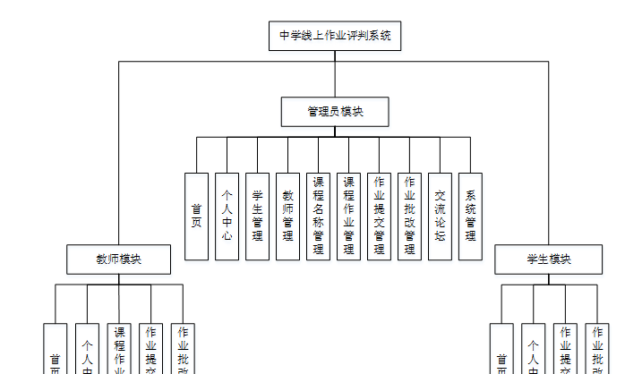

图4-2 系统结构图

### 4.3数据库设计

数据库是计算机信息系统的基础。目前，电脑系统的关键与核心部分就是数据库。数据库开发的优劣对整个系统的质量和速度有着直接影响。

#### 4.3.1 数据库设计原则

数据库的概念结构设计采用实体—联系（E-R）模型设计方法。E-R模型法的组成元素有：实体、属性、联系，E-R模型用E-
R图表示，是提示用户工作环境中所涉及的事物，属性则是对实体特性的描述。在系统设计当中数据库起着决定性的因素。下面设计出这几个关键实体的实体—关系图。

#### 4.3.2 数据库实体

数据模型中的实体（Entity），也称为实例，对应现实世界中可区别于其他对象的“事件”或“事物”。例如，公司中的每个员工，家里中的每个家具。

本系统的E-R图如下图所示：

1、课程作业实体图如图4-3所示：

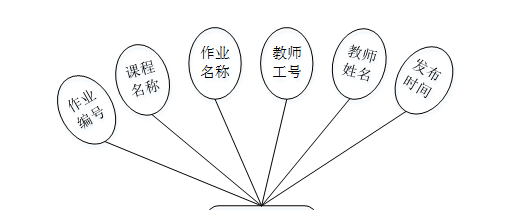

图4-3课程作业实体图

2、作业批改管理实体图如图4-4所示：

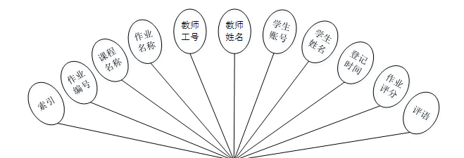

图4-4作业批改管理实体图

### 系统功能模块

中学线上作业评判系统，在系统首页可以首页、课程作业、交流论坛、系统公告、个人中心、后台管理等内容，如图5-1所示。

图5-1系统首页界面图

学生注册，在学生注册页面通过填写学生账号、学生姓名、密码、年级、班级、联系电话等信息完成学生注册，如图5-2所示。

图5-2学生注册界面图

课程作业，在课程作业页面可以查看作业编号、课程名称、作业名称、教师工号、教师姓名、发布时间等详细内容，如图5-3所示。

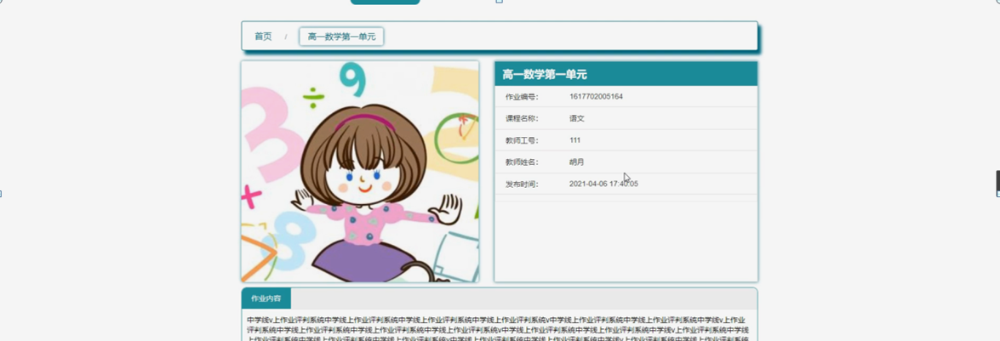

图5-3课程作业界面图

交流论坛，在交流论坛页面通过填写标题、类型、内容等信息进行发布帖子，如图5-4所示。

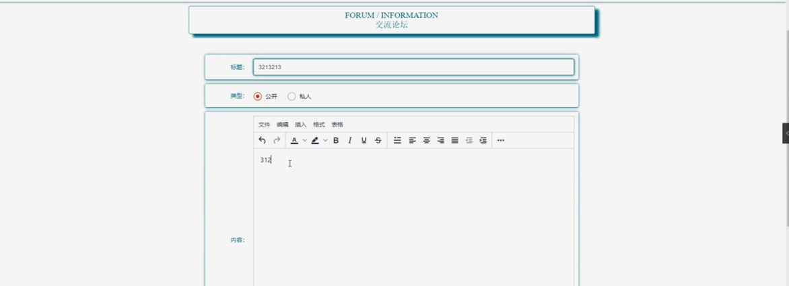

图5-4交流论坛界面图

### 5.2管理员功能模块

管理员登录，管理员通过输入用户名、密码，选择角色并点击登录进行系统登录操作，如图5-5所示。

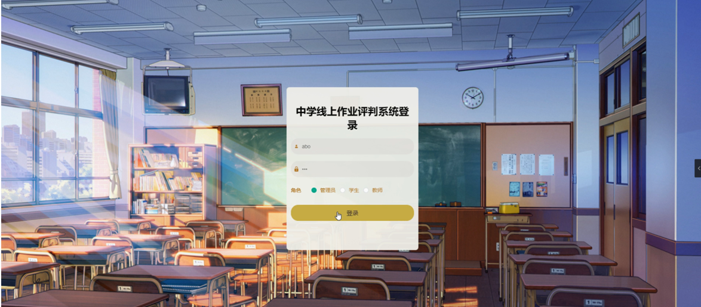

图5-5管理员登录界图面

管理员登录系统后，可以对首页、个人中心、学生管理、教师管理、课程名称管理、课程作业管理、作业提交管理、作业批改管理、交流论坛、系统管理等功能模块进行相应操作，如图5-6所示。

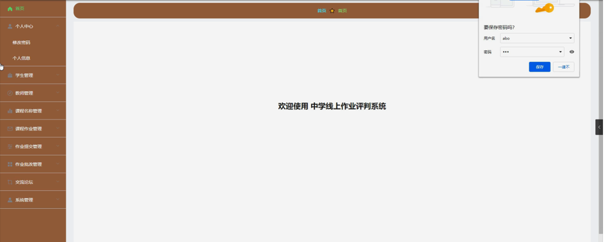

图5-6管理员功能界图面

学生管理，在学生管理页面可以对索引、学生账号、学生姓名、年级、班级、性别、联系电话等内容进行详情、修改或删除等操作，如图5-7所示。

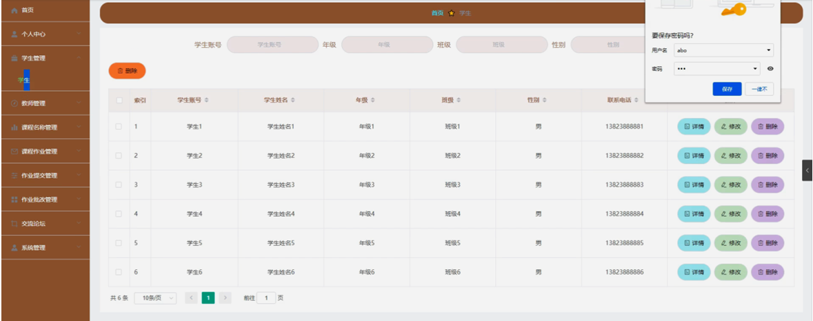

图5-7学生管理界面图

教师管理，在教师管理页面可以对索引、教师工号、教师姓名、性别、职称、联系电话等内容进行详情、修改或删除等操作，如图5-8所示。

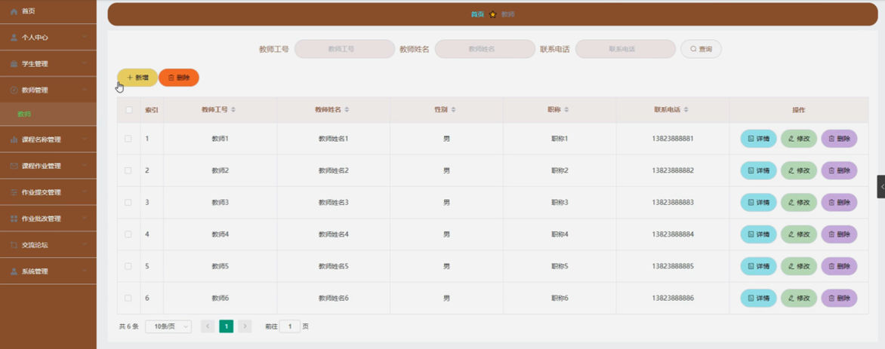

图5-8教师管理界面图

课程名称管理，在课程名称管理页面可以对索引、课程名称等内容进行详情、修改或删除等操作，如图5-9所示。

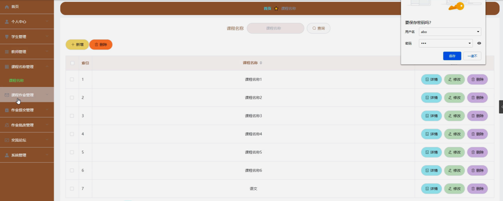

图5-9课程名称管理界面图

课程作业管理，在课程作业管理页面可以对索引、作业编号、课程名称、作业名称、图片、教师工号、教师姓名、发布时间等内容进行详情、删除等操作，如图5-10所示。

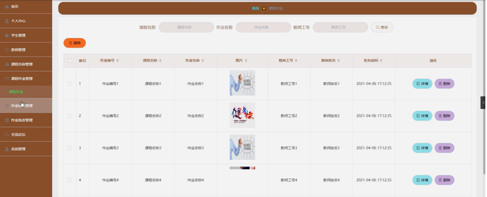

图5-10课程作业管理界面图

作业提交管理，在作业提交管理页面可以对索引、作业编号、课程名称、作业名称、教师工号、教师姓名、学生账号、学生姓名、提交时间等内容进行详情、删除等操作，如图5-11所示。

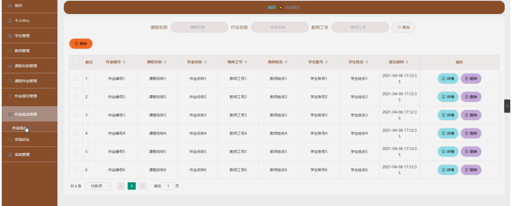

图5-11作业提交管理界面图

作业批改管理，在作业批改管理页面可以对索引、作业编号、课程名称、作业名称、教师工号、教师姓名、学生账号、学生姓名、登记时间、作业评分、评语等内容进行详情、修改等操作，如图5-12所示。

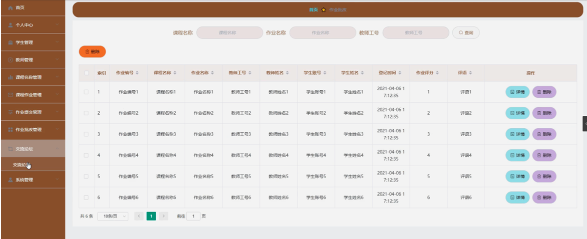

图5-12作业批改管理界面图

#### **JAVA** **毕设帮助，指导，源码分享，调试部署**

