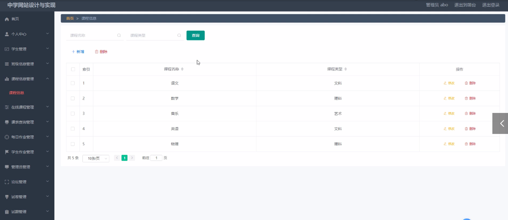
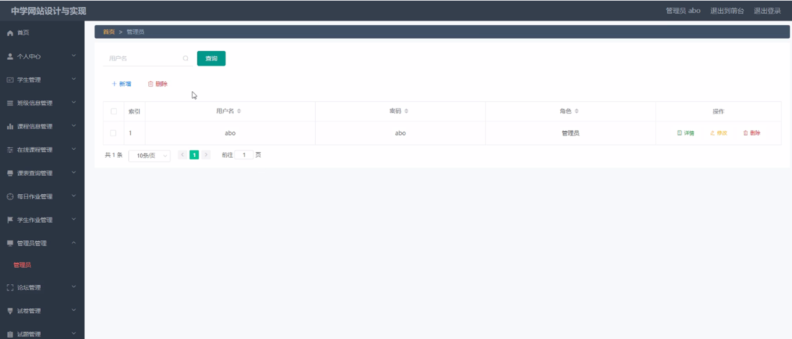

ssm+Vue计算机毕业设计中学网站（程序+LW文档）

**项目运行**

**环境配置：**

**Jdk1.8 + Tomcat7.0 + Mysql + HBuilderX** **（Webstorm也行）+ Eclispe（IntelliJ
IDEA,Eclispe,MyEclispe,Sts都支持）。**

**项目技术：**

**SSM + mybatis + Maven + Vue** **等等组成，B/S模式 + Maven管理等等。**

**环境需要**

**1.** **运行环境：最好是java jdk 1.8，我们在这个平台上运行的。其他版本理论上也可以。**

**2.IDE** **环境：IDEA，Eclipse,Myeclipse都可以。推荐IDEA;**

**3.tomcat** **环境：Tomcat 7.x,8.x,9.x版本均可**

**4.** **硬件环境：windows 7/8/10 1G内存以上；或者 Mac OS；**

**5.** **是否Maven项目: 否；查看源码目录中是否包含pom.xml；若包含，则为maven项目，否则为非maven项目**

**6.** **数据库：MySql 5.7/8.0等版本均可；**

**毕设帮助，指导，本源码分享，调试部署** **(** **见文末** **)**

### 系统体系结构

中学网站设计与实现的结构图4-1所示：

图4-1 系统结构

模块包括主界面，首页、个人中心、学生管理、班级信息管理、课程信息管理、在线课程管理、课表查询管理、每日作业管理、学生作业管理、管理员管理、论坛管理、试卷管理、试题管理、系统管理、考试管理等进行相应的操作。

登录系统结构图，如图4-2所示：

图4-2 登录结构图

这些功能可以充分满足中学网站设计与实现的需求。此系统功能较为全面如下图系统功能结构如图4-3所示。

图4-3系统功能结构图

### 4.2 数据库设计原则

每个数据库的应用它们都是和区分开的，当运行到一定的程序当中，它就会与自己相关的协议与客户端进行通讯。那么这个系统就会对使这些数据进行连接。当我们选择哪个桥段的时候，接下来就会简单的叙述这个数据库是如何来创建的。当点击完成按钮的时候就会自动在对话框内弹出数据源的名称，在进行点击下一步即可，直接在输入相对应的身份验证和登录密码。

中学网站设计与实现的数据流程：

图4-4 系统数据流程图

在线课程信息实体E-R图，如图4.5所示。

图4.5在线课程信息E-R图

学生信息E-R图，如图4.6所示。

图4.6学生信息E-R图

### 管理员功能模块

管理员通过用户名和密码、角色填写完成后进行登录，如图5-1所示。管理员登录成功后进入到系统操作界面，可以对首页、个人中心、学生管理、班级信息管理、课程信息管理、在线课程管理、课表查询管理、每日作业管理、学生作业管理、管理员管理、

论坛管理、试卷管理、试题管理、系统管理、考试管理等功能模块进行相对应操作。

学生管理：通过列表可以获取学号、密码、姓名、性别、年级、班级、手机、邮箱、照片等内容，可以进行修改或删除操作，如图5-2所示。

图5-1管理员登录页面

图5-2学生管理页面

班级信息管理：通过列表可以获取班级名称、班级人数、班主任、联系电话

等信息，进行删除或修改操作，如图5-3所示。

图5-3班级信息管理界面图

课程信息管理：通过列表可以获取课程名称、课程类型等信息，进行修改或删除操作，如图5-4所示。

图5-4课程信息管理界面图

在线课程管理：通过列表可以获取标题、课程、年级、时长、封面、视频、简介等信息，进行修改或删除操作，如图5-5所示。

图5-5在线课程管理界面图

轮播图；该页面为轮播图管理界面。管理员可以在此页面进行首页轮播图的管理，通过新建操作可在轮播图中加入新的图片，还可以对以上传的图片进行修改操作，以及图片的删除操作，如图5-6所示。

图5-6轮播图管理界面图

每日作业管理：管理员通过列表可以获取标题、年级、班级、封面、作业、日期等信息，进行修改或删除操作，如图5-7所示。

图5-7每日作业管理界面图

管理员管理：管理员通过列表可以获取用户名、密码、角色等信息，进行修改或删除操作，如图5-8所示。

图5-8管理员管理界面图

试卷管理：管理员通过列表可以获取试卷名称、考试时长（分钟）、试卷状态等信息，进行修改或删除操作，如图5-9所示。

图5-9试卷管理界面图

试题管理：管理员通过列表可以获取试卷、试题名称、分值、答案、类型等信息，进行修改或删除操作，如图5-10所示。

图5-10试题管理界面图

考试记录：管理员通过列表可以获取用户ID、试卷、考试得分等信息，进行修改或删除操作，如图5-11所示。

图5-11考试记录界面图

### 5.2学生前台功能模块

中学网站设计与实现，在系统首页可以查看首页、在线课程、课表查询、每日作业、论坛、试卷列表、登录、后台管理等内容，如图5-12所示。

图5-12前台首页功能界面图

**JAVA** **毕设帮助，指导，源码分享，调试部署**

