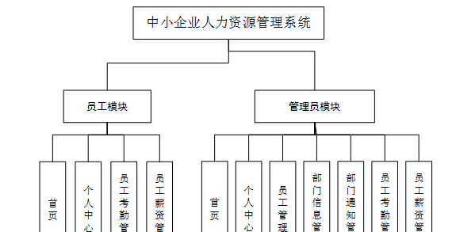
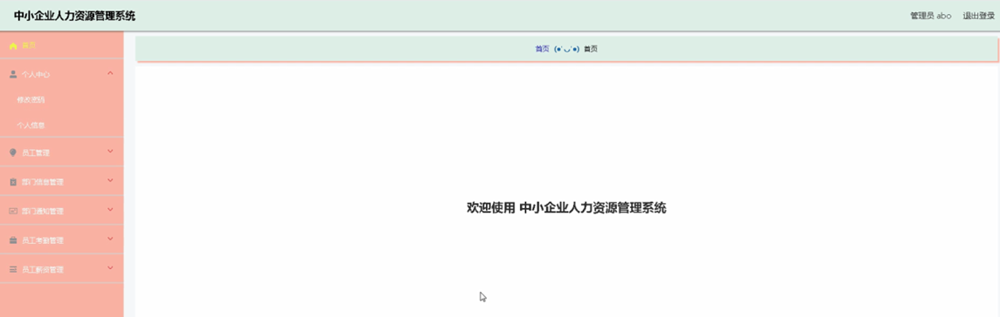
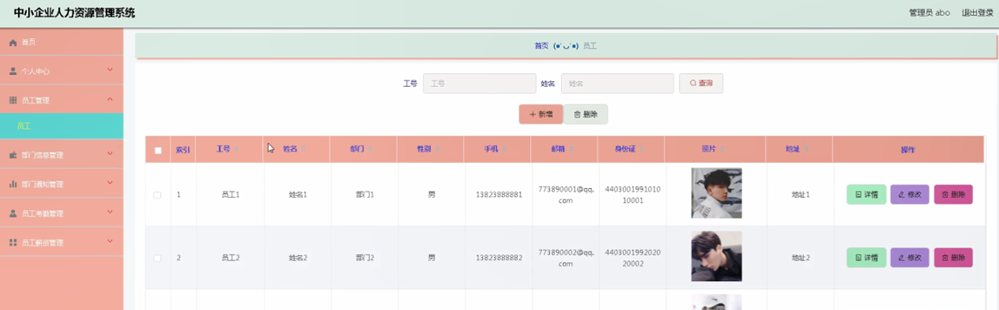
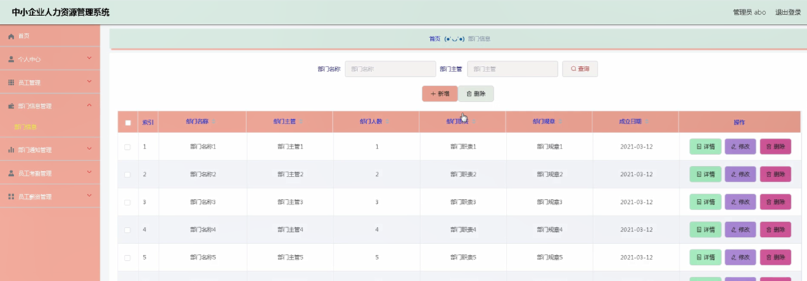
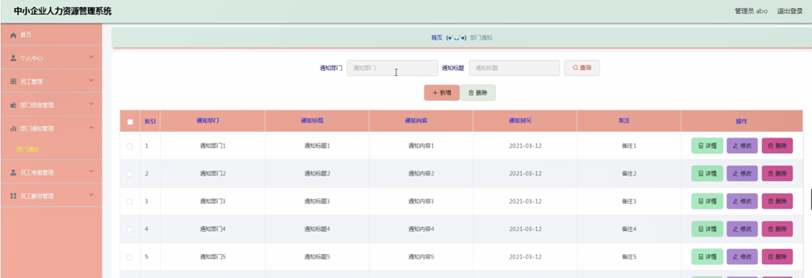
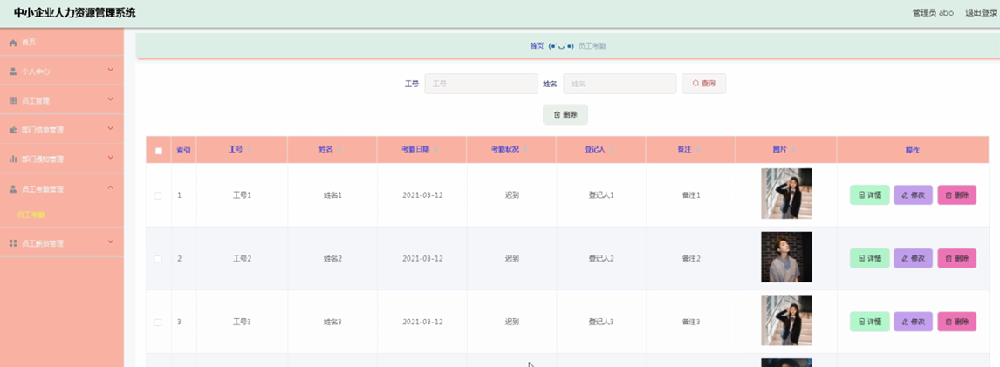
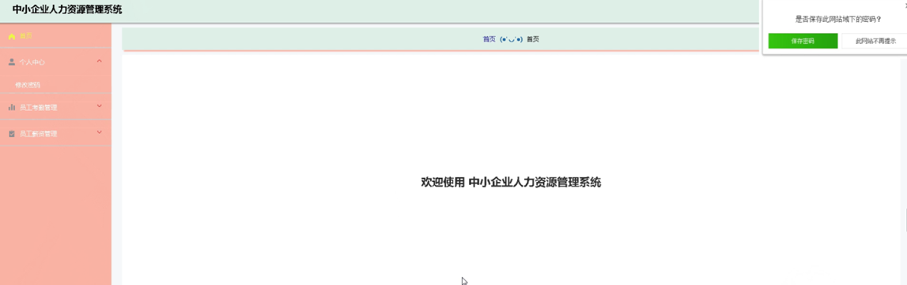
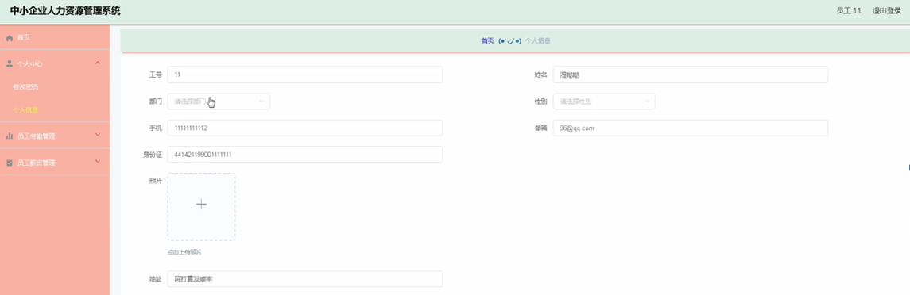
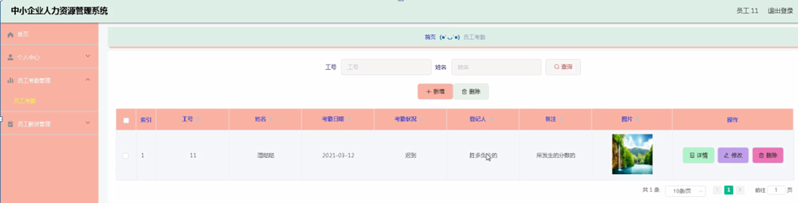
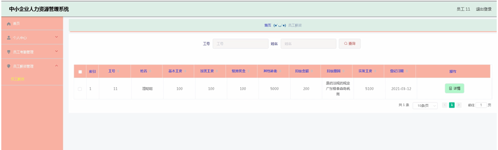

ssm+Vue计算机毕业设计中小企业人力资源管理系统（程序+LW文档）

**项目运行**

**环境配置：**

**Jdk1.8 + Tomcat7.0 + Mysql + HBuilderX** **（Webstorm也行）+ Eclispe（IntelliJ
IDEA,Eclispe,MyEclispe,Sts都支持）。**

**项目技术：**

**SSM + mybatis + Maven + Vue** **等等组成，B/S模式 + Maven管理等等。**

**环境需要**

**1.** **运行环境：最好是java jdk 1.8，我们在这个平台上运行的。其他版本理论上也可以。**

**2.IDE** **环境：IDEA，Eclipse,Myeclipse都可以。推荐IDEA;**

**3.tomcat** **环境：Tomcat 7.x,8.x,9.x版本均可**

**4.** **硬件环境：windows 7/8/10 1G内存以上；或者 Mac OS；**

**5.** **是否Maven项目: 否；查看源码目录中是否包含pom.xml；若包含，则为maven项目，否则为非maven项目**

**6.** **数据库：MySql 5.7/8.0等版本均可；**

**毕设帮助，指导，本源码分享，调试部署** **(** **见文末** **)**

### 系统的功能结构图

经过系统需求分析，该中小企业人力资源管理系统的设计与实现功能结构图如图4-1所示：

图4-1 系统功能结构图

### 4.2 数据库概念结构设计

####  4.2.1 数据库E-R图

概念设计主要是通过数据库的概念结构和模式进行建立数据库嗯逻辑结构，然后利用数据库的DBMS进行完成，它不需要计算机系统的支持。通过系统的整体来看，主要是对数据库进行管理、整理、更新等操作。数据库的功能是非常强大的，每个系统的开发肯定离不开数据库，通过数据库可以看得出整个系统的质量和效率，根据以上的系统分析，对系统中的主要实体进行规划。以下是几个关键实体的实体关系图：

(1) 部门信息管理实体E-R图如图4-2所示：

图4-2部门信息管理实体属性图

管理员功能模块

管理员登录，通过填写注册时输入的用户名、密码、选择角色进行登录，如图5-1所示。

图5-1管理员登录界面图

管理员登录进入系统可以查看首页、个人中心、员工管理、部门信息管理、部门通知管理、员工考勤管理、员工薪资管理等信息进行详细操作，如图5-2所示。

图5-2管理员功能界面图

员工管理，在员工管理页面中可以对索引、工号、姓名、部门、性别、手机、邮箱、身份证、照片、地址等信息进行详情，修改或删除等操作，如图5-3所示。

图5-3员工管理界面图

部门信息管理，在部门信息管理页面中可以对索引、部门名称、部门主管、部门人数、部门职责、部门规章、成立日期等信息进行详情，修改或删除等操作，如图5-4所示。

图5-4部门信息管理界面图

部门通知管理，在部门通知管理页面中可以对索引、通知部门、通知标题、通知内容、通知时间、备注等信息进行详情、修改或删除等操作，如图5-5所示。

图5-5部门通知管理界面图

员工考勤管理，在员工考勤管理页面中可以对索引、工号、姓名、考勤日期、考勤状况、登记人、备注、图片等信息进行详情，修改或删除等操作，如图5-6所示。

图5-6员工考勤管理界面图

员工薪资管理，在员工薪资管理页面中可以对索引、工号、姓名、基本工资、加班工资、绩效资金、其他补助、扣款金额、扣款原因、实发工资、登记日期等信息进行详情，修改或删除等操作，如图5-7所示。

图5-7员工薪资管理界面图

5.2员工功能模块

员工登录进入系统可以查看首页、个人中心、员工考勤管理、员工薪资管理等内容进行详细操作，如图5-8所示。

图5-8员工功能界面图

个人中心，在个人中心页面通过填写工号、姓名、部门、性别、手机、邮箱、身份证、照片、地址等内容进行个人信息修改操作，如图5-9所示。

图5-9个人中心界面图

员工考勤管理，在员工考勤管理页面中可以对索引、工号、姓名、考勤日期、考勤状况、登记人、备注、图片等信息进行详情，修改或删除等操作，如图5-10所示。

图5-10员工考勤管理界面图

员工薪资管理，在员工薪资管理页面中可以查看索引、工号、姓名、基本工资、加班工资、绩效资金、其他补助、扣款金额、扣款原因、实发工资、登记日期等信息内容；如图5-11所示。

图5-11员工薪资管理界面图

**JAVA** **毕设帮助，指导，源码分享，调试部署**

