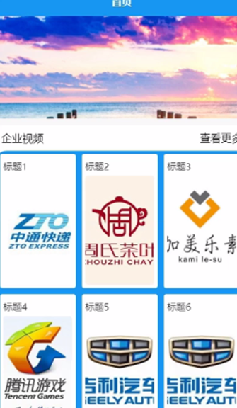

ssm+Vue计算机毕业设计中小型企业工作日志管理系统APP（程序+LW文档）

**项目运行**

**环境配置：**

**Jdk1.8 + Tomcat7.0 + Mysql + HBuilderX** **（Webstorm也行）+ Eclispe（IntelliJ
IDEA,Eclispe,MyEclispe,Sts都支持）。**

**项目技术：**

**SSM + mybatis + Maven + Vue** **等等组成，B/S模式 + Maven管理等等。**

**环境需要**

**1.** **运行环境：最好是java jdk 1.8，我们在这个平台上运行的。其他版本理论上也可以。**

**2.IDE** **环境：IDEA，Eclipse,Myeclipse都可以。推荐IDEA;**

**3.tomcat** **环境：Tomcat 7.x,8.x,9.x版本均可**

**4.** **硬件环境：windows 7/8/10 1G内存以上；或者 Mac OS；**

**5.** **是否Maven项目: 否；查看源码目录中是否包含pom.xml；若包含，则为maven项目，否则为非maven项目**

**6.** **数据库：MySql 5.7/8.0等版本均可；**

**毕设帮助，指导，本源码分享，调试部署** **(** **见文末** **)**

### 软件功能模块设计

网站整功能如下图所示：

图 4-1 企业工作日志总体功能模块图

### 4.2 数据库设计与实现

在每一个系统中数据库有着非常重要的作用，数据库的设计得好将会增加系统的效率以及系统各逻辑功能的实现。所以数据库的设计我们要从系统的实际需要出发，才能使其更为完美的符合系统功能的实现。

#### 4.2.1 概念模型设计

概念模型是对现实中的问题出现的事物的进行描述，ER图是由实体及其关系构成的图，通过E-R图可以清楚地描述系统涉及到的实体之间的相互关系。

员工信息实体图如图4-2所示：

图4-2员工信息实体图

员工日报信息实体图如图4-3所示：

图4-3员工日报信息实体图

员工周报信息实体图如图4-4所示：

图4-4员工周报信息实体图

### （管理员）后端功能模块

管理员登录，管理员通过登录页面输入用户名、密码，选择角色并点击登录进行系统登录操作，如图5-1所示。

图5-1管理员登录界面图

管理员登录系统后，可以对首页、个人中心、员工管理、员工日报管理、员工周报管理、企业视频管理、企业语音管理、系统管理等功能进行相应操作，如图5-2所示。

图5-2管理员功能界图面

个人中心，在个人中心页面可以修改密码、个人信息修改操作，如图5-3所示。

图5-3个人中心界面图

员工管理，在员工管理页面可以对员工工号、员工姓名、部门、性别、联系电话、职务、头像等内容进行详情、修改、删除等操作，如图5-4所示。

图5-4员工管理界面图

员工日报管理，在员工日报管理页面可以对报告标题、时间、封面、报告类型、员工工号、员工姓名、部门、职务、审核回复、审核状态、审核等内容进行详情、修改、删除等操作，如图5-5所示。

图5-5员工日报管理界面图

员工周报管理，在员工周报管理页面可以对报告标题、周数、封面、报告类型、员工工号、员工姓名、部门、职务、提交时间、审核回复、审核状态、审核等内容进行详情、修改、删除等操作，如图5-6所示。

图5-6员工周报管理界面图

企业视频管理，在企业视频管理页面可以对标题、封面、发布时间、视频等内容进行详情、修改、删除等操作，如图5-7所示。

图5-7企业视频管理界面图

企业语音管理，在企业语音管理页面可以对标题、封面、发布时间、语言等内容进行详情、修改、删除等操作，如图5-8所示。

图5-8企业语音管理界面图

### 5.2（员工）前端功能模块

员工注册，在注册页面填写员工工号、员工姓名、密码、部门、性别、联系电话、职务等详细信息进行注册，如图5-9所示。

图5-9员工注册界面图

员工登录，员工在登录页面通过填写账号、密码信息完成登录，如图5-10所示。

图5-10员工登录界面图

员工登录到APP前端后，可以对首页、企业视频、企业语音、我的等功能进行相应操作，如图5-11所示。

图5-11员工APP功能界面图

我的，在我的页面查看员工日报、员工周报等信息，进行详细操作，如图5-12所示。

图5-12我的界面图

#### **JAVA** **毕设帮助，指导，源码分享，调试部署**

