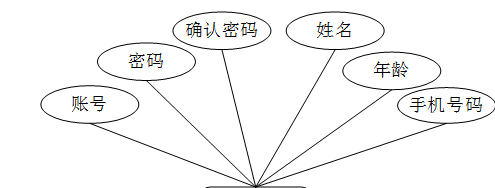

ssm+Vue计算机毕业设计中小型医院综合管理系统（程序+LW文档）

**项目运行**

**环境配置：**

**Jdk1.8 + Tomcat7.0 + Mysql + HBuilderX** **（Webstorm也行）+ Eclispe（IntelliJ
IDEA,Eclispe,MyEclispe,Sts都支持）。**

**项目技术：**

**SSM + mybatis + Maven + Vue** **等等组成，B/S模式 + Maven管理等等。**

**环境需要**

**1.** **运行环境：最好是java jdk 1.8，我们在这个平台上运行的。其他版本理论上也可以。**

**2.IDE** **环境：IDEA，Eclipse,Myeclipse都可以。推荐IDEA;**

**3.tomcat** **环境：Tomcat 7.x,8.x,9.x版本均可**

**4.** **硬件环境：windows 7/8/10 1G内存以上；或者 Mac OS；**

**5.** **是否Maven项目: 否；查看源码目录中是否包含pom.xml；若包含，则为maven项目，否则为非maven项目**

**6.** **数据库：MySql 5.7/8.0等版本均可；**

**毕设帮助，指导，本源码分享，调试部署** **(** **见文末** **)**

### 系统设计主要功能

通过市场调研及咨询研究，了解了使用者及管理者的使用需求，于是制定了管理员、医生和病人等模块。其功能结构图如下图4-1所示：

图4-1系统功能结构图

### 4.2 数据库设计

#### 4.2.1 数据库设计规范

数据可设计要遵循职责分离原则，即在设计时应该要考虑系统独立性，即每个系统之间互不干预不能混乱数据表和系统关系。

数据库命名也要遵循一定规范，否则容易混淆，数据库字段名要尽量做到与表名类似，多使用小写英文字母和下划线来命名并尽量使用简单单词。

#### 4.2.2 E-R图

病人注册E-R图，如图4-2所示：

图4-2 病人注册E-R图

病历信息E-R图，如图4-3所示：

图4-3病历信息E-R图

值班信息E-R图如图4-4所示。

图4-4值班信息E-R图

### 登录注册

系统登录，管理员、医生和病人通过填写注册时输入的用户名、密码、选择角色等信息进行登录操作，如图5-1所示。

图5-1系统登录界面图

病人注册，在中小型医院综合管理系统注册页面通过填写账号、 密码、确认密码、姓名、年龄、手机号码等内容进行注册操作，如图5-2所示。

图5-2病人注册界面图

### 5.2管理员功能模块

管理员登录进入中小型医院综合管理系统可以查看首页、个人中心、病人管理、医生管理、病床信息管理、入住信息管理、病历信息管理、处方信息管理、值班信息管理、收费信息管理、费用类型管理、出院信息管理等功能进行详细操作，如图5-3所示。

图5-3管理员功能界面图

病人管理；在病人管理页面中可以对索引、账号、姓名、性别、 年龄、手机号码、照片等内容进行详情、修改或删除等操作；如图5-4所示。

图5-4病人管理界面图

医生管理；在医生管理页面中可以对索引、工号、医生姓名、性别、邮箱、联系手机、职称、照片等内容进行详情、值班、修改或删除等操作；如图5-5所示。

图5-5医生管理界面图

病床信息管理；在病床信息管理页面中可以对索引、病床名称、病床图片、病床位置、状态等内容进行详情、修改或删除等操作；如图5-6所示。

图5-6病床信息管理界面图

病历信息管理；在病历信息管理页面中可以对索引、病例编号、账号、姓名、性别、年龄、过敏信息、登记日期等内容进行详情或删除等操作；如图5-7所示。

图5-7病历信息管理界面图

处方信息管理；在处方信息管理页面中可以对索引、病例编号、账号、姓名、性别、年龄、过敏信息、处方名称、发布日期、工号、医生姓名、职称等内容进行详情或删除等操作；如图5-8所示。

图5-8处方信息管理界面图

值班信息管理；在值班信息管理页面中可以对索引、值班名称、
工号、医生姓名、联系手机、职称、开始值班、结束时间等内容进行详情、修改或删除等操作；如图5-9所示。

图5-9值班信息管理界面图

收费信息管理；在收费信息管理页面中可以查看索引、费用名称、费用类型、费用金额、账号、姓名、发送日期、工号、医生姓名、职称、是否支付等内容进行详情或删除等操作；如图5-10所示。

图5-10收费信息管理界面图

费用类型管理；在费用类型管理页面中可以查看索引、费用类型等内容进行详情、修改或删除等操作；如图5-11所示。

图5-11费用类型管理界面图

### 5.3病人功能模块

病人登录进入中小型医院综合管理系统可以查看首页、个人中心、入住信息管理、病历信息管理、处方信息管理、值班信息管理、收费信息管理、出院信息管理等功能，并进行详细操作，如图5-12所示。

图5-12病人功能界面图

#### **JAVA** **毕设帮助，指导，源码分享，调试部署**

