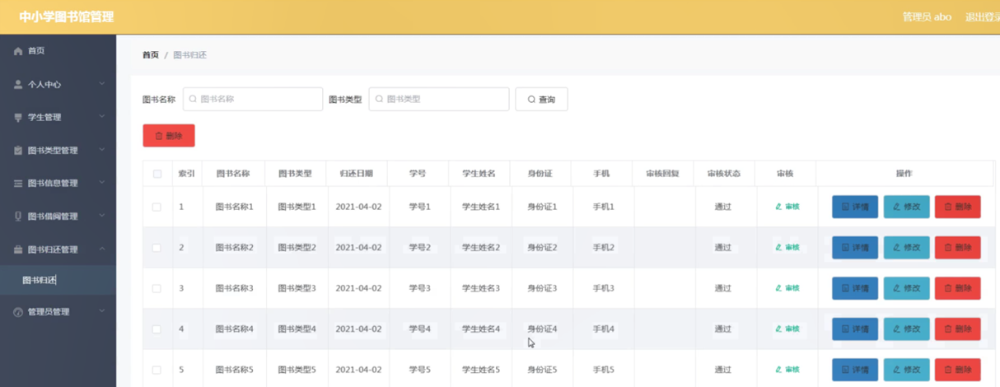

ssm+Vue计算机毕业设计中小学图书馆管理（程序+LW文档）

**项目运行**

**环境配置：**

**Jdk1.8 + Tomcat7.0 + Mysql + HBuilderX** **（Webstorm也行）+ Eclispe（IntelliJ
IDEA,Eclispe,MyEclispe,Sts都支持）。**

**项目技术：**

**SSM + mybatis + Maven + Vue** **等等组成，B/S模式 + Maven管理等等。**

**环境需要**

**1.** **运行环境：最好是java jdk 1.8，我们在这个平台上运行的。其他版本理论上也可以。**

**2.IDE** **环境：IDEA，Eclipse,Myeclipse都可以。推荐IDEA;**

**3.tomcat** **环境：Tomcat 7.x,8.x,9.x版本均可**

**4.** **硬件环境：windows 7/8/10 1G内存以上；或者 Mac OS；**

**5.** **是否Maven项目: 否；查看源码目录中是否包含pom.xml；若包含，则为maven项目，否则为非maven项目**

**6.** **数据库：MySql 5.7/8.0等版本均可；**

**毕设帮助，指导，本源码分享，调试部署** **(** **见文末** **)**

### 系统结构

系统架构图属于系统设计阶段，系统架构图只是这个阶段一个产物，系统的总体架构决定了整个系统的模式，是系统的基础。中小学图书馆管理系统的整体结构设计如图4-2所示。

图4-2 系统结构图

### 4.3. 数据库设计

4.3.1 数据库实体

管理员信息结构图，如图4-3所示：

图4-3 管理员信息实体结构图

图书信息管理实体属性图，如图4-4所示：

图4-4图书信息管理实体属性图

图书借阅管理实体属性图，如图4-5所示：

图4-5图书借阅管理实体属性图

### 登录注册

登录，用户通过输入账号，密码，选择角色等信息即可进行系统登录，如图5-1所示。

图5-1管理员登录界面图

学生注册，在学生注册页面通过填写学号、密码、学生姓名、身份证、手机等信息进行学生修改，如图5-2所示。

图5-2学生注册界面图

### 5.2管理员功能模块

管理员登录进入中小学图书馆管理系统设计可以查看首页、个人中心、学生管理、图书类型管理、图书信息管理、图书借阅管理、图书归还管理、管理员管理等内容进行详细操作，如图5-3所示。

图5-3管理员功能界面图

学生管理，在学生管理页面可以查看索引、学号、学生姓名、头像、性别、身份证、手机等信息，并可根据需要进行删除操作，如图5-4所示。

图5-4学生管理界面图

图书类型管理，在图书类型管理页面可以查看索引、图书类型等内容，并可根据需要进行删除，修改等操作，如图5-5所示。

图5-5图书类型管理界面图

图书信息管理，在图书信息管理页面可以查看索引、图书编号、图书名称、图书类型、图片、简述、作者、出版社等信息，并可根据需要进行详情，修改或删除等操作，如图5-6所示。

图5-6图书信息管理界面图

图书借阅管理，在图书借阅管理页面可以查看索引、图书名称、图书类型、借阅日期、借阅天数、备注、学号、学生姓名、身份证、手机、审核回复、审核状态、审核等信息，并可根据需要进行详情、修改或删除等操作，如图5-7所示。

图5-7图书借阅管理界面图

图书归还管理，在图书归还管理页面可以查看索引、图书名称、图书类型、归还日期、学号、学生姓名、身份证、手机、审核回复、审核状态、审核等信息，并可根据需要进行详情、修改或删除操作，如图5-
8所示。

图5-8图书归还管理界面图

管理员管理，在管理员管理页面可以查看索引、用户名、密码、角色等信息，并可根据需要进行详情、修改或删除操作，如图5- 9所示。

图5-9管理员管理界面图

### 5.3学生功能模块

学生登录进入中小学图书馆管理系统可以查看首页、个人中心、图书信息管理、图书借阅管理、图书归还管理等内容进行详细操作，如图5-10所示。

图5-10学生功能界面图

个人中心，在个人中心页面可以查看学号、学生姓名、头像、性别、身份证、手机等内容，并可根据需要对个人信息进行修改，如图5-11所示。

图5-11个人中心界面图

图书信息管理，在图书信息管理页面可以查看索引、图书编号、图书名称、图书类型、图片、简述、作者、出版社等信息，根据需要进行详情或借阅等操作，如图5-12所示。

图5-12图书信息管理界面图

**JAVA** **毕设帮助，指导，源码分享，调试部署**

