ssm+Vue计算机毕业设计中小学在线作业管理小程序（程序+LW文档）

**项目运行**

**环境配置：**

**Jdk1.8 + Tomcat7.0 + Mysql + HBuilderX** **（Webstorm也行）+ Eclispe（IntelliJ
IDEA,Eclispe,MyEclispe,Sts都支持）。**

**项目技术：**

**SSM + mybatis + Maven + Vue** **等等组成，B/S模式 + Maven管理等等。**

**环境需要**

**1.** **运行环境：最好是java jdk 1.8，我们在这个平台上运行的。其他版本理论上也可以。**

**2.IDE** **环境：IDEA，Eclipse,Myeclipse都可以。推荐IDEA;**

**3.tomcat** **环境：Tomcat 7.x,8.x,9.x版本均可**

**4.** **硬件环境：windows 7/8/10 1G内存以上；或者 Mac OS；**

**5.** **是否Maven项目: 否；查看源码目录中是否包含pom.xml；若包含，则为maven项目，否则为非maven项目**

**6.** **数据库：MySql 5.7/8.0等版本均可；**

**毕设帮助，指导，本源码分享，调试部署** **(** **见文末** **)**

### 系统结构

本系统架构网站系统，本系统的具体功能如下：

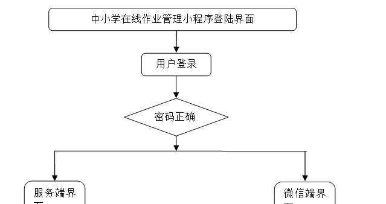

图4-2系统功能结构图

系统功能结构图，如图4-3所示：

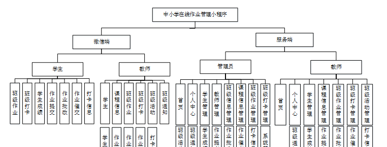

图4-3 系统功能结构图

### 4.3. 数据库设计

#### 4.3.1 数据库实体

管理员信息结构图，如图4-4所示：

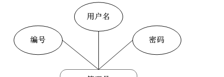

图4-4 管理员信息实体结构图

课程信息管理实体属性图，如图4-5所示：

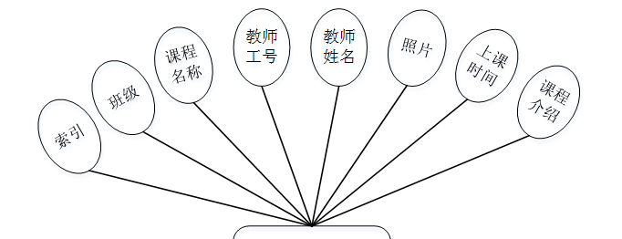

图4-5课程信息管理实体属性图

学生信息实体属性图，如图4-6所示：

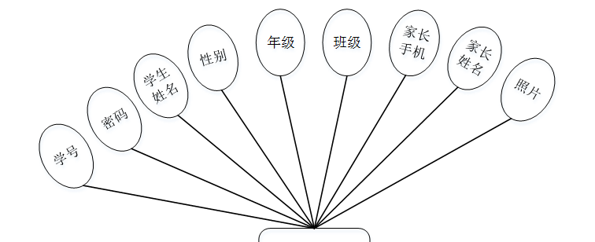

图4-6学生信息实体属性图

### 微信端

用户登录，用户通过输入用户名和密码，选择角色并点击登录进行系统登录操作，如图5-1所示。

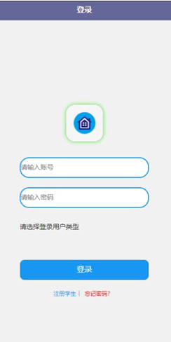

图5-1用户登录界面图

注册，在注册页面通过填写学号、密码、学生姓名、性别、年级、班级、家长手机、家长姓名等信息进行注册操作，如图5-2所示。

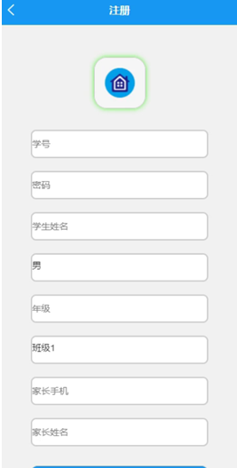

图5-2注册界面图

用户登陆系统后，可以对首页、课程信息、班级活动、班级通知、我的等功能模块进行操作，如图5-3所示。

图5-3系统首页界面图

课程信息，在课程信息页面可以查看课程名称、班级、教师工号、教师姓名、上课时间、课程介绍等信息，如图5-4所示。

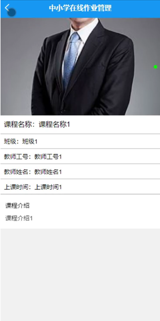

图5-4课程信息界面图

班级活动，在班级活动页面可以查看活动标题、班级、教师工号、教师姓名、开始时间、结束时间、活动内容等信息，如图5-5所示。

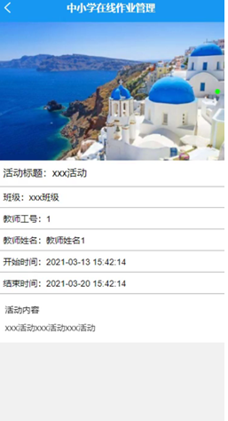

图5-5班级活动界面图

班级通知，在班级通知页面可以查看通知标题、教师工号、教师姓名、班级、通知内容等信息，如图5-6所示。

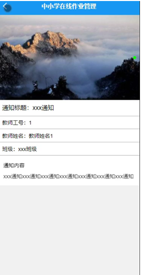

图5-6班级通知界面图

教师，在我的页面可以对学生、课程信息、班级作业、班级打卡、班级活动、班级通知、学生成绩、作业提交、作业批改、作业催交、打卡信息等详细信息进行操作，如图5-7所示。

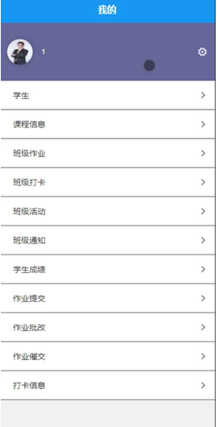

图5-7教师界面图

学生成绩，在学生成绩页面可以填写学号、学生姓名、照片、班级、平时成绩、中期成绩、期末成绩、教师工号、教师姓名、教师评语等信息并提交，如图5-8所示。

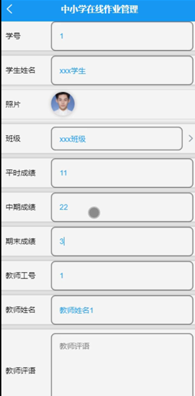

图5-8学生成绩界面图

学生，在我的页面可以对班级作业、班级打卡、学生成绩、作业提交、作业批改、作业催交、打卡信息等详细信息进行操作，如图5-9所示。

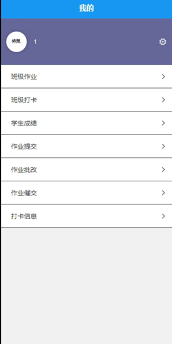

图5-9学生界面图

学生信息，在用户信息页面通过填写学号、密码、学生姓名、性别、年级、班级、家长手机、家长姓名、照片等信息进行保存，如图5-10所示。

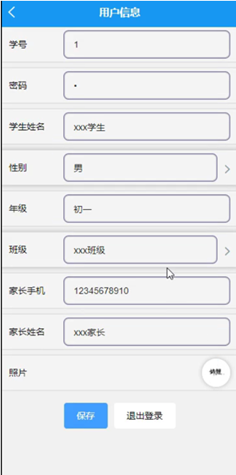

图5-10学生信息界面图

### 5.2管理员功能模块（服务端）

管理员登录，管理员通过输入账号和密码，选择角色并点击登录进行系统登录操作，如图5-11所示。

图5-11管理员登录界图面

管理员登陆系统后，可以对首页、个人中心、学生管理、教师管理、班级信息管理、课程信息管理、班级作业管理、班级打卡管理、班级活动管理、班级通知管理、学生成绩管理、作业提交管理、作业批改管理、作业催交管理、打卡信息管理、系统管理等功能模块进行相应操作，如图5-12所示。

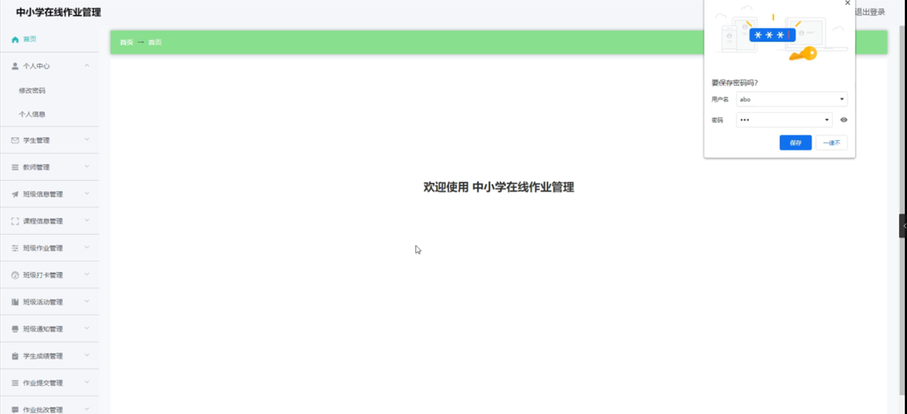

图5-12管理员功能界图面

**JAVA** **毕设帮助，指导，源码分享，调试部署**

