ssm+Vue计算机毕业设计中小学在线考试系统（程序+LW文档）

**项目运行**

**环境配置：**

**Jdk1.8 + Tomcat7.0 + Mysql + HBuilderX** **（Webstorm也行）+ Eclispe（IntelliJ
IDEA,Eclispe,MyEclispe,Sts都支持）。**

**项目技术：**

**SSM + mybatis + Maven + Vue** **等等组成，B/S模式 + Maven管理等等。**

**环境需要**

**1.** **运行环境：最好是java jdk 1.8，我们在这个平台上运行的。其他版本理论上也可以。**

**2.IDE** **环境：IDEA，Eclipse,Myeclipse都可以。推荐IDEA;**

**3.tomcat** **环境：Tomcat 7.x,8.x,9.x版本均可**

**4.** **硬件环境：windows 7/8/10 1G内存以上；或者 Mac OS；**

**5.** **是否Maven项目: 否；查看源码目录中是否包含pom.xml；若包含，则为maven项目，否则为非maven项目**

**6.** **数据库：MySql 5.7/8.0等版本均可；**

**毕设帮助，指导，本源码分享，调试部署** **(** **见文末** **)**

### 系统设计主要功能

通过市场调研及咨询研究，了解了使用者及管理者的使用需求，于是制定了管理员，学生和教师等模块。其功能结构图如下图4-1所示：

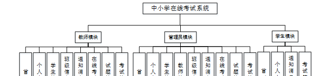

图4-1系统功能结构图

### 4.2数据库设计

#### 4.2.1数据库设计规范

数据可设计要遵循职责分离原则，即在设计时应该要考虑系统独立性，即每个系统之间互不干预不能混乱数据表和系统关系。

数据库命名也要遵循一定规范，否则容易混淆，数据库字段名要尽量做到与表名类似，多使用小写英文字母和下划线来命名并尽量使用简单单词。

#### 4.2.2 E-R图

学生注册E-R图，如图4-2所示：

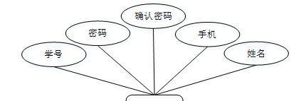

图4-2 学生注册E-R图

班级信息E-R图，如图4-3所示：

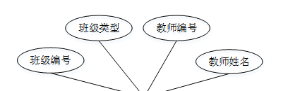

图4-3班级信息E-R图

系统登录，用户通过填写注册时输入的用户名、密码、选择角色等信息进行登录操作，如图5-1所示。

图5-1系统登录界面图

### 5.1管理员功能模块

管理员登录进入中小学在线考试系统可以查看首页，个人中心，学生管理，教师管理，班级信息管理，通知消息管理，在线考试管理，试题管理，考试管理等功能进行详细操作，如图5-2所示。

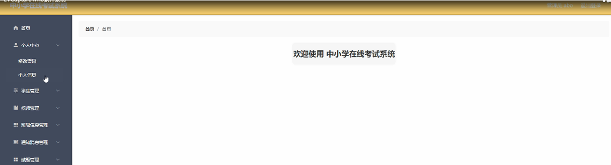

图5-2管理员功能界面图

学生管理；在学生管理页面中可以对索引，学号，姓名，性别，手机，班级等内容进行详情，修改和删除等操作；如图5-3所示。

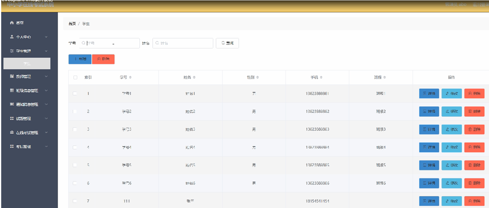

图5-3学生管理界面图

教师管理；在教师管理页面中可以对索引，教师编号，教师姓名，性别，联系电话，职务等内容进行详情，修改和删除等操作；如图5-4所示。

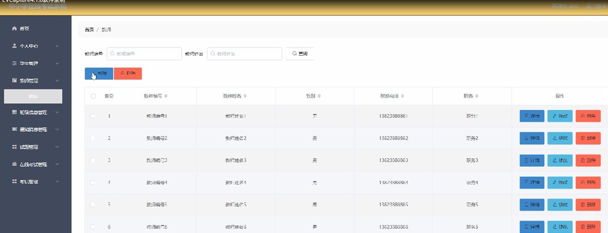

图5-4教师管理界面图

班级信息管理；在班级信息管理页面中可以对索引，班级编号，班级类型，教师编号，教师姓名等内容进行详情和删除操作；如图5-5所示。

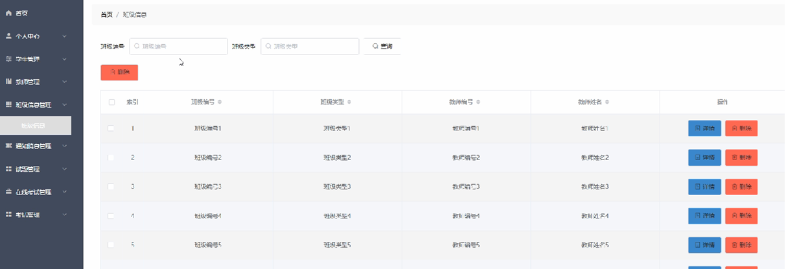

图5-5班级信息管理界面图

通知消息管理；在通知消息管理页面中可以对索引，标题，通知时间，学号，教师编号，教师姓名等内容进行详情操作；如图5-6所示。

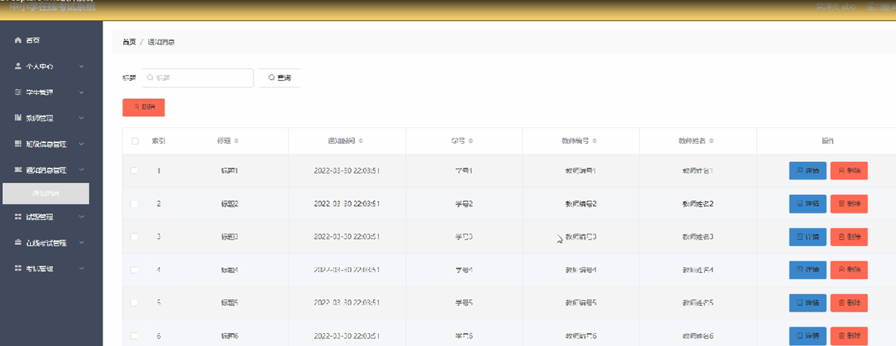

图5-6通知消息管理界面图

试题管理；在试题管理页面中可以对在线考试，试题名称，分值，答案，类型等内容进行修改操作；如图5-7所示。

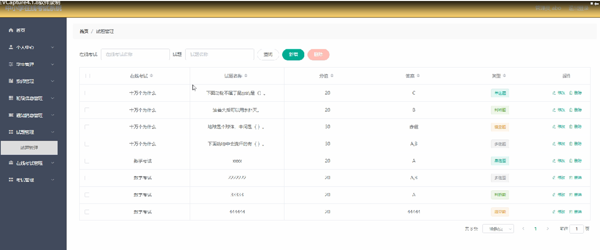

图5-7试题管理界面图

考试管理；在错题本页面中可以对姓名，在线考试，试题名称，分值，正确答案，考生答案，试题分析，考试时间等内容进行详情和删除操作；如图5-8所示。

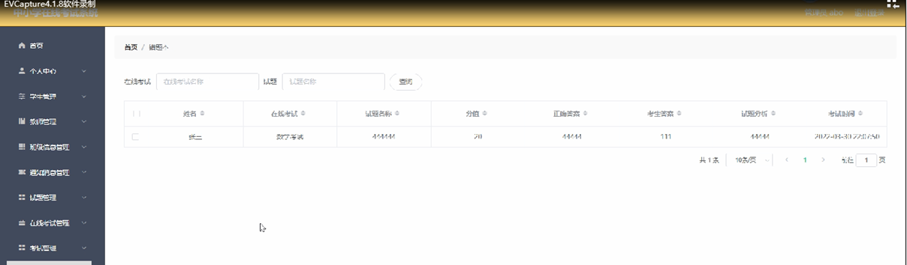

图5-8考试管理界面图

### 5.2学生功能模块

学生登录进入中小学在线考试系统可以查看首页，个人中心，通知消息管理，考试管理等功能，并进行详细操作，如图5-9所示。

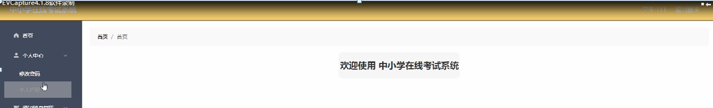

图5-9学生功能界面图

通知消息管理；在通知消息管理页面中可以查看索引，标题，通知时间，学号，教师编号，教师姓名等详细内容；如图5-10所示。

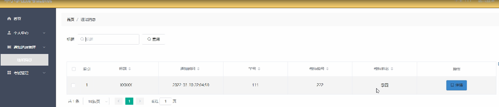

图5-10通知消息管理界面图

考试管理；在在线考试列表页面中可以查看在线考试，考试时长等详细内容；并进行考试操作；如图5-11所示。

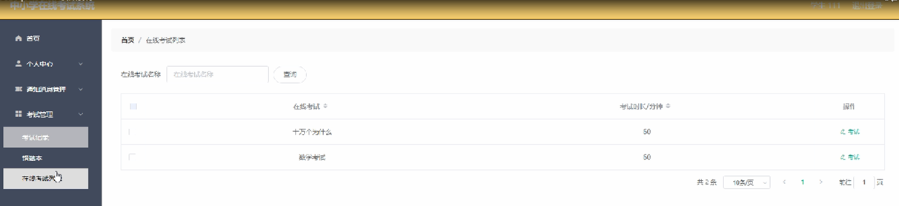

图5-11考试管理界面图

### 5.3教师功能模块

教师登录进入中小学在线考试系统可以查看首页，个人中心，学生管理，班级信息管理，通知消息管理，在线考试管理，试题管理，考试管理等功能，并进行详细操作，如图5-12所示。

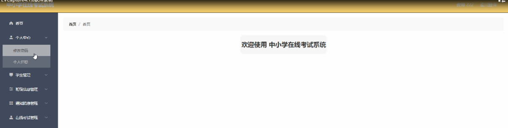

图5-12教师功能界面图

#### **JAVA** **毕设帮助，指导，源码分享，调试部署**

