ssm+Vue计算机毕业设计中草药管理系统（程序+LW文档）

**项目运行**

**环境配置：**

**Jdk1.8 + Tomcat7.0 + Mysql + HBuilderX** **（Webstorm也行）+ Eclispe（IntelliJ
IDEA,Eclispe,MyEclispe,Sts都支持）。**

**项目技术：**

**SSM + mybatis + Maven + Vue** **等等组成，B/S模式 + Maven管理等等。**

**环境需要**

**1.** **运行环境：最好是java jdk 1.8，我们在这个平台上运行的。其他版本理论上也可以。**

**2.IDE** **环境：IDEA，Eclipse,Myeclipse都可以。推荐IDEA;**

**3.tomcat** **环境：Tomcat 7.x,8.x,9.x版本均可**

**4.** **硬件环境：windows 7/8/10 1G内存以上；或者 Mac OS；**

**5.** **是否Maven项目: 否；查看源码目录中是否包含pom.xml；若包含，则为maven项目，否则为非maven项目**

**6.** **数据库：MySql 5.7/8.0等版本均可；**

**毕设帮助，指导，本源码分享，调试部署** **(** **见文末** **)**

### 软件功能模块设计

网站整功能如下图所示：

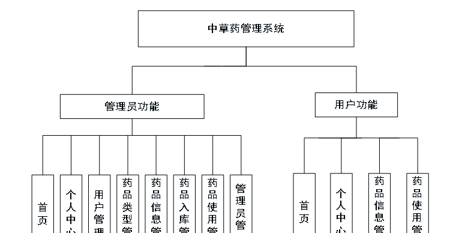

图 4-1 中草药管理总体功能模块图

### 4.2 数据库设计与实现

在每一个系统中数据库有着非常重要的作用，数据库的设计得好将会增加系统的效率以及系统各逻辑功能的实现。所以数据库的设计我们要从系统的实际需要出发，才能使其更为完美的符合系统功能的实现。

#### 4.2.1 概念模型设计

概念模型是对现实中的问题出现的事物的进行描述，ER图是由实体及其关系构成的图，通过E-R图可以清楚地描述系统涉及到的实体之间的相互关系。

药品信息实体图如图4-2所示：

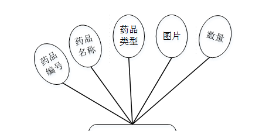

图4-2药品信息实体图

用户信息实体图如图4-3所示：

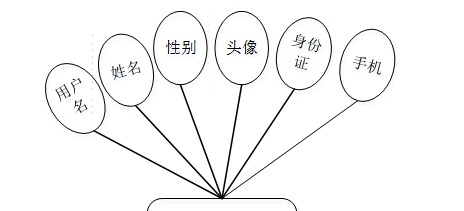

图4-3用户信息实体图

药品使用信息实体图如图4-4所示：

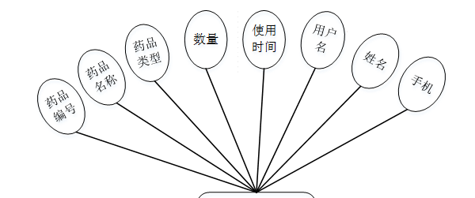

图4-4药品使用信息实体图

### 管理员功能模块

管理员登录，管理员通过登录页面输入用户名、密码，选择角色并点击登录进行系统登录操作，如图5-1所示。

图5-1管理员登录界面图

管理员登录系统后，可以对首页、个人中心、用户管理、药品类型管理、药品信息管理、药品入库管理、药品使用管理、管理员管理等功能进行相应操作，如图5-2所示。

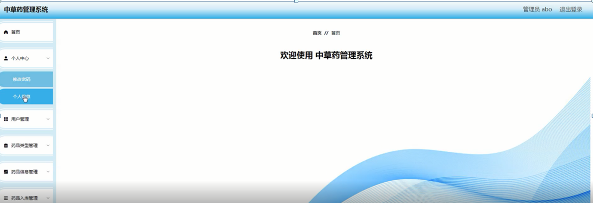

图5-2管理员功能界图面

管理员对个人中心进行操作填写原密码、新密码、确认密码并进行添加、删除、修改以及查看。修改密码，管理员对修改密码进行操作填写原密码、新密码、确认密码并进行添加、删除、修改以及查看，如图5-3所示。

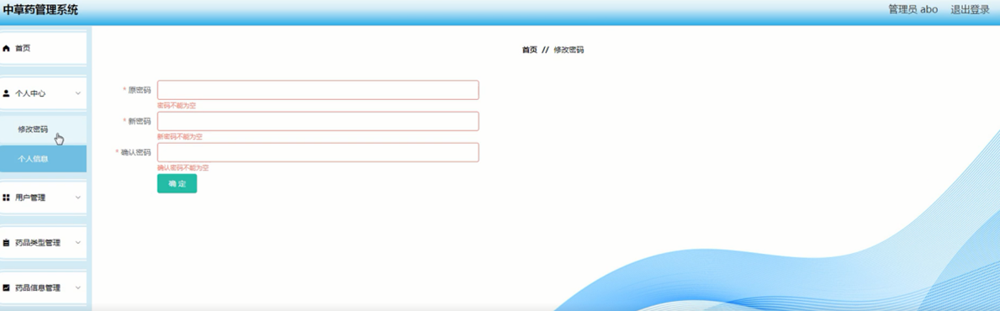

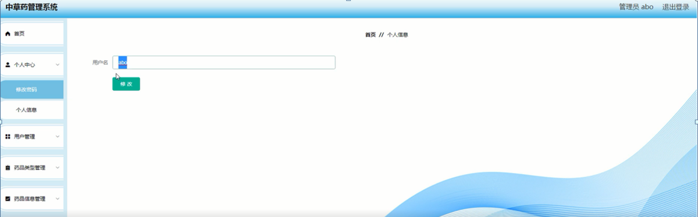

图5-3个人中心界面图

用户管理，在用户管理页面可以对用户名、姓名、性别、头像、身份证、手机等内容进行详情、修改、删除等操作，如图5-4所示。

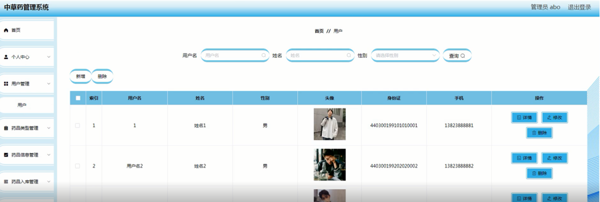

图5-4用户管理界面图

药品类型管理，在药品类型管理页面可以新增药品类型信息等内容，以及对药品类型管理进行详情、修改、删除等操作，如图5-5所示。

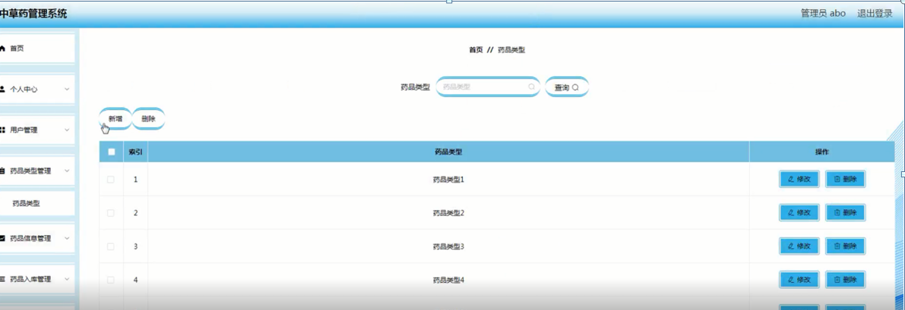

图5-5药品类型管理界面图

管理员管理，在管理员管理页面可以对用户名、密码、角色等内容进行详情、修改、删除等操作，如图5-6所示。

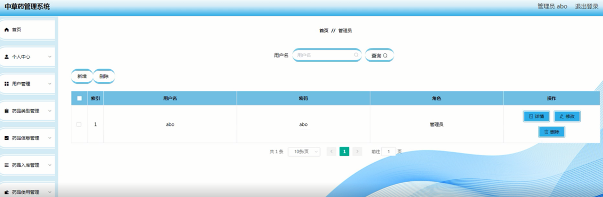图5-6管理员管理界面图

药品信息管理，在药品信息管理页面可以对药品编号、药品名称、药品类型、图片、数量等内容进行详情、修改、删除等操作，如图5-7所示。

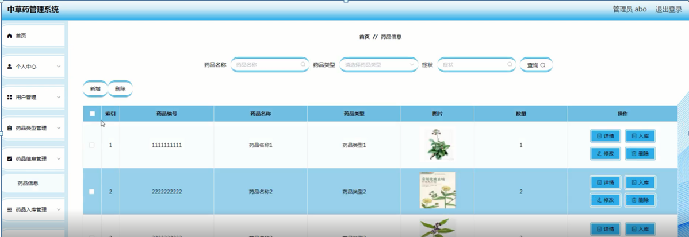图5-7药品信息管理界面图

药品入库管理，在药品入库管理页面可以对药品编号、药品名称、药品类型、数量、入库时间等内容进行详情、修改、删除等操作，如图5-8所示。

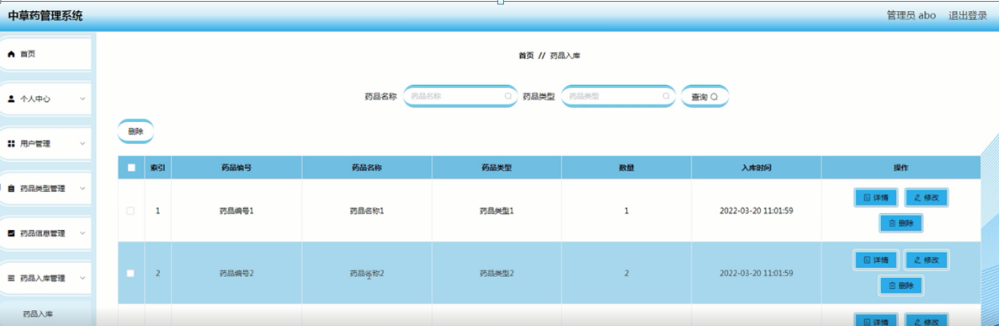

图5-8药品入库管理界面图

药品使用管理，在药品使用管理可以对药品编号、药品名称、药品类型、数量、使用时间、用户名、姓名、手机等内容进行详情、修改、删除等操作，如图5-9所示。

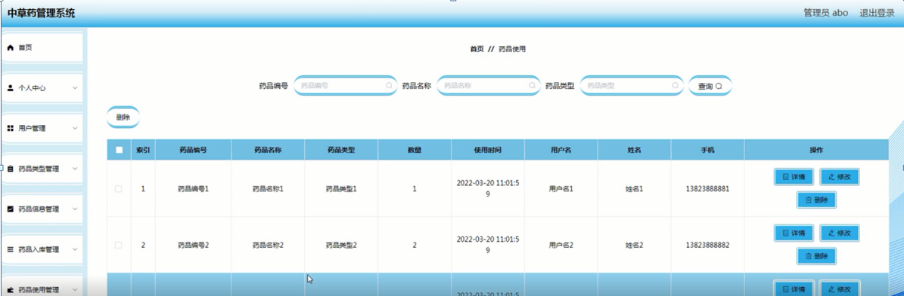

图5-9药品使用管理面图

###

### 5.2用户功能模块

用户注册，在注册页面填写用户名、密码、确认密码、姓名、身份证、手机等信息，进行注册操作，如图5-10所示。

图5-10用户注册界面图

用户登录，在登录页面填写用户名、密码、选择角色等信息，进行登录操作，如图5-11所示。

图5-11用户登录界面图

用户登录到中草药管理系统后台后，可以对首页、个人中心、药品信息管理、药品使用管理等功能进行相应操作，如图5-12所示。

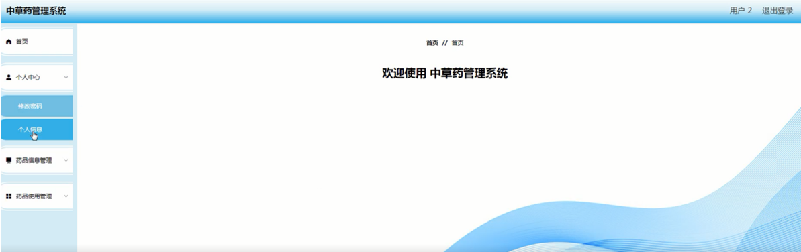

图5-12用户功能界面图

#### **JAVA** **毕设帮助，指导，源码分享，调试部署**

