ssm+Vue计算机毕业设计中药城药材销售管理系统（程序+LW文档）

**项目运行**

**环境配置：**

**Jdk1.8 + Tomcat7.0 + Mysql + HBuilderX** **（Webstorm也行）+ Eclispe（IntelliJ
IDEA,Eclispe,MyEclispe,Sts都支持）。**

**项目技术：**

**SSM + mybatis + Maven + Vue** **等等组成，B/S模式 + Maven管理等等。**

**环境需要**

**1.** **运行环境：最好是java jdk 1.8，我们在这个平台上运行的。其他版本理论上也可以。**

**2.IDE** **环境：IDEA，Eclipse,Myeclipse都可以。推荐IDEA;**

**3.tomcat** **环境：Tomcat 7.x,8.x,9.x版本均可**

**4.** **硬件环境：windows 7/8/10 1G内存以上；或者 Mac OS；**

**5.** **是否Maven项目: 否；查看源码目录中是否包含pom.xml；若包含，则为maven项目，否则为非maven项目**

**6.** **数据库：MySql 5.7/8.0等版本均可；**

**毕设帮助，指导，本源码分享，调试部署** **(** **见文末** **)**

### 总体设计

根据药材销售管理系统功能需求，进行系统设计。

CSS+DIV进行页面布局。CSS+DIV
是一种网页的布局方法,这一种网页布局方法有别于传统的HTML网页设计语言中的表格（Table）定位方式,真正地达到了w3c内容与表现相分离，但是不是很兼容老版本的浏览器。

使用 JAVA 母版页可以为应用程序中的页创建一致的布局，各个模块继承母版页。

后台由管理员和员工两个角色组成，主要功能包括首页，个人中心，员工管理，供应商管理，客户信息管理，药材信息管理，药材入库管理，销售出库管理等。

系统对这些功能进行整合，产生的功能结构图如下：

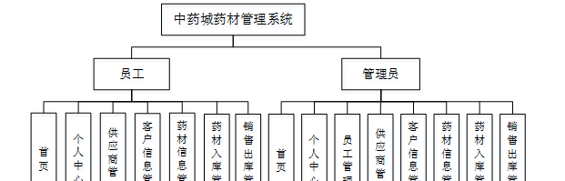

图4-1 系统总体结构图

### 4.2数据库设计

#### 4.2.1概念模型设计

概念模型是对现实中的问题出现的事物的进行描述，ER图是由实体及其关系构成的图，通过E-R图可以清楚地描述系统涉及到的实体之间的相互关系。

客户信息实体图如图4-2所示：

图4-2客户信息实体图

药材信息管理实体图如图4-3所示：

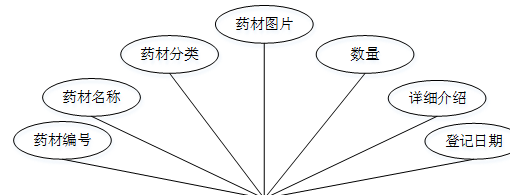

图4-3药材信息管理实体图

### 登录功能模块

运行系统，首先进入登录界面，按照登录界面的要求填写相应的“用户名”和“密码”以及用户类型，点击“登录”然后系统判断填写是否正确，若正确进入相应的界面，否则给出要求先注册信息。具体流程如图5-1所示

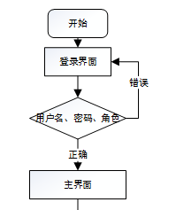

图5-1登录流程图

图5-2系统登录界面图

### 5.2管理员功能模块

管理员登录系统后，可以对首页，个人中心，员工管理，供应商管理，客户信息管理，药材信息管理，药材入库管理，销售出库管理等功能进行相应的操作管理，如图5-3所示。

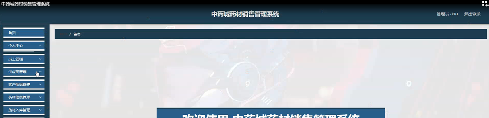

图5-3管理员功能界面图

员工管理，在员工管理页面可以对索引，工号，姓名，性别，年龄，手机，照片等内容进行详情，修改，删除等操作，如图5-4所示。

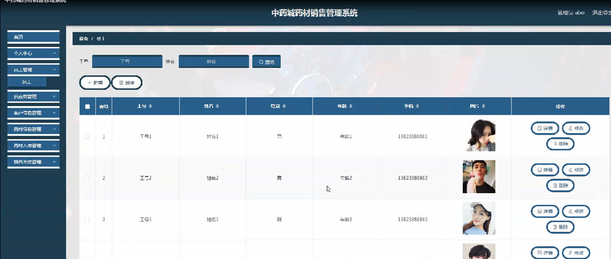

图5-4员工管理界面图

供应商管理，在供应商管理页面可以对索引，编号，名称，负责人，性别，联系电话，地址等信息进行详情，修改，删除等操作，如图5-5所示。

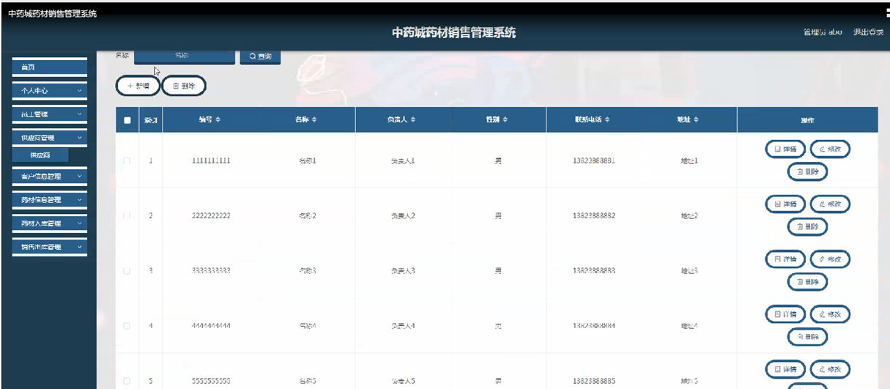

图5-5供应商管理界面图

客户信息管理，在客户信息管理页面可以对索引，客户编号，客户名称，负责人，性别，联系电话等信息进行详情，修改，删除等操作，如图5-6所示。

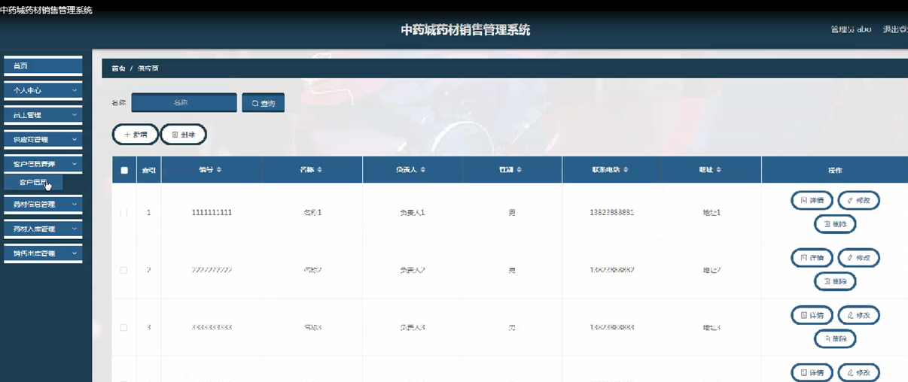

图5-6客户信息管理界面图

药材信息管理，在药材信息管理页面可以对索引，药材编号，药材名称，药材分类，药材图片，数量，详细介绍，登记时间等内容进行详情，删除操作，如图5-7所示。

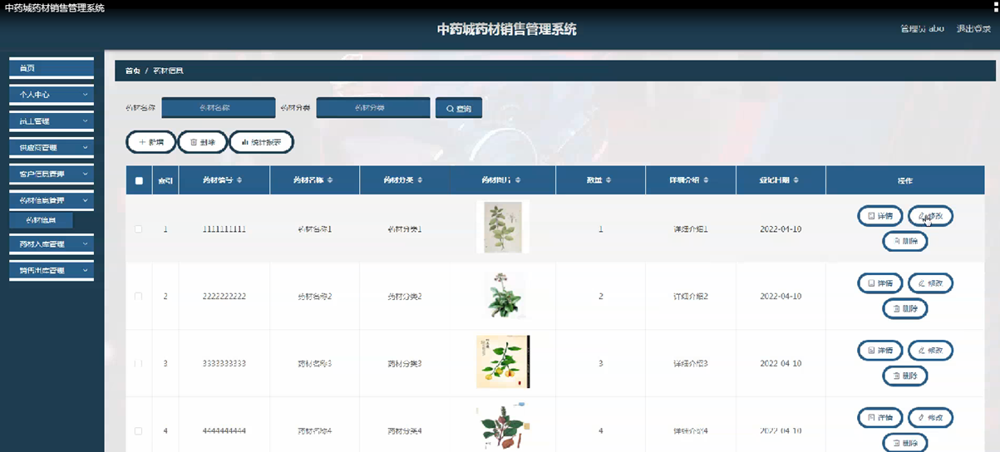

图5-7药材信息管理界面图

药材入库管理，在药材入库管理页面可以对索引，入库编号，药材编号，药材名称，进货价，数量，总价，供应商，入库日期，备注，工号，姓名等内容进行详情，删除操作，如图5-8所示。

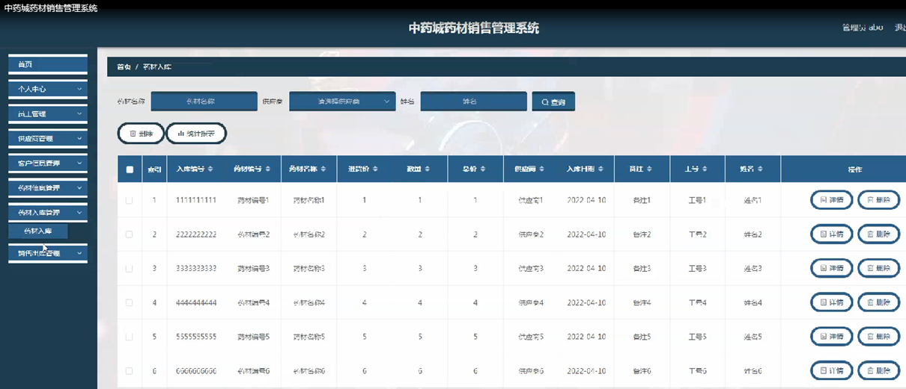

图5-8药材入库管理界面图

销售出库管理，在销售出库管理页面可以对索引，销售编号，药材编号，药材名称，进货价，数量，总价，客户，销售日期，备注，工号，姓名等内容进行详情，删除操作，如图5-9所示。

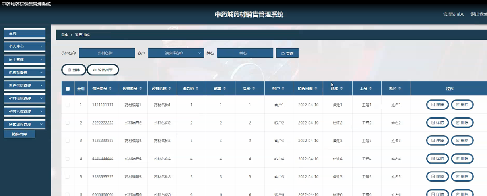

图5-9销售出库管理界面图

### 5.3员工功能模块

员工登录进入系统可以对首页，个人中心，供应商管理，客户信息管理，药材信息管理，药材入库管理，销售出库管理等功能进行相应操作，如图5-10所示。

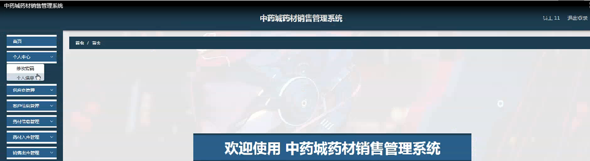

图5-10员工功能界面图

客户信息管理，在客户信息管理页面可以对索引，客户编号，客户名称，负责人，性别，联系电话等内容进行详情操作，如图5-11所示。

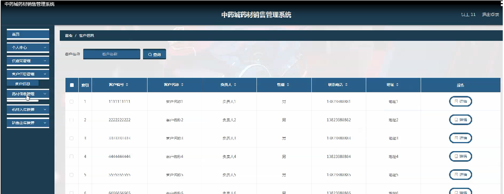

图5-11客户信息管理界面图

药材信息管理，在药材信息管理页面可以对索引，药材编号，药材名称，药材分类，药材图片，数量，详细介绍，登记时间等内容进行详情，药材入库，销售出库等操作，如图5-12所示。

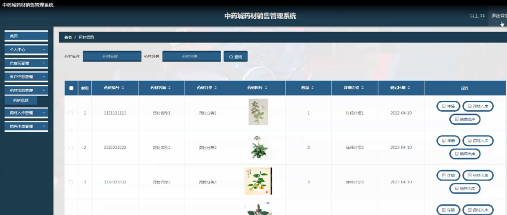

图5-12药材信息管理界面图

#### **JAVA** **毕设帮助，指导，源码分享，调试部署**

