ssm+Vue计算机毕业设计云共享知识交流平台（程序+LW文档）

**项目运行**

**环境配置：**

**Jdk1.8 + Tomcat7.0 + Mysql + HBuilderX** **（Webstorm也行）+ Eclispe（IntelliJ
IDEA,Eclispe,MyEclispe,Sts都支持）。**

**项目技术：**

**SSM + mybatis + Maven + Vue** **等等组成，B/S模式 + Maven管理等等。**

**环境需要**

**1.** **运行环境：最好是java jdk 1.8，我们在这个平台上运行的。其他版本理论上也可以。**

**2.IDE** **环境：IDEA，Eclipse,Myeclipse都可以。推荐IDEA;**

**3.tomcat** **环境：Tomcat 7.x,8.x,9.x版本均可**

**4.** **硬件环境：windows 7/8/10 1G内存以上；或者 Mac OS；**

**5.** **是否Maven项目: 否；查看源码目录中是否包含pom.xml；若包含，则为maven项目，否则为非maven项目**

**6.** **数据库：MySql 5.7/8.0等版本均可；**

**毕设帮助，指导，本源码分享，调试部署** **(** **见文末** **)**

### 软件功能模块设计

网站整功能如下图所示：

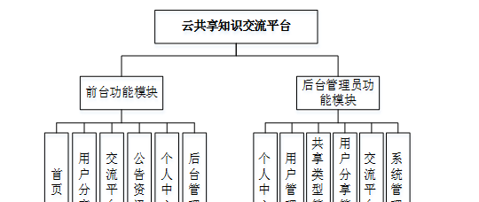

**图 4-1** **云共享知识交流平台总体功能模块图**

### 4.2 数据库设计

#### 4.2.1 概念模型设计

数据可设计要遵循职责分离原则，即在设计时应该要考虑系统独立性，即每个系统之间互不干预不能混乱数据表和系统关系。

数据库命名也要遵循一定规范，否则容易混淆，数据库字段名要尽量做到与表名类似，多使用小写英文字母和下划线来命名并尽量使用简单单词。

用户管理实体图如图4-2所示：

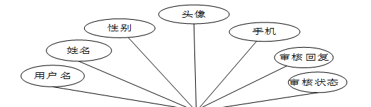

图4-2用户管理实体图

用户分享管理实体图如图4-3所示：

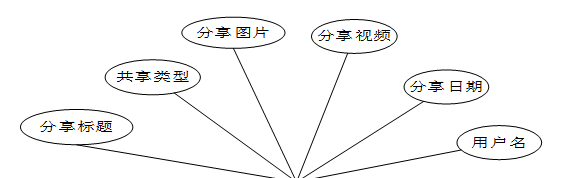

图4-3用户分享管理实体图

### 系统功能模块

在云共享知识交流平台的网站前台可以查看首页、用户分享、交流平台、公告资讯、个人中心、后台管理等内容，用户如果想要进行其他操作，则需要注册和登录，网站前台如图5-1所示。

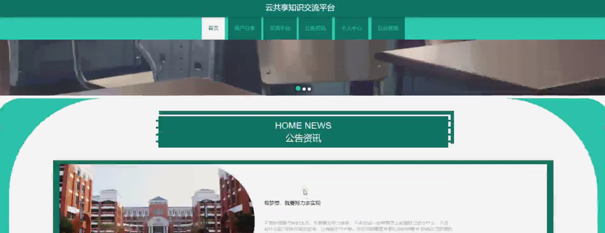

图5-1网站前台界面图

点击注册，用户通过输入用户名、密码、姓名、手机等信息进行用户注册；点击登录，用户输入账号和密码，进行登录，用户注册及登录页面如图5-2所示。

图5-2用户注册及登录界面图

个人中心，在个人中心页面，通过填写用户名、密码、姓名、性别、手机、上传图片等进行更新信息，还能对我的收藏、我的发布进行相应操作，如图5-3所示。

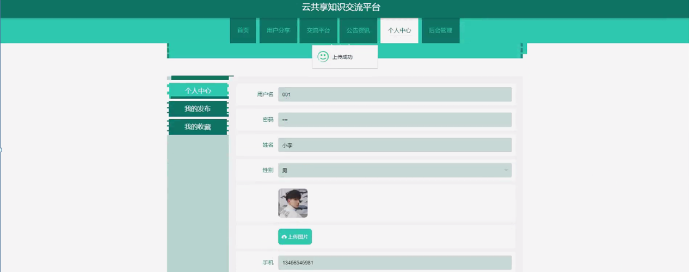

图5-3个人中心界面图

发布用户分享， 用户可通过输入分享标题、共享类型、分享图片、分享视频、分享日期、用户名、分享内容进行提交或重置等操作，如图5-4所示。

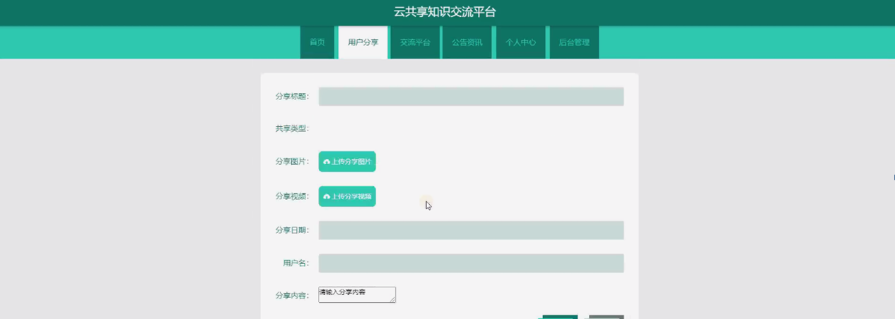

图5-4发布用户分享界面图

用户分享，
用户可在用户分享页面查看标题、共享内容、分享日期、用户名、封面等内容，还可进行赞、踩或收藏等操作，如图5-5所示。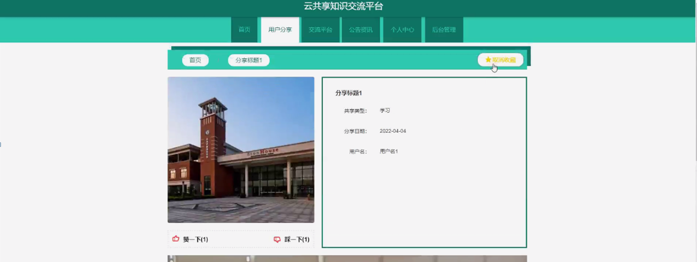

图5-5用户分享界面图

5.2管理员功能模块

管理员进行登录，进入系统前在登录页面根据要求填写用户名和密码，点击登录进行登录操作，如图5-6所示。

图5-6管理员登录界面图

管理员登录系统后，可以对个人中心、用户管理、共享类型管理、用户分享管理、交流平台、系统管理等进行相应的操作管理，如图5-7所示。

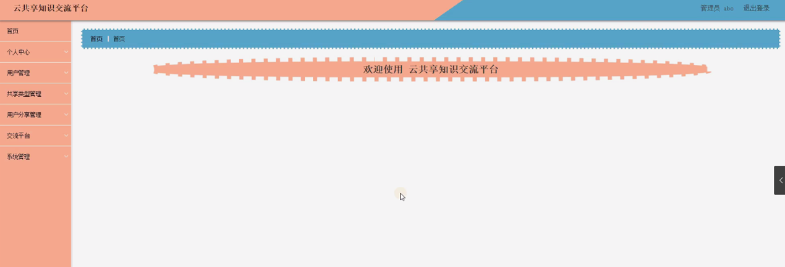

图5-7管理员功能界面图

用户管理，管理员可在用户管理页面查看用户名、姓名、性别、手机、头像、审核回复、审核状态等内容，还可进行审核、新增、修改或删除等操作，如图5-8所示。

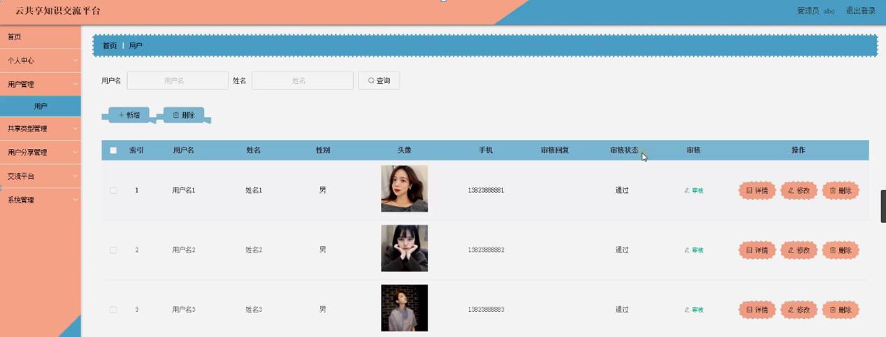

图5-8用户管理界面图

共享类型管理，管理员可在共享类型管理页面进行查询、新增、修改或删除等操作，如图5-9所示。

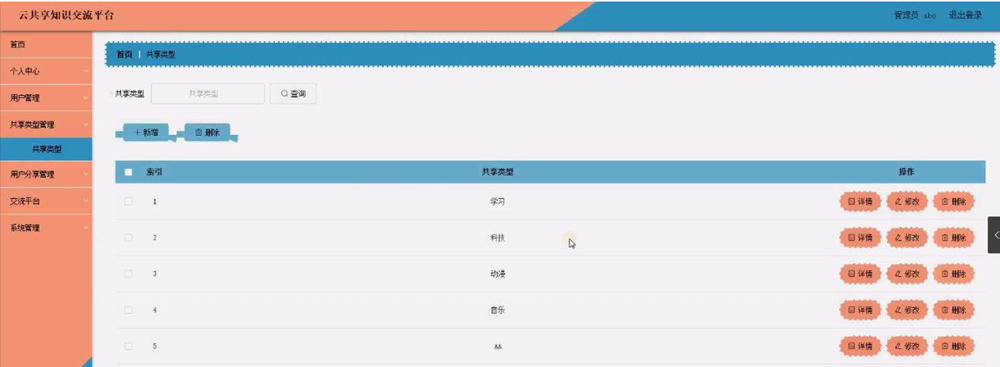

图5-9共享类型管理界面图

用户分享管理，管理员可在用户分享管理页面查看分享标题、共享类型、分享图片、分享视频、分享日期、用户名等内容，还可进行修改或删除等操作，如图5-10所示。

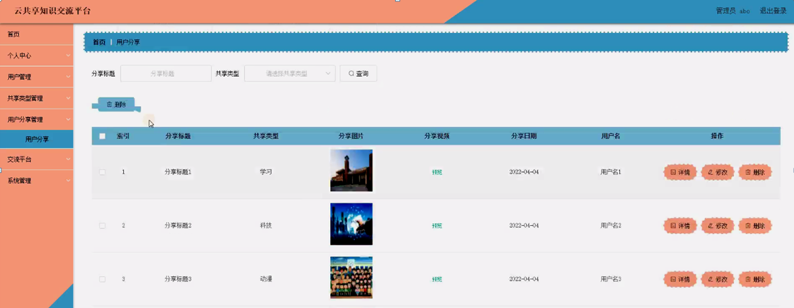

图5-10用户分享管理界面图

交流平台，管理员可在交流平台页面查看帖子标题、用户名、状态等内容，还可进行修改、查看评论或删除等操作，如图5-11所示。

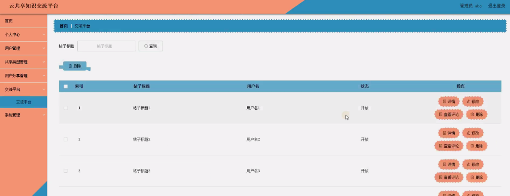

图5-11交流平台界面图

公告资讯，管理员可在公告资讯页面查看标题、图片等内容，还可进行新增、修改或删除等操作，如图5-12所示。

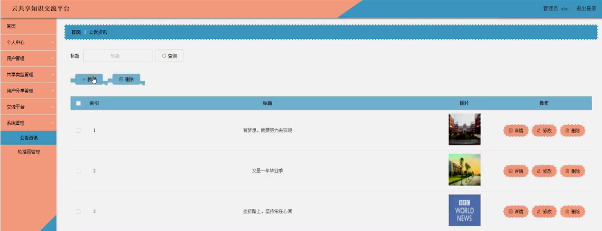

图5-12公告资讯界面图

**JAVA** **毕设帮助，指导，源码分享，调试部署**

