ssm+Vue计算机毕业设计云讲座系统（程序+LW文档）

**项目运行**

**环境配置：**

**Jdk1.8 + Tomcat7.0 + Mysql + HBuilderX** **（Webstorm也行）+ Eclispe（IntelliJ
IDEA,Eclispe,MyEclispe,Sts都支持）。**

**项目技术：**

**SSM + mybatis + Maven + Vue** **等等组成，B/S模式 + Maven管理等等。**

**环境需要**

**1.** **运行环境：最好是java jdk 1.8，我们在这个平台上运行的。其他版本理论上也可以。**

**2.IDE** **环境：IDEA，Eclipse,Myeclipse都可以。推荐IDEA;**

**3.tomcat** **环境：Tomcat 7.x,8.x,9.x版本均可**

**4.** **硬件环境：windows 7/8/10 1G内存以上；或者 Mac OS；**

**5.** **是否Maven项目: 否；查看源码目录中是否包含pom.xml；若包含，则为maven项目，否则为非maven项目**

**6.** **数据库：MySql 5.7/8.0等版本均可；**

**毕设帮助，指导，本源码分享，调试部署** **(** **见文末** **)**

### 4.1系统总体设计

系统总体设计即对有关系统全局问题的设计，也就是设计系统总的处理方案，又称系统概要设计。它包括系统规划与系统功能设计等内容。

云讲座系统主要有三类用户，分别是讲师模块、用户模块和管理员模块，详细规划如图4-1所示。

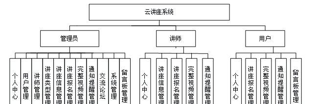

图4-1 系统规划图

其中各子模块的主要功能如下：

1、用户登录：用户进入网页先输入用户名与密码，选择权限登录，系统要记录登录的用户名和登录类型。

2、新用户注册：新用户填写账号、密码、姓名、年龄、手机，完成注册。

3、查看云讲座系统信息：用户登录成功后，能够按分类或者查找云讲座系统信息进行管理。

4、主页内容管理：管理员登录以后，可以对个人中心、用户管理、讲师管理、讲座类型管理、讲座信息管理、讲座报名管理、完整视频管理、通知提醒管理、交流论坛、系统管理、留言板管理进行详细操作。

### 4.2数据库设计

数据库是一个软件项目的根基，它决定了整个项目代码的走势，同时也决定了整个项目在后期的维护以及升级的难易程度。

#### 4.2.1 数据库概念设计

根据云讲座系统的功能需求，对数据库进行分析，得到相应的数据，设计用户需要的各种实体，以及相互之间的关联，为逻辑结构设计铺好路。根据所实体内的各种具体信息得于实现。

1\. 用户管理实体

用户管理实体包括账号、姓名、性别、年龄、手机、照片等属性。用户管理实体图如图4-2所示：

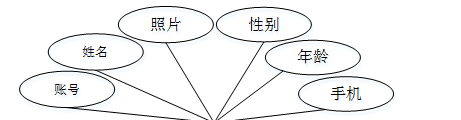

图4-2 用户管理实体图

2\. 完整视频管理实体

完整视频管理实体包括讲座名称、完整视频、发送时间、讲师账号、讲师姓名、账号、姓名等属性；完整视频管理实体图如图4-3所示：

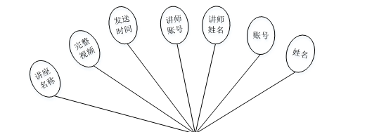

图4-3完整视频管理实体图

### 5.1功能页面实现

按照不同功能模块，在此对系统所涉及的关键页面的实现细节进行阐述，包括页面功能描述，页面涉及功能分析，介绍以及界面展示。

系统登录：
运行系统，首先进入登录界面，按照登录界面的要求填写相应的“账号”和“密码”以及用户类型，点击“登录”然后系统判断填写是否正确，若正确进入相应的界面，否则给出要求先注册信息。具体流程如图5-1所示。

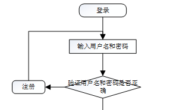

图5-1 登录流程图

登录，通过输入账号，密码，选择角色并点击登录进行系统登录操作，如图5-2所示。

图5-2登录界面图

### 5.2系统功能模块

云讲座系统，在系统首页可以查看首页、讲师、讲座信息、交流论坛、通知公告、留言板、个人中心、后台管理等内容进行详细操作，如图5-3所示。

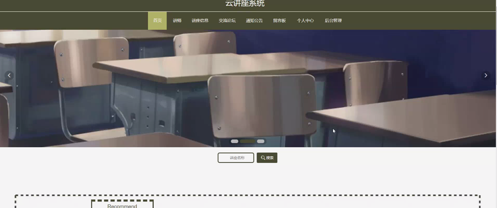

图5-3系统首页界面图

用户注册，用户通过输入账号、密码、姓名、年龄、手机等内容进行注册，如图5-4所示。

图5-4用户注册界面图

个人中心，用户可在个人中心页面通过输入账号、密码、姓名、年龄、性别、手机、上传图片等内容进行更新信息或查看我的发布、我的收藏等内容，如图5-5所示。

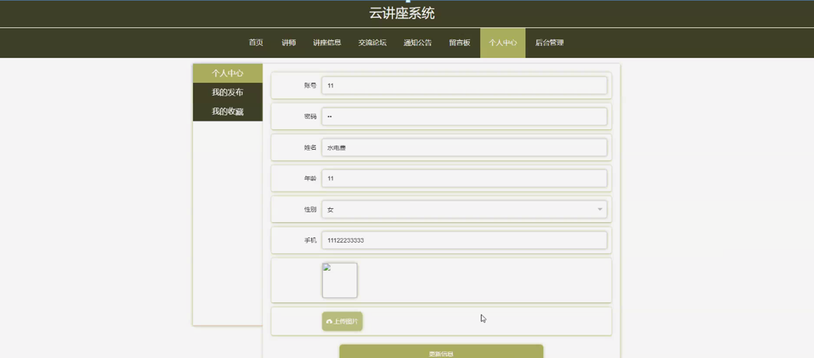

图5-5个人中心界面图

讲师，用户在讲师页面可查看讲师名称、讲师账号、年龄、性别、联系电话、个人简介、点击次数等内容，如图5-6所示。

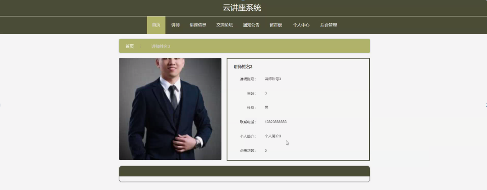

图5-6讲师界面图

交流论坛，用户可在交流论坛页面通过输入标题进行搜索或发布帖子等操作，如图5-7所示。

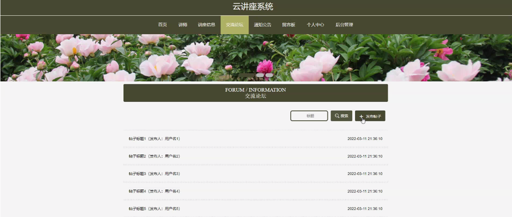

图5-7交流论坛界面图

### 5.3用户功能模块

用户进入系统后台功能模块可查看个人中心、讲座报名管理、完整视频管理、通知提醒管理、留言板管理等内容，如图5-8所示。

图5-8用户功能界图面

讲座报名管理，用户可在讲座报名管理页面查看讲座名称、报名时间、讲师账号、讲师姓名、账号、姓名、审核回复、审核状态等内容，还可进行删除等操作，如图5-9所示。

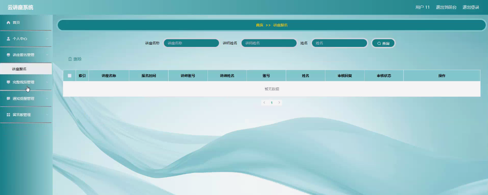

图5-9讲座报名管理界面图

5.4讲师功能模块

讲师注册，讲师通过输入讲师账号、密码、讲师姓名、年龄、联系电话等内容进行注册，如图5-10所示。

图5-10讲师注册界面图

讲师通过登录进入系统可查看个人中心、讲座信息管理、讲座报名管理、完整视频管理、通知提醒管理等内容，如图5-11所示。

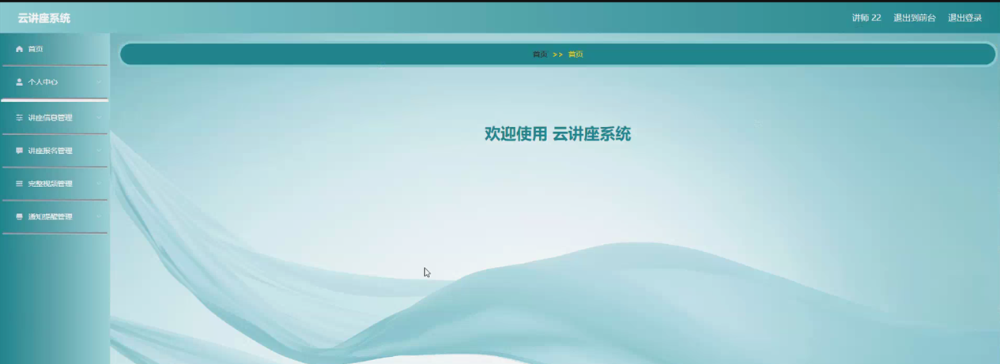

图5-11讲师功能界面图

讲座信息管理，讲师可在讲座信息管理页面查看讲座名称、封面、讲座类型、视频预览、开始时间、结束时间、时长、讲座地点、讲师账号、讲师姓名、审核回复、审核状态等内容，还可进行新增、修改、查看评论或删除等操作，如图5-12所示。

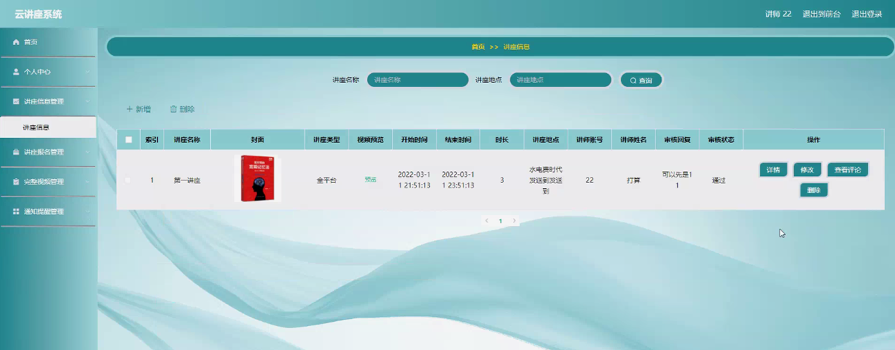

图5-12讲座信息管理界面图

**JAVA** **毕设帮助，指导，源码分享，调试部署**

