ssm+Vue计算机毕业设计亚健康人群健康管理系统（程序+LW文档）

**项目运行**

**环境配置：**

**Jdk1.8 + Tomcat7.0 + Mysql + HBuilderX** **（Webstorm也行）+ Eclispe（IntelliJ
IDEA,Eclispe,MyEclispe,Sts都支持）。**

**项目技术：**

**SSM + mybatis + Maven + Vue** **等等组成，B/S模式 + Maven管理等等。**

**环境需要**

**1.** **运行环境：最好是java jdk 1.8，我们在这个平台上运行的。其他版本理论上也可以。**

**2.IDE** **环境：IDEA，Eclipse,Myeclipse都可以。推荐IDEA;**

**3.tomcat** **环境：Tomcat 7.x,8.x,9.x版本均可**

**4.** **硬件环境：windows 7/8/10 1G内存以上；或者 Mac OS；**

**5.** **是否Maven项目: 否；查看源码目录中是否包含pom.xml；若包含，则为maven项目，否则为非maven项目**

**6.** **数据库：MySql 5.7/8.0等版本均可；**

**毕设帮助，指导，本源码分享，调试部署** **(** **见文末** **)**

**系统的主要的功能结构**

亚健康人群健康管理系统的主要功能的结构如图4-1所示。

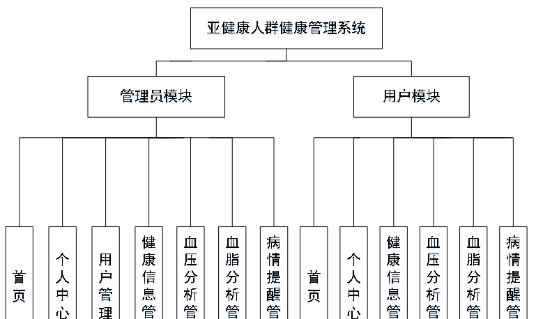

图4-1 亚健康人群健康管理系统功能结构图

4.2 系统设计

**4.2.1** ******数据表E-R图**

E-R图为实体-关系图，本系统的E-R图展现了各个实体之间的关系，在本数据库中，各个实体之间的关系均为多对多的关系。

血压分析信息属性图如图4-2所示。

图4-2血压分析信息实体属性图

血脂分析信息实体属性图如图4-3所示。

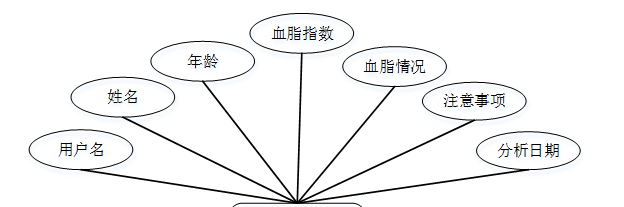

图4-3血脂分析信息实体属性图

健康信息实体属性图如图4-4所示。

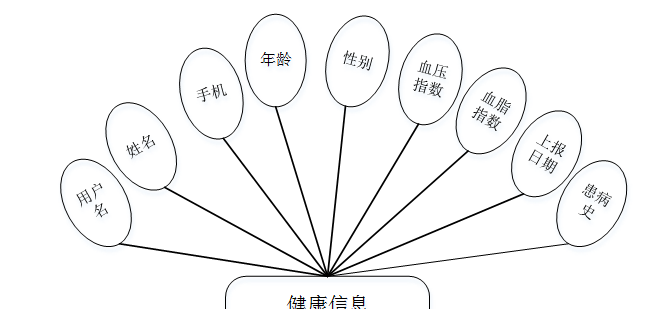

图4-4健康信息实体属性图

管理员功能模块

管理员进行登录，进入系统前在登录页面根据要求填写用户名和密码，选择角色等信息，点击登录进行登录操作，如图5-1所示。

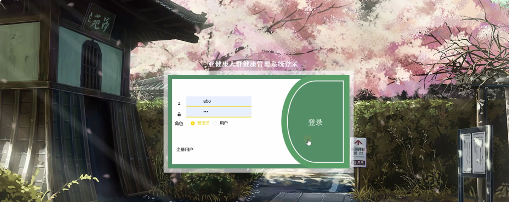

图5-1管理员登录界面图

管理员登录系统后，可以对首页、个人中心、用户管理、健康信息管理、血压分析管理、血脂分析管理、病情提醒管理等进行相应的操作管理，如图5-2所示。

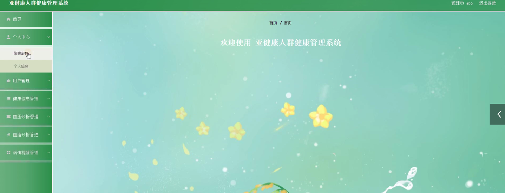

图5-2管理员功能界面图

用户管理，在用户管理页面可以对用户名、姓名、性别、头像、手机、年龄等内容，进行详情、修改或删除等操作，如图5-3所示。

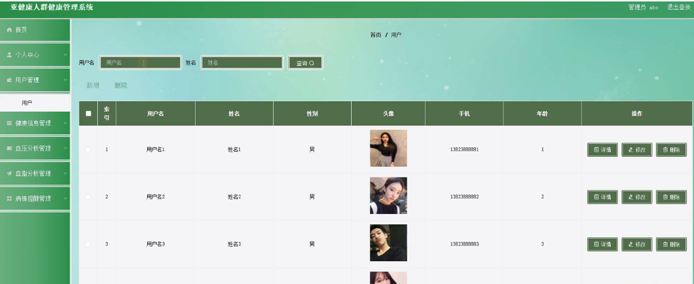

图5-3用户管理界面图

健康信息管理，在健康信息管理页面可以对用户名、姓名、手机、年龄、性别、血压指数、血脂指数、上报日期、患病史等内容，进行详情、修改或删除等操作，如图5-4所示。

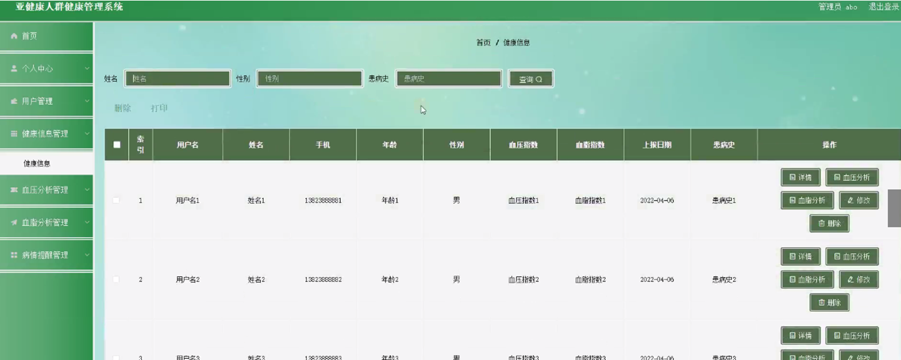

图5-4健康信息管理界面图

血压分析管理，在血压分析管理页面可以对用户名、姓名、年龄、血压指数、血压情况、注意事项、分析日期等内容，进行详情、修改、删除等操作，如图5-5所示。

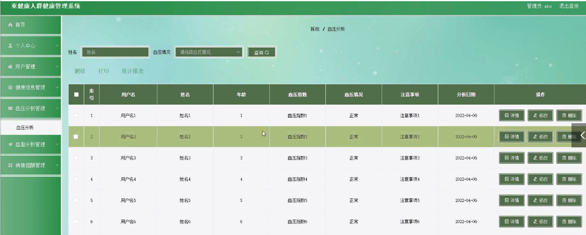

图5-5血压分析管理界面图

血脂分析管理，在血脂分析管理页面可以对用户名、姓名、年龄、血脂指数、血脂情况、注意事项、分析日期等内容，进行详情、修改、删除等操作，如图5-6所示。

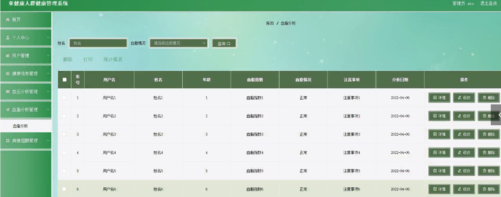

图5-6血脂分析管理界面图

病情提醒管理，在病情提醒管理页面可以对通知标题、通知日期、用户名、姓名、手机等内容，进行详情、修改、删除等操作，如图5-7所示。

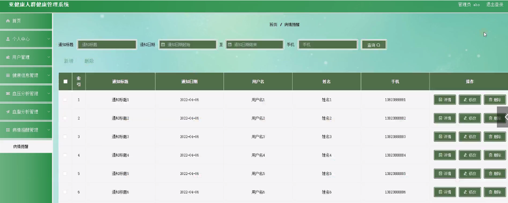

图5-7病情提醒管理界面图

5.2 用户功能模块

用户注册，在注册页面通过填写用户名、密码、确认密码、姓名、手机、年龄等信息，进行注册，如图5-8所示。

图5-8用户注册界面图

用户登录，在登录页面通过填写账号、密码、角色等信息进行登录，如图5-9所示。

图5-9用户登录界面图

用户通过输入账号、密码登录到亚健康人群健康管理系统后台后，可以对首页、个人中心、健康信息管理、血压分析管理、血脂分析管理、病情提醒管理等功能进行相应操作，如图5-10所示。

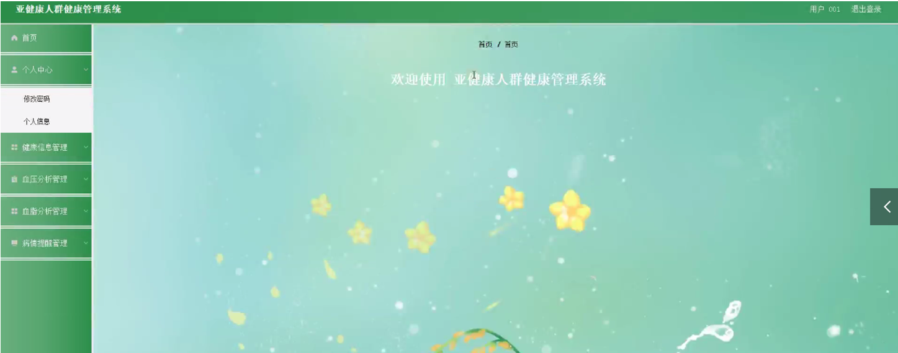

图5-10用户功能界面图

健康信息管理，在健康信息管理页面可以对用户名、姓名、手机、年龄、性别、血压指数、血脂指数、上报日期、患病史等内容，进行详情等操作，如图5-11所示。

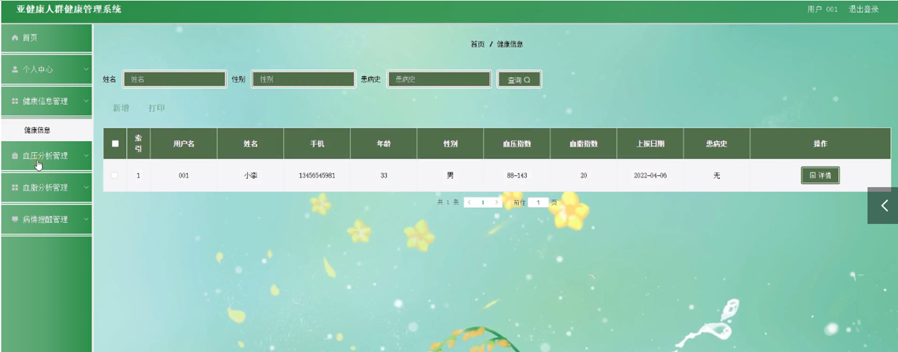

图5-11健康信息管理界面图

血压分析管理，在血压分析管理页面可以对用户名、姓名、年龄、血压指数、血压情况、注意事项、分析日期等内容，进行详情等操作，如图5-12所示。

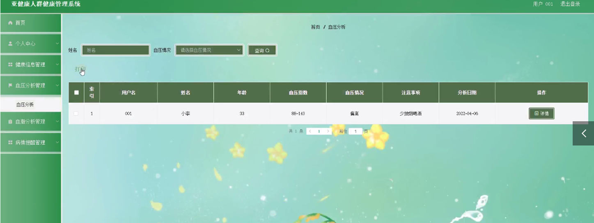

图5-12血压分析管理界面图

**JAVA** **毕设帮助，指导，源码分享，调试部署**

