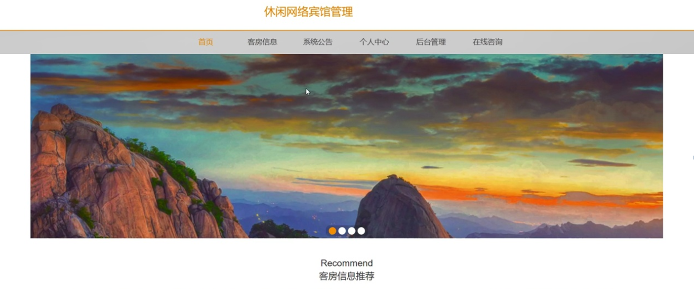
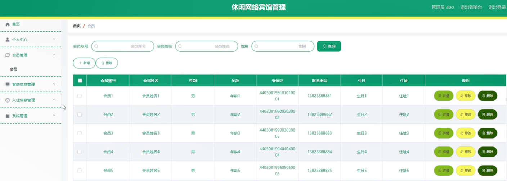

ssm+Vue计算机毕业设计休闲网络宾馆管理（程序+LW文档）

**项目运行**

**环境配置：**

**Jdk1.8 + Tomcat7.0 + Mysql + HBuilderX** **（Webstorm也行）+ Eclispe（IntelliJ
IDEA,Eclispe,MyEclispe,Sts都支持）。**

**项目技术：**

**SSM + mybatis + Maven + Vue** **等等组成，B/S模式 + Maven管理等等。**

**环境需要**

**1.** **运行环境：最好是java jdk 1.8，我们在这个平台上运行的。其他版本理论上也可以。**

**2.IDE** **环境：IDEA，Eclipse,Myeclipse都可以。推荐IDEA;**

**3.tomcat** **环境：Tomcat 7.x,8.x,9.x版本均可**

**4.** **硬件环境：windows 7/8/10 1G内存以上；或者 Mac OS；**

**5.** **是否Maven项目: 否；查看源码目录中是否包含pom.xml；若包含，则为maven项目，否则为非maven项目**

**6.** **数据库：MySql 5.7/8.0等版本均可；**

**毕设帮助，指导，本源码分享，调试部署** **(** **见文末** **)**

### 系统结构

系统架构图属于系统设计阶段，系统架构图只是这个阶段一个产物，系统的总体架构决定了整个系统的模式，是系统的基础。休闲网络宾馆系统的整体结构设计如图4-2所示。

图4-2 系统结构图

### 4.3. 数据库设计

4.3.1 数据库实体

管理员信息结构图，如图4-3所示：

图4-3 管理员信息实体结构图

会员信息管理实体属性图，如图4-4所示：

图4-4会员信息管理实体属性图

客房信息管理实体属性图，如图4-5所示：

图4-5客房信息管理实体属性图

### 系统功能模块

休闲网络宾馆管理系统设计，在休闲网络宾馆管理系统首页可以查看首页、客房信息、系统公告、个人中心、后台管理、在线咨询等内容进行详细操作，如图5-1所示。

图5-1系统首页界面图

客房信息，在客房信息页面可以查看宾馆名称、星级、宾馆图片、宾馆地址、房间类型、价格、联系电话、宾馆介绍等详细信息，还可以根据需要进行评论或收藏等操作，如图5-2所示。

图5-2客房信息界面图

会员注册，在会员注册页面通过填写会员账号、会员姓名、密码、年龄、身份证、联系电话、生日、住址等信息进行会员注册操作，如图5-3所示。在个人中心页面通过填写会员账号、会员姓名、密码、性别、年龄、身份证、联系电话、生日、住址等信息，根据需要对个人信息进行更新操作，还可以对我的收藏进行详细操作；如图5-4所示。

图5-3会员注册界面图

图5-4个人中心界面图

### 5.2管理员功能模块

管理员登录，管理员通过输入账号，密码，选择角色等信息即可进行系统登录，如图5-5所示。

图5-5管理员登录界面图

管理员登录进入休闲网络宾馆管理系统可以查看首页、个人中心、会员管理、客房信息管理、入住信息管理、系统管理等内容并进行详细操作，如图5-6所示。

图5-6管理员功能界面图

会员管理，在会员管理页面可以查看会员账号、会员姓名、性别、年龄、身份证、联系电话、生日、住址等信息，并可根据需要进行详情，删除或修改等操作，如图5-7所示。

图5-7会员管理界面图

客房信息管理，在客房信息管理页面可以查看宾馆名称、星级、宾馆图片、宾馆地址、房间类型、价格、联系电话等信息，并可根据需要进行详情、入住、修改、查看评论或删除等操作，如图5-8所示。

图5-8客房信息管理界面图

入住信息管理，在入住信息管理页面可以查看房间类型、价格、入住天数、总价格、房间号、会员账号、会员姓名、联系电话、入住时间、是否支付等信息，并可根据需要进行详情，删除或修改等操作，如图5-9所示。

图5-9入住信息管理界面图

系统管理，在系统公告页面可以查看标题、简介、图片等信息进行详情，修改或删除等操作，并可根据需要对轮播图管理、在线咨询进行相对应的操作，如图5-10所示。

图5-10系统管理界面图

### 5.3会员后台功能模块

会员登录进入休闲网络宾馆管理系统后台可以查看首页、个人中心、入住信息管理、我的收藏管理等内容，如图5-11所示。

图5-11会员后台功能界面图

入住信息管理，在入住信息管理页面可以查看房间类型、价格、入住天数、总价格、房间号、会员账号、会员姓名、联系电话、入住时间、是否支付等信息，并可根据需要进行详情或删除等操作，如图5-12所示。

图5-12入住信息管理界面图

#### **JAVA** **毕设帮助，指导，源码分享，调试部署**

