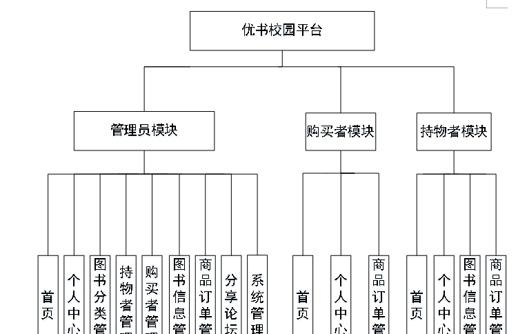
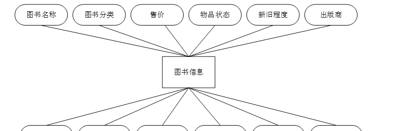
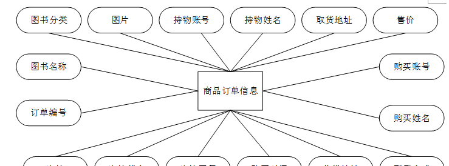
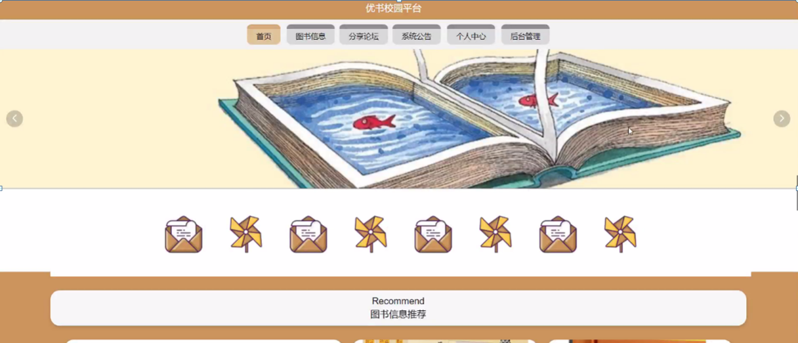
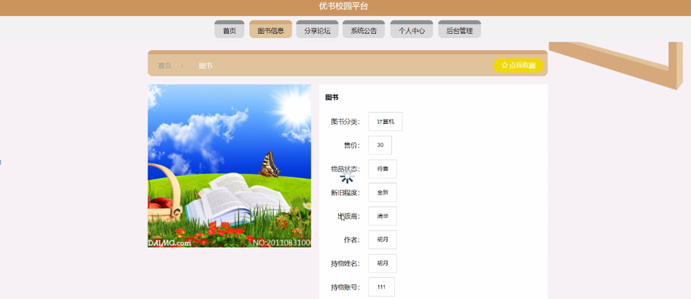
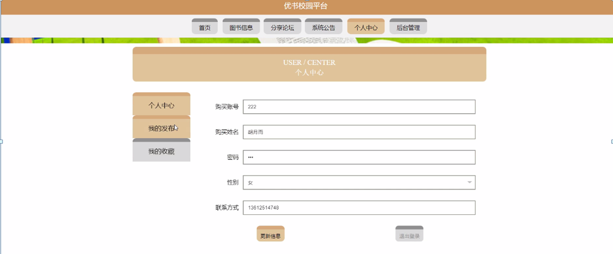
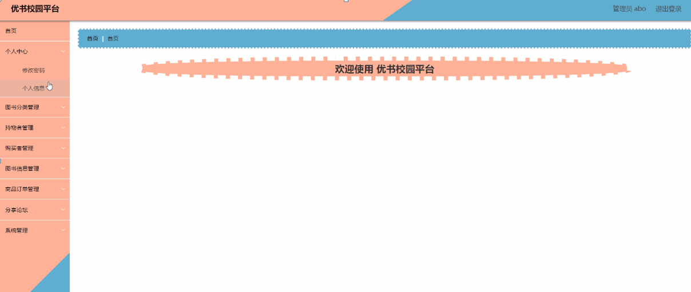
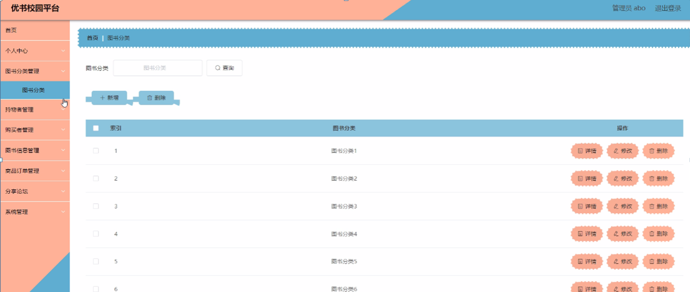
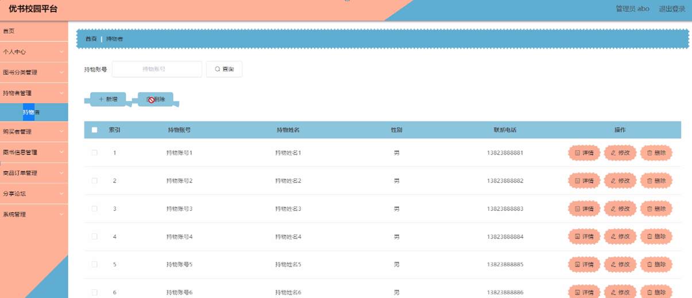
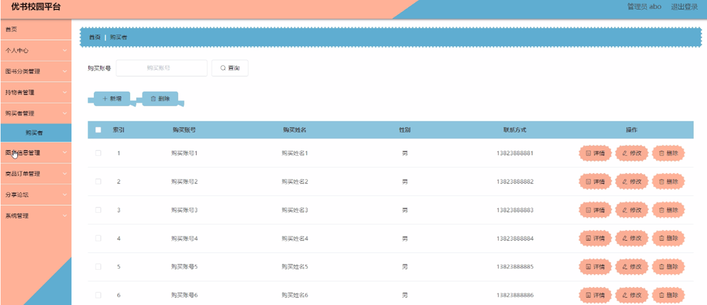

ssm+Vue计算机毕业设计优书校园平台（程序+LW文档）

**项目运行**

**环境配置：**

**Jdk1.8 + Tomcat7.0 + Mysql + HBuilderX** **（Webstorm也行）+ Eclispe（IntelliJ
IDEA,Eclispe,MyEclispe,Sts都支持）。**

**项目技术：**

**SSM + mybatis + Maven + Vue** **等等组成，B/S模式 + Maven管理等等。**

**环境需要**

**1.** **运行环境：最好是java jdk 1.8，我们在这个平台上运行的。其他版本理论上也可以。**

**2.IDE** **环境：IDEA，Eclipse,Myeclipse都可以。推荐IDEA;**

**3.tomcat** **环境：Tomcat 7.x,8.x,9.x版本均可**

**4.** **硬件环境：windows 7/8/10 1G内存以上；或者 Mac OS；**

**5.** **是否Maven项目: 否；查看源码目录中是否包含pom.xml；若包含，则为maven项目，否则为非maven项目**

**6.** **数据库：MySql 5.7/8.0等版本均可；**

**毕设帮助，指导，本源码分享，调试部署** **(** **见文末** **)**

### 系统结构图

整个系统的模块划分包含购买者管理模块、持物者管理模块和管理员管理模块, 又划分了若干了子模块,为了方便更直观的理解,下图以图形形式给出关于整个网站的结构图。

网站总体功能结构图3-1如图所示：

图3-2网站总体功能结构图

### 数据库概念设计

在对数据库设计之前首先要分析一下优书校园平台的功能，和各模块之间的关系，再对数据表进行设计。每一个模块的实体都会对应多个实体对象，下面是几个系统中的数据实体。

持物者信息实体E-R图如图4-1所示：

图4-1持物者信息E-R图

购买者信息实体E-R图如图4-2所示：

图4-2购买者信息实体E-R图

图书信息实体E-R图如图4-3所示：

图4-3图书信息实体E-R图

商品订单信息实体E-R图如图4-4所示：

图4-4商品订单信息实体E-R图

### 网站首页的设计

该界面是优书校园平台的首页，界面设置要求界面简洁明了、操作简单、兼容性好。在考虑设计界面时，首先要考虑界面标准化设计，其次是完善界面设计，但不要因对界面的美化使界面的操作变得复杂，购买者可在此页面进行登录等操作，页面顶部导航条是各模块的入口。

网站首页页面主要包括首页、图书信息、分享论坛、系统公告、个人中心、后台管理等内容，并根据需要进行详细操作；如图5-1所示：

图5-1网站首页界面图

购买者注册，在购买者注册页面通过填写购买账号、购买姓名、密码、确认密码、联系方式等信息，完成购买者注册操作，如图5-2所示。

图5-2购买者注册界面图

购买者登录，在购买者登录页面通过填写账号、密码等信息完成购买者登录操作，如图5-3所示。

图5-3购买者登录界面图

图书信息，在图书信息页面可以查看图书名称、图书分类、售价、物品状态、新旧程度、出版商、作者、封面、持物姓名、持物账号、联系电话、取货地址等内容，并进行立即购买、收藏或者评论等操作；如图5-4所示。

图5-4图书信息界面图

系统公告，在系统公告页面查看标题、简介、发布时间、公告内容，如图5-5所示。

图5-5系统公告界面图

个人中心，在个人中心页面填写购买账号、购买姓名、密码、性别、联系方式等信息，进行更新信息，还可以根据需要对我的发布、我的收藏进行相对应操作，如图5-6
5-7所示。

图5-6个人中心界面图

图5-7我的发布界面图

### 5.2管理员功能模块

管理员进行登录，进入系统前在登录页面根据要求填写用户名和密码，选择角色等信息，点击登录操作，如图5-8所示。

图5-8管理员登录界面图

管理员登录系统后，可以对首页、个人中心、图书分类管理、持物者管理、购买者管理、图书信息管理、商品订单管理、分享论坛、系统管理等进行相应的操作管理，如图5-9所示。

图5-9管理员功能界图面

图书分类管理，在图书分类管理页面可以对图书分类等内容，进行详情、修改和删除等操作，如图5-10所示。

图5-10图书分类管理界面图

持物者管理，在持物者管理页面可以对持物账号、持物姓名、性别、联系电话等内容，进行详情、修改、删除等操作，如图5-11所示。

图5-11持物者管理界面图

购买者管理，在购买者管理页面可以对购买账号、购买姓名、性别、联系方式等内容，进行修改和删除等操作，如图5-12所示。

图5-12购买者管理界面图

#### **JAVA** **毕设帮助，指导，源码分享，调试部署**

