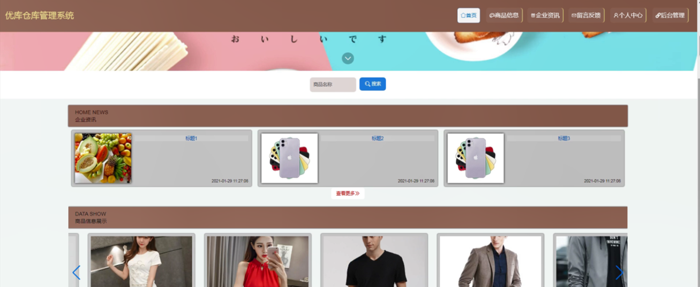

ssm+Vue计算机毕业设计优库仓库管理系统（程序+LW文档）

**项目运行**

**环境配置：**

**Jdk1.8 + Tomcat7.0 + Mysql + HBuilderX** **（Webstorm也行）+ Eclispe（IntelliJ
IDEA,Eclispe,MyEclispe,Sts都支持）。**

**项目技术：**

**SSM + mybatis + Maven + Vue** **等等组成，B/S模式 + Maven管理等等。**

**环境需要**

**1.** **运行环境：最好是java jdk 1.8，我们在这个平台上运行的。其他版本理论上也可以。**

**2.IDE** **环境：IDEA，Eclipse,Myeclipse都可以。推荐IDEA;**

**3.tomcat** **环境：Tomcat 7.x,8.x,9.x版本均可**

**4.** **硬件环境：windows 7/8/10 1G内存以上；或者 Mac OS；**

**5.** **是否Maven项目: 否；查看源码目录中是否包含pom.xml；若包含，则为maven项目，否则为非maven项目**

**6.** **数据库：MySql 5.7/8.0等版本均可；**

**毕设帮助，指导，本源码分享，调试部署** **(** **见文末** **)**

### 系统体系结构

优库仓库管理系统开发系统的结构图4-1所示：

图4-1 系统结构

模块包括主界面，首页、个人中心、商品分类管理、商品信息管理、供应商信息管理、客户信息管理、商品入库管理、商品出库管理、订单信息管理、用户管理、留言板管理、系统管理等进行相应的操作。

登录系统结构图，如图4-2所示：

图4-2 登录结构图

这些功能可以充分满足优库仓库管理系统的需求。此系统功能较为全面如下图系统功能结构如图4-3所示。

图4-3系统功能结构图

### 4.2 数据库设计原则

每个数据库的应用它们都是和区分开的，当运行到一定的程序当中，它就会与自己相关的协议与客户端进行通讯。那么这个系统就会对使这些数据进行连接。当我们选择哪个桥段的时候，接下来就会简单的叙述这个数据库是如何来创建的。当点击完成按钮的时候就会自动在对话框内弹出数据源的名称，在进行点击下一步即可，直接在输入相对应的身份验证和登录密码。

优库仓库管理系统的数据流程：

图4-4 系统数据流程图

商品信息实体E-R图，如图4-5所示。

图4-5商品信息E-R图

订单信息管理E-R图，如图4-6所示。

图4-6订单信息管理E-R图

###  系统功能模块

优库仓库管理系统，在系统的首页可以查看首页、商品信息、企业资讯、留言反馈、个人中心、后台管理等信息，如图5-1所示。

图5-1系统首页界面图

用户注册，在用户注册页面通过填写用户名、密码、姓名、年龄、手机、邮箱等信息完成用户注册，如图5-2所示。

图5-2用户注册界面图

商品信息，在商品信息页面中可以查看商品编号、商品名称、商品类别、商品规格、图片、价格、数量、品牌等信息，进行购买，如图5-3所示。

图5-3商品信息界面图

留言反馈，通过填写留言内容并立即提交，如图5-4所示。

图5-4留言反馈界面图

### 5.2 管理员模块

管理员登录，管理员通过输入用户名、密码、角色信息然后点击登录就能登录到系统进行系统的使用了，如图5-5所示。

图5-5管理员登录界面图

管理员登录进入优库仓库管理系统之后，就可以对所有的信息进行查看，可以查看到首页、个人中心、商品分类管理、商品信息管理、供应商信息管理、客户信息管理、商品入库管理、商品出库管理、订单信息管理、用户管理、留言板管理、系统管理等，并且还可以对其进行相应的操作管理，如图5-6所示。

图5-6管理员功能界面图

商品分类管理，在商品分类管理页面中可以查看商品类别等信息，还可以根据需要进行修改或删除等操作，如图5-7所示。

图5-7商品分类管理界面图

商品信息管理，在商品信息管理页面中可以查看商品编号、商品名称、商品类别、商品规格、图片、价格、数量、品牌等信息，还可以根据需要进行入库、出库、修改或删除等操作，如图5-8所示。

图5-8商品信息管理界面图

供应商信息管理，在供应商信息管理页面中可以查看供应商编号、供应商名称、供应商类型、主供商品、负责人、联系电话、地址、备注等信息，还可以根据需要进行修改或删除等操作，如下图5-9所示。

图5-9供应商信息管理界面图

客户信息管理，在客户信息管理页面中可以查看客户编号、客户名称、客户类型、负责人、联系电话、地址等信息，还可以根据需要进行修改或删除等操作，如图5-10所示。

图5-10客户信息管理界面图

商品入库管理，在商品入库管理页面中可以查看商品编号、商品名称、商品类别、数量、入库价格、总价、供应商编号、供应商名称、供应商类型、联系电话、地址、入库日期、备注等信息，还可以根据需要进行修改或删除等操作，如图5-11所示。

图5-11商品入库管理界面图

商品出库管理，在商品出库管理页面中可以查看商品编号、商品名称、商品类别、数量、出库价格、总价、客户编号、客户名称、客户类型、联系电话、地址、出库日期、备注等信息，还可以根据需要进行修改或删除等操作，如图5-12所示。

图5-12商品出库管理界面图

**JAVA** **毕设帮助，指导，源码分享，调试部署**

