ssm+Vue计算机毕业设计余庆金阳驾校管理系统（程序+LW文档）

**项目运行**

**环境配置：**

**Jdk1.8 + Tomcat7.0 + Mysql + HBuilderX** **（Webstorm也行）+ Eclispe（IntelliJ
IDEA,Eclispe,MyEclispe,Sts都支持）。**

**项目技术：**

**SSM + mybatis + Maven + Vue** **等等组成，B/S模式 + Maven管理等等。**

**环境需要**

**1.** **运行环境：最好是java jdk 1.8，我们在这个平台上运行的。其他版本理论上也可以。**

**2.IDE** **环境：IDEA，Eclipse,Myeclipse都可以。推荐IDEA;**

**3.tomcat** **环境：Tomcat 7.x,8.x,9.x版本均可**

**4.** **硬件环境：windows 7/8/10 1G内存以上；或者 Mac OS；**

**5.** **是否Maven项目: 否；查看源码目录中是否包含pom.xml；若包含，则为maven项目，否则为非maven项目**

**6.** **数据库：MySql 5.7/8.0等版本均可；**

**毕设帮助，指导，本源码分享，调试部署** **(** **见文末** **)**

### 功能结构

为了更好的去理清本系统整体思路，对该系统以结构图的形式表达出来，设计实现该余庆金阳驾校管理系统的功能结构图如下所示：

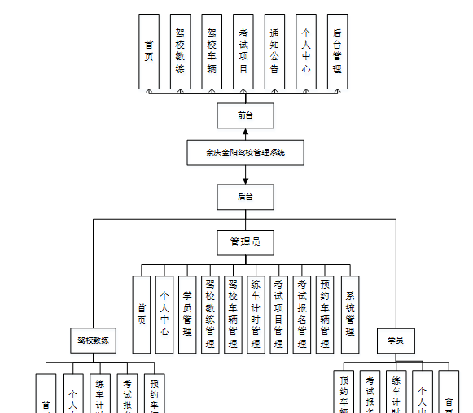

图4-1 系统总体结构图

### 4.2 数据库设计

#### 4.2.1 数据库E/R图

ER图是由实体及其关系构成的图，通过E/R图可以清楚地描述系统涉及到的实体之间的相互关系。在系统中对一些主要的几个关键实体如下图：

(1)考试项目E/R图如下所示：

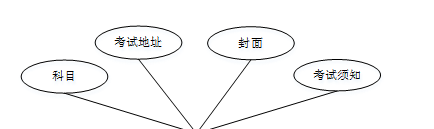

图4-2 考试项目E/R图

(2)考试报名E/R图如下所示：

图4-3考试报名E/R图

(4)预约车辆E/R图如下所示：

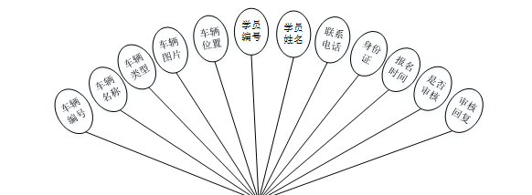

图4-4预约车辆E/R图

### 系统功能模块

余庆金阳驾校管理系统，在系统首页可以查看首页,驾校教练，驾校车辆，考试项目，通知公告，个人中心，后台管理等内容，并进行详细操作；如图5-1所示。

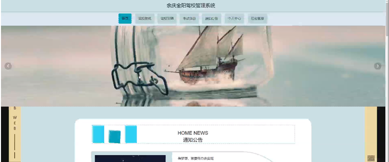

图5-1系统首页界面图

驾校教练，在驾校教练页面可以查看驾校教练,教练账号,图片,年龄，性别，联系电话，个人介绍，课时表等内容，并进行评论和收藏操作，如图5-2所示。

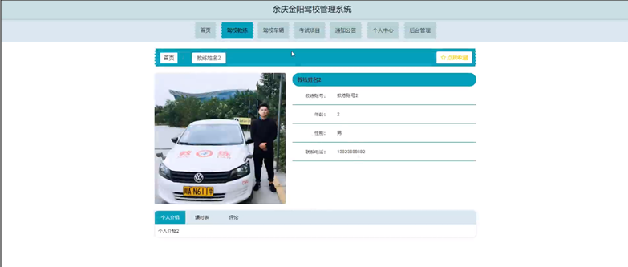

图5-2驾校教练界面图

驾校车辆，在驾校车辆页面可以查看车辆编号，车辆类型，车辆位置，图片，车辆详情等详细内容；如图5-3所示。

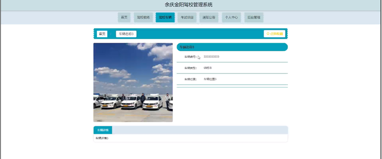

图5-3驾校车辆界面图

### 5.2后台登录模块

后台登录，管理员，学员和驾校教练进入系统前在登录页面根据要求填写账号，密码和选择角色等信息，点击登录进行登录操作，如图5-4所示。

图5-4后台登录界面图

#### 5.2.1管理员功能

管理员登陆系统后，可以查看首页,个人中心,学员管理,驾校教练管理,驾校车辆管理，练车计时管理，考试项目管理，考试报名管理，预约车辆管理，系统管理等功能，还能对每个功能逐一进行相应操作，如图5-5所示。

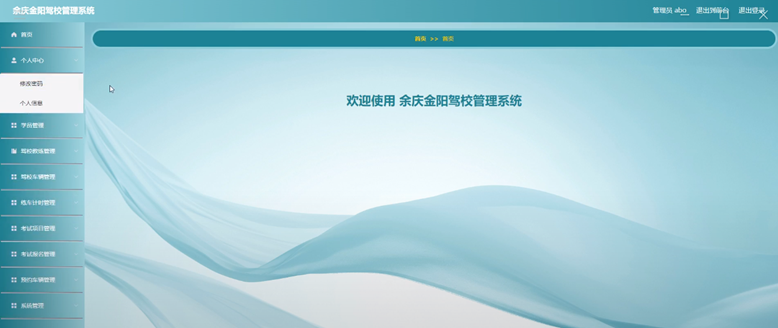

图5-5管理员功能界面图

学员管理，在学员管理页面可以对学员编号，学员姓名，年龄，性别，联系电话，身份证等内容进行详情，修改，和删除操作，如图5-6所示。

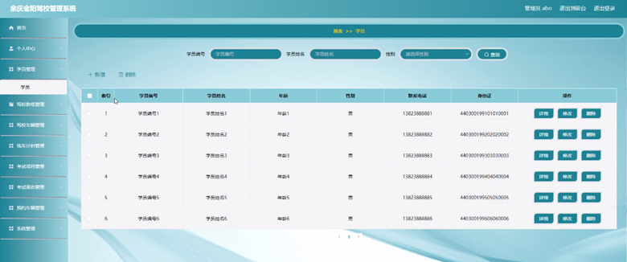

图5-6学员管理界面图

驾校教练管理，在驾校教练管理页面可以对教练账号,教练姓名，年龄，性别，头像，联系电话等内容进行详情，修改，查看评论和删除等操作，如图5-7所示。

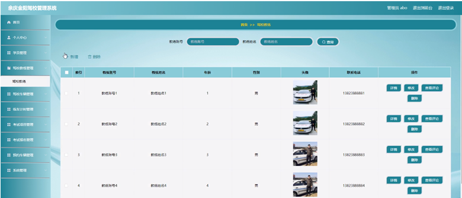

图5-7驾校教练管理界面图

驾校车辆管理，在驾校车辆管理页面可以对车辆编号，车辆名称，车辆类型，车辆图片，车辆位置等内容进行详情，修改和删除等操作，如图5-8所示。

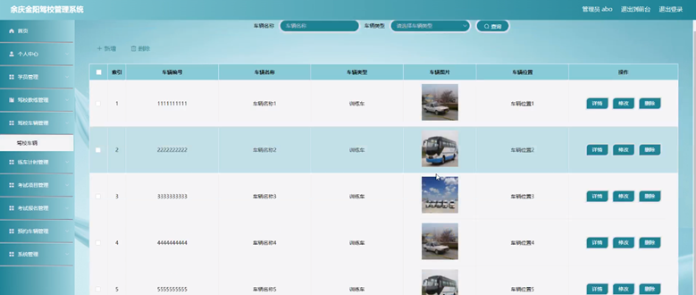

图5-8驾校车辆管理界面图

练车计时管理，在练车计时管理页面可以对学员编号，学员姓名，练习时长，科目，教练账号，教练姓名等内容进行详情，修改和删除等操作，如图5-9所示。

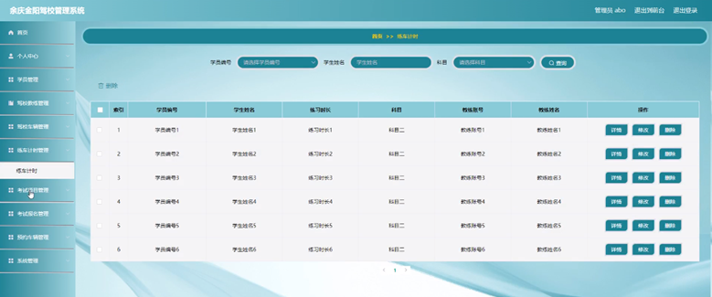

图5-9练车计时管理界面图

系统管理，在通知公告页面可以对标题,图片等内容进行详情，修改和删除等操作，还可以对轮播图管理进行详细操作；如图5-10所示。

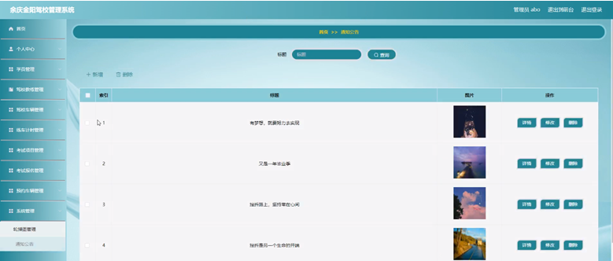

图5-10系统管理界面图

#### 5.2.2学员功能

学员登陆系统，可以查看首页,个人中心,练车计时管理，考试报名管理，预约车辆管理等功能，还能对每个功能逐一进行相应操作，如图5-11所示。

图5-11学员功能界面图

个人中心，在个人信息页面通过填写学员编号,学员姓名,性别,年龄,联系电话,身份证等内容进行个人信息修改操作，如图5-12所示。

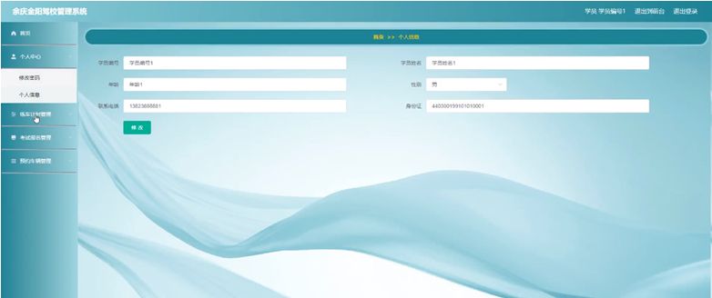

图5-12个人中心界面图

#### **JAVA** **毕设帮助，指导，源码分享，调试部署**

