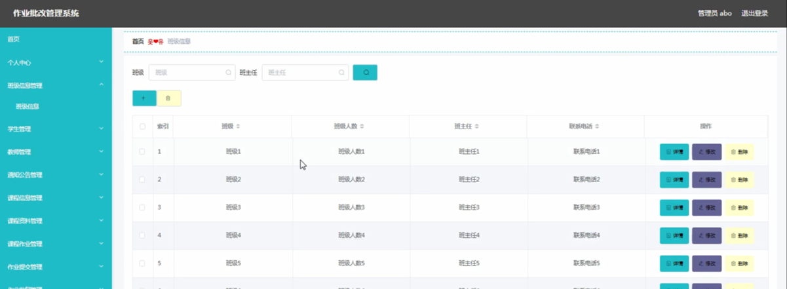
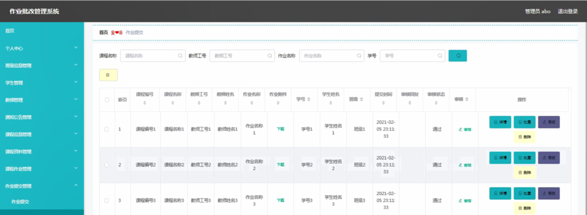

ssm+Vue计算机毕业设计作业批改管理系统（程序+LW文档）

**项目运行**

**环境配置：**

**Jdk1.8 + Tomcat7.0 + Mysql + HBuilderX** **（Webstorm也行）+ Eclispe（IntelliJ
IDEA,Eclispe,MyEclispe,Sts都支持）。**

**项目技术：**

**SSM + mybatis + Maven + Vue** **等等组成，B/S模式 + Maven管理等等。**

**环境需要**

**1.** **运行环境：最好是java jdk 1.8，我们在这个平台上运行的。其他版本理论上也可以。**

**2.IDE** **环境：IDEA，Eclipse,Myeclipse都可以。推荐IDEA;**

**3.tomcat** **环境：Tomcat 7.x,8.x,9.x版本均可**

**4.** **硬件环境：windows 7/8/10 1G内存以上；或者 Mac OS；**

**5.** **是否Maven项目: 否；查看源码目录中是否包含pom.xml；若包含，则为maven项目，否则为非maven项目**

**6.** **数据库：MySql 5.7/8.0等版本均可；**

**毕设帮助，指导，本源码分享，调试部署** **(** **见文末** **)**

### **系统的结构划分**

本网站可以分为: 教师使用的功能、学生使用的功能、管理员进行管理的功能。

教师使用功能：首页、个人中心、学生管理、教师管理、通知公告管理、课程信息管理、课程资料管理、课程作业管理、作业提交管理、作业批复管理、提问教师管理等。

学生使用功能：首页、个人中心、教师管理、通知公告管理、课程资料管理、课程作业管理、作业提交管理、作业批复管理、提问教师管理等。

管理员管理功能首页、个人中心、班级信息管理、学生管理、教师管理、通知公告管理、课程信息管理、课程资料管理、课程作业管理、作业提交管理、作业批复管理、提问教师管理、管理员管理等。

作业批改管理系统的结构图3-1所示：

图3-1 系统结构

登录系统结构图，如图3-2所示：

图3-2 登录结构图

这些功能可以充分满足作业批改管理系统的需求。此系统功能较为全面如下图系统功能结构如图3-3所示。

图3-3系统功能结构图

### 数据库设计

#### 3.3.1 数据库实体

管理员信息结构图，如图3-7所示：

图3-7 管理员信息实体结构图

课程信息管理实体属性图，如图3-8所示：

图3-8课程信息管理实体属性图

课程作业管理实体属性图如图3-9所示。

图3-9课程作业管理实体属性图

### 系统实现

#### 4.2.1管理员功能模块

管理员登录，通过填写注册时输入的用户名、密码、选择角色进行登录，如图4-1所示。

图4-1管理员登录界面图

管理员登录进入作业批改管理系统可以查看首页、个人中心、班级信息管理、学生管理、教师管理、通知公告管理、课程信息管理、课程资料管理、课程作业管理、作业提交管理、作业批复管理、提问教师管理、管理员管理等信息进行详细操作，如图4-2所示。

图4-2管理员功能界面图

班级信息管理，在班级信息管理页面中可以对索引、班级、班级人数、班主任、联系电话等信息进行详情，修改或删除等操作，如图4-3所示。

图4-3班级信息管理界面图

学生管理，在学生管理页面中可以对索引、学号、密码、学生姓名、性别、出生日期、联系电话、学院、班级、照片等信息进行详情，修改或删除等操作，如图4-4所示。

图4-4学生管理界面图

教师管理，在教师管理页面中可以对索引、教师工号、密码、教师姓名、性别、手机、邮箱、主教课程、照片等信息进行详情，修改或删除等操作，如图4-5所示。

图4-5教师管理界面图

通知公告管理，在通知公告管理页面中可以对索引、标题、摘要、相关附件、内容、发布日期等信息进行详情，修改或删除等操作，如图4-6所示。

图4-6通知公告管理界面图

课程信息管理，在课程信息管理页面中可以对索引、课程编号、课程名称、课时、学分、上课时间、教师工号、教师姓名等信息进行详情、课程资料、课程作业、修改或删除等操作，如图4-7所示。

图4-7课程信息管理界面图

课程资料管理，在课程资料管理页面中可以对索引、课程编号、课程名称、教师工号、教师姓名、资料名称、资料、资料介绍等信息进行详情，修改或删除等操作，如图4-8所示。

图4-8课程资料管理界面图

课程作业管理，在课程作业管理页面中可以对索引、课程编号、课程名称、教师工号、教师姓名、作业名称、相关附件、作业内容、布置时间、提交日期等信息进行详情，修改或删除等操作，如图4-9所示。

图4-9课程作业管理界面图

作业提交管理，在作业提交管理页面中可以对索引、课程编号、课程名称、教师工号、教师姓名、作业名称、作业附件、学号、学生姓名、班级、提交时间、审核回复、审核状态、审核等信息进行详情、批复、修改或删除等操作，如图4-10所示。

图4-10作业提交管理界面图

作业批复管理，在作业批复管理页面中可以对索引、课程编号、课程名称、教师工号、教师姓名、作业名称、学号、学生姓名、作业成绩、批复、语音评价等信息进行详情，修改或删除等操作，如图4-11所示。

图4-11作业批复管理界面图

提问教师管理，在提问教师管理页面中可以对索引、教师工号、教师姓名、内容、学号、学生姓名、班级、审核回复、审核状态、审核等信息进行详情，修改或删除等操作，如图4-12所示。

图4-12提问教师管理界面图

#### **JAVA** **毕设帮助，指导，源码分享，调试部署**

