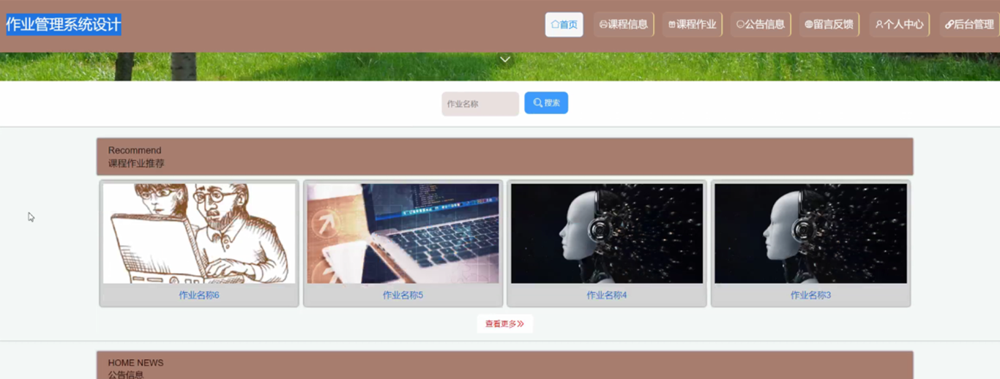

ssm+Vue计算机毕业设计作业管理系统设计（程序+LW文档）

**项目运行**

**环境配置：**

**Jdk1.8 + Tomcat7.0 + Mysql + HBuilderX** **（Webstorm也行）+ Eclispe（IntelliJ
IDEA,Eclispe,MyEclispe,Sts都支持）。**

**项目技术：**

**SSM + mybatis + Maven + Vue** **等等组成，B/S模式 + Maven管理等等。**

**环境需要**

**1.** **运行环境：最好是java jdk 1.8，我们在这个平台上运行的。其他版本理论上也可以。**

**2.IDE** **环境：IDEA，Eclipse,Myeclipse都可以。推荐IDEA;**

**3.tomcat** **环境：Tomcat 7.x,8.x,9.x版本均可**

**4.** **硬件环境：windows 7/8/10 1G内存以上；或者 Mac OS；**

**5.** **是否Maven项目: 否；查看源码目录中是否包含pom.xml；若包含，则为maven项目，否则为非maven项目**

**6.** **数据库：MySql 5.7/8.0等版本均可；**

**毕设帮助，指导，本源码分享，调试部署** **(** **见文末** **)**

### **系统的结构划分**

本系统可以分为:学生使用的功能、教师使用的功能、管理员进行管理的功能。

学生使用功能：首页、个人中心、学生作业管理、作业评分管理、我的收藏管理等。

教师使用功能：首页、个人中心、课程信息管理、课程作业管理、学生作业管理、作业评分管理、系统管理等。

管理员管理功能：首页、个人中心、教师管理、学生管理、课程信息管理、课程作业管理、学生作业管理、作业评分管理、留言板管理、系统管理等。

作业管理系统的结构图3-1所示：

图3-1 系统结构

登录系统结构图，如图3-2所示：

图3-2 登录结构图

这些功能可以充分满足作业管理系统的需求。此系统功能较为全面如下图系统功能结构如图3-3所示。

图3-3系统功能结构图

### 数据库设计

#### 3.3.1 数据库实体

课程信息管理实体属性图，如图3-7所示：

图3-7课程信息管理实体属性图

课程作业管理实体属性图如图3-8所示。

图3-8课程作业管理实体属性图

### 系统实现

#### 4.2.1系统功能模块

作业管理系统，在系统首页可以查看首页、课程信息、课程作业、公告信息、留言反馈、个人中心、后台管理等内容，如图4-1所示。

图4-1系统首页界面图

课程信息，在课程信息页面可以查看课程名称、班级名称、教师工号、教师姓名、教师邮箱、课程课件、图片、课程详情等详细内容进行评论或收藏，如图4-2所示。

图4-2课程信息界面图

课程作业，在课程作业页面可以查看作业名称、课程名称、图片、班级名称、作业要求、发布日期、教师工号、教师姓名、教师邮箱、点击次数、作业附件、作业内容等详细内容进行提交作业、评论或收藏，如图4-3所示。

图4-3课程作业界面图

学生注册，在学生注册页面通过填写学号、密码、学生姓名、手机、专业、班级、邮箱等信息完成学生注册，如图4-4所示。在个人中心页面通过填写学号、密码、学生姓名、性别、图片、手机、专业、班级、邮箱等信息进行个人信息更新操作，还可以根据需要对我的收藏进行详细操作；如图4-5所示。

图4-4学生注册界面图

图4-5个人中心界面图

#### 4.2.2管理员功能模块

管理员登录，通过填写注册时输入的用户名、密码、选择角色进行登录，如图4-6所示。

图4-6管理员登录界面图

管理员登录进入作业管理系统可以查看首页、个人中心、教师管理、学生管理、课程信息管理、课程作业管理、学生作业管理、作业评分管理、留言板管理、系统管理等信息进行详细操作，如图4-7所示。

图4-7管理员功能界面图

教师管理，在教师管理页面中可以查看索引、教师工号、教师姓名、性别、照片、职称、联系电话、教师邮箱等信息，并可根据需要进行详情，修改或删除等操作，如图4-8所示。

图4-8教师管理界面图

学生管理，在学生管理页面中可以查看索引、学号、学生姓名、性别、头像、手机、专业、班级、邮箱等信息，并可根据需要进行详情，修改或删除等操作，如图4-9所示。

图4-9学生管理界面图

课程信息管理，在课程信息管理页面中可以查看索引、课程名称、课程图片、班级名称、课程视频、课程课件、教师工号、教师姓名、教师邮箱等信息，并可根据需要进行详情、修改、查看评论或删除等操作，如图4-10所示。

图4-10课程信息管理界面图

作业评分管理，在作业评分管理页面中可以查看索引、作业名称、课程名称、作业图片、作业评分、评分等级、教师工号、学号、学生姓名、专业、班级等信息，并可根据需要进行详情，修改或删除等操作，如图4-11所示。

图4-11作业评分管理界面图

#### 4.2.3学生后台功能模块

学生登录进入系统后台可以查看首页、个人中心、学生作业管理、作业评分管理、我的收藏管理等内容进行详细操作，如图4-12所示。

图4-12学生后台功能界面图

**JAVA** **毕设帮助，指导，源码分享，调试部署**

